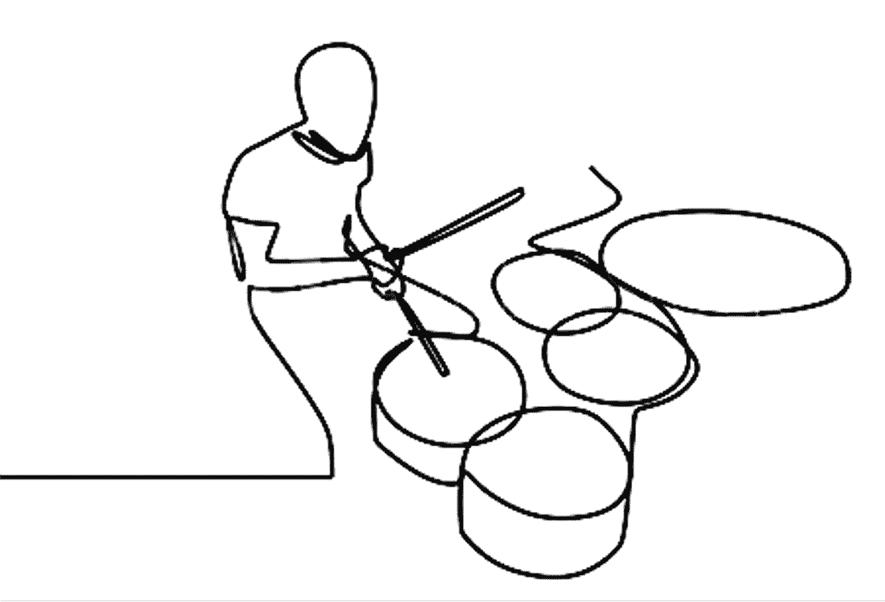
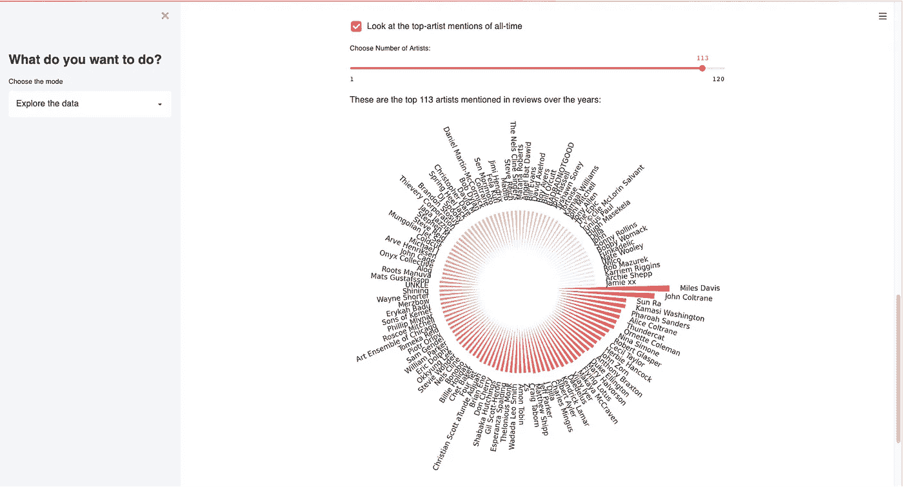
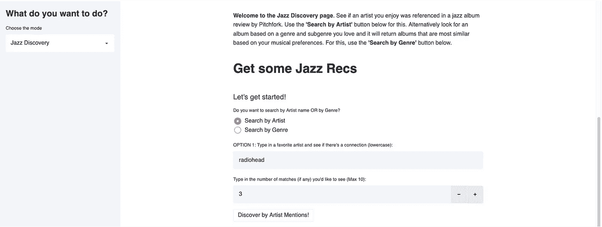
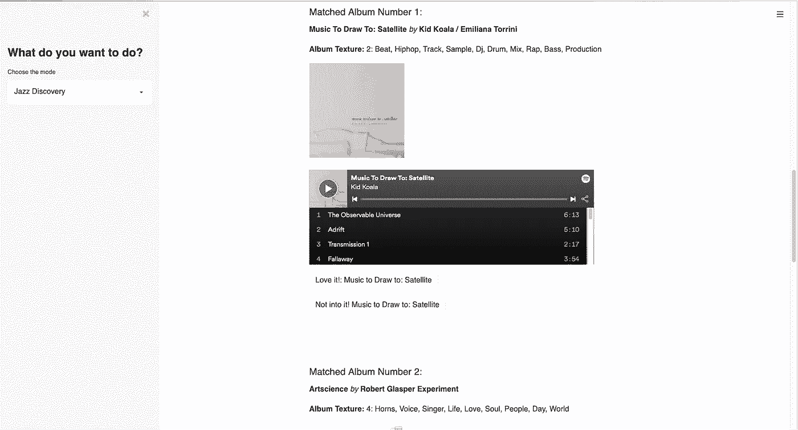
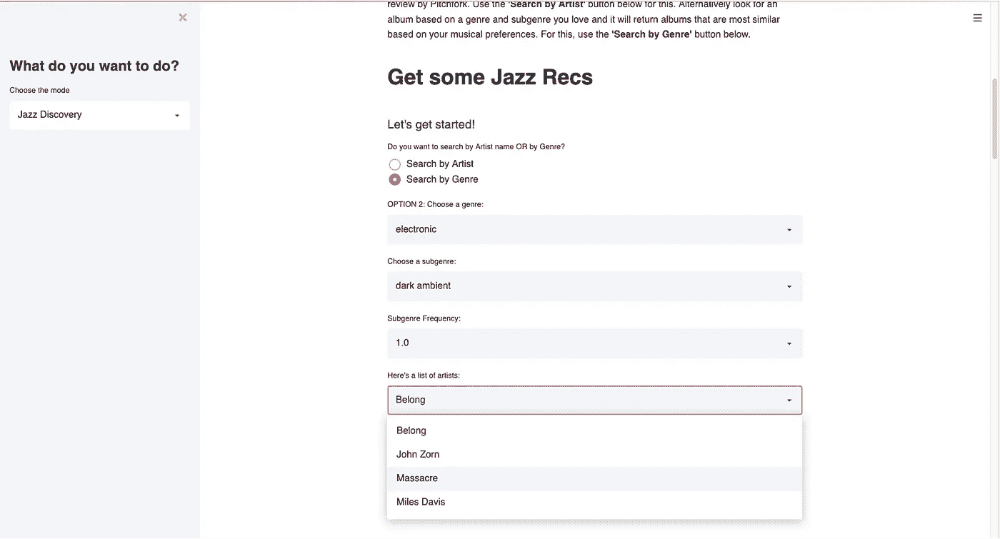
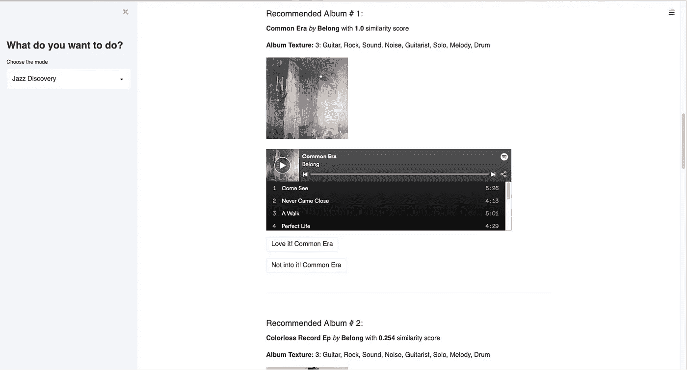
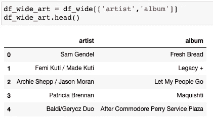
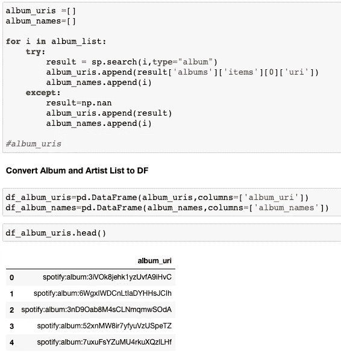
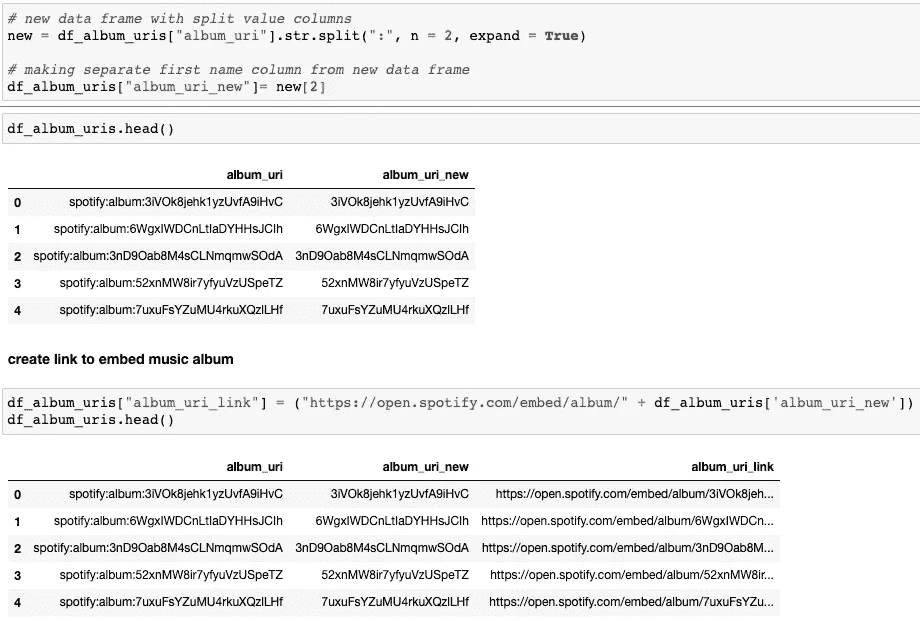

# 现代爵士乐发现工具(pt。2)

> 原文：<https://medium.com/nerd-for-tech/a-modern-jazz-discovery-tool-pt-2-82adb4f97e36?source=collection_archive---------19----------------------->

## 这是两部分系列的第二部分。本文主要关注在 Streamlit 上部署我的基于内容的发现工具。



**在本系列的** [**第一部分**](https://chris-chan1.medium.com/a-modern-jazz-discovery-tool-420344872985) **中，**我带领我们完成了构建现代 Jazz 发现工具的旅程，从项目的*动机*，使用的*数据*，从分析数据中收集的*见解*，以及推荐器是如何构建的开始。本文将重点介绍[**Streamlit**](https://pitchfork-metis.herokuapp.com/)**app**本身的一个简短教程，以及如何在 app 中嵌入一个 [**Spotify 播放按钮**](https://newsroom.spotify.com/2018-09-04/how-to-embed-spotifys-play-button/) 。下面是文章的大致流程:

1.  Streamlit 应用程序—探索数据
2.  Streamlit 应用程序—按艺术家或流派发现
3.  如何嵌入 Spotify 播放按钮


app 登陆页面截图

**上面的截图**是我们现代爵士乐发现工具的登陆页面。如左图所示，该工具分为两部分。第一个是*“探索数据*”，侧重于数据洞察，更具探索性。例如，我们可以看到类似于上一篇文章中的图表，但是我们有更多的动态功能。



Pitchfork jazz 专辑评论中提到的顶级艺术家的截图(用户可以选择艺术家的数量)

工具的第二部分“爵士发现”是推荐系统本身。这就是爵士乐发现奇迹发生的地方！



## 艺术家搜索

如上所述，用户可以通过键入喜爱的艺术家名字或选择喜爱的流派来发现爵士乐。让我们先看看艺术家的搜索。假设我们想找到类似于电台司令的艺术家，因为那是我们最喜欢的乐队之一。通过在搜索框中输入“电台司令”,可以在爵士乐专辑评论中搜索这个词，看看它是否出现过。接下来，我们可以根据这个搜索参数输入我们希望看到的推荐专辑数量。我们最多可以输入 10 场比赛。如果没有匹配(意味着电台司令没有出现在任何爵士评论中)，那么我们就不会收到任何推荐。但是，如果有匹配的，推荐系统会找到提到过*电台司令*的专辑，并给出这些匹配的列表:



以上是结果的快照。信息包括专辑名称、艺术家和专辑纹理(如前一篇文章所述)。您还将有机会使用 **Spotify 播放按钮**收听专辑。我将在下面进一步解释我是如何将它整合到应用程序中的。首先，让我们简要地看一下按类型划分的探索。

## 流派搜索

比方说，我想发现爵士乐，但我更喜欢 T2 电子音乐。所以我想找和*电子*有相似质感的爵士专辑。



选择了流派= *电子*之后，我们还有一个子流派可供选择。假设我们今天有心情享受黑暗的环境。我可以选择短语“*黑暗环境”*在评论中出现的频率，如果不止一次，但我们现在选择一个。最后，我们现在有了一个符合我们参数的爵士乐艺术家列表。我对这个叫做*的乐队很好奇。*一旦我点击“发现”按钮，默认情况下，我们会得到 5 个推荐专辑。给出的信息与您按艺术家搜索时的信息相同，但是您也将获得余弦相似性得分:



## Spotify 播放按钮

那么，我们是如何将 **Spotify 播放按钮**放入应用程序的呢？根据简单的搜索，有很多关于如何做到这一点的教程。没有放之四海而皆准的方法，所以这里是我拼凑的一些组件，让它在我的 Streamlit 应用程序中工作。以下是一般步骤:

1.  获取 Spotify API 凭证，并使用[**Spotify**](https://spotipy.readthedocs.io/en/2.18.0/)初始化连接
2.  使用我们的专辑(或艺术家)列表获取 **Spotify 嵌入链接**
3.  将链接放入你的数据框，然后**加载你的应用**

## **第一步。获取 Spotify API 凭证并建立连接**

Spotify 的 web API 非常有用，也很容易使用。我不会深入讨论如何获得 Spotify 证书，但这里有一个链接指向 [API 教程](https://developer.spotify.com/documentation/web-api/quick-start/)来开始。获得 Spotify API 证书后，您需要导入 [Spotipy](https://spotipy.readthedocs.io/en/2.18.0/) ，然后使用以下代码启动与 API 的连接:

```
import spotipy
from spotipy.oauth2 import SpotifyClientCredentials
from tqdm import tqdm
from time import sleep
import time
import pandas as pd
import numpy as np# Replace Spotify Credentials once you've set up an accountclient_credentials = SpotifyClientCredentials(client_id = ‘xxxxxxxx’, client_secret = ‘xxxxxxxx’)
sp = spotipy.Spotify(client_credentials_manager = client_credentials)
```

## 第二步。获取 Spotify 专辑 ID

下一步是在我们的数据中获取与 Spotify 专辑相关的唯一 ID(Spotify URI)。在某些情况下，Spotify 上的每个专辑、艺术家和曲目都由一个 URI 唯一标识(基本上只是一个唯一标识符)。例如，如果我想听米勒·戴维斯的*，蓝色的*，我需要以下链接:

*h*[*ttps://open . Spotify . com/embed/album/****1 ween LD 61 qoidwyuz 1 gesa***](https://open.spotify.com/embed/album/1weenld61qoidwYuZ1GESA)

该 url 的前缀是静态的，用于嵌入相册，但末尾粗体字母数字部分是该相册的 URI。那么我们如何获得这些呢？我们首先从数据入手，获得我们希望 URI 获奖的专辑的唯一列表:



以上只是我们希望 Spotify 嵌入的 5 位艺术家和专辑的样本。现在我们有了一个独特的专辑列，我们将它转换成一个列表，以便使用 Spotipy 包搜索专辑 URI:

```
album_list=list(df_wide_art[‘album’])
artist_list=list(df_wide_art[‘artist’])
```

给定专辑列表，我们搜索专辑 URI，并使用以下代码将它们附加到一个单独的列表中:



## 第三步。创建 Spotify 嵌入链接并加载到应用程序中

我们的专辑《URI》出现在上面结果的最后部分(第二个冒号之后)。因此，我们将它们剥离出来，创建一个嵌入链接:



如上所示， *album_uri_link* 是我们将 Spotify play 按钮嵌入应用程序所需的。现在我们的数据框架中已经有了这个，在构建 Streamlit 应用程序的代码中，我们可以编写一个函数来加载 Spotify embed 的链接，以便在我们的应用程序中使用:

```
def load_audio2(url):
 if type(url) == str:
 try:
 audio2=url 
 components.iframe(album_uri_link , width=600, height=200 )
 except:
 st.image([‘../img/none.jpeg’])
```

对于推荐的每张专辑，现在都会有一个 Spotify 播放按钮供您尝试和感受。

## 现代爵士乐发现工具

最后，这里有一个在 Heroku 上部署的 [**jazz 发现工具**](https://pitchfork-metis.herokuapp.com/) 的链接，供大家欣赏。

我希望本教程有助于您导航发现工具，以及了解如何将 Spotify 播放按钮嵌入到您的 Streamlit 应用程序中。

**免责声明** : *该工具是一项持续进行的工作。将定期编辑/添加特性和功能。任何即时反馈都非常受欢迎！*

更多细节、代码或连接，请访问我的 [Github 知识库](https://github.com/chan-chris/Metis_proj5)或 [LinkedIn](https://www.linkedin.com/in/chrischanlkn/) 页面。