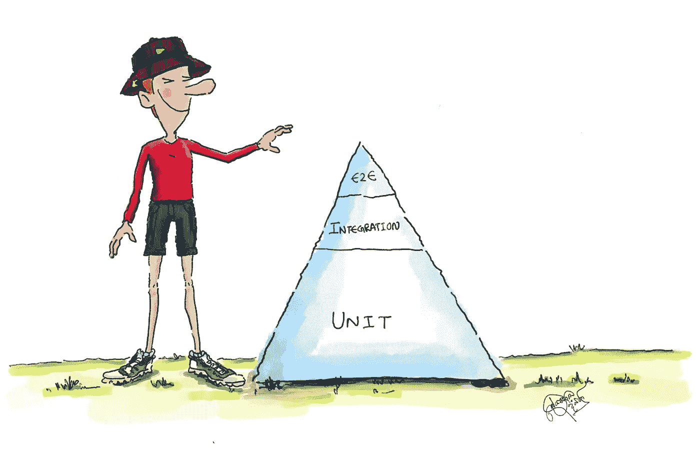
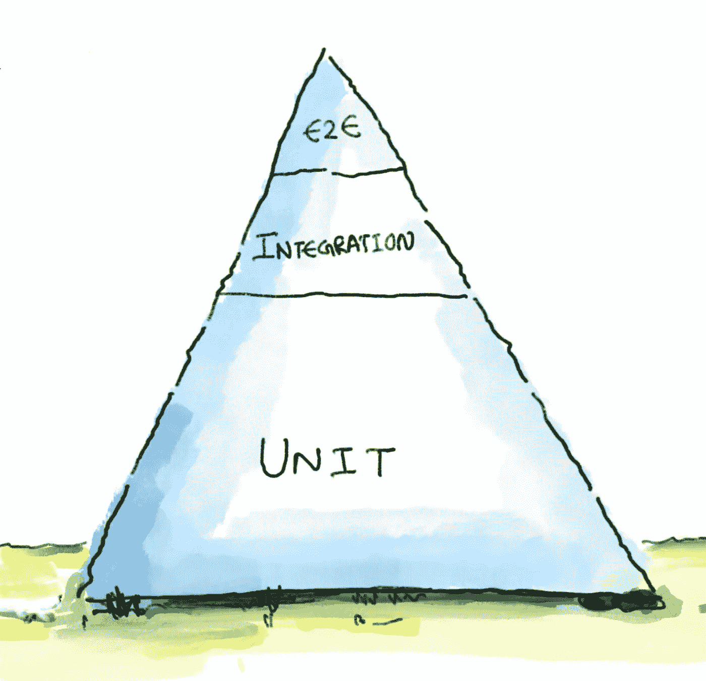

# 新的冒险刚刚开始！

> 原文：<https://medium.com/nerd-for-tech/a-new-adventure-has-just-begun-b9470bc9127b?source=collection_archive---------21----------------------->

GSoC 2021:OpenMRS 3.0 RefApp 的 E2E 自动化测试

> 设计测试的行为是已知的最好的错误预防措施之一，而不仅仅是测试的行为
> ——鲍里斯·贝泽尔

由于微前端团队的不懈努力，OpenMRS 很快就会有新版本“OpenMRS 3.0”。大多数 MFE 应用程序都有自己的单元测试和集成测试。这些测试将抽取应用程序的一小部分，并孤立地评估这一部分。然而，即使应用程序的小部分工作正常，也不能保证它们能作为一个整体一起工作。这就是 E2E 测试(端到端测试)附加测试层发挥作用的地方。我今年的 GSoC 项目的目标是建立 E2E 测试，使真实的用户工作流自动化，以确保它们按预期工作。

我花了一些时间来熟悉它，因为这是该项目的第一周。我第一次打电话给我的导师；Joseph Kaweesi 和 Brandon 倾听以澄清项目并计划本周剩余时间。然后我加入了 QA 支持团队和 Microfrontend 小队，认为那是我可以分享我的工作的地方。

由于这是项目的开始，我想我应该简单地解释一下项目的背景。

# 端到端(E2E)测试？

E2E 测试验证完整的系统流程，并确保应用程序按预期运行。此外，E2E 测试模拟真实世界的场景，这允许看到真实用户将如何与应用程序交互。

例如，它可以像 OpenMRS 的登录页面一样简单。测试将包括:

1.  在浏览器中打开 OpenMRS 的登录页面
2.  键入用户名和密码
3.  确保用户已成功登录仪表板

图一。展示了谷歌测试金字塔的简化版[。Google 建议 70/20/10 的划分:70%的单元测试，20%的集成测试，10%的端到端测试。](https://docs.google.com/presentation/d/15gNk21rjer3xo-b1ZqyQVGebOp_aPvHU3YH7YnOMxtE/edit#slide=id.g437663ce1_53_98)[【1】](https://testing.googleblog.com/2015/04/just-say-no-to-more-end-to-end-tests.html)

图 1 .[2014 Google 测试自动化会议](https://developers.google.com/google-test-automation-conference/2014/)开幕主题演讲中测试金字塔的简化版。

# E2E 测试的类型

有两种类型的 E2E 测试，手动 E2E 测试和自动 E2E 测试。在手动测试中，业务测试人员根据需要在多种设备和屏幕尺寸上扮演客户的角色。测试人员将遵循与普通用户相同的流程，普通用户将决定是否满足应用程序的规范。

另一方面，自动化 E2E 测试也有同样的目的。只是自动化测试有更高级的功能，是人类测试人员无法提供的。

如前所述，手动测试需要测试人员手动执行实验。糟糕的测试可能是由人为错误造成的。由于自动化 E2E 测试是在没有人工参与的情况下自动运行的，因此在许多情况下更加准确。此外，从长远来看，自动化测试节省了时间，因为它只需要在开始时付出努力[【2】](https://www.perfecto.io/blog/comprehensive-guide-end-end-e2e-testing)。

以下是一些主要的自动化 E2E 测试框架。

*   柏树
*   WebdriverJS
*   量角器
*   WebdriverIO
*   夜间观察
*   测试咖啡馆

在他们看来，考虑到设置环境、运行测试和获得报告所需的时间和精力，Cypress 似乎是一个合适的框架。

# 柏树

Cypress 是一个非基于 Selenium 的框架，它不需要额外的驱动程序来与浏览器交互。测试用例可以在项目中使用 javascript 来定义，并且可以使用 Cypress Test Runner 的工具来运行。该工具将打开选定的浏览器并自动运行测试。

cypress 最好的特性之一是时间旅行功能。它允许测试人员在测试运行时拍摄快照，这允许他们看到在每个步骤中发生了什么。此外，它允许使用浏览器的开发工具来调试测试。这有助于确定测试失败的原因。Cypress 支持 chrome、Firefox、Edge、electronic 和其他 Chrome 系列浏览器 [[3]。](https://docs.cypress.io/guides/overview/why-cypress) 此外，它还可以与一个名为 Cucumber 的知名测试工具配合使用。

# 柏树黄瓜集成

Cucumber 是一个支持行为驱动开发的测试工具[【4】](https://cucumber.io/docs/guides/overview/)。它提供了一种编写测试的方法，无论技术水平如何，每个人都能理解。Cypress cumber 集成可以通过一个名为“Cypress Cucumber Preprocessor”的插件来完成。该插件允许从 cucumber 特征文件[【5】](https://www.npmjs.com/package/cypress-cucumber-preprocessor)中运行测试。

项目的主要目标是使用 Cypress 和 cumber 测试引擎框架来建立测试。测试将基于真实的用户工作流程，自动在 UI 上运行。结果将在共享的 Repo 自述文件中指出，这样就不会有人错过失败的测试。希望今年夏天我能为 OpenMRS 做点贡献，让它变得更好！

## 参考

[1]“拒绝更多的端到端测试，”*谷歌测试博客*。[https://testing . Google blog . com/2015/04/just-say-no-to-more-end-to-end-tests . html](https://testing.googleblog.com/2015/04/just-say-no-to-more-end-to-end-tests.html)(2021 年 4 月 13 日访问)。

[2]“端到端(E2E)测试综合指南| by Perforce”， *Perfecto by Perforce* 。[https://www . perfecto . io/blog/comprehensive-guide-end-end-e2e-测试](https://www.perfecto.io/blog/comprehensive-guide-end-end-e2e-testing)(2021 年 4 月 13 日访问)。

[3]“为什么是柏树？，"*柏树文档*。[https://docs.cypress.io/guides/overview/why-cypress](https://docs.cypress.io/guides/overview/why-cypress)(2021 年 4 月 13 日访问)。

[4]“简介—黄瓜文档。”[https://cucumber.io/docs/guides/overview/](https://cucumber.io/docs/guides/overview/)(2021 年 4 月 13 日访问)。

[5]“柏树-黄瓜-预处理器”， *npm* 。[https://www.npmjs.com/package/cypress-cucumber-preprocessor](https://www.npmjs.com/package/cypress-cucumber-preprocessor)(2021 年 4 月 13 日访问)。