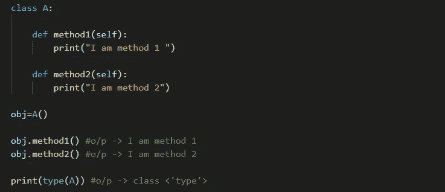
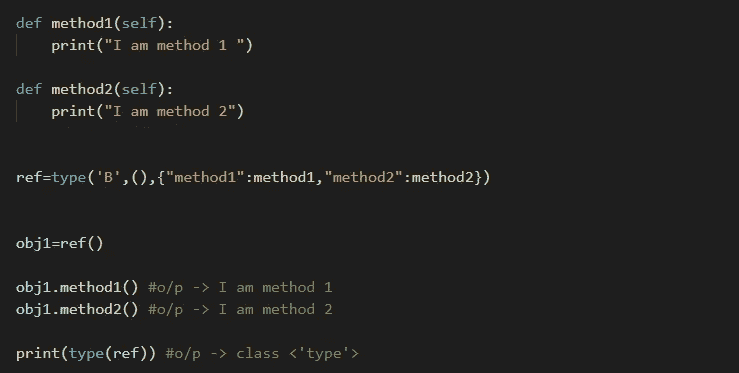

# 一种处理 Python 中类的新方法

> 原文：<https://medium.com/nerd-for-tech/a-new-approach-to-deal-with-the-classes-in-python-75d19a11dbec?source=collection_archive---------15----------------------->

您可能熟悉用以下方式创建类和类属性。

传统上，我们使用 class 关键字定义一个类，使用 def 关键字定义一个方法，使用 self 关键字将方法或属性绑定到类。此外，我们创建一个对象来调用类的已定义方法或属性。

如果你查看创建的类的类型，你会发现它实际上是 class 本身的类型。这个独一无二的特性允许我们发明一种新的方法来创建类和它们的属性。

在本文中，我们将研究一种对比机制来创建类和类属性。

这里我们使用类型内置函数，它不仅用于确定一个对象的类型，还用于创建它的类和属性。

首先将一个变量赋给由 3 个默认参数组成的内置函数类型，

1.类别的名称。

2.基类(我们从中继承)。

3.类的属性(可以是类变量、构造函数、方法、静态方法、类方法等)。

可以有多个属性。现在，我们为分配给类型函数的变量创建一个 obj，并最终调用该类的方法或属性。

这是 python 中使用类的一种高级而复杂的方式。不建议新手使用。希望这篇文章真的有帮助。

如果您有任何疑问，请在下面的**评论**部分发帖。在 [**Linkedin**](https://www.linkedin.com/in/harshith-raj-uppula-541196181/) 上和我联系。还有，如果你想看看我开发的一些项目，别忘了查一下 [**GitHub**](https://github.com/harsha954) 。

话虽如此，感谢阅读我的文章，并*快乐编码！*