# 对 Git 奇妙世界的简单介绍

> 原文：<https://medium.com/nerd-for-tech/a-non-scary-introduction-to-the-wondrous-world-of-git-eb213643a4e8?source=collection_archive---------7----------------------->

## 你需要知道的 Git 命令，简单解释，有动手的例子！

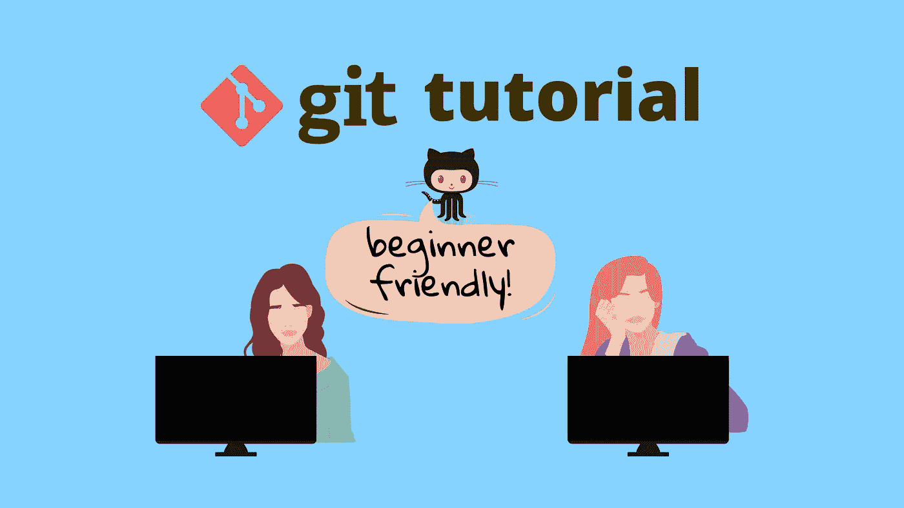

无论你选择哪种编程语言，也无论你为哪家公司工作，你都会使用 Git。

我在 AliceCode 做志愿者，教十几岁的女孩编程。上个月，我向我的团队介绍了 Git，在看到他们努力之后，我注意到了一个新手不理解的所有事情(还没有！)

在这篇博文中，我们将学习基本的 git 命令，并看到它们的实际应用。动手意味着它涉及积极参与/使用，而不仅仅是理论。

与其他教程相比，对我来说，展示与 git 的通信流，以及当您认为可以工作的命令不工作时的样子是很重要的。

为了便于访问，这里有一个目录:

```
[Let's Start With The Basics](#ad79)
  [Hello world, this is the command-line](#ec68)
  [Creating the Initial State](#a5be)
[Story Time + Hands-on](#99f9)
```

下面是我们将要讨论的命令列表:

```
git init
git clone
git add
git commit
git push
git branch
git checkout
git status
git log
git fetch
```

我们可以开始了吗？

# 让我们从基础开始

[***Git***](https://git-scm.com/) 是一个版本控制系统，可以让你管理和跟踪你的源代码历史。
[***GitHub***](https://github.com/)*是一家使用 Git 进行软件开发和版本控制的互联网托管提供商。
如果你有另一台主机，你可以使用 **Git** 而不用 **GitHub** ，但这里我们将使用 GitHub。*

*Git 可以变得很复杂，每个命令都有几个 ***命令行*** ***标志*** 和选项，但今天只是简单介绍一下基础知识！*

## *你好，世界，这是命令行*

***命令行界面** (CLI)是您电脑上的一个程序，允许您创建和删除文件、运行程序以及浏览文件夹和文件。在 Mac 上叫**终端**，在 Windows 上叫**命令提示符**。不管你使用哪种操作系统，通常都称它为终端，我也是这样做的。*

*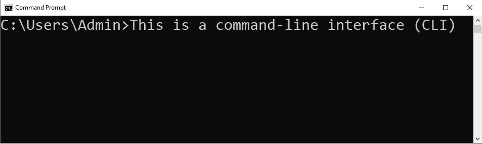*

*现在*你知道我在创建本教程时在哪个操作系统上工作；)**

****命令行标志*** 是为命令行程序指定选项的常用方式，通常是用一个连字符或两个连字符。比如:`git commit -m "message"` - > -m 是表示提交消息的标志，“消息”是消息本身。*

*使用终端时您应该知道的事情:*

*   *`mkdir`创建一个目录(文件夹)*
*   *`cd <DIRECTORY>`进入文件夹内*
*   *`./`是当前目录，`../`是父目录，所以您可能会看到这样的文件名:`./file_in_current_folder.txt`*
*   *键盘上的 **↑、↓** 将让您导航之前的命令*
*   ***选项卡**键将自动完成名称*

*比如说:*

```
*PS C:\Projects> mkdir git-hands-on
PS C:\Projects> cd gi<TAB> **–becomes–>** PS C:\Projects> cd git-hands-on
PS C:\Projects\git-hands-on> ↑ **–becomes–>** PS C:\Projects\git-hands-on> cd git-hands-on*
```

*我创造了一个现实的场景，你可能会遇到自己。你可以只通过阅读来学习，但我相信它更有教育意义(也更令人愉快！)跟着走。因此，如果你决定动手，请遵循下一节的步骤。
如果没有，可以跳转到[后续章节的故事](https://cupofcode.blog/?p=653&preview=true&_thumbnail_id=655#hands-on)。*

## *创建初始状态*

*首先你需要安装 git ( [这里](https://www.youtube.com/watch?v=2j7fD92g-gE)是 Windows 的教程)并注册 [GitHub](https://github.com/) 。*

*之后，您需要创建一个类似于我的例子中的项目。为此，您需要:*

1.  *创建一个新文件夹，命名为`git-hands-on`*
2.  *进入`git-hands-on`文件夹，创建三个文件:`Loris_file.txt`、`Olivias_file.txt`和`mutual_file.txt`*
3.  *在 GitHub 中，创建一个新的存储库，命名为“ *git-hands-on* ”。*
4.  *在终端中打开你的项目文件夹(打开终端并`cd`到你的项目文件夹)。*
5.  *按照 GitHub 提供的快速设置:(别忘了把`<USERNAME>`改成你的 GitHub 用户名！)*

```
*git init
git add .
git commit -m “first commit”
git branch -M main
git remote add origin https://github.com/<USERNAME>/git-hands-on.git
git push -u origin main*
```

*这是做什么的？我会告诉你，但是每个命令在博客中都有自己的部分，所以不要担心！让我们从所有的 git 命令都以`git`开始说起。*

1.  *`git init`在你的项目上初始化 git。需要明确的是，这只会发生在项目的创建中，而不会发生在克隆中！所以当你在一个现有的项目上工作时，你不需要做这一步。*
2.  *`git add .`将所有文件添加到提交中(我们将详细讨论)。*
3.  *`git commit -m “first commit"`在本地保存更改**，并显示消息“首次提交”。本地*是什么意思？这是一个很好的问题，我将在动手操作部分回答它！****
4.  *`git branch -M main`将创建一个名为`main`的远程分支。(什么是分支？你会看到的！)*
5.  *`git remote add origin`将本地目录连接到远程 git 存储库。*
6.  *`git push -u origin main`将提交推送到远程主分支。*

*之后，在 GitHub 中，我们会看到这个:*

*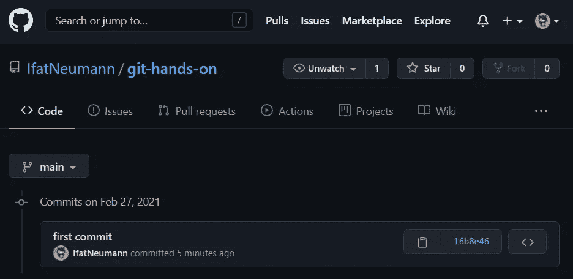*

*点击提交*第一次提交*将显示我们的文本文件:`Loris_file.txt`、`Olivias_file.txt`和`mutual_file.txt`。*

*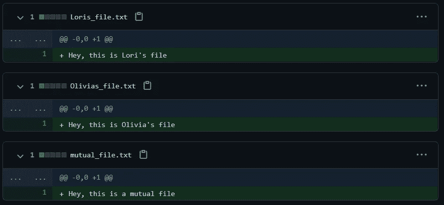*

*所以你已经知道我们的故事围绕着奥利维亚和萝莉。我使用一个 GitHub 帐号，但是我想模仿两个不同的女人在两台不同的电脑上工作。为此，我将在我的计算机上创建两个目录(=文件夹)，并且我将以作者的名字开始每条提交消息。*

*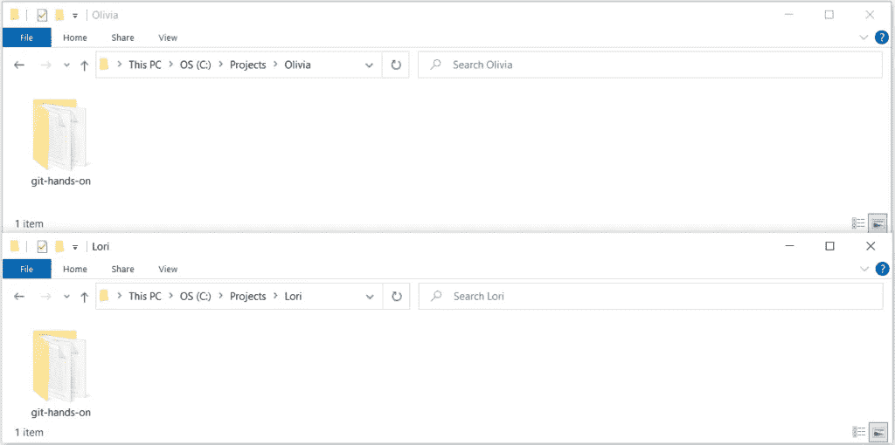*

*重要提示:尽管我将解释我们在这里会遇到的每个命令和响应，但我还是强烈建议您阅读每个命令的完整响应。大多数情况下，输出——尤其是错误消息——会提供您需要的所有信息！*

*现在我们准备开始了！想听故事吗？*

# *故事时间！*

*认识一下奥利维亚和罗莉，她们在同一个团队工作。*

**

*Lori 和 Olivia 开始着手一个名为`git-hands-on`的项目，该项目有一个分支`main`。
克隆项目后，他们将开始使用不同的方法工作:
**萝莉**将在她的本地`main`分支上工作，当她完成后将推送到远程`main`。
**Olivia** 将创建她自己的分支，也将该分支推送到远程，并且将更新它而不是`main`。当她完成时— **奥利维亚**会将完成的代码推送到`main`。萝莉会更快完成，这意味着她不会遇到任何冲突——但**奥利维亚**会！*

*听起来很复杂？！不要担心，到这篇博文结束时，事情会变得简单起来！*

## *故事情节*

*因此，让我们明确一下我们今天将看到的内容:*

```
*1\. [Lori - clones the project](#9a47)
2\. [Olivia - creates her own branch: dev/olivia](#3560)
3\. [Lori - add, commit, push changes to remote main](#2e73)
4\. [Olivia - pulls Lori's changes from remote main](#e592)
5\. [Olivia - add, commit, push changes to remote dev/olivia](#39c2)
6\. [Lori and Olivia update the same file](#f492)
7\. [Olivia - facing and fixing conflicts!](#6b2f)*
```

*你准备好开始了吗！？*

**

# *1.Lori 克隆了这个项目*

```
*git clone https://github.com/<USERNAME>/REPOSITORY*
```

*GitHub 里有个项目叫 *git-hands-on* 。奥利维亚和罗莉需要把它克隆到他们的电脑上，这样他们就可以开始工作了！考虑到**远程** ( `main`)上只有一个分支，默认为女性会有一个**本地** `main`分支。*

*当您用`git clone`克隆一个存储库时，它会自动创建一个名为 *origin* 的**远程**连接，指向 GitHub 中克隆的存储库。这意味着我们有一个名为`origin main`的主分支的远程版本。有时我会说`remote`，有时我会说`origin`，但我的意思是一样的。*

*对于 Olivia 和 Lori 来说，这一步看起来是一样的，所以让我们看看 Lori 是怎么做的:*

# *洛里的终端:*

*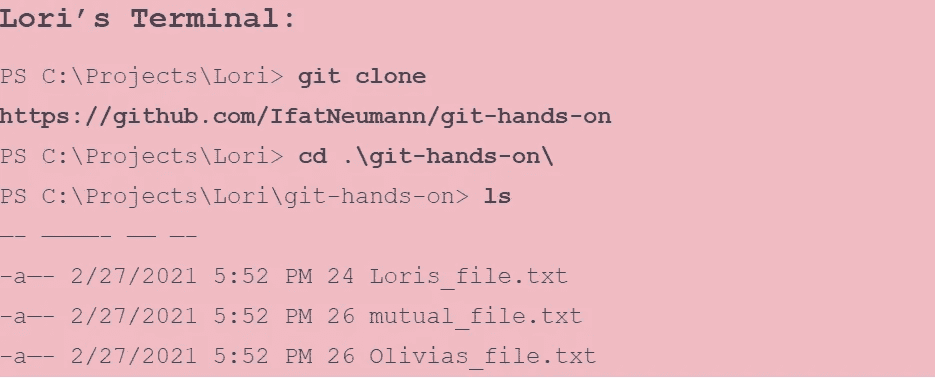*

*注意，克隆完成后，洛里用`cd .\git-hands-on\`命令进入了`git-hands-on`文件夹。使用`ls`我们可以看到目录的内容，在我们的例子中是三个文本文件。*

*Olivia 也做了同样的事情，现在我们在远程(GitHub 中)和本地的每台笔记本电脑上都有 main。*

*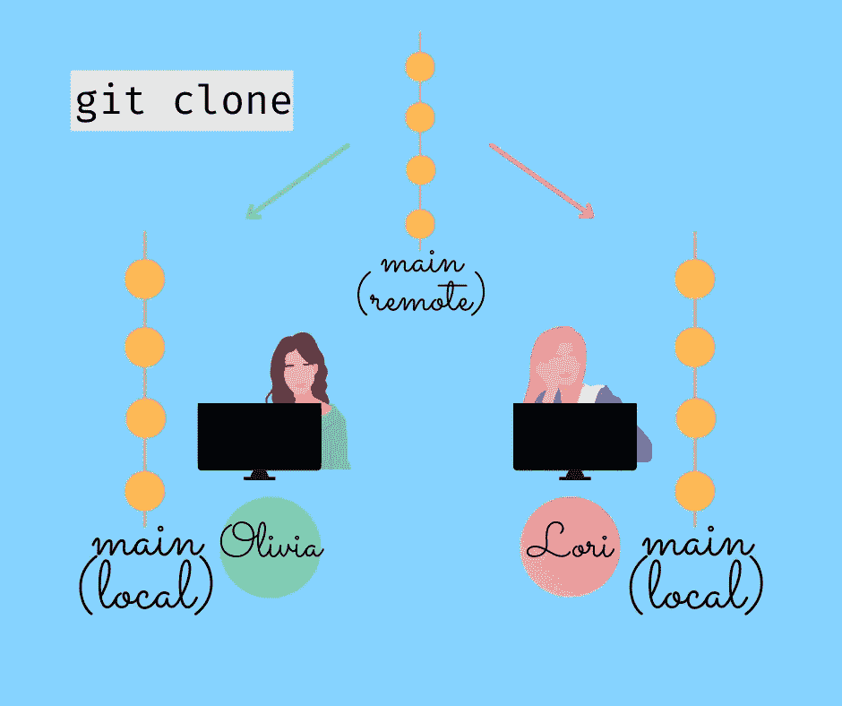*

# *2.Olivia——创建自己的分支:dev/olivia*

*创建一个新的分支有几个原因:有时根据作者来分离(正如您将在本例中看到的)，有时根据特性。如果你想得到某人的帮助，这也很好:他们可以提取你的分支，以及你所有的修改，并在他们的本地计算机上运行它。*

*所以奥利维亚想创建自己的分支机构:*

*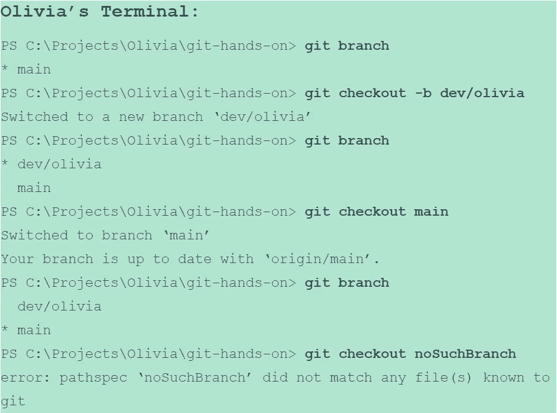*

*我们在这里看到了什么？*

1.  *`git branch`向我们展示本地现有的分支机构。到目前为止我们只有`main`。*
2.  *`git checkout -b dev/olivia`创建一个新的分支**，从我们当前所在的分支**派生而来(在我们的例子中是本地`main`)。当我说派生时，我的意思是无论本地`main`发生了什么变化，我们的新分支也会发生变化。*
3.  *`git branch`向我们展示了`main`和`dev/olivia`。*
4.  *`git checkout main`会把我们正在做的分支改成`main`。*
5.  *`git checkout noSuchBranch`将显示错误，因为您试图切换到不存在的分支。澄清一下，`git checkout **-b** <NAME>`创建一个新分支，`git checkout <NAME>`切换到一个分支。*

*注意，`dev/olivia`分支**只存在于 Olivia 的 git 上的本地**，而不在远程。*

*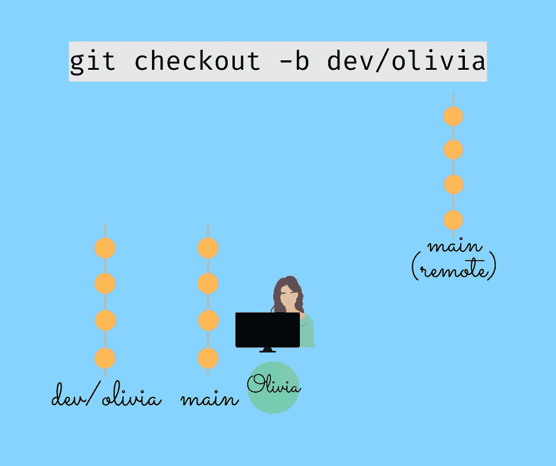*

# *3.Lori —添加、提交、推送对远程 main 的更改*

*这一步是关于更新远程`main`分支。这是本教程的一大部分，也是你使用 git 的一大部分。通常，循环是:添加、提交、推送。`add`添加将要提交的更新，`commit`提交变更，`push`推送代码。`add, commit, push`当我们完成我们的任务，测试它，并且它是好的时候发生！*

## *命令背后的含义*

*有点像寄包裹。你**添加**物品，**将包裹**提交给邮局，**将包裹**推送给员工。*

*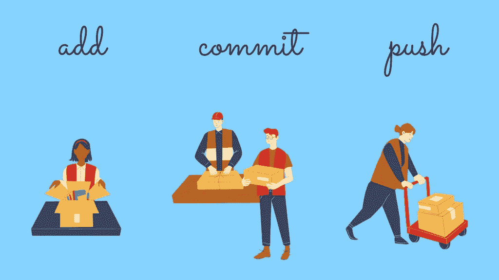*

*这是一个很好的类比，因为您可以将多个项目添加到同一个包中(`git add`在`git commit`之前多次)。
您也可以在同一次就诊中递送多个包裹(`git commit`多次在`git push`之前)。*

*建议尽可能多地添加到相同的提交中(在合理的范围内)。没有必要提交你所做的每一个改变。当你完成任务或达到一个有意义的里程碑时，提交它。*

*假设我在三个文件中做了更改:a、b 和 c。我选择哪个选项并不重要:*

*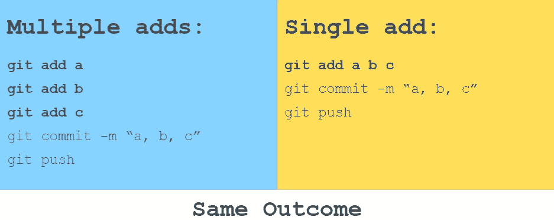*

*输出看起来是一样的:我已经提交了 3 个文件。
还要注意，在同一个命令中添加多个文件是用空格完成的:`git add a b c`。*

*然而，当使用单次/多次提交时，输出是不同的:*

*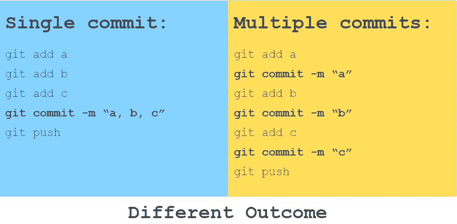*

*当您单独提交每个文件时，就像右边的例子一样，您最终会提交三个不同的文件。git 存储库中的多次提交，没有任何好的理由，会变得相当混乱。*

*这也是一个很好的地方来说明提交消息可以帮助你！所以要明智地使用它们，不要写无意义的消息，比如“更新”(更新哪里？！)，“ifat”(哪些文件？哪个功能？)，等等。*

*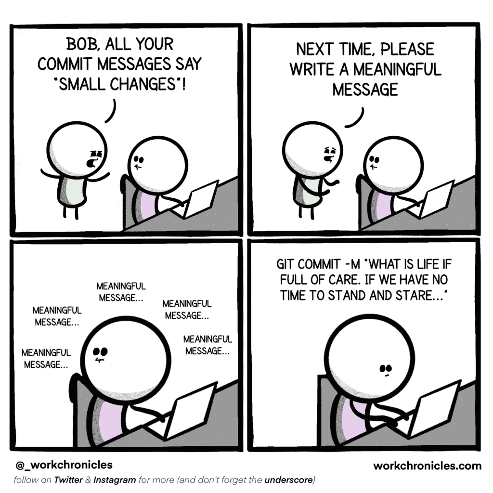*

*如果你试图推而不承诺，这就像去邮局寄包裹——没有包裹。如果你试着承诺而不添加，这就像带着一个空盒子来到邮局——他们不会接受的。*

*需要看到才相信？让我们看看当您尝试推送*nothing*或提交*nothing*时会发生什么:*

```
*PS C:\Projects\git-hands-on> **git status**
On branch main
Your branch is up to date with ‘origin/main’.nothing to commit, working tree cleanPS C:\Projects\git-hands-on> **git push**
Everything up-to-datePS C:\Projects\git-hands-on> **git commit -m “empty commit”**
On branch main
Your branch is up to date with ‘origin/main’.nothing to commit, working tree clean*
```

*你注意到一个我们还没有提到的命令了吗？`git status`！
`git status`显示了我们工作的状态:改变的文件，被**添加**到提交的文件，被**提交**的文件，等等。*

*在我们的例子中，我们有`nothing to commit, working tree clean`。当我们*试图不顾一切地推动*时，它不会做任何事情，因为`Everything is up-to-date`。*

*由于`nothing to commit, working tree clean`，我们的*尝试提交* *nothing*也被阻塞。*

## *回到故事！*

*Lori 正在她的本地`main`分支上工作，现在想要将她的代码推送到**远程 main。***

*让我们看看她的终端:*

*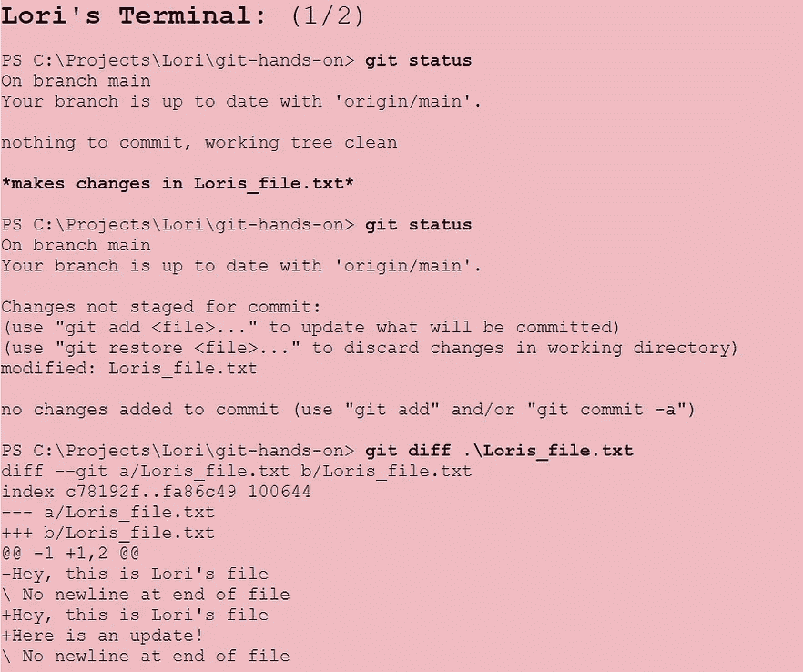**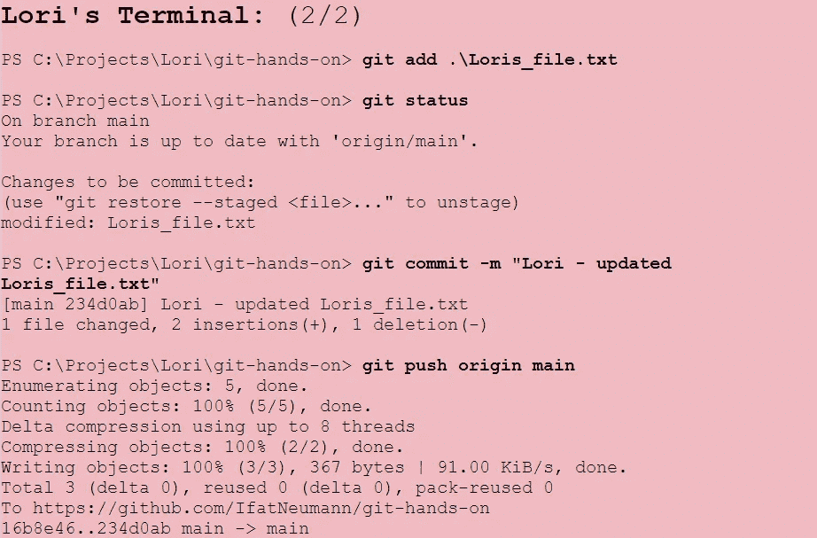*

*那么我们在这里看到了什么？*

1.  *`git status`只是为了表明还没有发生什么事情。*
2.  *`Loris_file.txt`的变化:我加了*“这里有更新！”*文件的结尾。*
3.  *`git status`向我们展示了还没有提交的变更，这意味着我们还没有用`git add`添加它们。我们还可以在这里看到哪个文件发生了变化:`modified: Loris_file.txt`*
4.  *`git diff Loris_file.txt`向我们展示了文件中到底发生了什么变化。*
5.  *`git add ./Loris_file.txt`将文件添加到提交中。*
6.  *`git status`添加后，向我们显示现在有`changes to be committed`。*
7.  *`git commit -m ...`提交变更，并显示消息*萝莉–更新的洛里斯 _ 文件. txt**
8.  *`git push ...`将 Lori 的提交推送到分支`origin main`*

***这是 Lori 提交后我们的状态:***

*   *Olivia 的本地——Olivia 在两个分支中都有原始代码:`main`和`dev/olivia`*
*   *Lori 是本地的——Lori 对原始代码进行了修改*
*   *Remote — `origin main`在原始代码上有 Lori 的修改*

*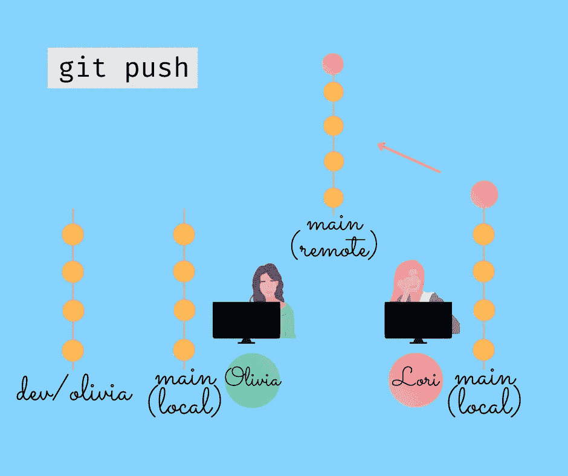*

# *4.Olivia —从远程 main 获取 Lori 的更改*

*正如我们在上一节中看到的，Olivia 不再更新代码中的最新变化。一个有趣的方法是让两位女士运行`git log`命令。`git log`显示了存储库中不同分支的提交。*

*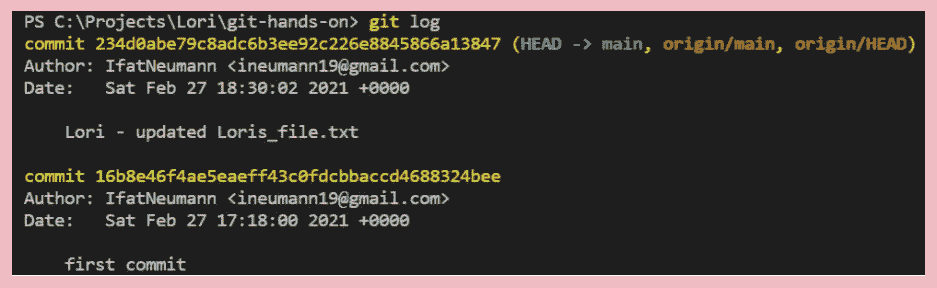*

*先说萝莉的终端。我们可以看到她的 git 知道 3 个分支:origin/main、origin/HEAD 和 local main。老实说，我不知道`origin/HEAD`有什么故事，但这不重要。我总是在`origin/main`旁边看到它，所以我们暂时忽略它。*

*我们还可以看到`origin/main`与 Lori 的本地`main`是最新的，总共有 2 次提交。*

*现在，让我们看看奥利维亚的终端:*

*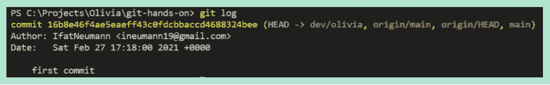*

*哇哇哇！您是否注意到只有初始提交，但是这里说本地分支与原始主分支是最新的？？？*

*除非 Lori 告诉她，否则 Olivia 知道的唯一方法就是尝试从远程获取更改。这并不意味着奥利维亚需要每五分钟拉一次。理想情况下，奥利维亚会在完成工作后拉，就在推之前。如果奥利维亚在推之前没有拉**——git 将阻止她推。***

*另外，请注意，在 Olivia 的终端上，我们看到她有 4 个分支，因为她创建了她的本地`dev/olivia`。*

*怎样才能让奥利维亚意识到遥控器的变化？*

*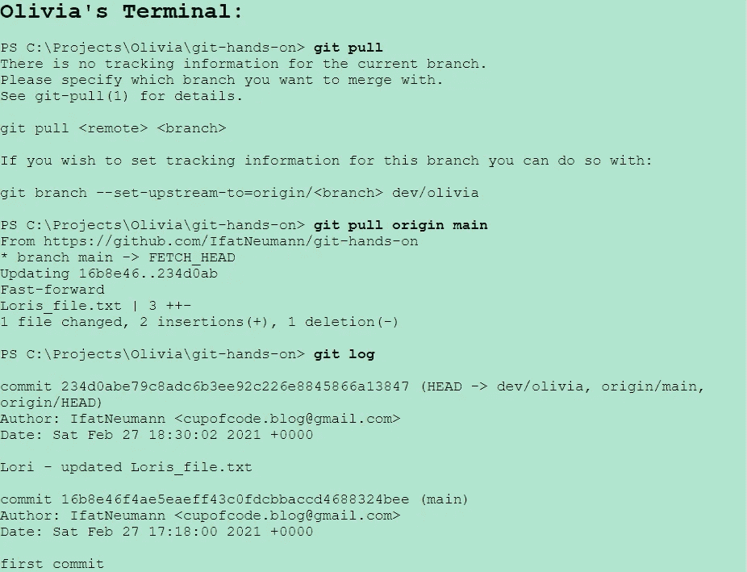*

*那么，我们这里有什么？*

1.  *`git pull`靠自己没用，因为它不知道从哪里拉！如果我们在`main`上，这是显而易见的，因为我们从远程主服务器克隆了本地主服务器。`dev/olivia` branch 是从本地 main“诞生”的，它还没有遥控器。
    正如我们从终端看到的，我们可以用命令`git branch --set-upstream-to=origin/ dev/olivia`定义遥控器。还有另一种方法，你接下来会看到。*
2.  *`git pull origin main`告诉 git 从哪里拉。我们还可以在这里看到发生了什么变化。*
3.  *`git log`，就是为了看和最初`git log`的区别。在下面的截图中我们会看得更清楚。*

*这是奥利维亚的终端拉后:*

*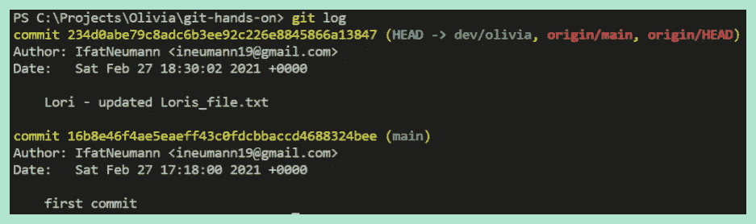*

*`dev/olivia`是我们拉入的分支，所以用 origin/main 是最新的。另一方面，本地 main 仍处于初始提交状态。*

**

# *5.Olivia —向远程开发人员/olivia 添加、提交、推送更改*

*既然 Olivia 了解了最新情况，她就继续处理她的文件。完成后，她想远程推送，以备后用。她不能只做`git push`因为没有`origin/dev/olivia`。她需要创造一个！*

*那么，如何创建远程分支呢？有两种方法可以做到。第一种方法是创建一个空的远程分支，然后推送到它。第二种方法是像往常一样创建一个 commit，并使用 push 创建远程分支—这就是我们将在下面看到的:*

**

*那么，我们这里有什么？*

1.  *这些我们已经知道了。*
2.  *`git push -u origin dev/olivia`-u 标志用于*上游*，仅在新分支的第一次推送中需要。*

*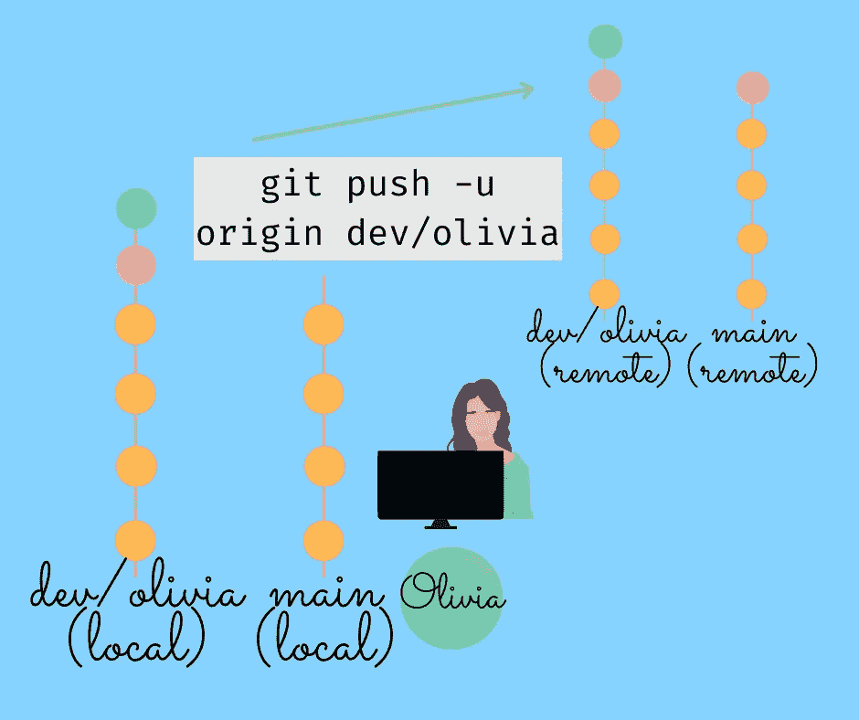*

*突击测验！在奥利维亚的终端中写下`git log`后我们会看到什么？提交了多少次，每个分支在哪里？*

*让我们看看你是否正确:*

*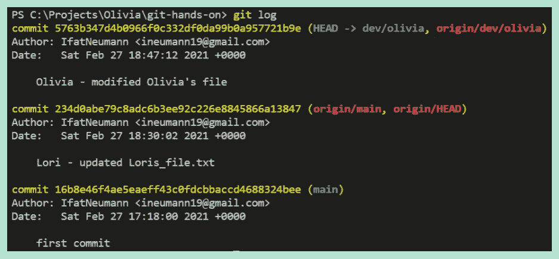*

*奥利维亚在`dev/olivia`上工作，并在从原点总管拉出后将其推至其远程分支**。***

*   *dev/olivia 和 origin/dev/olivia 提交了 3 次，是最新的*
*   *origin/main 有两个提交—初始提交和 Lori 提交*
*   *本地 main 只有初始提交*

## *有趣的事实:有时 git 是无法解释的*

*好吧，我肯定这是可以解释的，但我不知道为什么会发生下面的事情。好消息是——为了使用 git，你不需要理解所有的事情*

*所以，我想从本地`dev/olivia`更新`origin/main`。我原以为一个简单的`git push origin main`会推送到远程主界面，但是由于某种原因，它尝试了从主界面推送到主界面:`! [rejected] main -> main`。*

*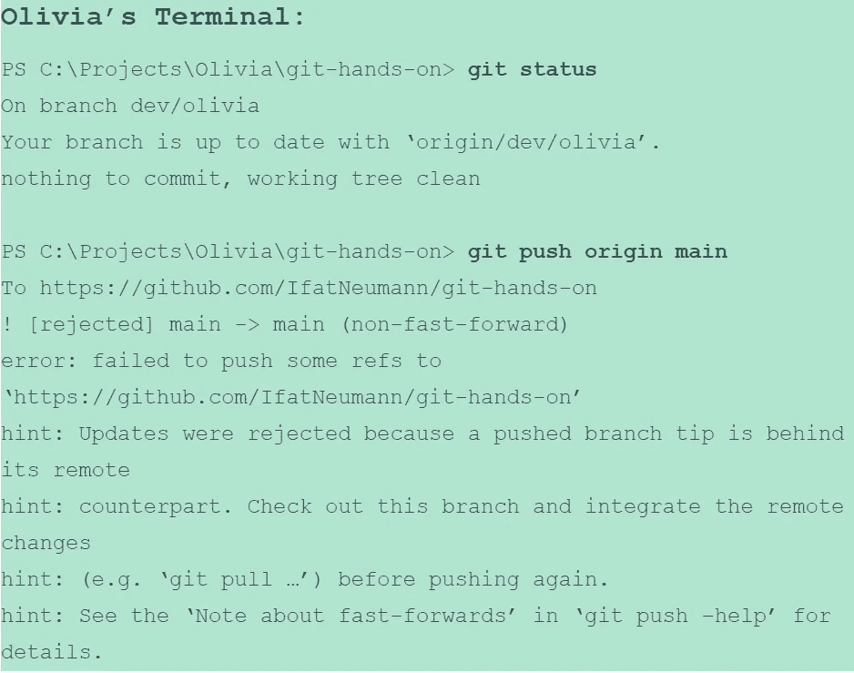*

*那么，如果我们想更新`remote main`，又无法通过本地`dev/olivia`来完成，该怎么办呢？我们可以更新**本地** `main`并从那里推送:*

*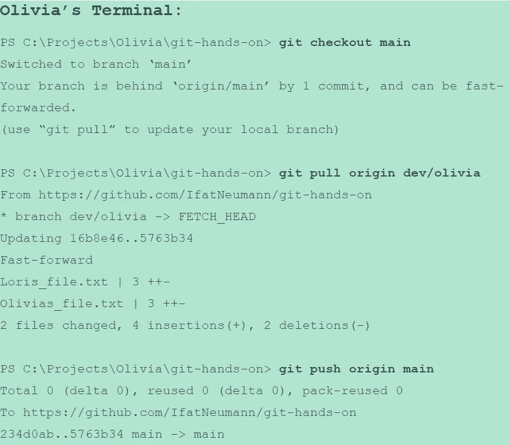*

*我们在这里看到了什么？*

1.  *`git checkout main`切换到分支干线。*
2.  *`git pull origin dev/olivia`更新代码。*
3.  *`git push origin main`更新远程主分支。*

*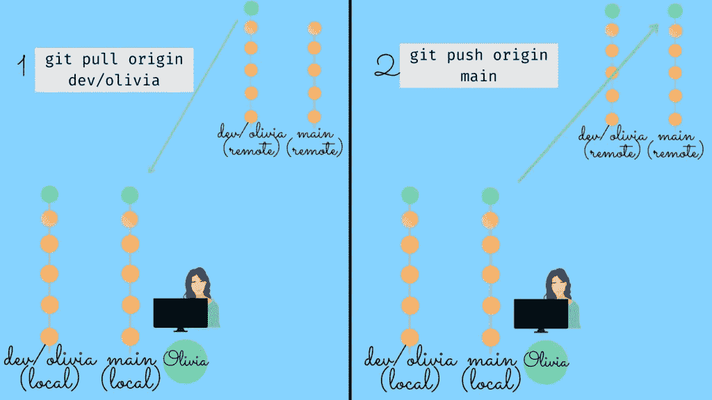*

*现在当 Olivia 写`git log`时，我们可以看到所有的分支都是最新的。*

*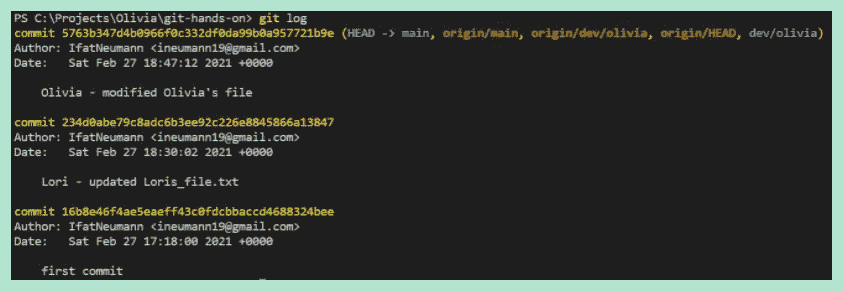*

# *6.Lori 和 Olivia 更新了同一个文件*

*您可能已经注意到项目中有一个名为`mutual_file.txt`的文件。这一步， **Lori** 会更新并推送到`origin/main`，而 **Olivia** 会更新并推送到`origin/dev/olivia`。*

*让我们从奥利维亚开始:*

*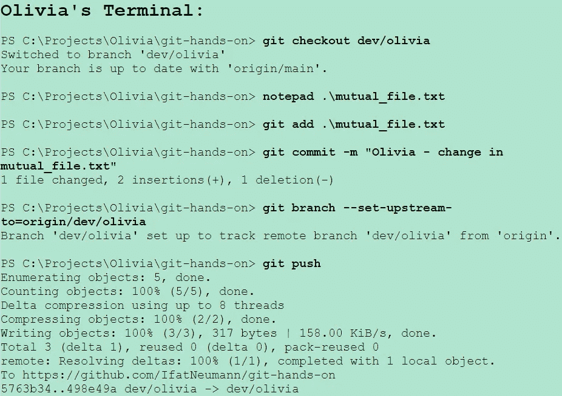*

*我们在这里看到了什么？*

1.  *`git checkout dev/olivia`切换分支。*
2.  *`nodepad .\mutual_file.txt`在记事本中打开该文件，我们可以进行更改并保存。这只是在终端中显示 Olivia 对文件进行了更改的一种方式。*
3.  *到现在为止，我们对这些已经很熟悉了。*
4.  *`git branch --set-upstream-to=origin/dev/olivia`–之前，我们试图从这个分支推进到`origin/main`，因此这会将上游设置为 Olivia 的分支。只是为了确保我们能推进到那里。*
5.  *最后，老熟人`git push`。*

*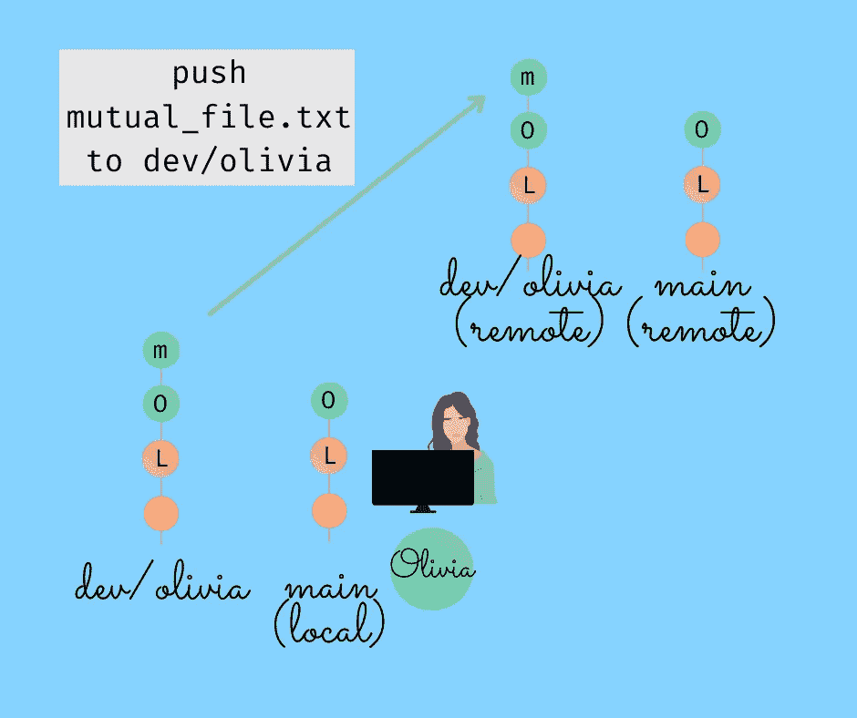*

*在上面的图片中，你可以看到，我在代表提交的圆圈中添加了字母。粉色圆圈是 Lori 提交的，绿色圆圈是 Olivia 提交的。关于信件:
L =对`Loris_file.txt`的更新
O =对`Olivias_file.txt`的更新
m =对`mutual_file.txt`的更新*

*奥利维亚的更新很简单。对于萝莉，事情会变得有点棘手。让我们看看她的终端:*

*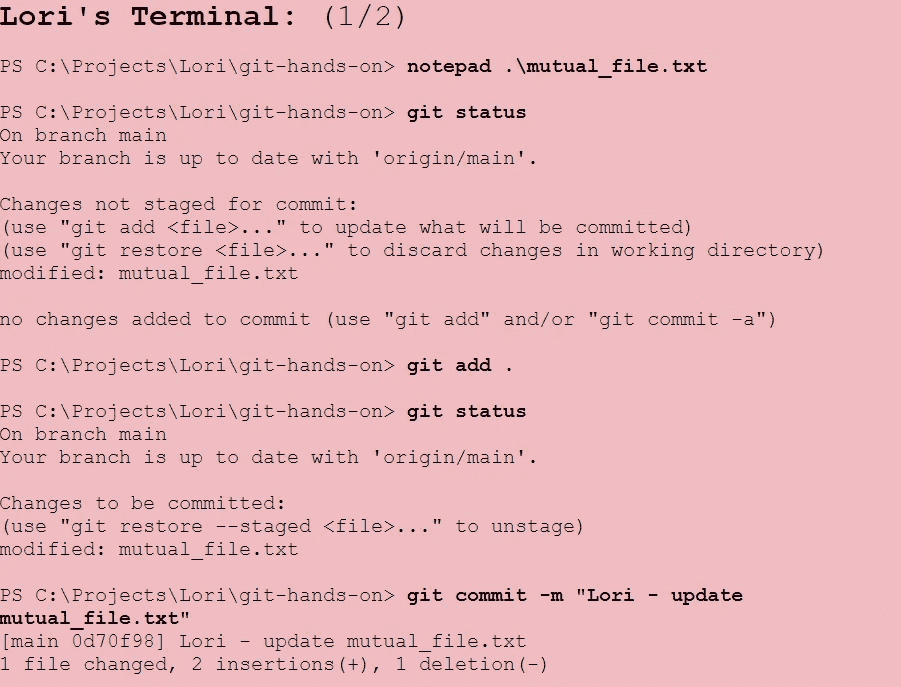**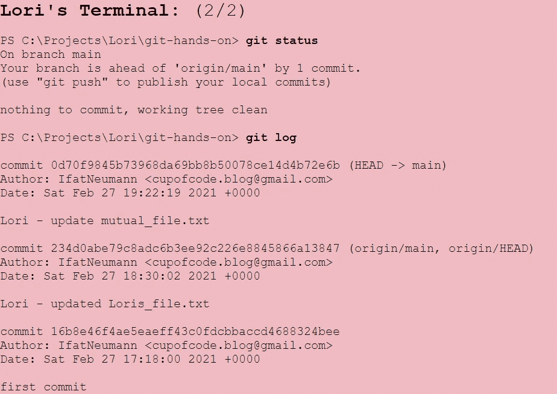*

*那么，我们这里有什么？*

1.  *`nodepad .\mutual_file.txt`向我们展示 Lori 对文件进行了更改。*
2.  *`git add, git commit`，我们现在已经很熟悉了。*
3.  *`git status`在每个命令之后，我强烈建议您阅读响应。*
4.  *最后，`git log`，看看我们的立场。*

*等一下！！`git log`显示出一些怪异的东西。我们知道自从提交了`Loris_file.txt`更新之后`origin main`已经被更新了。我们知道 **Olivia** 从她的分支(*“Olivia-修改的 Olivia 的文件】*)推送到`origin main`的变更！如果**萝莉**推前不拉，更新到最新版本——她的推会被拒绝！！*

*下面是这个问题的形象化描述:*

*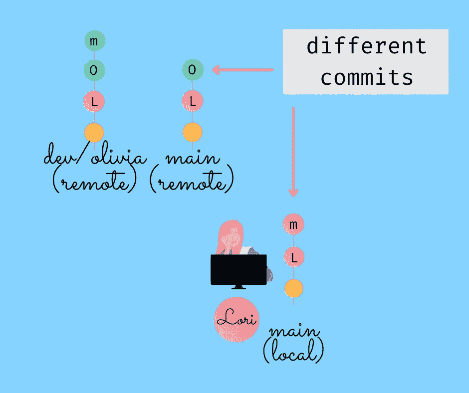*

*现在是了解今天最后一个 git 命令的好时机:`git fetch`。
**git fetch** 是告诉你的 **local** git 从原来的**中获取最新的元数据信息，而**不做任何文件传输。它正在检查是否有任何可用的更改。 **git pull，**另一方面，**和**从远程库带来(复制)那些变更。*

*让我们看看 Lori 获取更改后会发生什么:*

*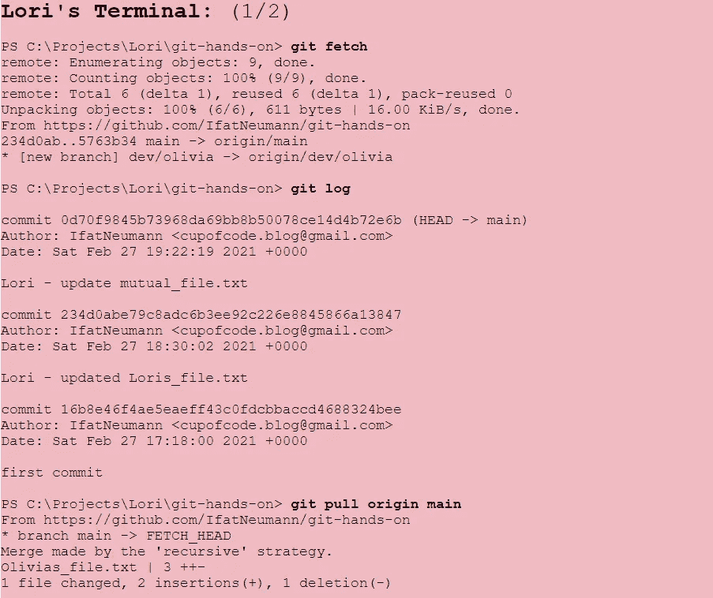**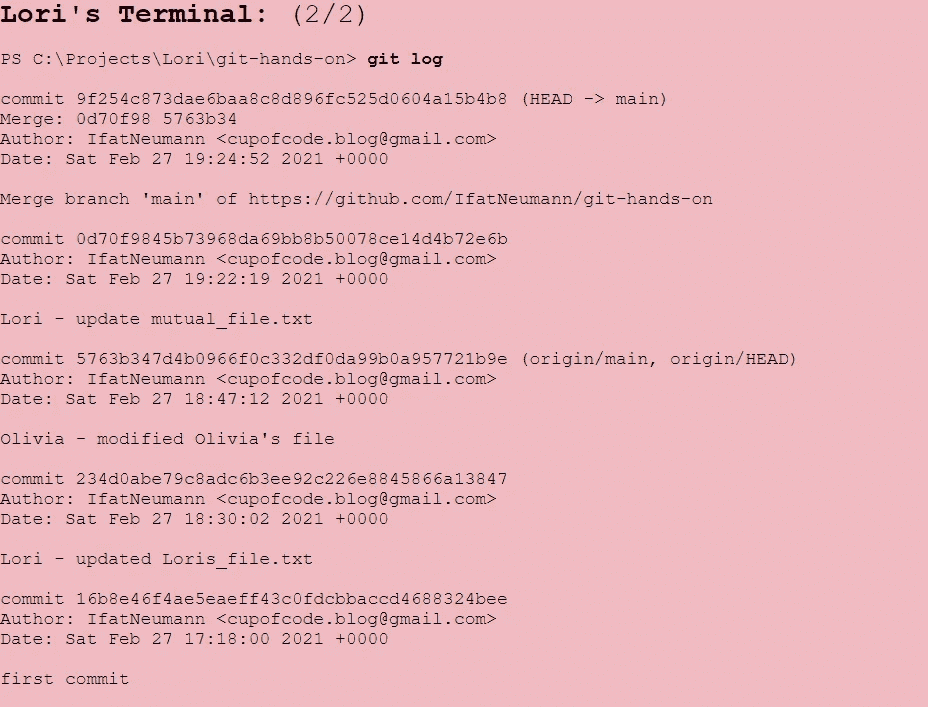*

*所以，你知道我要问什么…我们这里有什么？*

1.  *`git fetch`通知我们变更，其中出现分支`dev/olivia`(**【新分支】dev/Olivia->origin/dev/Olivia*)。*
2.  *`git log`证明没有文件被更新——本地主文件没有改变。*
3.  *`git pull origin main`确实做出了改变，以一种我们以前从未见过的方式:*由‘递归’策略做出的合并。**
4.  *`git log`向我们展示了一个不是女士们创建的提交:*合并 https://github.com/IfatNeumann/git-hands-on.*的“主”分支为什么会这样？奥利维亚的承诺在哪里？*

## *`Merge branch 'main'`提交*

*合并[https://github.com/IfatNeumann/git-hands-on](https://github.com/IfatNeumann/git-hands-on)的分支‘主’*

*递归合并是当我们在从`origin`拉取变更之前**在本地创建提交时发生的事情。***

*为了澄清，Lori 已经创建了一个提交，并且没有基于最新版本的代码。基于最新版本的代码提交是通过在提交之前**从原点拉取来完成的。这也是有意义的，因为为了确保你的代码是好的并且不破坏任何东西——你需要确保它与项目的其余部分一起工作，就像现在一样。***

*如果萝莉没有先拉就试着推，它会被拒绝。在提交更改后从原点提取更改，“强制”git 一个接一个地组织提交，即使它们最初具有相同的父状态。我说的父状态是指它们都基于代码的相同状态。*

*让我们看看它在存储库中的样子:*

*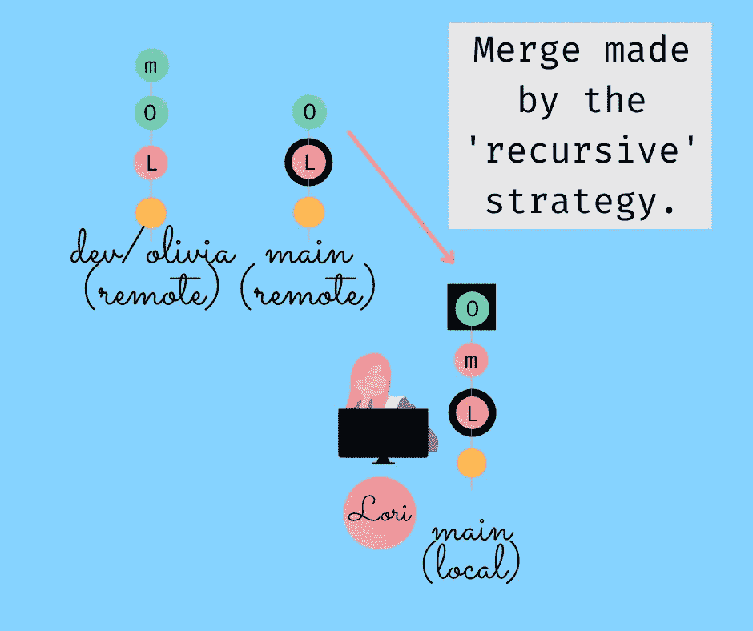*

*既然我们了解了这一点，让我们继续讨论 Lori 的终端:*

*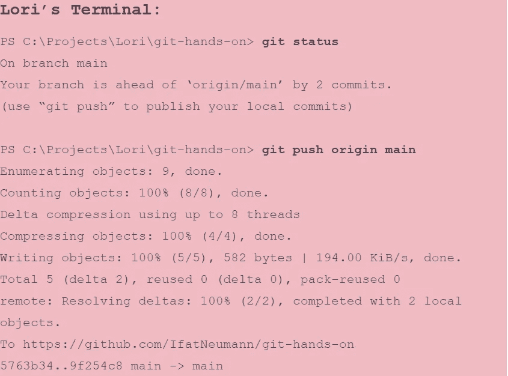*

*`git status`向我们展示了 Lori 的本地 main 领先`origin/main`两次提交。它们是她的原始提交(改变相互文件)和递归合并提交。让我们看看`origin/main`在 GitHub 中的样子:*

*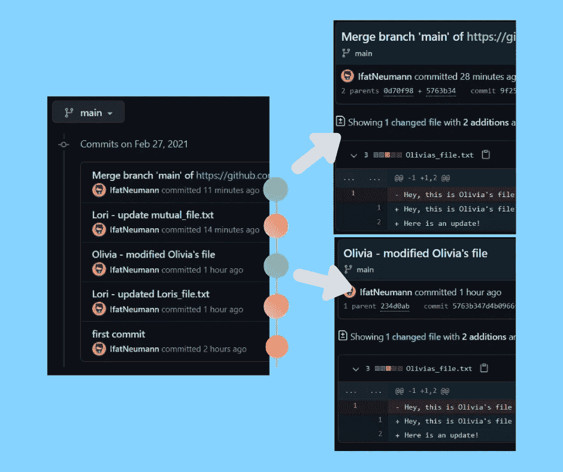*

*`origin/main`现在有 5 次提交。如上图所示，如果您查看两次提交的代码，Olivia 的提交和自动递归合并提交，您会发现它们包含相同的更改。*

*哇，这是一个很长的故事！此时分支的状态如下:*

*   *Olivia 更新了共同文件，并将更改推送到她的远程分支*
*   *Lori 更新了双方的文件，并将更改推送到 main*

*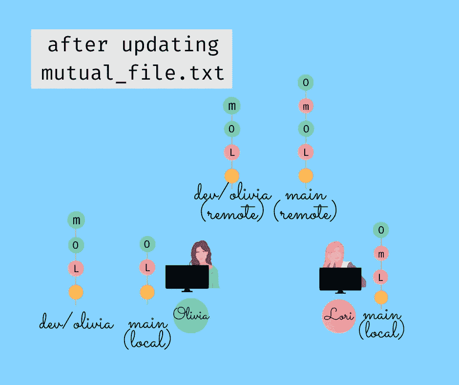*

# *7.冲突！*

*如你所见，我们的两位女士修改了同一个文件，这肯定会造成冲突。只是时间问题。*

*时间到了！让我们看着它发生吧！*

*因此，假设 Olivia 希望获得最新的主版本:*

*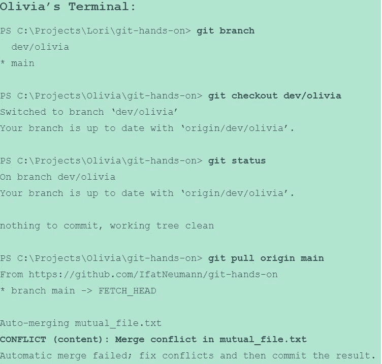*

*代码中的冲突是怎样的？在我们的例子中，就像这样:*

*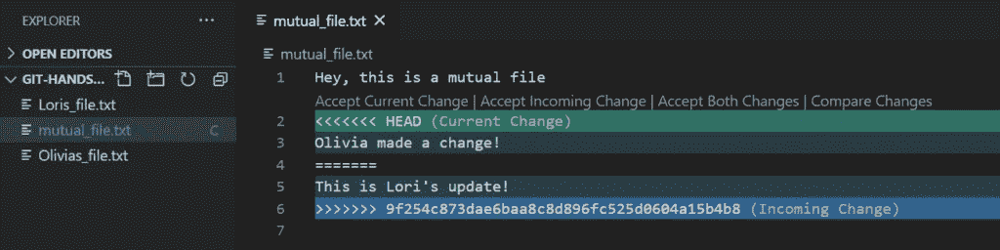*

*   *`<<<<<< HEAD`标记您在本地存储库中的代码*
*   *`======`标记头部结束和引入变化开始的位置*
*   *`>>>>>>`标志着传入代码的结束*

*如果您的文件中多次出现冲突，您将会有多个<<> >的三元组。*

*当您看到冲突时，您需要选择是要保留您现有的版本，用引入的更改替换它，还是两者都保留。如果使用 [Visual Studio](https://en.wikipedia.org/wiki/Microsoft_Visual_Studio) (集成开发环境，如截图所示)，一键完成，生活变得更轻松。在上图中，可以看到选项:`Accept Current Change | Accept Incoming Change | Accept Both Changes`。*

*在我们的情况下，奥利维亚会选择两者都保留。*

*决定保留哪个代码后，你会怎么做？运行命令`git status`给了我们答案:*

*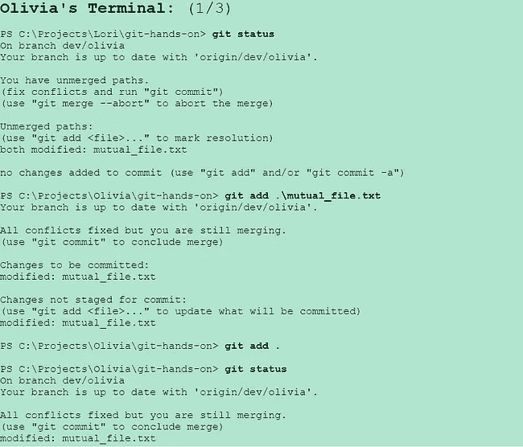**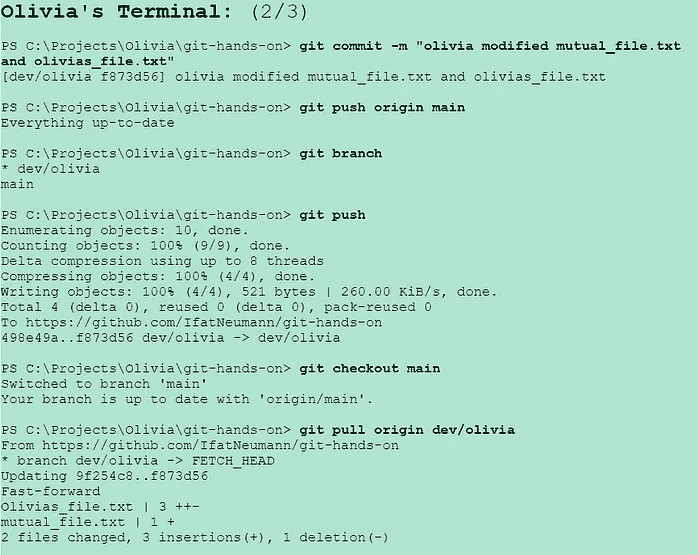**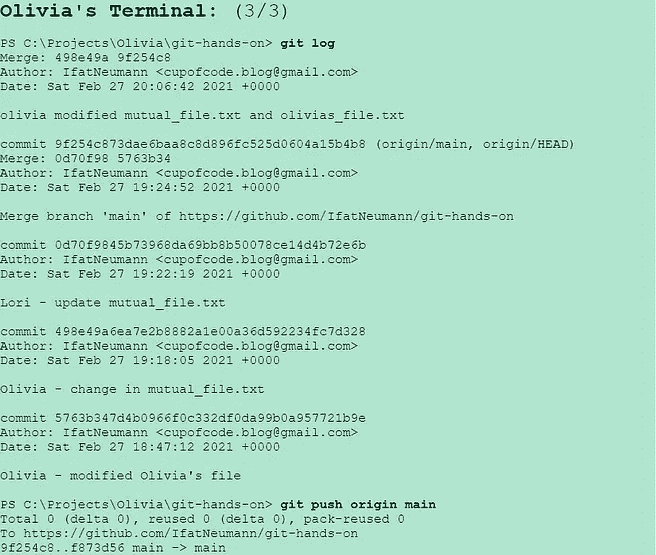*

*我们在这里看到了什么？*

1.  *根据`git status`的说法，我们需要*修复冲突并运行“git commit”*，并且我们还有*未合并的路径:并且应该使用“git add…”**
2.  *命令`git add .`后我得到了回应:
    `Changes to be committed:
    modified: mutual_file.txt`*
3.  *`Changes not staged for commit:
    (use "git add ..." to update what will be committed)
    modified: mutual_file.txt`
    我发现这有点奇怪，就像它说修改后的文件将被提交，也不准备提交，所以我做了一个额外的`git add .`和`git status`。只是为了确定一下。*
4.  *在提交之后，我尝试了推送到 main，但是得到的回应是`Everything is up to date`。所以我用了我以前用过的方法:*
5.  *按下`origin/dev/olivia`，切换到本地主电源，从远程`origin/dev/olivia`中拉出更改，然后按下`origin/main`。*

# *就是这样！*

**

*现在您可以毫无问题地使用 git 了！*

*今天我们学到了很多:命令行界面，git，GitHub，它是如何工作的，并复习了基本命令:*

```
*git init
git clone
git add
git commit
git push
git branch
git checkout
git status
git log
git fetch*
```

*我们还看到了现实生活中使用的命令，并了解了如何解决冲突！*

*如果你感到有点不知所措，这是正常的。git 的奇妙世界让人难以理解，掌握它需要实践！*

*今天之后，看到 git 并没有看起来那么可怕，你觉得你准备好学习更多了吗？因为我有一些非常有用的命令可以在以后的博客文章中与你分享！*

*我希望你喜欢阅读这篇文章，并学到一些新的东西！想多读点？点击[这里](https://cupofcode.blog/tips-for-students-dr-erez-sheiner/)看看巴尔伊兰大学的杰出讲师 Erez Sheiner 给学生们的建议！*

*我很想听听你的想法，以下是联系我的方式:
https://www.facebook.com/cupofcode.blog/[脸书](https://www.facebook.com/cupofcode.blog/)insta gram:[https://www.instagram.com/cupofcode.blog/](https://www.instagram.com/cupofcode.blog/)邮箱:cupofcode.blog@gmail.com*

**