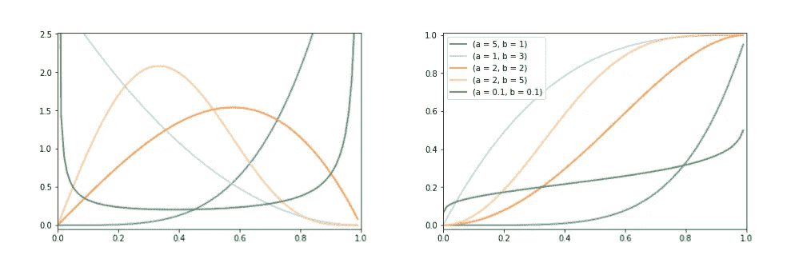
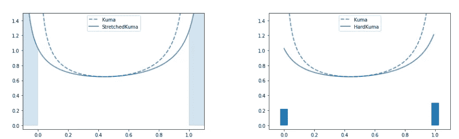
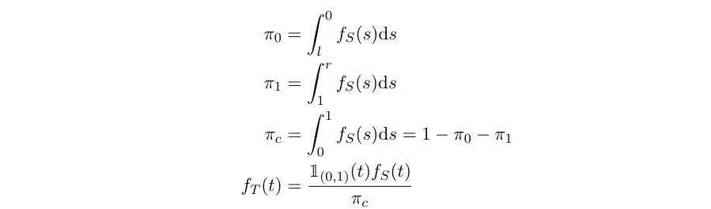

# 关于硬 Kumaraswamy 分布的一个注记

> 原文：<https://medium.com/nerd-for-tech/a-note-on-hard-kumaraswamy-distribution-b74278dc6877?source=collection_archive---------13----------------------->

> 这是摘自我的硕士论文“使用修正随机变量的半监督形态强化”

在这个故事中，我们描述了适用于 Kumaraswamy 分布的拉伸和矫正原理[1]。该技术由 Louizos 等人在 2017 年提出[2]，他们对来自 Gumbel-sigmoid 分布的样本进行了校正。

各种形状参数值的 Kumaraswamy 分布 pdf(左)和 cdf(右)。该插图的原始版本来自 Bastings 等人(2019)。

## 库马拉斯瓦米分布

Kumaraswamy 分布(Kumaraswamy，1980)是定义在区间(0，1)上的双有界连续概率分布。其形状由两个参数 *a∈R > 0* 和 *b∈R > 0* 控制。如果 a=1 或 b=1 或两者都是，Kumaraswamy 等价于 Beta 分布。对于等效的参数设置，Kumaraswamy 分布非常类似于 Beta 分布(但是具有更高的熵)。其密度函数如下所示:

其中 *a* 和 *b* 是前面提到的形状参数。其累积分布函数(cdf)可推导如下:

## **从库马拉斯瓦米分布中取样**

我们注意到累积密度函数有[0，1]的支撑。使用上面所示的累积密度函数，我们可以得到它的倒数，如下所示:

其中 *z∈[0，1]* 表示累积密度函数值。因此，为了获得 Kumaraswamy 样本，我们首先从具有 support [0，1]的均匀分布进行采样，并使用逆 cdf 对其进行变换。有了这个公式，我们可以重新参数化预期，如 Nalisnick 和 Smyth，2016 [3]所述。取样程序如下所示:

## **修正后的库马拉斯瓦米分布**

设 *k* 表示从*库马(a，b)* 采样的基本随机变量。它的定义域是开区间(0，1)。 *k* 被拉伸定义在开区间(l，r)内，其中 *l < 0，r > 1* ，我们表示拉伸版 ass。其累积密度函数如下所示:

最后， *s* 通过一个硬 sigmoid 函数，即 *min(1，max(0，s))* ，被修正为定义在域[0，1]中。我们用 *h* 表示整流后的变量。根据 Bastings 等人(2019) [1]，我们将拉伸和校正后的分布称为**硬 Kumaraswamy 分布**。精确采样的概率 *s= 0* 为 0，由于 *s* 在区间(l，r)内是连续的，精确采样任意值的概率为 0。但是采样 *h= 0* 等价于采样任意 *s∈(l，0)*。类似地，采样 *h= 1* 等价于采样任何 *s∈[1，r)* ，即

拉伸和矫正:我们从一个*库马(0.5，0.5)* 开始，把它的支撑拉伸到区间(-0.1，1.1)，最后我们把 0 以下的质量折叠到{ 0 }，1 以上的质量折叠到{1}。该插图的原始版本来自 Bastings 等人(2019)。

上图说明了拉伸和矫正的过程。阴影区域显示采样的概率 *h=0* (左)和 *h=1* (右)。经整流的变量 *h* 具有由 0 和 1 处的点质量组成的分布，以及截断为(0，1)的拉伸分布，

其中 f(h)是 H 的概率密度函数，δ(。)表示狄拉克-德尔塔函数，T 是截断分布，以及

其中，π₀和π₁分别表示对离散结果进行采样的概率{ 0 }和{1}，π𝒸表示对连续结果进行采样的概率。截断的密度 fₜ(t)被引入，因为 fₛ(s)在(1，r)上被适当地归一化。我们可以看到 fₕ(h)具有以下性质:

1.  *支持一致性*:支持[0，1]，包含离散结果{ 0 }和{1}。
2.  *灵活性*:可以控制这个分布的参数，这样我们就可以指定得到结果{ 0 }和{1}的概率。
3.  *可微性*:为了利用现成的(随机)梯度上升技术，分布在其参数方面几乎处处可微。

# 参考

1.  Bastings、w . Aziz 和 I . Titov(2019 年)。具有可微分二元变量的可解释神经预测。arXiv 预印本 arXiv:1905.08160。
2.  Louizos，c .，Welling，m .，和 Kingma，D. P. (2017)。通过 l0 正则化学习稀疏神经网络。
3.  Nalisnick，e .和 Smyth，P. (2016 年)。粘连断裂变分自动编码器。