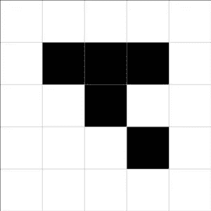

# 细胞自动机一瞥(1/2)

> 原文：<https://medium.com/nerd-for-tech/a-peek-at-cellular-automata-1-2-ee0bf60204fa?source=collection_archive---------22----------------------->

## 我们能模拟生命本身吗？

前阵子，[我写了一篇关于**遗传算法**](https://mina-pecheux.medium.com/a-peek-at-genetic-algorithms-9179e81275fb) 以及它们如何被用来解决各种数学问题的帖子。但是那些**进化策略**并不是计算机科学领域的人们从自然中获取灵感来创建他们的模型的唯一方式…

# 自然的力量