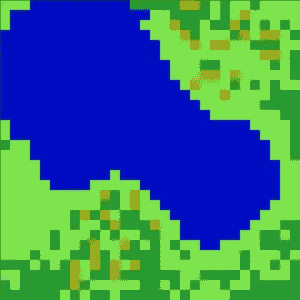

# 细胞自动机一瞥(2/2)

> 原文：<https://medium.com/nerd-for-tech/a-peek-at-cellular-automata-2-2-5abbcc461aa7?source=collection_archive---------11----------------------->

## 让我们看看如何使用细胞自动机来制作一个 RPG 地图生成器:)

昨天，[我讲了元胞自动机](https://mina-pecheux.medium.com/a-peek-at-cellular-automata-1-2-ee0bf60204fa)，更准确的说是康威的《生命的游戏》。为了继续这个话题，我搜索了我们可以从细胞自动机的概念中得到的小应用程序，最终我满足于一个:一个类似于 **RPG 的俯视图生成器**。

