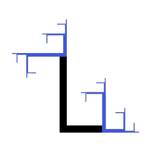

# L 系统一瞥

> 原文：<https://medium.com/nerd-for-tech/a-peek-at-l-systems-29b847b23365?source=collection_archive---------3----------------------->

## 我们可以用相同的算法为一棵树和一个城市路线图建模吗？

[几周前](/nerd-for-tech/a-peek-at-cellular-automata-1-2-ee0bf60204fa)，我谈到了细胞自动机，并展示了我们如何将它们用于**程序生成**。今天，我们来看看另一种类型的**发电机** : [L 系统](https://en.wikipedia.org/wiki/L-system)。

正如维基百科页面所解释的，**L-系统**(或林登迈耶系统)是由匈牙利生物学家设计的…