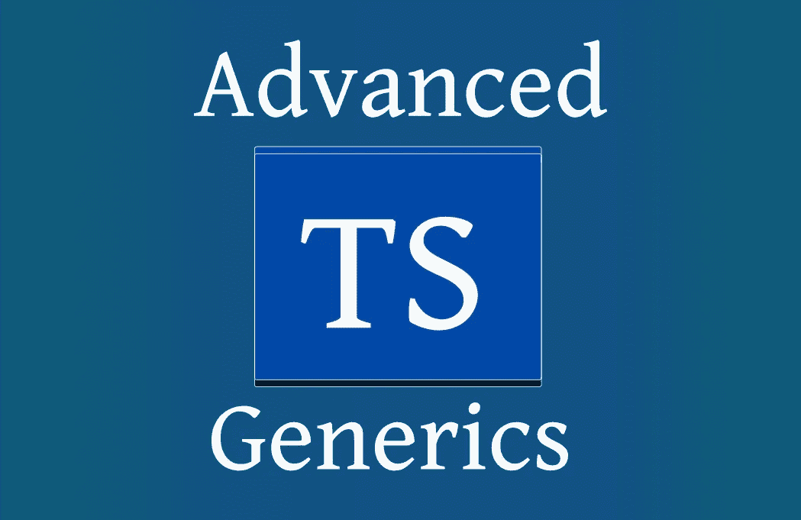

# TypeScript 泛型高级用法的实用介绍

> 原文：<https://medium.com/nerd-for-tech/a-practical-introduction-to-advanced-usage-of-typescript-generics-92aa7e8ae47d?source=collection_archive---------7----------------------->

TypeScript 泛型的高级用法

在像 TypeScript 这样的静态类型语言中，泛型是一种通过引入受控的类型宽松度来提高代码可重用性的方法。在这篇短文中，让我们深入探讨 Typescript 中的泛型，以及如何使用它来编写更少的代码并提高项目的一般可维护性。

# 仿制药: