# 在生成布局上用数字准备的 3D 建筑物设计代替受限的玻尔兹曼机器的建议

> 原文：<https://medium.com/nerd-for-tech/a-proposal-for-digitally-prepared-designs-of-3d-buildings-replacing-restricted-boltzmann-machines-383ad81bf4f2?source=collection_archive---------2----------------------->

*控制流理论及其与数据的关系*

## **简介 **

一个想法转化为产品的过程是由项目方法论中的统一过程定义的。《盗梦空间》描述的事件范围从利益相关者会议到项目启动阶段，从头脑风暴到想法验证。

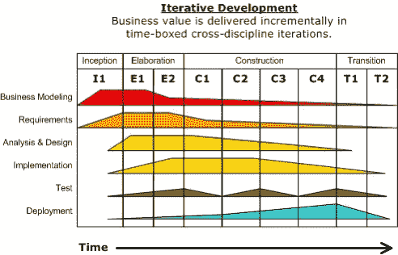

这是一个为建筑或房间制作的 Unity 项目模拟演示，请在下面观看。

当您为入射太阳光规划建筑布局时，上面的删除建筑结构演示开始。这是当设计师考虑建筑物的布局时，限制通过门和窗进入每个有界区域。我可以展示设计过程是多么简单，通过这一过程，考虑两个点作为源和汇与系统互动，产生一个房间的描述性表示，从而产生建筑。

## ***参数***

客户必须能够使用三个因素搜索整个设计空间:

> (1)建筑物的照明要求
> 
> (2)流通要求
> 
> (3)运动要求

*存在一个度量表*,它从近似的输入房间大小映射到这些要求

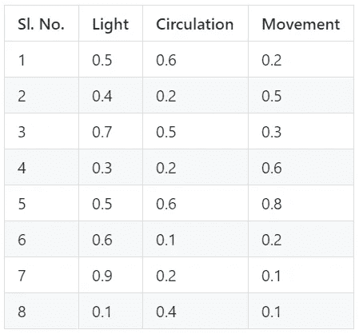

公制表

接下来，*是从单个房间类型映射到房间类型各个方面的设计图表*

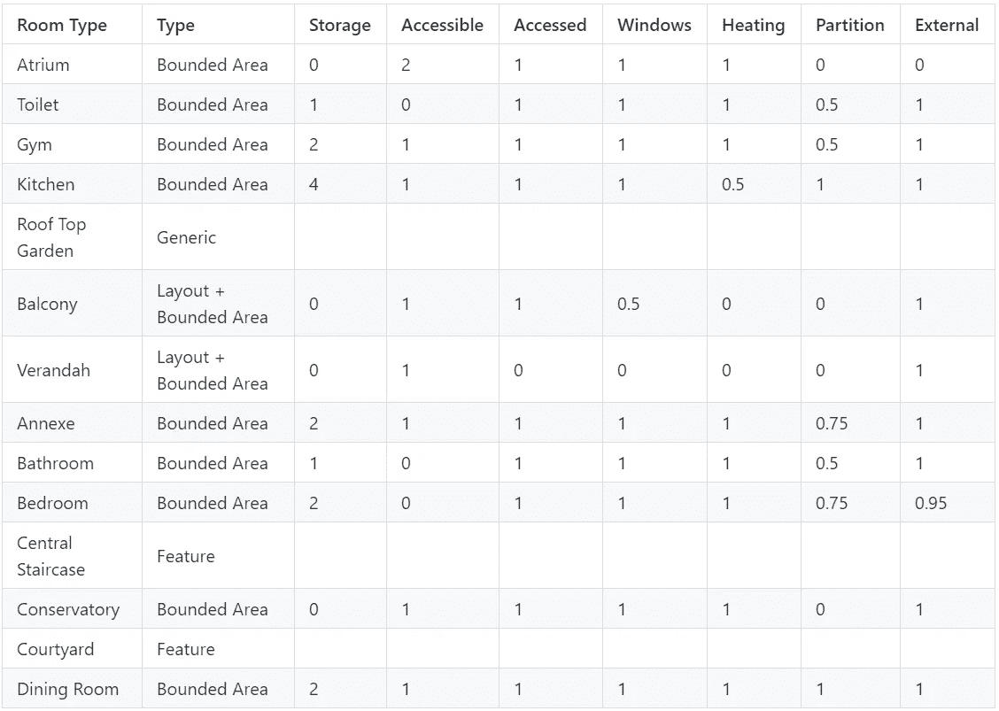

设计图表

*负荷分布图*指定给定建筑的每个房间应承受多少负荷

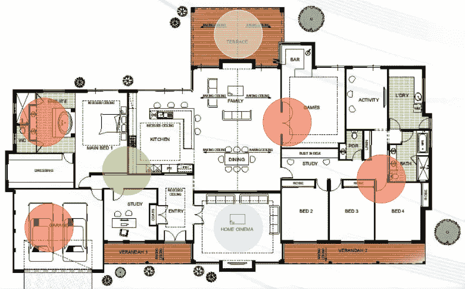

彩色区域代表房间承受的负荷

设计方案继续使用*邻接矩阵*作为:

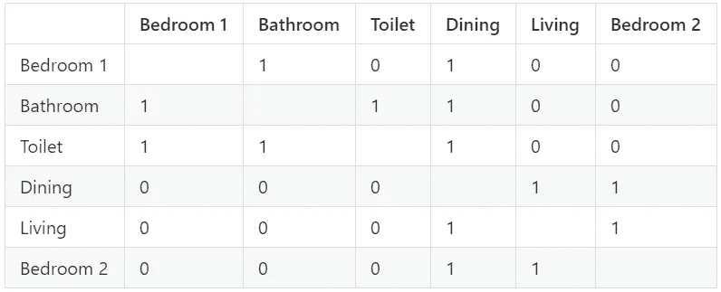

邻接矩阵

这里，1 表示房间彼此相邻，而 0 表示它们不相邻。

## **设计理念**

设计理念考虑使用负荷分布图设计结构，考虑建筑的长宽比和能量，并近似模拟建筑内人员的移动。它们被分为光的考虑，空间的要求和邻近模型的应用来定义建筑内的结构。

## ***一张拉格朗日图***

使用拉格朗日图定义房间内的空间，并考虑以下邻近因素:

> -不要太靠近窗户和门口
> 
> -离窗户和门口不太远

窗户和门口被用来构造不太远的距离和不太近的距离的功能被编码。编程代码如下所示:

```
**not_too_far_distances** = exp(distances)
**not_too_close_distances** = exp(-1 * distances)
```

接下来，找到两个拉格朗日点，使拉格朗日值最大化和最小化。这两点被认为是与系统相互作用的源和汇。这里展示了这个想法。

```
**data_h** = distr_affinity
*# initialising the minimal data_h values to zero*
**data_h.affinity -= np.min(distr_affinity.affinity)**
**data_f** = distr_distance
result = pd.DataFrame(columns=result_cols)
epsilon = np.arange(0.05, 0.2, 0.05)
**for** eps **in** epsilon:
    value_df = data_h.iloc\
    [data_f[(np.abs(data_f['d0'] - data_f['d1']) < eps) & \
            (np.abs(data_f['d1'] - data_f['d2']) < eps)].index, 3]
    **if**(len(value_df) != 0):
        val = value_df.astype('float32').idxmin()
        result = result.append(dict(zip(result_cols, 
            [value_df[val], eps, val])), ignore_index=True)
epsilon_chosen = 0.05
eps_df = result[(result['epsilon'] <= epsilon_chosen)]
beta = np.mean(np.square(_distances[eps_df.row_index.values.astype(int).tolist(), :]))
data_l = data_f.loc[:, 'distance'].values + beta * data_h.loc[:, 'affinity'].values**primal_value** = data_l[data_l == np.max(data_l)]
**dual_value** = data_l[data_l == np.min(data_l)]
```

我上面所做的是优化拉格朗日以得出一个公式化的β因子。结果是不太近距离和不太远距离的回归。最后，我们找到最大化和最小化拉格朗日值的原始点和对偶点。这两点作为一个房间的源汇系统。每个房间都通过通道门连接到相邻的房间，源汇系统通过通道门进行通信。使用公式可以表明，拉格朗日映射适用于这种情况。这种源汇系统的公式如下:

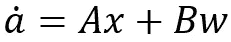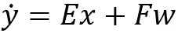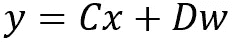

## ***在一个假想的源汇系统中:***

第一个方程是源输入的状态空间方程，A 是状态矩阵，B 是输入矩阵

第二个方程是信宿输入的状态空间方程，E 是连接到信宿时的状态矩阵，F 是输入 W 的反馈/传输矩阵

第三个方程是从接收器输出的状态空间方程，C 是输出矩阵，D 是到输入 W 的反馈/传输矩阵

取第二个方程和第一个方程的差，在两边求平方，我们得到一个类似的方程:

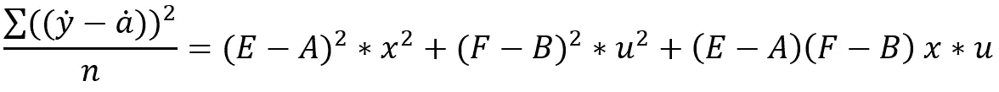

输入 u 或 w 是流量矢量，x 是状态矢量

左侧的残差平方和(RSS)与值的平方项匹配，其中 x 代表状态向量，u/w 代表流量向量。

在拉格朗日图中，由于残差平方和(RSS)可以解释为:

> -变量的风险敞口

我们可以通过在状态空间模型上取一个拉格朗日量来确定我们的状态。

拉格朗日函数应用于我们的窗户、通道门和另一个小窗户的空间，如下所示:

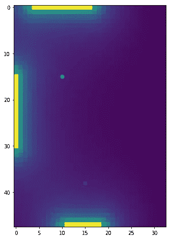

代表原始变量和对偶变量的点。洋红色的点利用了离门口和窗户很远的距离，而浅绿色的点附近的窗户是流通的主要因素之一。

## ***接近度图表***

我们可以描述 RSS(剩余平方和)是另一个房间连接到这个拉格朗日房间的机会。平衡观察到的 RSS 值是我们最初的动机。

使用我们的设计图表，我们构建了一个主成分分析矩阵，它构成了我们开发邻近图的设计考虑因素。

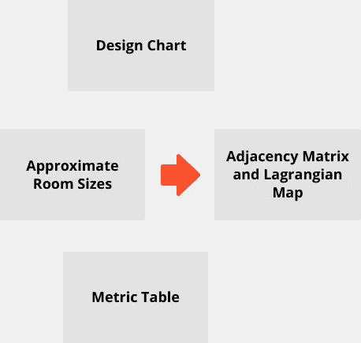

邻近图的推导

## ***因子分析算法***

因子分析算法根据先验对后验进行建模，并最大化变量的可能性。使用因子分析，可以有效地模拟每个窗口和通道区域(如通道门)的照明需求。因此，我们可以使用拉格朗日和因子分析来形成搜索空间，然后将它们聚集起来以表示度量表值。

因子分析算法最大化了后验和先验之间的 KL 散度，因此我们所表示的光需求将被有效地转化为位置的星历数据。就我们记录的客户对典型房间的阳光或光线的偏好而言，我们知道我们的系统是适当建模的。

类似地，拉格朗日图从关于流过窗户的随机分布中获取输入数据，并且它很容易由我们的空间和邻近要求来表示，或者反过来称为房间的流通。拉格朗日图也模拟人的运动，只是改变函数和状态空间方程来模拟运动的空间和邻近值。

## **结论**

我们应该严格避免随机解，因为这里的解本质上主要是确定性的。事实上，建模提高了所生成的布局的输出，并且我们可以抑制用于生成布局的基于模型的迭代。

我在一些论文中看到，他们使用受限玻尔兹曼机(RBM)算法来建模可达性、楼层和各种其他参数。这种描述需要大量的管理数据，而不是配置数据。