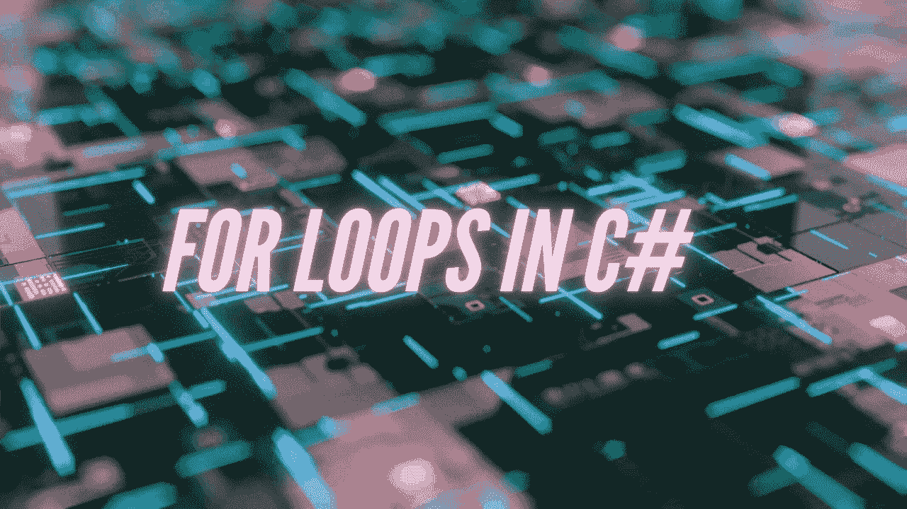
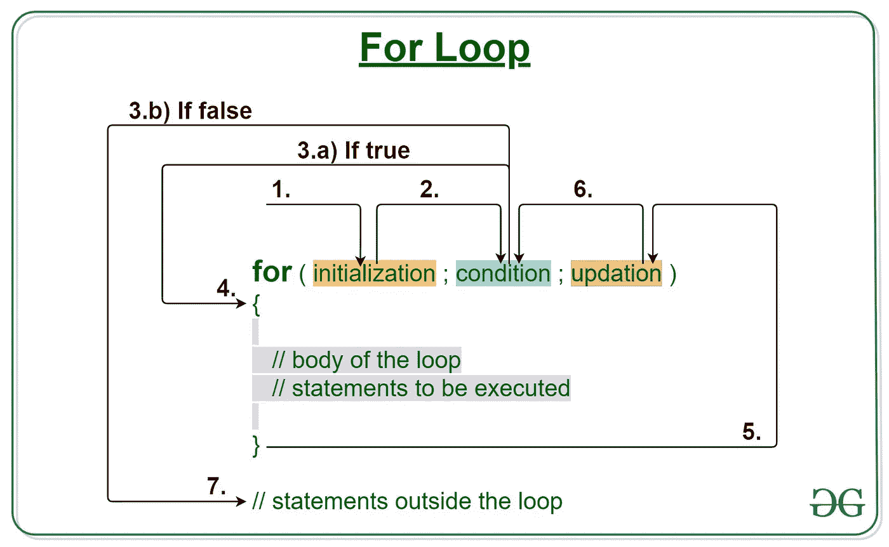
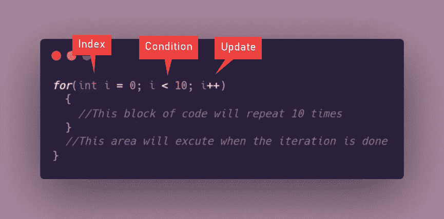
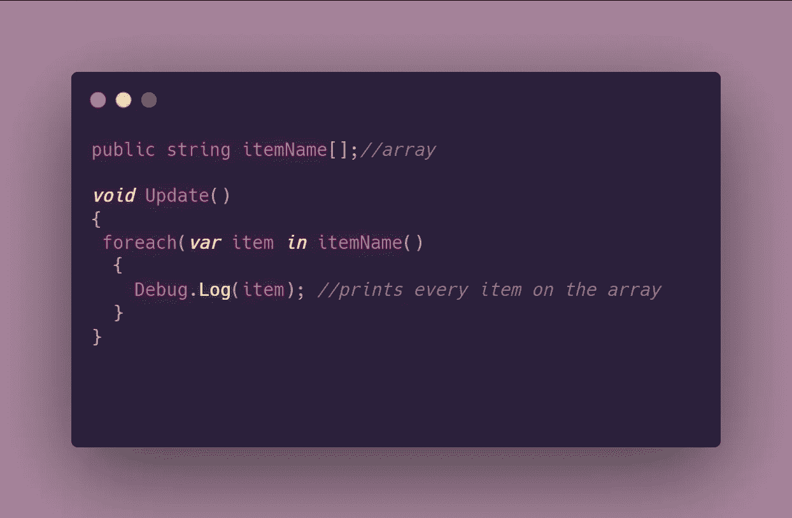

# C#中 For 循环的快速介绍

> 原文：<https://medium.com/nerd-for-tech/a-quick-introduction-to-for-loops-in-c-68a2924b341a?source=collection_archive---------14----------------------->

# 什么是 For 循环？

For 循环是一种允许我们对代码块进行特定次数迭代的结构。虽然所有循环都用于迭代目的，但 for 循环更擅长于让我们准确知道代码块将运行多少次。

[为循环流程图](https://www.geeksforgeeks.org/java-for-loop-with-examples/)

# 语法:

For 循环的语法如下:

*   **初始化**:默认或起始索引号。这是一个可以有任何名字的变量，但是，在 C#和 C++中，这个值传统上表示为 *i(* ，例如 I = 0；).
*   **条件**:指定循环将运行多长时间的条件。例如 i < 10 →这意味着只要索引号小于 10，就会一直运行。
*   **更新**:索引变量**的增加或减少。**随着循环的进行，它将在每次迭代中主动比较新值(更新后的)与条件值。重复此过程，直到该值达到条件中设置的阈值。

# 如何尽早摆脱循环

尽早退出循环在很多方面都很有用。例如，如果您正在遍历一个列表，并希望循环在找到列表中的特定值或项目时停止，或者即使您正在编写传统的游戏逻辑，但有一个事件中断了事情的流程。尽早跳出循环很简单，您可能已经通过实现 [Switch-Statements](https://levelup.gitconnected.com/switch-statements-to-the-rescue-277cb924c312?source=your_stories_page-------------------------------------) 熟悉了这一点。

要跳出一个循环，你只需要陈述一个条件，后面跟着一个 break；声明。

# Foreach 循环

这个循环是 C#语言独有的，虽然概念与 for 循环相同，但语法不同。foreach 循环在遍历集合(如数组)时非常有效。

## 语法如下:

*   **变量项:**被搜索或将被迭代的变量的名称。
*   **in:** 指定在哪个集合中搜索变量**的关键字。**
*   **itemName:** 数组或集合的名称。

在下一篇文章中，我将介绍 while 循环！