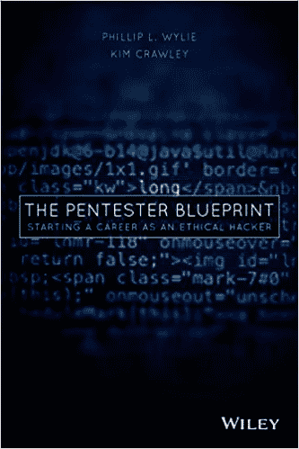
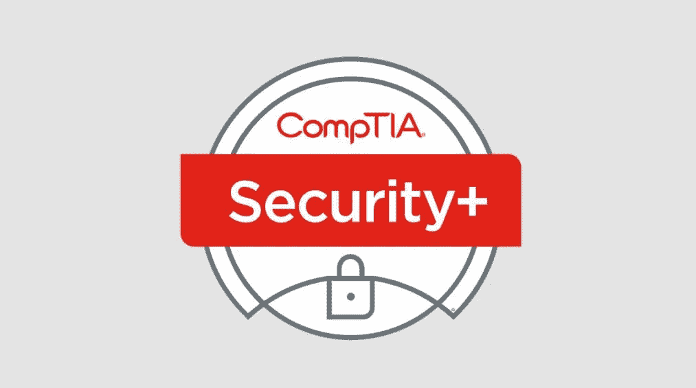
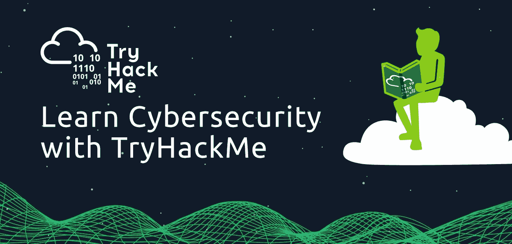
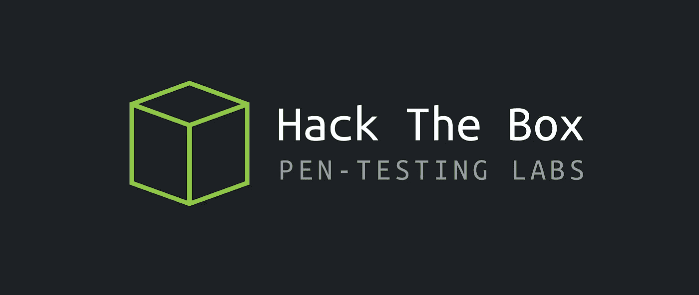
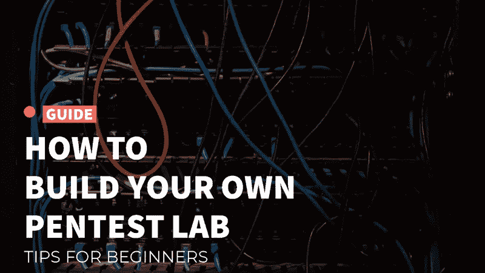
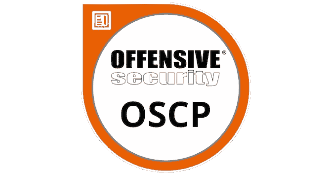
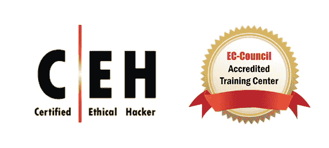
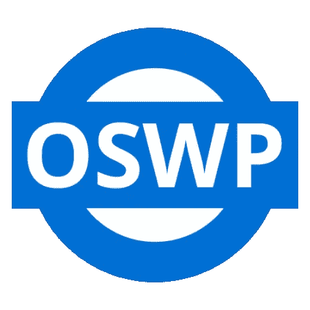
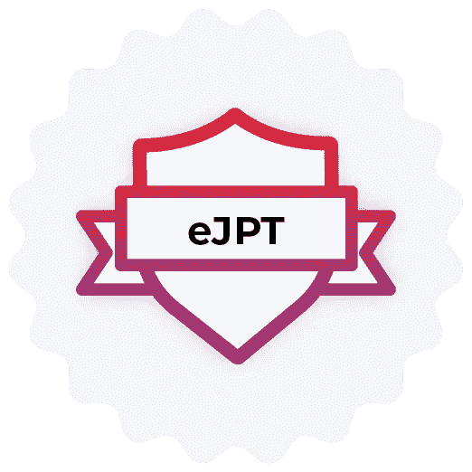
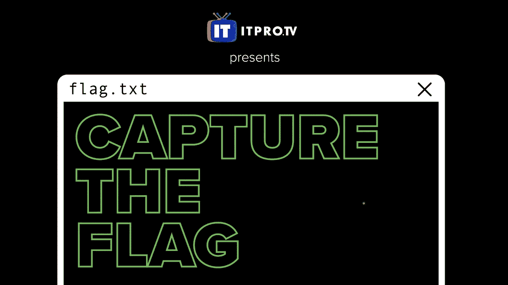

# 成为道德黑客指南

> 原文：<https://medium.com/nerd-for-tech/a-quick-pentester-blueprint-outline-efe866a06c56?source=collection_archive---------0----------------------->

图像[来源](https://img.sheroes.in/tr:w-790/img/uploads/article/high_res/15495365261549536526.png)

*如果你想进入进攻/防御安全行业，Pentester 蓝图*是一个很好的资源。我发现这本书是一个多合一的地方，可以找到有关 Red Teaming 的信息，成为一名有道德的黑客意味着什么，以及如何获得进入安全领域并最终被雇用所需的必要经验。下面，我提供了每章中我认为有用的内容的概要，以及你将从阅读本书中受益的主要原因。

抢一份[这里**这里**](https://amzn.to/3KoEzEb)

值得说明的是，这本书没有给我提供任何新的惊人的信息。相反，它是一个以相关方式编写的信息集合，涉及道德黑客以及如何获得经验、人脉和获得第一份工作。所有这些信息都可以在网上找到，但是这本书把所有的关键信息都集中在一个地方。如果你是这个行业的新手，这是一个很好的入门资源。如果你是一个经验丰富的专业人士，它可能看起来很基础，但你仍然会找到有用的信息。这是一本简短的书，提供了有关道德黑客的信息的简明汇编。

有几个故事讲述了当前的安全专业人员以及他们是如何进入这个行业的；我发现这些故事非常有用，因为这些专业人士来自各种不同的背景(包括一个从面包店工作到作为一名黑客从事安全工作的人！).

第一章:什么是圣灵降临节？

第一章充满了关于行业本质的真知灼见。本章概述了不同类型的黑客、pentester 类别、进行渗透测试的原因、pentester 方法和 7 步 PTES。

*   **红队**:攻击性安全→发现漏洞和利用
*   **蓝队**:防御安全→使用红队的发现来保护和加固他们的网络
*   **紫队**:帮助红队和蓝队沟通的一小组人

**渗透检测执行标准(PTES) 7 步**

1.  预约前互动
2.  情报收集(侦察)
3.  威胁建模
4.  弱点分析
5.  剥削
6.  后期开发
7.  报告

我发现这一章很有用，因为它提供了对这个行业的基本理解，可以帮助你在道德黑客世界中找到自己的位置。

**第 2 章:必备技能**

看看 CompTIA.org

本章列出了进入这个行业所需要的基本证书。围绕证书是否必要，是否值得花费时间、金钱和精力，有一场大辩论。我个人最近获得了 CompTIA Security Plus 认证，我发现我对安全性的理解有了很大的提高。点击这里 ，查看我关于如何通过 CompTIA Security Plus 考试 [**的快速指南。如果你想开始你的教育，像**](https://tanner-jones.medium.com/quick-tips-for-passing-the-comptia-security-plus-sy0-601-exam-61ff7f3e499c) **[CompTIA A+](https://www.comptia.org/certifications/a) 、 [Network+](https://www.comptia.org/certifications/network) 、 [Security+](https://www.comptia.org/certifications/security) 或 [Linux+](https://www.comptia.org/certifications/linux) 、 [PenTest+](https://www.comptia.org/certifications/pentest) 这样的认证是一个很好的起点。**

本章继续概述道德黑客在商业模式中的位置，以及这个角色如何影响商业安全态势。它提到了其他主题，如事件响应、高级持久性威胁(APT)、网络杀伤链、CIA Triad 和访问控制。

**第三章:黑客教育**

第三章主要讨论“黑客思维”。**黑客思维**是像黑客一样思考的能力，并且能够找到利用易受攻击漏洞的方法。这需要时间和重复去开发，最好是有动手的黑客经验来开发。

本部分重申**五旬节蓝图公式:**

## PBF =技术知识+黑客知识+黑客思维

第四章:教育资源

由于互联网和道德黑客的本质，在线资源是获得实践经验的有效途径。本节概述了几个在线免费和付费资源，无论你在旅途中的什么地方，都可以提高你的技能水平。

[**开始黑客攻击！**](https://tryhackme.com)

查看 [**这里**](http://www.hackthebox.com)

小 [**图片大技巧学习！**](http://www.pentestlab.com)

**第 5 章:建立一个测试实验室**

这一章是我个人想花更多时间来研究并创建自己的家庭实验室的内容。作者提到了三种实验室环境，这取决于你的预算和你想要完成的任务。最棒的是，你可以从小处着手，随着时间的推移不断增加。本章概述了流行的工具，如 Nmap、Metasploit、Nessus、OpenVAS、Kali Linux 和 Wireshark。

点击这里[到**启动你的家庭实验室**到](https://hackwarenews.com/how-to-build-your-own-pentest-lab-tips-for-beginners/)

极简实验室 →创建一个虚拟机，在笔记本电脑上拥有一个便携式实验室。您可以在不同的地点学习，并创建实验室来测试您在网络、软件或应用程序方面的技能。

**专用实验室** →为你的攻击系统和黑客目标系统创建单独的计算机。这给测试增加了一个网络元素。你不是直接攻击机器，而是通过网络。

**高级实验室** →这是三个选项中更广泛、更昂贵的一个。实验室运行需要大量电力，而且实验室越复杂，排除故障所需的时间就越长。您可以使用路由器和交换机，它们可以是独立的硬件设备，也可以是使用 pf sense([www.pfsense.org](http://www.pfsense.org))或基于 FreeBSD 类 UNIX 操作系统的开源防火墙软件发行版的虚拟设备。

**第 6 章:认证和学位**

本章概述了直接关注道德黑客的认证。这些认证更高级，需要大量的时间来准备。认证费用从 500 美元到 2000 美元不等。考试本身需要更多的动手操作，需要你黑掉网络上的几台机器，然后写一份报告。

推荐的认证如下:

**攻击性安全认证专家(OSCP)**

结账详情[此处**此处**](https://www.offensive-security.com/pwk-oscp/)

**认证道德黑客(CEH)**

结账详情 [**此处**](https://www.eccouncil.org/programs/certified-ethical-hacker-ceh/)

**进攻安全无线专业(OSWP)**

结账详情 [**此处**](https://www.offensive-security.com/wifu-oswp/)

虽然拥有信息技术、计算机科学或任何其他相关领域的大学学位会为你提供更多的知识，帮助你成为一名更全面的专业人士，但大学教育并不是成为一名道德黑客的必要条件。在我看来，根据你的志向，大学学位将有助于你以后的职业发展，根据你的情况，大学学位是值得获得的。然而，传统的四年制大学并不是大学的唯一形式。有许多证书，社区大学和在线平台，你可以利用，以推进你的教育。

我计划努力的一个认证是 eJPT，它是 eLearn Security Junior 渗透测试器。这种认证没有其他认证存在的时间长，但它更实惠，而且大多数学习材料都可以在网上免费获得。

结账详情 [**此处**](https://elearnsecurity.com/product/ejpt-certification/)

**第七章:制定计划**

本章着重于确定你目前的技能水平，以便找到你的技能差距。以下是这本书推荐你精通的技能列表:

> Windows
> Linux
> 联网
> 安全
> 脚本
> 活动目录(AD)
> Web 技术
> 无线技术
> 物联网
> 黑客攻击 Web
> 无线黑客攻击
> 社会工程
> 物理测试
> Android
> iOS
> MAC OS
> 防火墙配置
> Python
> Java
> 逆向工程
> 防病毒防火墙
> 批判思维

**第八章:获得经验**

这一章旨在提供你在哪里可以获得实践经验的信息。正如我前面提到的，tryhackme、HackTheBox 和其他网站都是很好的在线资源。另一种让你为工作面试和认证做好准备的获得经验的方法是 **CTFs** 或捕获标志事件、 **Bug 奖金、**和**面试。这些是我认为最有帮助的资源:**

*   [Bugcrowd](https://bugcrowd.com/programs)
*   [钢骨](https://www.hackerone.com)
*   [Synack](https://www.synack.com)
*   [Vulnhub](https://www.vulnhub.com)
*   [ctftime](https://ctftime.org)
*   [picoCTF](https://www.picoctf.org)
*   [overthewire](https://overthewire.org/wargames/)

去年我第一次参加了 CTF，这是一次很棒的经历。我同意作者和故事中提到的参加 CTF 的重要性，因为这是提高你的技能和结识新朋友的好方法。网络在网络安全中极其重要，这些事件提供了与各行各业的人见面和联系的机会。本章提供了当前安全专业人员和黑客的信息，以及他们在该行业的起步情况。我发现它们很有帮助，很有见地，因为你可以将它们与你的个人经历和个性联系起来。

我希望你能找到这个 [*的简要概述，圣灵降临节蓝图*](https://amzn.to/3KoEzEb) 对你有所帮助，并在你的学习之旅中有所帮助。我只涉及了我认为最有帮助的主题，所以如果你正在寻找如何进入信息安全领域以及如何成为一名有道德的黑客的蓝图，我建议你自己阅读。感谢您的时间和支持。我是亚马逊的会员，如果你从提供的链接中购买，这将有助于支持我的写作。

干杯！