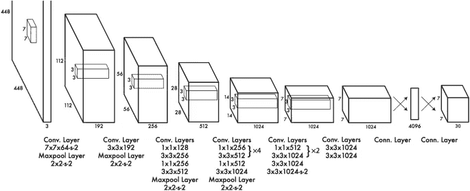
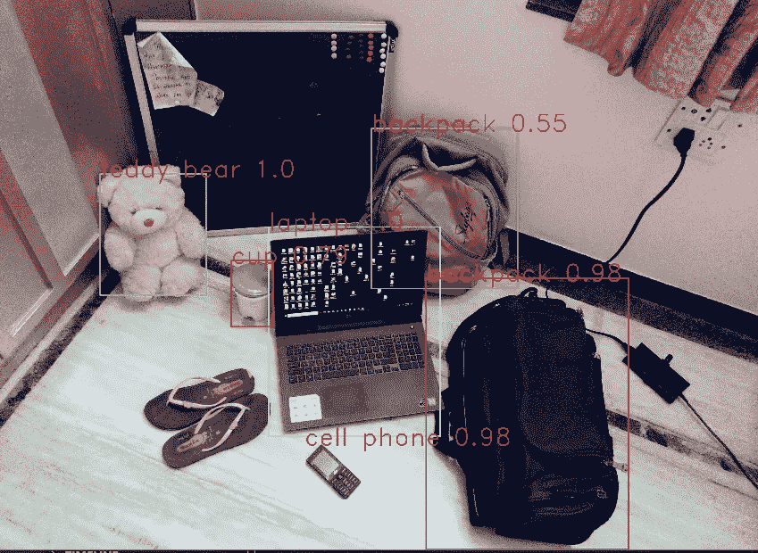
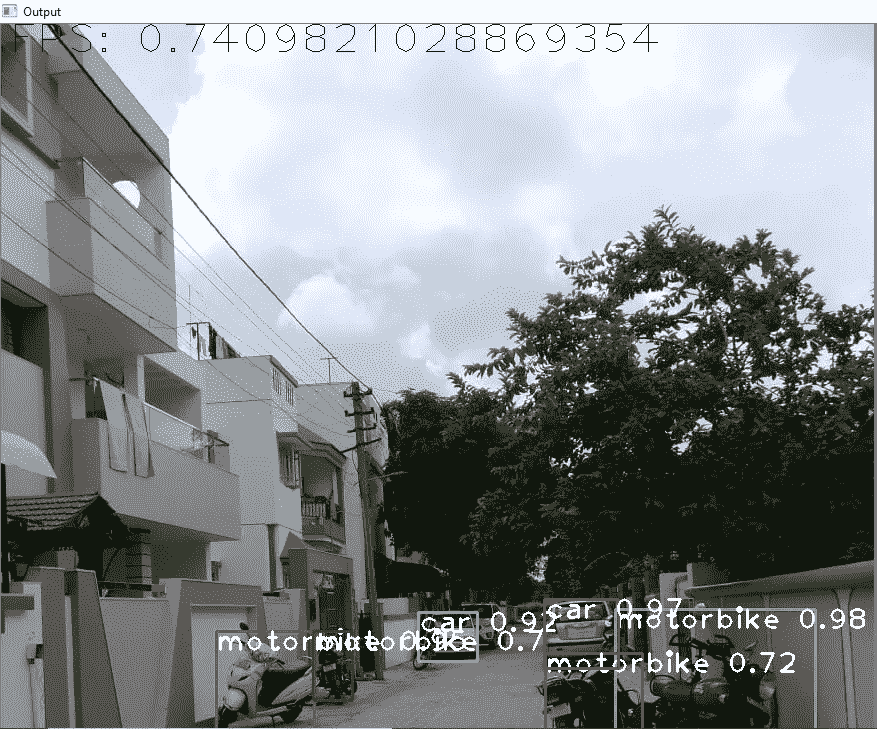

# 面向非 GPU 计算机的 YOLOv3 算法实时目标检测模型

> 原文：<https://medium.com/nerd-for-tech/a-real-time-object-detection-model-using-yolov3-algorithm-for-non-gpu-computers-8941a20b445?source=collection_archive---------2----------------------->

> 合著者 [Dhrumilparikh](https://medium.com/u/b4c7c4df291a?source=post_page-----8941a20b445--------------------------------)


> 你只看一次(YOLO)是一个最先进的，实时对象检测系统。YOLOv3 速度极快，精度极高。

YOLOv3 是一种新兴的对象检测模型，用于运行在图形处理单元(GPU)不足的笔记本电脑或台式机上。“你只看一次”v3 (YOLOv3)模型广泛应用于基于深度学习的物体检测方法**。**该模型是在 **COCO 数据集**上准备的，实现了 57.9%的平均精度(mAP)。YOLOv3 在非 GPU 计算机上的运行速度约为 20 FPS。

YOLO 已经经历了三次迭代，每一次都是对前一次的逐步改进。你可以检查每一篇文章:

*   [https://arxiv.org/pdf/1506.02640.pdf](https://arxiv.org/pdf/1506.02640.pdf)
*   [https://arxiv.org/pdf/1612.08242.pdf](https://arxiv.org/pdf/1612.08242.pdf)
*   约洛夫 3:[https://pjreddie.com/media/files/papers/YOLOv3.pdf](https://pjreddie.com/media/files/papers/YOLOv3.pdf)

**先决条件**

*   OpenCV
*   NumPy
*   YOLO 的配置文件和权重文件
*   熊猫
*   COCO 名称文件
*   Python(3.0 或以上版本)

**什么是 YOLO？**

YOLO 是一个聪明的**卷积神经网络(CNN)** 用于实时进行对象检测。该算法将单个神经网络应用于整个图像，然后将图像分成多个区域，并预测每个区域的边界框和概率。这些边界框由预测概率加权。图像的高分区域被认为是检测。

与基于分类器的系统相比，我们的模型有几个优点。它在测试时查看整个图像，因此它的预测由图像中的全局上下文提供信息。它还可以通过单个网络评估进行预测，不像 R-CNN 这样的系统需要成千上万的单个图像。这使得它非常快，比 R-CNN 快 1000 多倍，比快速 R-CNN 快 100 倍。

约洛夫 3 的建筑:



[来源](https://arxiv.org/pdf/1506.02640.pdf)

*   每个边界框包含 5 个元素:( *x，y，w，h* )和一个**框置信度得分**。置信度得分反映了框包含对象的可能性以及边界框的精确度。然后用图像的宽度和高度归一化边框宽度 *w* 和高度 *h* 。 *x* 和 *y* 是相对于相应单元格的偏移量。因此， *x，y，w* 和 *h* 都在 0 和 1 之间。每个单元格有 20 个条件类概率。**条件类别概率**是检测到的物体属于特定类别的概率(每个单元每个类别一个概率)。因此，YOLO 的预测具有(S，S，B×5 + C) = (7，7，2×5 + 20) = (7，7，30)的形状。
*   YOLO 的主要概念是建立一个 CNN 网络来预测(7，7，30)张量。它使用 CNN 网络将空间维度降低到 7×7，每个位置有 1024 个输出通道。YOLO 使用两个完全连接的图层执行线性回归，以进行 7×7×2 边界框预测(下图中)。要进行最终预测，请将那些具有高框置信度得分(大于 0.50)的预测作为最终预测。

**实施:**

1.  我们需要在任何 python IDE 中创建一个 python 文件，并导入所有必需的包。

```
import cv2
import numpy as np
import time
```

**2。加载 YOLOv3 的训练权重和配置文件。**

```
net = cv2.dnn.readNet('yolov3.weights','yolov3.cfg')classes = []with open('coco.names','r') as f:classes = f.read().splitlines()cap = cv2.VideoCapture(0)
```

**3。现在，我们将图像分成多个区域并预测边界框。然后，它将制作区域置信度大于 0.5 的盒子。**

```
font = cv2.FONT_HERSHEY_DUPLEXstarting_time = time.time()frame_id = 0while True: _, img = cap.read() height, width, _ = img.shape frame_id += 1 blob = cv2.dnn.blobFromImage(img, 1/255, (416,416), (0,0,0),       swapRB = True, crop = False) net.setInput(blob) output_layers_names = net.getUnconnectedOutLayersNames() layersOutputs = net.forward(output_layers_names) boxes = [] confidences = [] class_ids = [] for output in layersOutputs: for detection in output: scores = detection[5:] class_id = np.argmax(scores) confidence = scores[class_id] if confidence > 0.5: center_x = int(detection[0]*width) center_y = int(detection[1]*height) w = int(detection[2]*width) h = int(detection[3]*height) x = int(center_x - w/2) y = int(center_y - h/2) boxes.append([x, y, w, h]) class_ids.append(class_id) confidences.append((float(confidence))) print(len(boxes)) indexes = cv2.dnn.NMSBoxes(boxes, confidences, 0.5, 0.4) colors = np.random.uniform(0, 255, size = (len(boxes), 3))
```

**4。这将制作不同颜色的矩形盒子，并通过将物体与预先训练的重量进行比较来给出标签，就这样。尽情享受吧！！**

```
 for i in range(len(boxes)): if i in indexes: x, y , w, h = boxes[i] label = str(classes[class_ids[i]]) confidence = str(round(confidences[i],2)) color = colors[i] cv2.rectangle(img, (x,y), (x+w,y+h), color, 8) cv2.putText(img, label + " " + confidence, (x, y+20), font, 1, (255,255,255) , 2) elapsed_time = time.time() - starting_time fps = frame_id / elapsed_time cv2.putText(img, "FPS: " + str(fps), (10,30), font, 1, (0,0,0), 1) cv2.imshow('Output',cv2.resize(img,(700, 500)))  # cv2.resize(img,(600, 400)) key = cv2.waitKey(1)  #0 #if the 'c' key is pressed, stop the loop if key == ord('c'): breakcap.release()cv2.destroyAllWindows()
```

## **结果会是这样的:**



## ***概要:***

在这个模型中， **YOLOv3** 实现了将物体检测带到非 GPU 计算机上的目标。该模型还可以从记录的图像或视频中检测物体。此外，YOLOv3 还在物体探测领域做出了贡献。此外，YOLOv3 表明浅层网络对于轻量级实时对象检测网络具有巨大的潜力。在非 GPU 计算机上以 20 FPS 的速度运行，对于这样一个小系统来说是非常有前途的。此外，该模型 YOLOv3 表明，当涉及到较小的浅层网络时，批量规范化的使用应该受到质疑。轻量级实时对象检测领域的进展是使对象检测在日常实例中可用的最后前沿。

## 参考资料:

[https://www.youtube.com/watch?v=1LCb1PVqzeY](https://www.youtube.com/watch?v=1LCb1PVqzeY)

[](https://pjreddie.com/darknet/yolo/) [## YOLO:实时目标检测

### 你只看一次(YOLO)是一个最先进的，实时对象检测系统。在 Pascal Titan X 上，它处理…

pjreddie.com](https://pjreddie.com/darknet/yolo/) 

[https://towards data science . com/yolo-v3-object-detection-53 FB 7d 3 bfe 6 b](https://towardsdatascience.com/yolo-v3-object-detection-53fb7d3bfe6b)

***项目编码:***

[https://github.com/Krutarth08/Realtime_Object_Detection](https://github.com/Krutarth08/Realtime_Object_Detection)