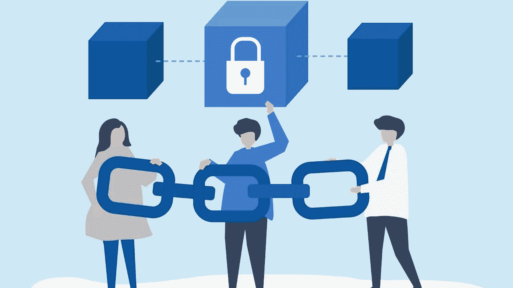

# 多链和跨链区块链路线图

> 原文：<https://medium.com/nerd-for-tech/a-roadmap-to-multi-chain-and-cross-chain-blockchain-4f2d1ef29746?source=collection_archive---------3----------------------->

区块链技术的基本能力和功能推动了它的采用。随着开发商不断创新和最大化技术，区块链项目的数量正在稳步增加。

此外，随着区块链平台上[区块链专家](https://www.blockchain-council.org/certifications/certified-blockchain-professional-expert/)和用户数量的增长，不同区块链之间的互操作性变得更加重要。因为没有一个放之四海而皆准的解决方案可以解决区块链的所有缺陷，所以一直在开发更新的协议来改进现有的区块链。

旨在改善物联网支付系统的 IOTA 区块链、旨在简化区块链供应链管理的 VeChain 和旨在克服偏远地区延迟相关问题以促进无缝支付的 Stellar 区块链，只是区块链项目的几个例子。

**什么是跨链技术，它是如何工作的？**

区块链平台的广泛采用暴露了早期区块链在处理速度和可伸缩性方面的困难。因为所有的区块链功能都是独立的，相互之间没有联系，开发者面临一个独特的挑战:用户将无法充分享受区块链技术的好处。

只有通过一个单一的协议将不同区块链的参与者联系在一起，才能实现完全的去中心化。交叉链技术试图通过允许多个区块链相互通信来解决这个问题。这意味着他们都能够交流和分享信息。

旨在提高连通性的跨链协议可与各种区块链互操作。这意味着两个完全独立的区块链之间的金融交易是可能的。以前，加密业务只能接受与他们使用相同区块链的客户的付款，这使得他们无法与其他区块链公司自由交易。

交易费用将显著降低，并且不会因为这样的环境而出现停机。

**什么是多链技术，它是如何工作的？**

为了最大限度地减少误解，并保持稳定和控制哪些交易存在，区块链的可见性应该始终刻意保持在选定的参与者中。在工作证明和相关费用的帮助下，采矿作业可以更安全地进行。另一方面，这种区块链架构只交易已经被链的参与者验证的账户。

当区块链中的节点相互作用时，握手过程发生在多链中。当两个区块链节点连接时，会出现多链。每个节点的身份由一个带有权限列表的地址表示。因此，它所代表的每个节点都会向其他用户发送一条消息。如果他们没有从该过程中收到满意的结果，则 P2P 连接被终止。

**结束**

区块链技术与互操作性解决方案相结合，预计将在各种行业中得到广泛应用。多年来，区块链一直在与可扩展性作斗争，但跨链协议可以有所帮助。这也将有助于加密的采用，因为使用哪种区块链并不重要。

具有如此坚实基础特征的加密货币具有实用价值，使其投资更加安全。在做出金融决策之前，投资者应该了解区块链的一切，以及它们是如何运作的。如果你已经发现自己想知道[如何学习区块链](https://www.blockchain-council.org/blockchain/how-can-a-newbie-start-learning-about-blockchain/)，那么是时候参加区块链认证了。在线学习区块链，开始你的旅程。