# 使用最先进的人工智能解决方案进行道路损坏检测和分类的自我案例研究

> 原文：<https://medium.com/nerd-for-tech/a-self-case-study-on-road-damage-detection-classification-using-state-of-the-art-ai-solutions-a3daed88e6f9?source=collection_archive---------2----------------------->

*一个阳光明媚的星期天，长长的假期，清新的空气掠过，我们还错过了什么？是啊！！长驱动*🚗*。但是这个甜蜜的梦会让你想到什么呢？我有你，交通，俚语，当然还有坑坑洼洼。对于所有生活在印度的人来说，坑坑洼洼完全不需要介绍。尺寸可能会因地点而异，但我们无法避免坑洞，尤其是在这个国家。责怪制度或个人不会有任何好处，也不会避免我们面临的* [*危险*](https://gomechanic.in/blog/road-hazards-in-india-reasons/) *！请继续阅读，找出可以提出的解决方案，以便在适当的时候采取适当的措施。*

坑洞可能看起来很小，但可能造成大灾难。参考号: [unsplash](https://unsplash.com/photos/-TQUERQGUZ8)

# 目录

1.  *问题陈述*
2.  *目标*
3.  *映射成深度学习任务*
4.  *数据来源&动机*
5.  *数据概述*
6.  *指标*
7.  *第一次切割模型*
8.  *探索性数据分析*
9.  *移动互联网*
10.  *YOLO*
11.  *最终管线*
12.  *演示*
13.  *未来工作*
14.  *和我联系*
15.  *参考文献*

# 1.问题陈述

路面检查主要基于人工视觉观察和使用昂贵机器的定量分析。其中，目视检查方法不仅需要有经验的道路管理者，而且**耗时且昂贵**。此外，目视检查往往**不一致且不可持续**，这增加了风险。另一方面，缺乏必要资源的城市没有适当和经常地进行基础设施检查，增加了结构恶化带来的风险。相比之下，基于大规模检查的定量测定，如使用移动测量系统(MMS) (KOKUSAI KOGYO CO .，2016 年)或激光扫描方法(Yu 和 Salari，2011 年)被广泛采用。虽然定量检查非常准确，但进行这种全面检查的费用太高，特别是对缺乏必要财政资源的小城市而言。

# 2.目标

2.1 本案例研究是深度学习在对不同类型的道路损坏进行分类和检测方面的实际应用。

2.2 这将有助于政府/市政当局提供一种高效且经济的维护方式，以保持道路的良好和安全状况。

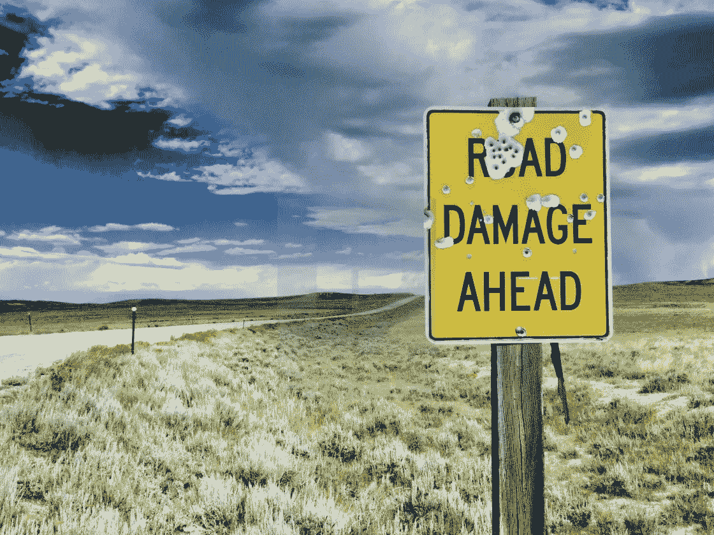

礼貌: [Picfair](https://www.picfair.com/pics/04615076-a-road-damage-ahead-sign-full-of-bullet-holes-along-lonely-road-in-wyoming)

# 3.映射到深度学习任务

将基于深度学习的端到端目标检测方法应用于路面破损检测问题，并验证其检测精度。特别是，我们检查我们是否可以通过应用最先进的物体检测方法来检测八类道路损坏。

# 4.数据来源和动机

*4.1*[研究论文](https://arxiv.org/pdf/2008.13101.pdf)

作者使用 MobileNet 作为他们的基本模型。他们从多个国家收集了数据，并根据该数据集创建了组合，并试图提出一个通用模型，该模型可用于检测任何其他国家的故障/问题。在这里，他们将问题分成 8 个不同的部分/ 8 个不同的对象。他们利用了来自其他数据集的已训练模型(迁移学习),作者使用 F1 分数作为 IoU 阈值= 0.5 的评估指标。

4.2 本案例研究的[数据源](https://mycityreport.s3-ap-northeast-1.amazonaws.com/02_RoadDamageDataset/public_data/IEEE_bigdata_RDD2020/train.tar.gz)由上述研究论文的作者共享。

4.3 [深度方向可分离卷积——更快的卷积！](https://www.youtube.com/watch?v=T7o3xvJLuHk&ab_channel=CodeEmporium)，[可分卷积的基本介绍](https://towardsdatascience.com/a-basic-introduction-to-separable-convolutions-b99ec3102728)

从上面的博客和视频中，我们了解了深度方向可分离卷积，它是如何工作的，深度方向和点方向卷积如何显著减少计算时间。这是 Mobilenet 背后的核心思想。

4.4 [MobileNets:用于移动视觉应用的高效卷积神经网络](https://arxiv.org/pdf/1704.04861.pdf)

4.5 [从头开始使用 TensorFlow 进行自定义对象检测](https://towardsdatascience.com/custom-object-detection-using-tensorflow-from-scratch-e61da2e10087)

4.6 [对象检测的选择性搜索(C++ / Python)](https://learnopencv.com/selective-search-for-object-detection-cpp-python/)

4.7 [探索移动互联网:从纸张到 Keras](https://towardsdatascience.com/exploring-mobilenets-from-paper-to-keras-f01308ada818)

4.8 [R-CNN(目标探测)。《最……|的初学者指南》作者:Sharif Elfouly](/@selfouly/r-cnn-3a9beddfd55a)

4.9 [R-CNN，快速 R-CNN，更快 R-CNN，YOLO——目标检测算法](https://towardsdatascience.com/r-cnn-fast-r-cnn-faster-r-cnn-yolo-object-detection-algorithms-36d53571365e)

4.10[https://www.ccoderun.ca/programming/darknet_faq/](https://www.ccoderun.ca/programming/darknet_faq/)

# 5.数据概述

数据包括从印度、捷克、日本收集的图像。该数据集仅考虑了四种损坏类别，主要包括裂缝和坑洞，即 D00、D10、D20 和 D40。请注意，与道路标记退化(如人行横道或白线模糊)评估相关的标准在几个国家之间存在显著差异。因此，这些类别被排除在研究之外，以便通用模型可以被训练成适用于监测一个以上国家的道路状况。

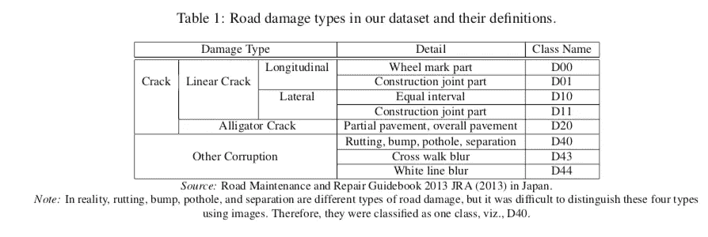

Ref : [塞基拉布](https://nbviewer.jupyter.org/github/sekilab/RoadDamageDetector/blob/master/images/RoadDamageTypeDef.png)

# 6.韵律学

*   [**IoU(交集超过并集)**](https://jonathan-hui.medium.com/map-mean-average-precision-for-object-detection-45c121a31173#:~:text=for%20Object%20Detection-,Jonathan%20Hui,value%20over%200%20to%201.) **:** IoU 测量两个边界之间的重叠。我们用它来衡量我们预测的边界与地面事实(真实物体的边界)有多少重叠。在一些数据集中，我们预定义了一个 IoU 阈值(比如 0.5)来区分预测是真阳性还是假阳性。
*   **【平均精度(mAP)】:为了在对象检测的背景下计算 mAP，我们首先计算每个类的平均精度(AP)，然后计算所有类的平均值。给定真正值 IoU 检测次数> 0.5**

**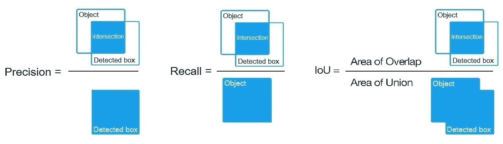**

**参考号:[堆叠交换](https://datascience.stackexchange.com/questions/25119/how-to-calculate-map-for-detection-task-for-the-pascal-voc-challenge)**

****注:** `mAP@[.5:.95]`表示不同 IoU 阈值上的平均 mAP，从 0.5 到 0.95，步长 0.05 (0.5，0.55，0.6，0.65，0.7，0.75，0.8，0.85，0.9，0.95)。`mAP@[.5]`表示 IoU = 0.5 时的平均 mAP**

** [## 如何计算 PASCAL VOC 挑战赛检测任务的 mAP？

### 回答你的问题:是的，你的方法对 A，B 和 C 是正确的。正确答案是 B。解释…

datascience.stackexchange.com](https://datascience.stackexchange.com/questions/25119/how-to-calculate-map-for-detection-task-for-the-pascal-voc-challenge)  [## 符号 mAP@[.5:.95]是什么意思？

### 对于检测，确定一个对象提议是否正确的一个常用方法是交集对并集(IoU…

datascience.stackexchange.com](https://datascience.stackexchange.com/questions/16797/what-does-the-notation-map-5-95-mean/16813#16813) 

# 7.首次切割模型

在这里，我们提出了第一个切割模型，它是基于我们想如何处理这个问题，以及我们脑海中首先出现的关于这个问题的最初实验想法。

7.1.我们将与 MobileNet 报纸合作。

7.2.将执行 EDA，如果有任何垃圾数据，将进行数据清理

7.3.将做预处理，以及像结构的文件位置适当，标签的图像等。

7.4.我将进行 EDA，并尝试寻找任何重要的变量，以便我们可以改善 IoU

7.5.将逐一探索 DL 模型，并评估结果。

# 8.探索性数据分析

EDA 是一种彻底的检查，旨在揭示数据集的底层结构，它对公司非常重要，因为它揭示了不容易显现的趋势、模式和关系。

我们不能仅仅通过搜集大量的数据来得出可靠的结论——相反，我们必须通过分析的镜头仔细地、有条不紊地看待它。

对这些关键信息的“感觉”可以帮助你发现错误，揭穿假设，并理解不同关键变量之间的关系。这种认识可能最终导致选择合适的预测模型

***8.1 概述***

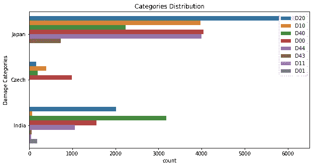

*从数据中获得高层次的理解*

*   数据集不平衡。
*   与其他伤害等级相比，我们拥有 D00、D20、D40 等等级的更多数据。
*   来自日本的损害类别 D20 比任何其他损害类别都多。

**8.2 数据可视化**

Ref : [路面破损教程](https://github.com/sekilab/RoadDamageDetector/blob/master/RoadDamageDatasetTutorial.ipynb)

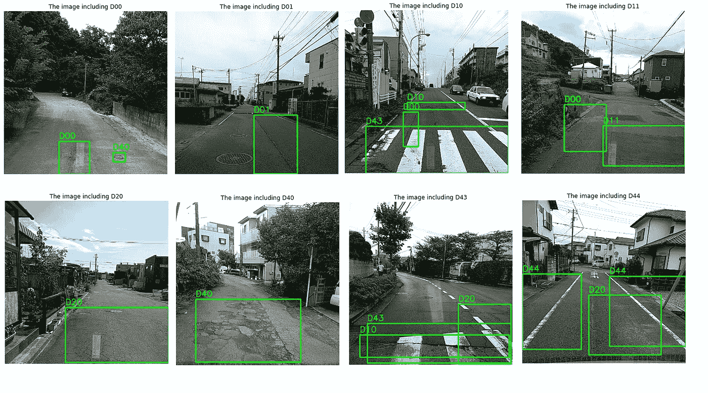

不同类型的道路损坏

**8.3 关于数据的其他信息**

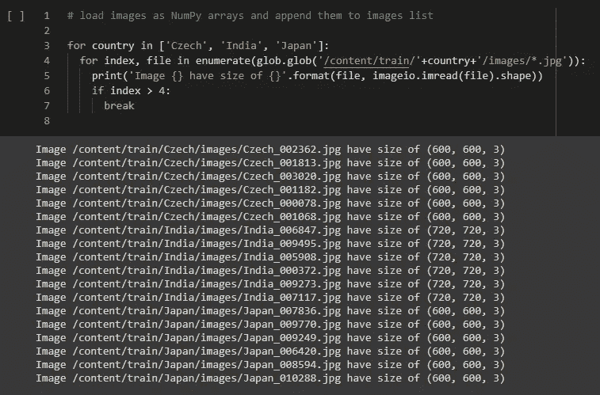

*观察结果*

*   这些图像具有不同的大小。我们需要调整图像的大小，以加快处理速度

**8.4 数据预处理**

*   调整图像及其相应边界框的大小。
*   增强数据平衡/上采样。
*   相应的对象边界框应该相应地调整大小和增加。

> **增强**:图像数据增强是一种技术，可用于通过创建数据集中存在的图像的修改版本来人为扩展训练数据集的大小。增强技术可以创建图像的变体，这些变体可以提高 fit 模型将他们所学到的概括到新图像的能力

*少量增强图像*

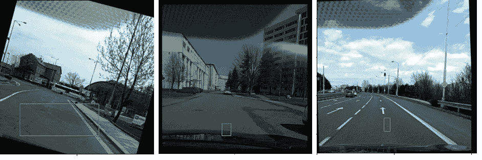

增强是创建同一图像的不同版本，这使得模型更加通用

# 9.移动网络

MobileNets 基于一种流线型架构，使用深度方向可分离卷积来构建轻量级深度神经网络。有两个简单的全局超级参数(宽度乘数和分辨率乘数)可以有效地在延迟和准确性之间进行权衡。这些超参数允许我们根据问题的约束条件为其应用选择合适的模型。

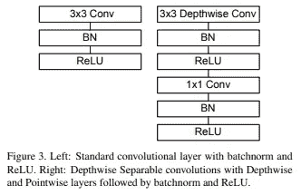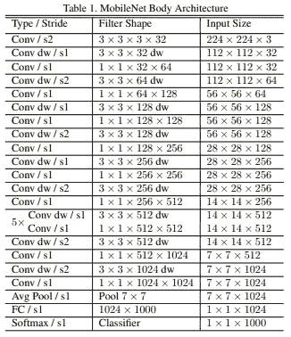

*张量板图追踪这个问题中的损耗和其他参数*

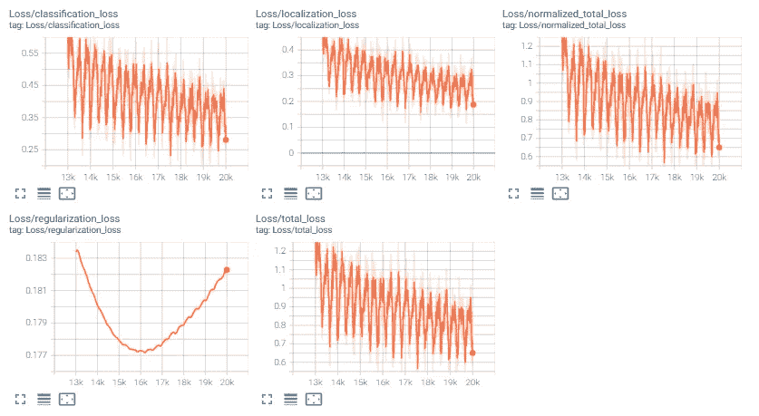

*来自 MobileNets 的最终结果*

*   mAP[IoU=0.50:0.95] : 0.054
*   映射[IoU=0.50] : 0.118

# 10.YOLO

在使用了第一个切割模型之后，我们继续尝试最先进的对象检测模型，即 YOLOv3、YOLOv4 和 YOLOv5。由于 YOLOv5 比其他版本工作得更好，因此我们将只讨论 v5。为了深入了解 YOLOs 的历史，我们推荐阅读 YOLOv4 的详细分析。简而言之，YOLO 模型是一种快速紧凑的对象检测模型，相对于其大小而言，它的性能非常好，并且一直在稳步改进。

**10.1 约洛夫 5**

在 Darknet 框架中，YOLOv4 的最新版本有一些改进，为了避免版本冲突，它被重命名为 YOLOv5。

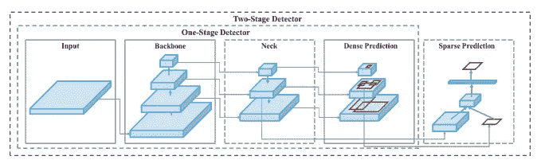

*另一幅物体检测过程(* [*引文*](https://arxiv.org/pdf/2004.10934.pdf) *出自 YOLOv4)*

**YOLO 网络由三个主要部分组成。**

**10.1.1** [**主干**](https://blog.roboflow.com/glossary/#:~:text=backbone) —在不同粒度下聚合并形成图像特征的卷积神经网络。在 YOLO v5 中，[CSP——跨级局部网络](https://arxiv.org/abs/1911.11929)被用作主干，以从输入图像中提取丰富的信息特征。

**10.1.2** [**颈部**](https://blog.roboflow.com/glossary/#:~:text=neck%20-) **—** 一系列层混合和组合图像特征，以将它们向前传递给预测。在 YOLO v5 [中，PANet](https://arxiv.org/abs/1803.01534) 用于作为颈部以获得特征金字塔。有关要素金字塔的详细信息，请参考以下链接。欲了解更多信息，请访问[了解用于目标检测的特征金字塔网络(FPN)](/@jonathan_hui/understanding-feature-pyramid-networks-for-object-detection-fpn-45b227b9106c)

**10.1.3** [**头部**](https://blog.roboflow.com/glossary/#:~:text=head%20-) **—** 从颈部消耗特征，采取盒和类预测步骤。在 YOLO，v5 模型的头部与之前的 YOLO V3 和 V4 版本相同。

**10.1.4 激活功能**——YOLO V5 作者决定采用泄漏 ReLU 和 [Sigmoid](https://en.wikipedia.org/wiki/Sigmoid_function) 激活功能。

**10.1.5 优化功能** —对于 YOLO v5 中的优化功能，我们有两种选择:

1.  新币
2.  [亚当](https://arxiv.org/abs/1412.6980)

在 YOLO v5 中，用于训练的默认优化函数是 SGD。

**10.1.6 成本函数或损失函数** —在 YOLO 家族中，有一种复合损失是基于目标得分、类别概率得分和边界框回归得分计算的。

Ultralytics 使用 PyTorch 的[二进制交叉熵和 Logits Loss](https://pytorch.org/docs/master/generated/torch.nn.BCEWithLogitsLoss.html) 函数来计算类别概率和对象分数的损失。

**10.1.7 结构**

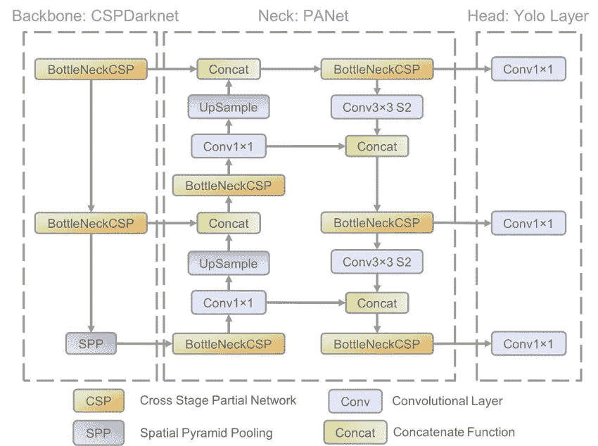

参考号:[研究之门](https://www.researchgate.net/figure/The-network-architecture-of-Yolov5-It-consists-of-three-parts-1-Backbone-CSPDarknet_fig1_349299852)

**10.1.8 一些预测图像**

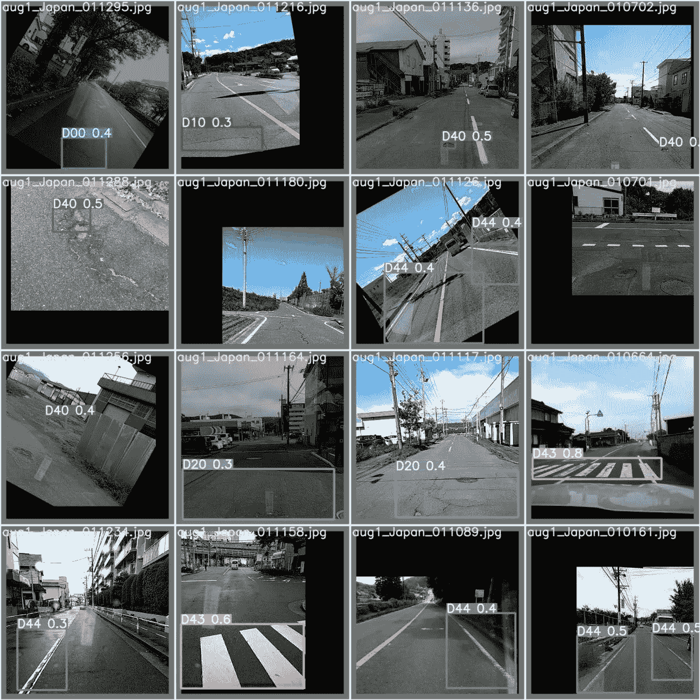

10.1.9 结果

****

**我们数据的 yolov5 结果**

***yolov 5 的最终结果:***

*   **mAP[IoU=0.50:0.95] : 0.175**
*   **映射[IoU=0.50] : 0.279**

# **11.最终管道**

**我们发现 Yolov5 在测试数据上表现更好。因此，我们将该模型的权重保存为最终模型。我们创建了一个数据管道，它将消费来自最终用户的有关道路损坏的图像或录制的视频，代码将通过类和概率的边界框展示图像/视频。**

# **12.演示**

**在我们为模型创建最终管道后，我们在 AWS 中使用 flask 创建了一个 web 应用程序，用户必须传递道路损坏的图像或视频。**

**注意:由于我们使用的是带 CPU 的云服务器(来自 AWS 的免费轮胎资源)，视频的干扰时间比图像多**

**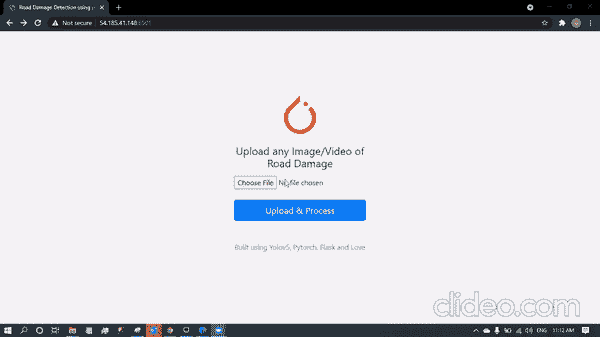**

**用于演示的已部署应用程序**

# **13.未来的工作**

*   **我们必须找到一种方法，将标签 D00、D01 替换为相应的损伤类型，如线性裂纹，并将其实时显示为标签，因为它对所有人都是可解释的。**
*   **我们必须升级应用程序，以便它可以与直播流。**
*   **其他增强技术可能也很有效。**
*   **如果我们用更多的数据来训练模型，那将是有益的。**
*   **其他深度学习模型需要尝试。**

# **14.与我联系**

**以上代码可以在我的 [**GitHub**](https://github.com/gokulhaldar/Road-Damage-Detection) 上找到。如有任何疑问、改进，可以通过 [**LinkedIn**](https://www.linkedin.com/in/gokul-sakha-haldar/) 联系我。**

# **15.参考**

** [## 应用课程

### 我们知道转行是多么具有挑战性。我们的应用人工智能/机器学习课程被设计为整体学习…

www.appliedaicourse.com](https://www.appliedaicourse.com/)  [## Seki lab/道路损坏检测器

### 2021-03-23]: IEEE 大数据杯-gr DDC 2020:2020 IEEE 大数据国际会议论文集…

github.com](https://github.com/sekilab/RoadDamageDetector)  [## 在 Keras 中实现单触发探测器(SSD ):第二部分——损失函数

### 在 Keras 中实现 SSD 丢失功能

towardsdatascience.com](https://towardsdatascience.com/implementing-single-shot-detector-ssd-in-keras-part-ii-loss-functions-4f43c292ad2a)  [## asetkn/Tutorial-图像和多边界框-增强深度学习-4 步

### 假设我们有图像来训练我们的深度神经网络。我们也有单独的 PASCAL VOC 格式的 XML 文件…

github.com](https://github.com/asetkn/Tutorial-Image-and-Multiple-Bounding-Boxes-Augmentation-for-Deep-Learning-in-4-Steps)  [## 如何在 Google Colab 上训练 YOLOv3 检测自定义对象(例如:枪支检测)

### 一.导言

medium.com](/@quangnhatnguyenle/how-to-train-yolov3-on-google-colab-to-detect-custom-objects-e-g-gun-detection-d3a1ee43eda1)  [## 快速脏物检测(YOLO)

### YOLOv3 和 YOLOv4 代码实现

medium.com](/@thamqianyu96/quick-object-detection-yolo-7f2bbdaf6a6d)  [## YOLOv5 新版本-改进和评估

### 6 月 25 日，Ultralytics 发布了 YOLOv5 的首个正式版本。在本帖中，我们将讨论小说…

blog.roboflow.com](https://blog.roboflow.com/yolov5-improvements-and-evaluation/#:~:text=The%20YOLOv5%20repository%20is%20a,then%20move%20forward%20to%20production)  [## YOLO V5 -解释和去神秘化

### YOLO V5 -模型架构和技术细节解释从我上一篇关于 YOLO V5 的文章开始，我收到了多个…

towardsai.net](https://towardsai.net/p/computer-vision/yolo-v5%E2%80%8A-%E2%80%8Aexplained-and-demystified) 

## 今天到此为止。感谢阅读。欢迎在评论区分享你的反馈。****