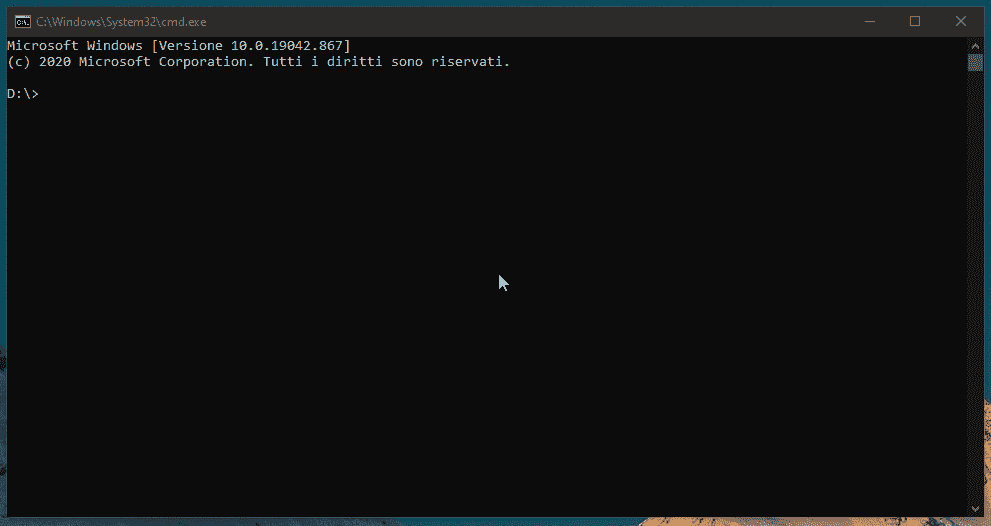

# 基于语义的有效电子邮件管理方法

> 原文：<https://medium.com/nerd-for-tech/a-semantics-based-approach-to-effective-email-management-f1d49c76f8ac?source=collection_archive---------14----------------------->

一个老问题的现代解决方法


由[乔安娜·科辛斯卡](https://unsplash.com/@joannakosinska?utm_source=medium&utm_medium=referral)在 [Unsplash](https://unsplash.com?utm_source=medium&utm_medium=referral) 上拍摄的照片

每天发送数十亿封电子邮件。我们花了大量的时间浏览它们，弄清楚它们是关于什么的，并给它们指定一个优先级。几个月前我在探索这个用例时，我意识到这是一个应用 AI 和 NLP 的完美场景。

自动化接收电子邮件可以大大减少逐一处理它们所花费的时间，并对任何人都有很大的帮助，从寻求人工智能包来管理收件箱的个人到寻求采用从电子邮件中收集增值信息的技术的企业。

鉴于 RPA(机器人流程自动化)的广泛可用性，选择适当的 NLP 技术来快速开始实施您的电子邮件管理解决方案可能比您想象的要容易得多。下面解释了我如何依靠来自 expert.ai 的深度语言学和 NLU 开发了一个紧凑的电子邮件自动化解决方案

项目旅程:

- **设计基于开源 NLU 的电子邮件管理解决方案**

- **语义欢迎:文本分类的概念方法**

- **提取:从文本中收集有价值的信息**

- **在电子邮件自动化中利用情感**

**教程和代码**在底部。点击此链接 **(** [、https://github.com/therealexpertai/email-management](https://tinyurl.com/2nme5ma2)**)**，在 **GitHub** 上找到关于**方法**的更多细节。

# 基于开源 NLU 的电子邮件管理解决方案设计

Expert.ai 的 Edge NL API 是一个能够执行 NLU 任务的本地 API，无需培训或额外工作。如果需要定制，它还可以运行通过专用 IDE expert.ai Studio 开发的项目。

我决定使用这个 API 来构建一个基于 NLU 的模型，任何人都可以将其连接到 RPA 或电子邮件自动化脚本。我使用我的自定义 NLP 模型对文本进行分类，并发现发送者的意图(例如，传入的消息是投诉、支持请求还是信息请求)。

我设计的 NLP 模型还收集特定的数据，如公司、人员和产品的名称。我期望这三个经常在这类邮件中被提及。由于 Edge NL API 提供了内置的情感分析功能，我将它添加到了循环中。我认为，对于任何对数据或业务分析感兴趣的人来说，将情感和意图信息与提到的公司、人和产品进行交叉是很有趣的。

# 语义欢迎:文本分类的概念方法

对于分类部分，我开发了一个算法，遵循主题建模方法以及依赖于语言结构的启发式方法。

我使用 expert.ai Studio 构建了这个算法，它提供了对 expert.ai 的核心 NLU 分析的访问，并以非常基本的 if-then 语句的形式对其应用语言定制。例如，如果出现特定的语言条件，则对文本进行注释或应用特定的类别。

主题建模方法**在语义**上严重依赖**。Expert.ai 的 NLU 分析主动理解单词的含义，将它们聚类，并允许我将它们视为**概念**。所有的概念都属于一个**知识图**，你可以在文本分类和数据挖掘的语言 if-then 语句中主动使用它。**

为此，我经常使用专有语言的一个特定特性，称为**祖先**。ANCESTOR 允许查询 expert.ai 的庞大知识图来收集整个概念分支(例如，“*宠物*将触发“狗”、“猫”、“鸟”等)。因为知识图已经*知道*什么是*宠物*，然后使用它们来注释最能描述我的模型的类的单词和短语。

这种基于概念的技术的优势在于**它使得模型开发更加容易、快速和有效**。从图表中选择几个有代表性的关键概念，只需稍加调整，就能使我的规则更加丰富和强大。依靠这个图表，我可以充分利用它的 NLU 分析，使得通过它们的意思来区分相同的单词成为可能。这是我的模型的基本附加值。能够识别和区分投诉、支持请求和信息请求依靠的是含义而不是语言，这有助于使模型更加智能和准确。

这是投诉邮件的规则示例。

这个条件自动注释文本，每当在一个句子中发现括号中的一个概念时，就将其归档到“complaint”类别下。此外，该条件在知识图中导航，并利用任何同义词或*类似的负面*概念或词来扩展其能力，以得出关于发送者意图的结论。

例如，在使用 Studio 时，我发现这个知识图表包含了大量的动词、形容词和名词链，以及几十个反映负面观点的常用词。

相反，启发式方法在较低的层次上起作用，更深入语言学和语言结构。有时，在文本的某些部分，能够处理单词、词条和其他语法元素之间的特定关系，对于收集证据以理解发送者的意图，从而识别最合适的类别并将其应用于文本的某个部分，会产生巨大的影响。启发式规则帮助我专注于这些深层的语言学关系以及相关术语的序列，当发现这些相关术语时，会立即有效地将文本分类到最合适的类别下。

这是我用来检测支持请求的启发式条件的一个例子。

在这里，我试图抓住像“我有一个问题”和“有困难……”这样的句子，我用我感兴趣的引理列表指定了我想要掌握的句子的结构。“啊！SYNCON”命令用于避免在出现否定动词的情况下对类别进行注释，因此它不会对“我没有任何问题…”或“我对…没有问题”这样的情况进行注释

这只是我为第一个实现选择的两种方法。基于概念和启发的方法似乎是快速实现解决方案的最佳方式，但是该工具的灵活性提供了多种方式。

# 提取:从文本中收集有价值的信息

电子邮件是一种交流方式。因此，它们**包含了很多信息**。你可能想从你的电子邮件中检索出无数种带有**价值**的数据。例如，从文本中提取公司、人员和产品的名称，结合情感分析和分类，可以让您构建一个 NLP 模型，该模型支持更深入的分析，以将公司的产品与投诉相匹配，同时还可以测量发送者对该品牌的情感和看法。

在这个项目中，我使用了 expert.ai 的 NER 功能来主动提取人们和公司的专有名词，同时再次使用知识图来提取电子邮件正文中提到的已知和未知产品。

下面你可以找到一个例子，我如何再次使用 ANCESTOR 来选择知识图的一个完整分支，这个分支集中在产品名称上，并使用它来提取这些名称，无论它们是由技术还是在图中识别的。

在这里，当“products”的祖先是“专有名词”，后跟“products”的祖先是“名词”时，就会触发提取。例如:“我昨天看到了一部三星 Galaxy 智能手机”。

# 在电子邮件自动化中利用情感

可以为您的 NLP 驱动的项目设置 Edge NL API，以提供对事实上丰富的**内置**自然语言处理功能列表的访问，如词性标注、关键短语提取、预训练分类等。而且极其**好用**。我决定利用内置的情感分析，我只花了**几行代码**就把它添加到了我的文本分析管道中(你可以在 expert.ai 的[开发者门户](https://tinyurl.com/3ev4dz4t)上找到 Python 和 Java SDK)。

情感分析是对模型的一个很好的补充。能够处理电子邮件情感及其发件人的意图(分类)使您能够提供丰富的信息列表，这些信息适合于额外的交叉引用和数据分析。例如，人们可以使用**自动情绪分析**来推断电子邮件中提到的问题的严重性，然后**相应地对**电子邮件进行优先级排序。

这是我制作的包含情感分析的定制 Edge NL API 的结果示例:



在一个场景中，我们从收到的电子邮件中收集关键信息，并对文本执行自动情感分析，将非常负面或非常正面的情感与发件人的意图和产品提及进行交叉引用，很容易看出这如何通过自动提供足够的信息来识别问题或失望的客户，从而在支持请求电子邮件变成实际投诉之前支持客户关怀实践**。**

# 结束语

我最终得到的是一个 NLU 驱动的电子邮件自动化包，它可以收集关键信息，以得出发件人的意图和情绪，以及关键的产品和公司特定数据。这种模式允许**无止境的应用**:人们可以利用它来构建一个先进的 RPA，以过滤电子邮件，并在执行优先级排序的同时将它们路由到适当的收件箱，或者甚至使用该模式进行进一步的数据分析，交叉引用受到投诉的产品或品牌的信息。

可以使用 expert.ai Studio 对模型进行进一步定制，并提取任何其他能够为解决方案带来进一步价值的关键信息。除了为特定行业和使用案例定制您自己的提取和分类算法(例如，自动回复您客户的请求)，您还可以使用 Edge NL API 的内置分析功能来进一步丰富结果。或者您可以快速地为不同的语言复制相同的过程(支持 5 种语言)。

我用 Studio 创建的项目是这里的。你可以在这个链接[这里](https://tinyurl.com/2a3f639s)找到 NLP 模型及其相应的 Edge NL API 一切准备就绪！由于 IDE 和 API 可以免费使用，所以非常欢迎大家来试用这些包，甚至在 GitHub 上投稿。

# 辅导的

首先:下载[电子邮件管理包](https://tinyurl.com/2a3f639s)，解压，然后前往 expert.ai 的[开发者门户](https://tinyurl.com/3ev4dz4t)注册你的证书并开始使用 API。

从 expert.ai 的开发者门户，点击开发者菜单(仪表盘左侧)，然后点击 Studio，下载 Windows 的 ide 设置文件(也有 Linux 版本！！).

请注意，您将需要 [Python](https://tinyurl.com/k6k2ykh9) 3.5 或更高版本来启动 API。开始吧！

这是您可以用来构建自己的 Edge NL API 的四个步骤。

## 1 安装 expert.ai NL API Python SDK 并导入库

浏览到您的[Python 文件夹]/脚本，并从命令行运行 pip 来安装库

```
pip install expertai-nlapi
```

然后将您的凭证设置为环境变量。

*   Linux:

```
export EAI_USERNAME=YOUR_USER
export EAI_PASSWORD=YOUR_PASSWORD
```

*   Windows 操作系统

```
SET EAI_USERNAME=YOUR_USER
SET EAI_PASSWORD=YOUR_PASSWORD
```

它们也可以在导入操作系统库的代码中定义。

```
import os
os.environ["EAI_USERNAME"] = YOUR_USER
os.environ["EAI_PASSWORD"] = YOUR_PASSWORD
```

然后导入 expert.ai 的 Edge NL API 客户端

## 2 指定一个示例文本

创建一个“text”变量，将样本文本粘贴到这个变量中，以提供给 API。

```
text = """Dear Mr. Avery
I am writing today to complain about my new Blender 365HB. I purchased this blender at your Woodbury, NY store on 8/9/2020.
I purchased the blender only 3 weeks ago and it is falling apart. The insert for the blade has warped and now I must stand there and hold the blender when it is on. Also, one of the blades on the blender is bend after blending ice. Now I'm very disappointed and I hate this blender so much! This performance is unacceptable and your store would not take it back because it was past the 14-day return. This is ridiculous! How was I supposed to know that all these defects would happen within the 14 days? This is bonkers!
I have attached a pdf below of my receipt. In addition, I have attached before and after pictures of the blender. I look forward to your response and your proposed solution to this problem. I have had blenders from Universal Blenders Co before and never have had this problem. Please contact me at the email I am sending you this from or my cell phone 845*******. Thank you for your help in advanced.
Best Regards,
Jane Billings
"""
```

我建议使用三重引号，这样就不需要转义了。

## 3 分类和提取

创建一个 for 循环来调用 API，并按排名顺序获取所有分类结果。我选择打印属性、id 和它们各自的描述，用一个标签分开，以便于阅读。

对数据挖掘结果执行相同的操作:创建一个 for 循环来调用 API 并获取数据挖掘结果，打印提取类、名称及其各自的结果。

前往 [Edge NL API 的文档](https://tinyurl.com/28y2u464)获取更多信息，或者使用更多特性定制您的 API 调用。

## 4 启动 API

前往电子邮件管理文件夹(你从 GitHub 下载的那个)并导航到“package\edge”文件夹。

通过单击“runmeWindows.cmd”文件启动 NLP 模型，然后返回到您的 Edge NL API 脚本(确保您的 expert.ai 凭据设置正确)。如果你在这个阶段遇到任何问题，你可以参考这个教程[这里](https://tinyurl.com/28y2u464)。如果您在 expert.ai Studio 中对模型进行了任何编辑，并且想要尝试您的新模型，您需要做的就是在 Studio 中按 Ctrl+Alt+P，并按照向导创建一个新模型，再次前往“package\edge”以启动“runmeWindows.cmd”文件。运行 Python API 脚本，尽情享受吧！