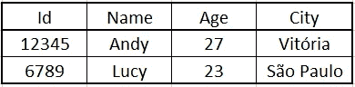

# 关于 ETL 的简单解释

> 原文：<https://medium.com/nerd-for-tech/a-simple-explanation-about-etl-841ff7b1b898?source=collection_archive---------8----------------------->


# 介绍

ETL 是每个处理数据的公司的一部分。数据无处不在，为了能够正确地分析和使用数据，必须将数据收集、处理并存储在一个可访问的地方，以便数据科学家和分析师团队能够使用这些数据。

简单地说，ETL 过程包括三个步骤:提取、转换和加载。

ETL 过程通常由数据工程师团队来完成，但是作为一名数据科学家，掌握一些数据工程方面的知识是很重要的。

由于数据是新的石油，我将画一个石油提炼过程的平行线来解释数据 ETL 过程。

# **提取**


在 [Unsplash](https://unsplash.com?utm_source=medium&utm_medium=referral) 上 [Zbynek Burival](https://unsplash.com/@zburival?utm_source=medium&utm_medium=referral) 拍摄的照片

ETL 过程的第一步是获取数据。数据可以以多种形式出现，也可以来自许多地方，这里是您从许多可能的不同来源中提取数据的地方。

您的组织可能有来自不同地方的数据，如数据库中的不同表，甚至不同的数据库和系统。能够从这些不同的来源中提取所有可能的信息是很重要的。

此外，信息可以是结构化的或未结构化的，并且以 excel 文件、JSON 文件、图像等格式出现。每种格式都有其特点，需要正确处理以保持数据的一致性。

因此，在**提取**步骤中，数据从其许多来源中被读取，并且现在准备好进入 ETL 过程的下一部分。

# 改变


就像我之前说的，数据可能以不同的形式出现，但是为了使用它，它们需要由您的团队决定的特定形式。例如，该形状可以是 SQL 数据库中的表。

因此，为了更好地解释这一步，假设您正在应用程序中提取关于两个用户的数据，并且这些信息是 JSON 格式的。

```
{users:
    [{   
        "Id" : 12345
        "Name" : "Andy",
        "Age" : 27,
        "City": "Vitória"
    },
    {
        "Id" : 6789
        "Name" : "Lucy",
        "Age" : 23,
        "City": "São Paulo"
    }]
}
```

要准备好使用，您需要将这些数据存储到一个表中，为此，您需要将 JSON 文件中包含的信息映射到一个包含列和行的结构化表中。



将包含在 JSON 格式中的信息转换成表格的过程是这个步骤中许多转换的一个例子。

原始数据通常很乱，有很多问题。为了处理这些问题，有更多类型的转换应用于数据，使其可用。

因此，总而言之，在**转换**步骤中，数据必须经过多次转换，才能供数据科学家和分析师团队使用。

# 负荷


最后，在完成所有转换并且数据准备好供最终用户(数据科学家、数据分析师等)使用之后，就到了流程的 **Load** 步骤。

在这一步中，转换后的数据保存在所需的位置(如数据仓库)，团队的其他成员可以方便地访问这些数据。

# 结论

ETL 过程解释起来相当简单，但是实现起来却非常困难。根据原始数据的不同，为了使数据可供使用，可能需要进行大量的转换。

此外，如果您的公司有许多不同的数据源，则需要做一些工作来读取所有信息，根据需要进行转换，并编排数据流。

感谢您的阅读！希望我能够清楚地解释什么是 ETL 过程。

欢迎任何意见和建议。

请随时通过我的 Linkedin 联系我，并查看我的 GitHub:

[领英 ](https://www.linkedin.com/in/alexandre-rosseto-lemos/)

[**Github**](https://github.com/alerlemos)