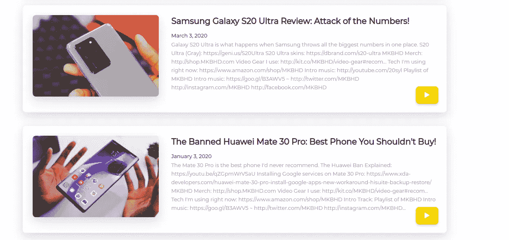

# 一个简单的带有 youtube API 的视频库

> 原文：<https://medium.com/nerd-for-tech/a-simple-video-gallery-with-youtube-api-4c697990653f?source=collection_archive---------0----------------------->

因此，我们将创建一个视频画廊，这是非常容易的，如果你以前与 API 的。但是如果你没有，不要担心。这是它最后的样子。

视频从 YouTube 加载到卡上

首先，我们必须了解它是如何工作的。

我们将使用 spring boot 创建一个包装器，使用 API 获取特定 youtube 播放列表的详细信息。为了将播放列表的细节作为有效载荷，我们将使用 google API 生成一个 url。url 看起来像这样，

> https://www.googleapis.com/youtube/v3/playlistItems?part = snippet & playlistId = "+YouTube playlistId+" & key = "+Google API key

你只需要将播放列表 id 和 google api 密钥添加到 url 中。一旦完成，你就可以开始编写包装器了。这是我写的。

 [## sef-全球/sef-数据持有者

### 通过在 GitHub 上创建帐户，为 sef-global/sef-data holder 的发展做出贡献。

github.com](https://github.com/sef-global/sef-data-holder/blob/master/src/main/java/org/sefgobal/dataholder/api/YoutubeAPI.java) 

根据这一点，我们可以使用 req 参数发送每个有效负载需要多少项，并且它包含下一个有效负载的下一页标记，因此我们也需要使用 req 参数来发送它，以加载下一个有效负载。

一旦创建了包装器，我们必须使用 jquery 编写一个 js 函数来遍历每一项。这是我写的循环遍历这些条目的函数。

 [## sef-全球/sef-站点

### 可持续教育基金会官网- sef-global/sef-site

github.com](https://github.com/sef-global/sef-site/blob/master/src/main/webapp/onelive/archive/functions.js) 

因此，作为视频图库的最后一步，我们需要将其渲染到页面上。我们需要使用 mustache 创建一个模板来渲染它。这是我为页面创建的。由此可以有一个简单的想法。

 [## sef-全球/sef-站点

### 可持续教育基金会官网- sef-global/sef-site

github.com](https://github.com/sef-global/sef-site/blob/master/src/main/webapp/onelive/archive/index.html) 

现在它将内容加载到页面。这是一个基本的视频库，你可以有一个大概的概念。今天到此为止。下一场见。