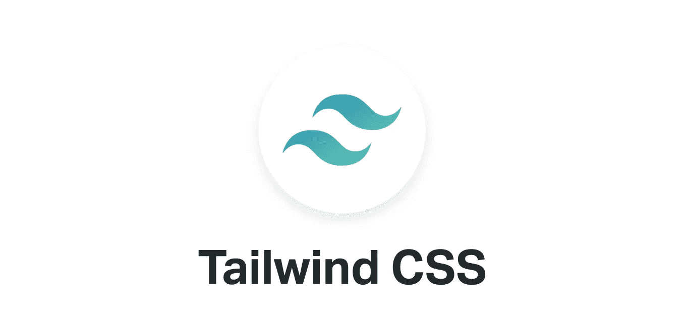
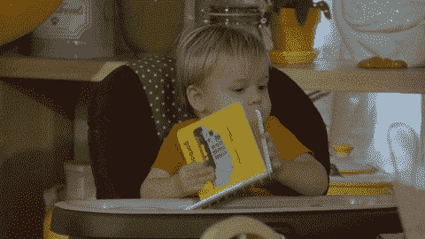
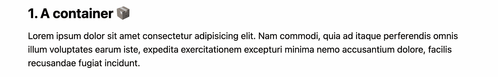
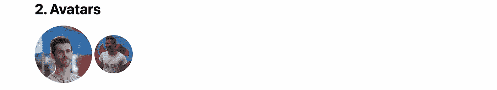
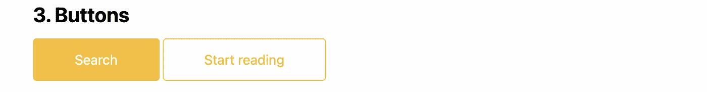
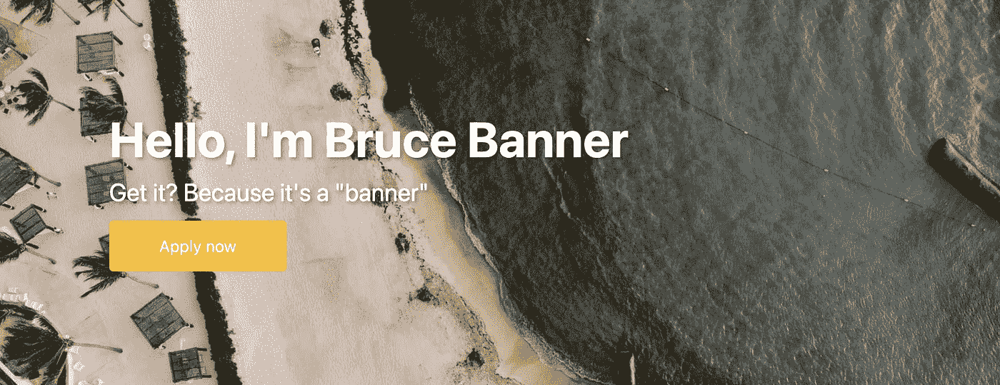
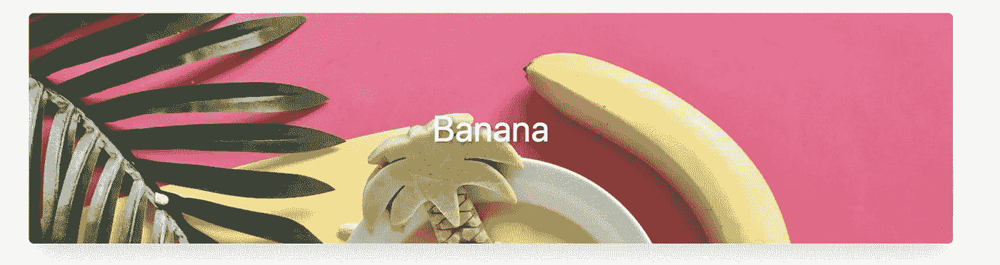
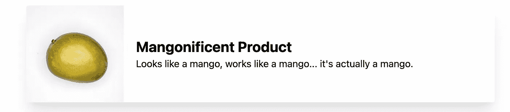
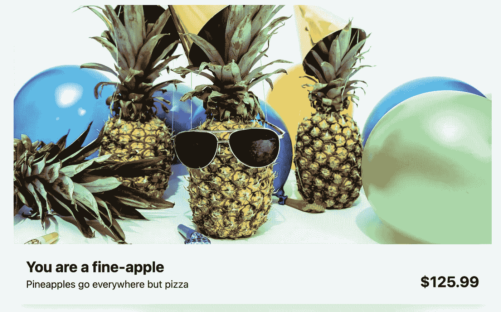

# TailwindCSS 的一个小介绍

> 原文：<https://medium.com/nerd-for-tech/a-small-intro-to-tailwindcss-a6b93d726ce7?source=collection_archive---------12----------------------->



# 介绍

在这个小介绍中，我将帮助你理解如何在 TailwindCSS 中思考。我们将通过一个小的理论介绍🤓(提前抱歉)而且会跳到下一个更动手的👋练习我们所学的知识。

# 为什么要用顺风？

*   **简单而具体:**所包含的大多数实用程序都有特定的功能，并且不会增加额外的样式(与 Bootstrap 相反)。
*   **高度可定制:**尽管它有一个默认配置，我们可以简单地在`tailwind.config.js`文件中覆盖它。
*   **可以优化:**我们可以在生产中使用 PurgeCSS 从 Tailwind 中删除任何我们不使用的类，只加载我们使用的实用程序。
*   **易写:**一习惯，写你的 CSS 类就变得超级快；您还可以使用`@apply`将类分组到组件中。
*   [其他原因](https://dev.to/joserfelix/why-use-tailwind-css-for-your-next-project-39hp)

# 开始前的一些评论

*   TailwindCSS 没有包含 JavaScript，是纯 CSS。因此，如果我们想让事情变得动态，我们需要编写自己的 JavaScript。
*   我假设你知道 CSS 的基础知识😄。
*   我们不会进行尾翼 CSS 的安装，因为这可以随意查看他们的[安装指南](https://tailwindcss.com/docs/installation)。
*   Ruby on Rails 考虑了文件位置。

# 配置文件

TailwindCSS 配置保存在一个名为`tailwind.config.js`的文件中。在这个文件中，我们可以自定义每个 TailwindCSS 变量。

# TailwindCSS 如何工作

*   **实用程序类:**和大多数框架一样，TailwindCSS 使用实用程序类来样式化 HTML 元素；它的命名约定超级直观(`text-center`、`font-bold`等)。).
*   前缀:我们可以在不同的类上添加前缀，使它们在不同的断点或状态下有条件地工作。
    *例如:* `*hover:font-bold*` *悬停时会将元素的字体改为粗体。*

# 前缀

## 响应式设计[(见文档)](https://tailwindcss.com/docs/responsive-design)

在 TailwindCSS 类上，我们可以添加一个**断点前缀**，这将使它在不同的断点上有条件地工作。

**用途**

```
<div class="md:w-92 lg:w-40">
 [...] 
<div class="sm:text-center lg:text-left">
```

# 悬停、聚焦和其他状态

与**响应式设计**一样，我们可以使用前缀来设计元素的不同状态。

**用法**

```
<button class="bg-purple-600 hover:bg-purple-800">
    Sign up
</button>
```

# 实用程序类别

编写 **TailwindCSS** 实用程序类在大多数 CSS 属性中保持相同的结构。我们将通过一些例子来阐明这个结构是如何工作的，但是可以在他们令人惊奇的 [**文档**](https://tailwindcss.com/docs) 中找到任何特定的实用程序类。

# 字体

[**字体家族**](https://tailwindcss.com/docs/font-family)**→**`**font-family**`**→**`**font-{type}**`

```
<p class="font-sans ...">
<p class="font-serif ...">
<p class="font-mono ...">
```

*注意:* `*font-sans*` *、* `*font-serif*` *和* `*font-mono*` *是变量，我们可以在我们的配置文件中将其更改为我们选择的* `*font-family*` *。*

[**字号**](https://tailwindcss.com/docs/font-size)**→**`**font-size**`**→**`**text-{size}**`

```
<p class="text-xs ...">The quick brown fox ...</p>
<p class="text-xl ...">The quick brown fox ...</p>
```

[**字体粗细**](https://tailwindcss.com/docs/font-weight)**→**`**font-weight**`**→**`**font-{weight}**`

```
<p class="font-bold ...">The quick brown fox ...</p>
<p class="font-thin ...">The quick brown fox ...</p>
```

[**文本对齐**](https://tailwindcss.com/docs/text-align)**→**`**text-align**`**→**`**text-{alignment}**`

```
<p class="text-left ...">Lorem ipsum dolor sit amet ...</p>
<p class="text-center ...">Lorem ipsum dolor sit amet ...</p>
```

# 容器

`container`类将根据当前断点固定元素宽度。

[容器](https://tailwindcss.com/docs/container) **→** `**width**`

```
<div class="container">
  <!-- ... -->
</div>
```

# 边距和填充

[**边距**](https://tailwindcss.com/docs/margin)**→**`**margin**`**→**`**m{direction}-{size}**`

```
<div class="mt-8 ...">mt-8</div>
<div class="m-5 ...">m-5</div>
```

左+右→ `**mx**`

Top + Down → `**my**`

[**填充**](https://tailwindcss.com/docs/padding)**→**`**padding**`**→**`**p{direction}-{size}**`

```
<div class="pb-3 ...">pb-4</div>
<div class="py-2 ...">py-2</div>
```

左+右`**px**`

自上而下`**py**`

# 颜色；色彩；色调

颜色类工具允许我们使用相同的语法来设计不同的属性。

`**{property}-{color}-{value}**`

```
<p class="text-purple-600 ..."></p>
<button class="bg-green-500 ...">Button</button>
<input class="border-2 border-red-500 ...">
```

# 宽度和高度

[**身高**](https://tailwindcss.com/docs/height)**→**`**height**`**→**`**h{direction}-{size}**`

```
<div class="h-12 ..."></div>
<div class="h-16 ..."></div>
```

[**宽度**](https://tailwindcss.com/docs/width)**→**`**width**`**→**`**w{direction}-{size}**`

```
<div class="w-20 ..."></div>
<div class="w-28 ..."></div>
```

# 显示

这里没有火箭科学，只有应用不同显示属性的类。

`**flex**` **→** `**display: flex**`

`**inline-block**` **→** `**display: inline-block**`

`**hidden**` **→** `**display: none**`

# 创建组件[(查看更多)](https://tailwindcss.com/docs/extracting-components)

有时在相同的元素(按钮、头像等)上重复上课。)，最好重构我们的代码，创建帮助我们更新和重用代码的组件。

**TailwindCSS** 包括`@apply`指令，该指令提取 CSS 组件类的公共实用程序模式。

```
**.btn-indigo** {
  @apply py-2 px-4 bg-indigo-500 text-white font-semibold rounded-lg shadow-md hover:bg-indigo-700 focus:outline-none focus:ring-2 focus:ring-indigo-400 focus:ring-opacity-75;
}<button class="btn-indigo">
  Click me
</button>
```

TailwindCSS 还建议将我们使用`@apply`的样式用`@layer components { }`包装起来，这样它就可以识别出那些样式属于`components` ( [性能和组织原因](https://tailwindcss.com/docs/extracting-components))。

# 理论够了！让我们创建一个组件厨房水槽

*注意:我们将使用令人惊叹的模板*[***bamboo sticks***](https://github.com/mangotreedev/bamboosticks)*使用 TailwindCSS 开发一个已经创建好的 Ruby on Rails 应用程序😉。*

**

*再见理论👋*

# *总集气管*

*让我们开始设计我们的主标题。*

**

```
*<h1 class="text-5xl font-semibold text-center">Kitchen Sink</h1>*
```

*我们使用了什么工具？*

*   *`**text-5xl**` → `font-size`和`line-height`*
*   *`**font-semibold**` **→** `font-weight`*
*   *`**text-center**` → `text-align`*

# *容器*

*现在让我们添加一个简单的容器，这样我们以后就可以把组件放在中间了。*

**

*我们使用了哪些新的实用程序？*

*   *`**container**` **→** `max-width`断点(`sm`、`md`、`lg`、`xl`、`2xl`)*
*   *`**mx-auto**` **→** `margin-left`和`margin-right`*
*   *`**my-3**` **→** `margin-top` **和** `margin-bottom`*

# *神使*

*现在让我们通过创建头像来玩一些图像属性。*

**

*天哪，那些家伙真帅*

*我们使用了什么新工具？*

*   *`**rounded-full**` **→** `**border-radius**`(同`border-radius: 50%`)将所有边框变圆。如果图像是一个正方形，它将创建一个圆形。*
*   *`**h-24**`**&**`**w-24**`**→**`**weight**`**和** `**height**`*
*   *`**inline-block**` **→** `**display**`*

# *小跟班*

*好了，现在我们来做一个主次按钮。*

**

*两个都叫本杰明…懂了吗？*

*我们使用了哪些新的实用程序？*

*   *`**px-12**`**/**`**py-3**`**→**`**padding-left**`**`**padding-right**`**/**/`**padding-up**`**`**padding-bottom**`*****
*   *****`**bg-yellow-400**` **→** `**background-color**`*****
*   *****`**border-yellow-400**` **→** `**border-color**`*****
*   *****`**hover:bg-yellow-300**`**→**`**background-color**``**:hover**`*****
*   *****`**focus:outline-none**`**→`**:focus**`上的** `**background-color**`*****
*   ***`**text-white**` **→** `**color**`***
*   ***`**rounded**` **→** `**border-radius**`***
*   ***`**border**` **→** `**border-width**`***
*   ***`**transition**` **→** `**transition**`(过渡延迟 150ms)***
*   ***`**duration-300**` **→** `**transition-duration**`***
*   ***`**inline-block**` **→** `**display**`***

# ***旗帜***

******

***我们使用了哪些新的实用程序？***

*   ***`**bg-cover**` **→** `**background-size**`***
*   ***`**flex**`**→*****
*   ***`**items-center**` **→** `**align-items**`***
*   ***`**text-shadow**` **→** ❗This 是我做的自定义类，TailwindCSS❗上没有文字阴影实用类***

# ***类别卡***

******

***这卡皮太神奇了…***

***我们使用了什么新工具？***

*   ***`**justify-center**` **→** `**justify-content**`***
*   ***`**shadow-xl**` **→** `**box-shadow**`***

# ***产品卡***

******

***我们使用了什么新工具？***

*   ***`**object-cover**` **→** `**object-fit**`***
*   ***`**flex-col**` **→** `**flex-direction**`***
*   ***`**p-5**` **→** `**padding**`***
*   ***`**rounded-l**` **→** `**border-top-left-radius**` 和`**border-bottom-left-radius**`***

# ***聚会卡***

******

*****我们使用了哪些新的实用程序？*****

*   ***`**rounded-t**`**→**`**border-top-left-radius**`****`**border-top-right-radius**`*******
*   *****`**w-full**` **→** `**width: 100%**`*****
*   *****`**items-end**` **→** `**align-items**`*****

# *****提取组件*****

*****我们所有的重构都将放在单独的文件中，这些文件以文件夹`app/javascript/stylesheets/components`中特定组件的名称命名。*****

# *****小跟班*****

*****我们将从`.btn`类中的按钮中提取所有公共类，并为不同版本的按钮创建两个特定类(`.btn-main`和`.btn-ghost`)。*****

*****我们完了。**恭喜**！*****

**********

******👉🏻* [*用所有组件*](https://github.com/nicoproto/tailwindcss-tutorial) 链接到 Ruby on Rails 应用程序*****

*****如果你想知道这是谁写的，让我告诉你一些关于我自己的事情。*****

******我叫尼科普罗托，是* [*芒果* ***树***](http://www.mangotree.dev/) *的开发人员。如果你好奇我们是做什么的(你应该是)通过*[*Linkedin*](https://www.linkedin.com/in/nicolas-proto/)*联系我。******