# 创建容器化 spring boot 应用程序的分步指南，通过使用自签名证书来保护应用程序级数据传输

> 原文：<https://medium.com/nerd-for-tech/a-step-by-step-guide-to-create-a-containerized-spring-boot-application-in-order-to-secure-8ecbc8defc36?source=collection_archive---------0----------------------->

照片由[乔丹·哈里森](https://unsplash.com/@jordanharrison?utm_source=medium&utm_medium=referral)在 [Unsplash](https://unsplash.com?utm_source=medium&utm_medium=referral) 上拍摄

大家好，让我分享一下我的经验，如何在开发环境中从头开始为 Spring Boot 应用程序启用安全的应用程序级数据传输支持。

## 我们所说的 SSL 和 TLS 是什么意思？

SSL(安全套接字层)和 TLS(传输层安全性)都是加密协议，SSL 是 TLS 的前身，现在已被弃用。这两种协议都用于在 web 服务器和 web 浏览器之间创建加密连接。

## 我们所说的自签名 SSL 证书和证书颁发机构(CA)签名 SSL 证书是什么意思？

自签名 SSL 证书是一种安全证书，用于非生产环境，以便测试 SSL 端点功能，因为它易于创建且不需要成本。但是，不建议在生产环境中使用，因为它不提供所有的安全证书。

证书颁发机构(CA)签署的 SSL 证书也是安全证书，但它由证书颁发机构(CA)签署并提供所有安全证书，是生产环境的标准，并且涉及成本。

## 让我们考虑一个支持 SSL 或 HTTPs 的 spring boot 应用程序。

作为一个示例，我不会使用 CA 签名的 SSL 证书，而是使用自签名的 SSL 证书。

## **如何创建自签名证书？**

在这个例子中，我将使用 JDK 的 keytool 来生成一个 PKCS 12 格式的自签名证书。我使用的是 windows 机器，我已经使用这个命令打开了一个终端来生成 keytool。

**keytool-genkey pair-keyalg RSA-keysize 2048-storetype PKCS12-keystore key-cert-mousumi . p12-validity 365**

*   genkeypair(生成密钥对)
*   密钥大小(密钥的大小)
*   storetype(密钥库格式)
*   密钥库(是存储私钥、证书和对称密钥的存储库)

一旦你输入这个命令，你会得到一系列的指示，如下图所示。

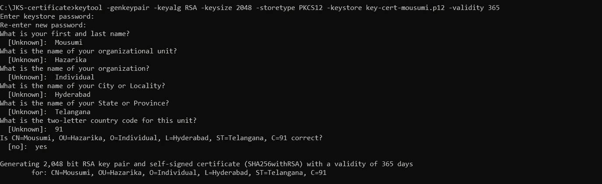

键盘工具命令

关于 PKCS 12 格式的更多信息，你可以参考这个链接-[https://en.wikipedia.org/wiki/PKCS_12](https://en.wikipedia.org/wiki/PKCS_12)

一旦命令被执行，你将在这个文件夹下得到一个证书，如下图所示。

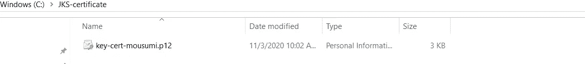

自签名 SSL 证书

接下来，我将使用 gradle 创建一个简单的 spring boot 应用程序。

我已经创建了一个 spring boot 应用程序，并用最少的 spring-boot jar 配置了 build.gradle 文件。

## 下面是我的 build.gradle 文件。

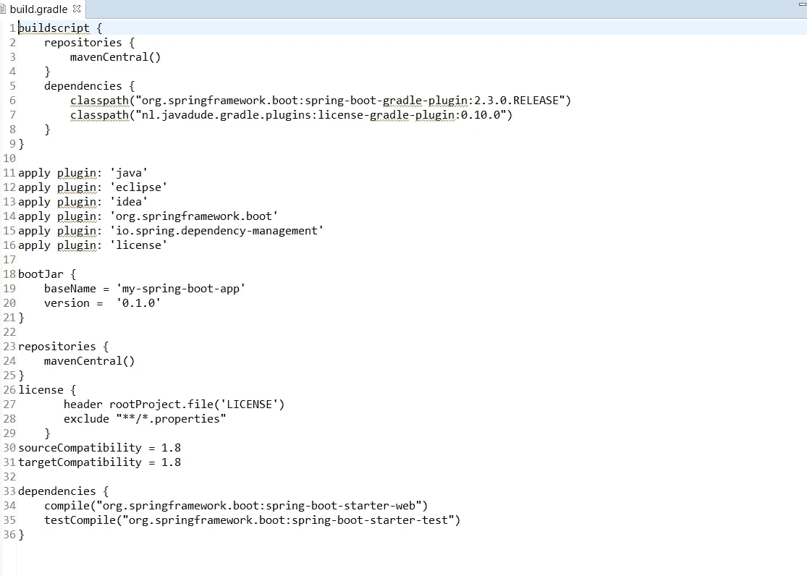

build.gradle

现在，我将创建一个主 spring-boot 类，如下所示。

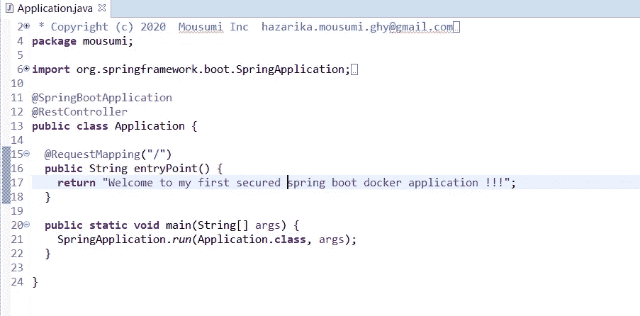

Application.java

接下来，我们需要在 resources 文件夹下添加自签名 SSL 证书，如下图所示。

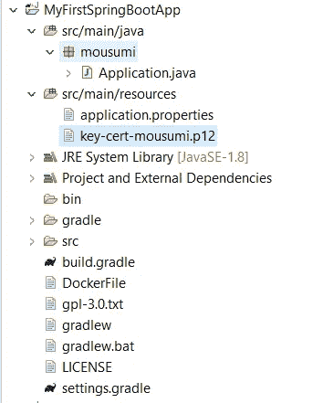

接下来，我们需要将 SSL 细节添加到 application.properties 文件中。

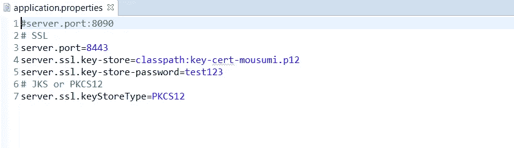

应用程序.属性

最后，我们创建了一个安全的 spring boot 应用程序。

为了测试这个应用程序，我们可以启动 spring boot 应用程序并点击这个 URL[https://localhost:8443/](https://localhost:8443/)。下面是屏幕。

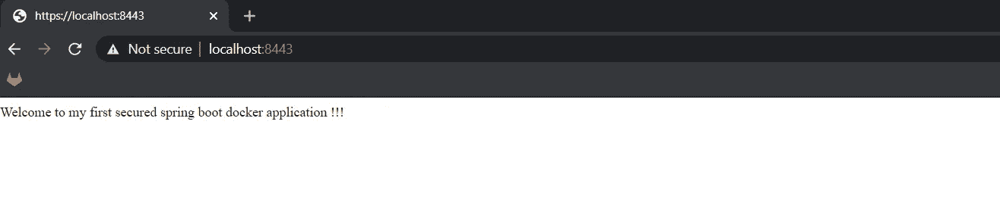

安全 spring boot 应用程序的网页

正如我们看到的，spring boot 应用程序运行在一个安全的网络上，我们可以创建 spring boot 应用程序的容器化映像。

> **注意:如果你用命令手动创建一个图像，那么总是构建最新的代码，这样所有的改变都会反映在 docker 容器中。**

为此，我们将创建一个 docker 文件，如下图所示。

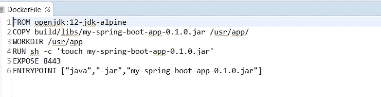

Dockerfile 文件

之后，我们将使用 docker build 命令构建 docker 映像，如下图所示。

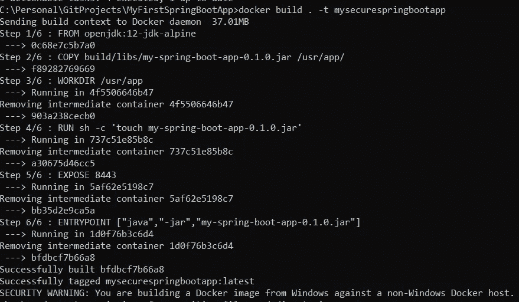

docker 构建命令

接下来，我们将使用如下屏幕所示的命令检查 docker 图像。

> **忽略安全警告**

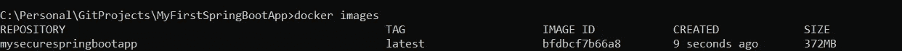

docker 图像命令

接下来，我们将使用下面屏幕所示的命令运行 docker 映像。

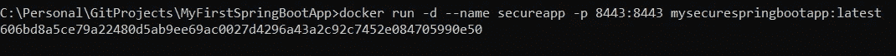

docker 运行命令

接下来，我们将使用下面屏幕中显示的命令检查容器是否启动并运行。

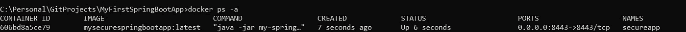

docker ps 命令

最后，我们将检查 docker 日志，以确保 spring boot 应用程序启动并运行，方法是使用下面屏幕中所示的 docker 命令。

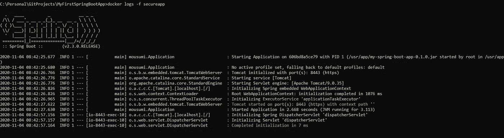

docker 日志命令

上面屏幕中的最后一行清楚地表明应用程序已经启动并正在运行。

***关于 docker 形象创作的详细信息，可以查看我的其他故事。***

[***https://medium . com/@ hazarika . mousumi . ghy/a-step-by-step-guide-on-how-to-create-and-build-a-docker-image-for-a-Java-application-1531 eed 6 AE 6***](/@hazarika.mousumi.ghy/a-step-by-step-guide-on-how-to-create-and-build-a-docker-image-for-a-java-application-1531ee2d6ae6)

现在，我们确定应用程序正在运行，我们将尝试在 web 浏览器中点击相同的 url，即[https://localhost:8443/](https://localhost:8443/)。

下面是网络浏览器的屏幕，这表明给定图像的容器正在成功运行。

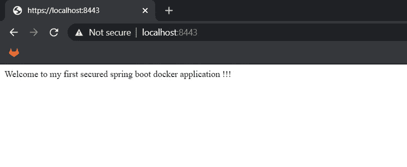

网页浏览器

这就是如何使用自签名 SSL 证书创建安全的 spring boot 应用程序。

> **虽然自签名 SSL 证书不是生产环境的标准，但如果您想在本地开发环境中测试应用程序，它们是很好的选择。**

希望这对我的开发伙伴有所帮助。

我个人认为，在开发环境中创建一个安全的应用程序本身对你很有帮助，如果你正在构建一个尚未准备好投入生产的应用程序，需要与其他安全的应用程序集成并处理 CORS。请分享你的反馈，无论谁读了这篇文章，这将在某种程度上鼓励我。

【https://github.com/mousumi8/spring-boot/tree/master】GitHub 链接:

**参考资料:**[https://docs.oracle.com/javase/9/tools/keytool.htm](https://docs.oracle.com/javase/9/tools/keytool.htm)，[https://en.wikipedia.org/wiki/PKCS_12](https://en.wikipedia.org/wiki/PKCS_12)，[https://spring.io/](https://spring.io/)，[https://www.docker.com/](https://www.docker.com/)