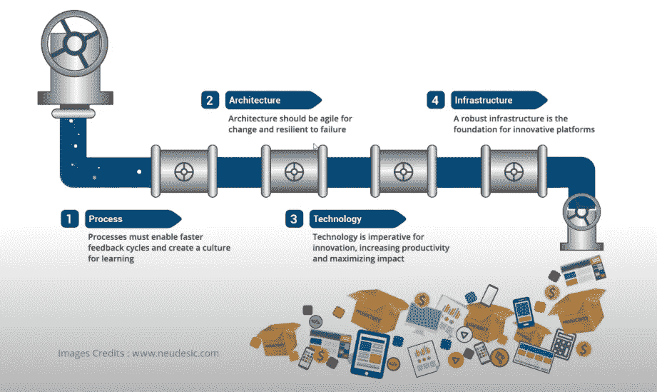
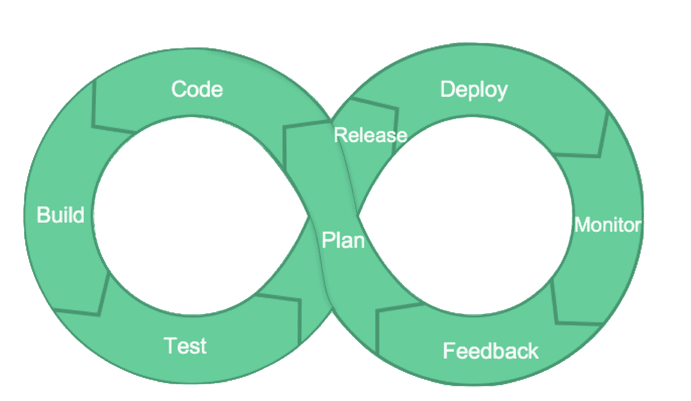

# 理解 DevOps 管道的简单方法

> 原文：<https://medium.com/nerd-for-tech/a-straightforward-approach-to-understanding-devops-pipelines-e865953766cf?source=collection_archive---------18----------------------->

# 什么是 CI/CD 管道？

DevOps 管道可以定义为软件项目的设置，它交付**持续集成(CI)** 、**持续部署**以及最终**持续交付(CD)** 。

创建管道背后的想法是能够创建一个**可重复的**、**可靠的**系统，并且能够**持续改进**软件开发的过程，并从概念阶段交付给客户。

这是通过在生产中实现恒定的**变更流**并通过各种工具使用自动化流程来实现的。

在软件开发生命周期中完成的典型流水线过程。

这个过程的第一步包括让代码正常工作。

DevOps 的生命周期通过以下步骤解释:代码->构建->测试->发布->部署->监控->反馈->计划。

*   **计划** —在开发人员开始编码之前，项目经理和产品经理创建一个计划，该计划由整个工作流程中的一系列任务组成。
*   **代码** —开发人员编写代码，并通过源代码控制系统将其放入存储库中。
*   **构建** —基于存储库中的代码创建构建。
*   测试——各种单元测试、系统测试、集成测试和功能测试在新创建的构建上完成，然后问题被报告给开发人员来解决。

当设置了生产就绪构建时，生产环境被创建、设置，然后通过**管道**为客户**部署**最终构建。

一旦建立了管道，运营团队就努力工作，持续监控基础设施、系统和应用程序，以确保一切顺利运行。

在前一阶段收集的反馈用于提高 DevOps 管道的整体效率。

在每次发布后调整管道以消除可能阻碍生产力的潜在问题是一个很好的实践。

# 如何创建 DevOps 管道？

# 设置源代码管理环境

创建管道时，首先要做的是建立一个源代码控制环境，如 **GitHub** 、 **GitLab** 或 **BitBucket** 。

要将代码推送到 GitHub 这样的环境中，必须在本地机器上安装 Git。

# 设置和测试生成服务器

一旦代码在环境中，下一步就是**测试**它。

运行测试有助于防止错误、bug 或错别字被部署到客户端和用户。

单元测试、集成测试和功能测试是测试代码时应该创建的一些测试。

决定运行哪些测试取决于项目的范围和用于运行应用程序的编程语言。

自动化测试应该在测试过程的开始运行。

一个流行的创建构建的解决方案是 **Jenkins** ，这是一个免费的开源软件，可以被配置为在每次对库中的代码进行更改时运行。

它编译代码并创建一个版本。如果发现任何问题，将自动创建警报。

# 部署到生产

有两种方法可以部署应用程序——手动或自动。

首先，手动部署代码最适合体验部署过程，但是自动化可以显著加快速度。

将代码发布到产品中非常简单。

配置好构建服务器后，它会执行一个脚本，自动将代码发布到生产环境中。

# 结论

本文触及了 DevOps 管道的关键元素，并解释了涵盖这个不断增长的软件开发领域一小部分的概念。

要学习的关键点是，一旦管道到位，它将完全重新定义软件是如何构建的，从长远来看，将会收集大量的商业和技术利益。