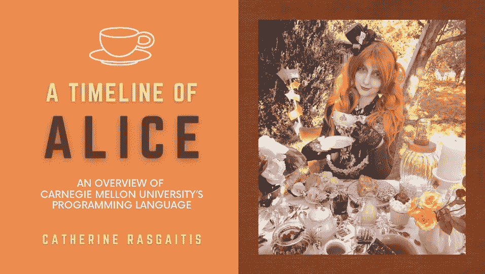
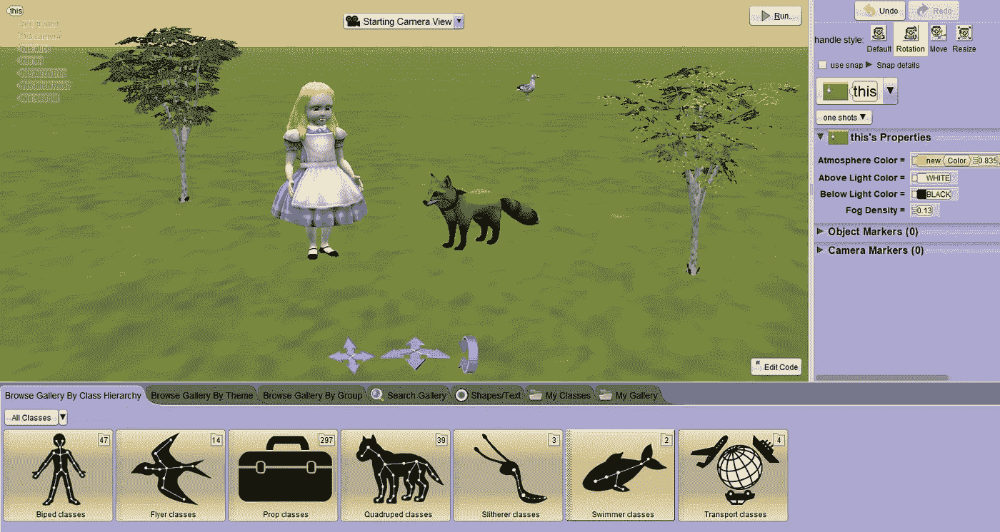
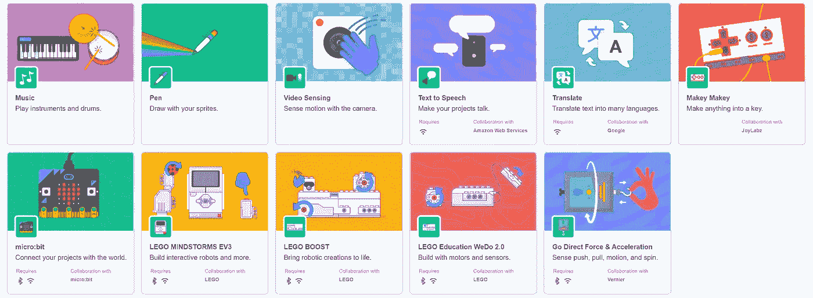

# 爱丽丝的时间线

> 原文：<https://medium.com/nerd-for-tech/a-timeline-of-alice-f265113a5c3c?source=collection_archive---------7----------------------->

## 卡内基梅隆大学编程语言概述

照片由 [Unsplash](https://unsplash.com/photos/dVMqt0ioPYo) 提供

# **爱丽丝简介**

Alice 是一种基于视觉的编程语言，旨在向年轻学生介绍面向对象编程的基础，也称为 OOP。OOP 是一种基于对象和数据而不是功能和逻辑的编程。

Alice 作为一种教育编程语言出现，因为它对年轻观众有吸引力，所以很有前途。然而今天，由于缺乏潜在的项目类型和竞争性的基于块的语言，Alice 变得越来越不受欢迎。

# **历史**

爱丽丝的开发由计算机科学教授兰迪·波许领导。最初，波许在弗吉尼亚大学开始创造爱丽丝。他希望将 Alice 建成一个虚拟现实原型工具，程序员和非程序员都可以使用。到 1995 年，在第三阶段研究小组的帮助下，他已经构建了一个爱丽丝语言的粗略模型。

1999 年，Pausch 发现了如何将 Alice 用作与 3D 图形交互的教育工具。为了减少编程对 Alice 用户的威胁，Pausch 还决定实现 Alice 的拖放式编码风格。这种基于块的编码系统有效地消除了程序员通常必须面对的遵循严格语法规则的挑战。这时，波许也从弗吉尼亚大学转学到卡内基梅隆大学任教。

在接下来的几年里，Pausch 和几个卡内基梅隆大学的学生开发了新的功能来创造更现代的爱丽丝版本。到 21 世纪初，Alice 显然成为年轻程序员的一个独特的教育平台。配套书籍，包括*用爱丽丝学习编程*，也允许用户学习编程课程。

后来，卡内基梅隆大学的学生凯特琳·凯莱赫为爱丽丝计划贡献了另一个重要的功能，称为[讲故事爱丽丝](http://www.alice.org/get-alice/storytelling-alice/)。这个版本推动了动画和讲故事的结合，使得这个节目更加引人入胜。凯莱赫的 3D 角色和易于理解的故事情节一直是当今爱丽丝的一些定义特征。

爱丽丝的另一个显著特征是它的名字。爱丽丝是为了纪念刘易斯·卡罗尔而命名的，他是《爱丽丝漫游奇境记》和《透过镜子看 T2》的作者。卡罗尔坚信解释和分享复杂思想的重要性，尤其是对年轻观众。卡罗尔成了一个重要的灵感来源，激励着 Alice 开发者让计算机编程变得简单而有趣。

在实践层面上，使用“爱丽丝”的名称和“仙境”的主题呈现了其他有用的优势。首先，大部分与爱丽丝原著相关的艺术作品都属于公共领域。因此，Alice 开发人员可以在 Alice 程序中使用这种艺术作品来推进他们吸引孩子的目标。同样，爱丽丝这个名字也很容易被孩子们记住、拼写和发音。最后，这个名字也出现在所有按字母顺序排列的编程语言列表的顶部。

爱丽丝的最新版本是[爱丽丝 3](https://www.cmu.edu/homepage/computing/2009/summer/alice-3-released.shtml#:~:text=The%20beta%20release%20of%20Alice,PC%20game%2C%20The%20Sims2%E2%84%A2.) ，它包括用户从基于块的编码过渡到基于文本的编码的选项。以前，在基于数据块的系统中，用户只能查看数据块并与之交互。改进后的 Alice 3 允许用户通过 Alice [NetBeans 库插件](https://www.alice.org/get-alice/alice-3-with-netbeans/)查看和编辑基于 Java 文本的编程。爱丽丝 3 也有一个更明显的面向对象的设计，并融入了来自模拟人生 2 的标志性角色和场景。

目前，卡内基梅隆大学的学生继续致力于维护和改进 Alice。Alice 团队目前正致力于将虚拟现实融入到该程序中，正如其最初打算的那样。

# **好处**

Alice 有许多好处，因为它有独特的编码环境。

首先，使用 Alice 的一个主要优势源于它的可视化和基于块的特性。由于 Alice 的目标受众包括新的和更年轻的程序员，拖放块比从头开始编写基于文本的代码更有吸引力。这样，Alice 用户可以比使用正确的 Java 语法更专注于问题的解决。同样，Alice 基于块的设计意味着编程将更少耗时，尤其是对于慢打字员。

Alice 程序中的程序块本身还提供了第二个优势。具体来说，Alice 程序块中的命令比传统编程语言更加明确和直接。例如，对于 Alice，要使一个对象掉头，可以使用写有“向后转”的块。如果你使用 Java turtle 编程，你需要输入“this.turn(180)”。虽然这两个命令完成了相同的任务，但新程序员知道如何更容易地使用 Alice 的块。

Alice 的工作空间本身简单明了，易于操作，对于新手来说并不复杂。当创建一个 Alice 项目时，用户将关注两个主屏幕。一个屏幕用于设置程序的“场景”,另一个屏幕用于实际编程。

Alice 的场景工作空间有几个内置的优点，允许用户从广泛的设置、对象和角色中进行选择。这些对象可以通过改变它们的大小、位置、角度和颜色来进一步定制。所有这些选项增强了 Alice 的图形和视觉吸引力。此外，该系统为各个场景提供具有默认位置和效果的对象。因此，用户不必在他们的代码中指定每个特性的值。相比之下，对于其他语言来说，指出所有这些特征既费时又低效。

场景设置工作区

在编程工作区中，用户使用虚拟“摄像机”为场景中的每个对象创建代码。在这种模式下，用户从一系列*程序*和*功能*中拖放可定制的块。Alice 还允许用户拖放额外的块来创建变量、循环等。

当一个新的块被添加到用户的代码中时，Alice 提示用户输入适当的值。这也很有帮助，因为它提醒用户在必要时输入值，并防止错误。

简而言之，Alice 比其他编程语言有很多优势，因为它直接应用了块、工作空间和图形。

# **弊端**

然而，虽然 Alice 提供了各种不同寻常的好处，但它也给用户带来了一些挑战。

学习 Alice 最明显的缺点是它不是一种用于专业软件开发的语言。虽然 Alice 教授基本的计算机科学概念，但是 Alice 语言本身的专业知识并不直接适用于构建和部署现实世界的产品。

类似地，流利地使用 Alice 也不容易移植到其他基于文本的编程语言中。大多数编程语言没有拖放功能或基于块的环境。这些语言需要了解相应语言的正确编程语法。例如，从 Java 迁移到 C 会相对容易，因为 Java 和 C 的语法有一些共同的特征。相比之下，Alice 专家不具备从零开始编写代码和遵循语法规则的必要技能。结果，他们将很难把他们的技能从 Alice 转移到 c。

Alice 的另一个常见问题是它不支持[。exe](https://www.webroot.com/us/en/resources/glossary/what-is-an-exe) 导出。. exe 文件或“可执行文件”是在设备上运行软件程序的一种流行方式。这使得创建独立项目变得困难。

其次，虽然 Alice 因其内置角色而闻名，但这一特性也限制了用户的创造力。Alice 阻止其用户独立创建对象和角色。对于 Alice，也没有直接的方法来添加由用户创建或导入的原始图形。当 Alice 程序的新鲜感消失后，使用同一组字符很容易变得乏味和无趣。

# **趋势**

不幸的是，对于 Alice 用户来说，Alice 语言正逐渐失去人气。随着其他基于块的语言，如 Scratch 和 Blockly，Alice 的功能不再像以前那样令人印象深刻。Alice 用户大多局限于创建动画和故事，他们不能创建更高级的项目，如平台游戏、物理引擎等。这在更现代的语言中是可能的。

例如，麻省理工学院创造的 [Scratch](https://scratch.mit.edu/) ，提供了 Alice 所没有的更广泛的程序。使用 Scratch，您可以创建更加多样化的项目，因为它有补充的扩展和库。例如，Scratch 包括音符块扩展，允许用户制作自己的音乐。笔扩展允许 Scratchers 用户(称为 Scratchers)控制直接在屏幕上绘制的虚拟笔。

Alice 上没有的其他 Scratch 扩展包括 Makey-Makey 板和 LEGO 扩展，这些扩展将编程与现实世界联系起来。您还可以使用视频和动作感应附件来控制摄像机，并与您的代码进行交互。这些工具允许 Scratchers 构建自己的物理遥控器，这是 Alice 无法实现的。

临时扩展

Scratch 甚至可以说在图形和视觉方面继续超过 Alice，这是 Alice 最初的一些卖点。Scratch 有更大的字符库可供选择。更重要的是，Scratch 为用户提供了编辑预制角色和创建自己角色的选择。这些工具使 Scratch 变得更加有趣和令人兴奋，更好地实现了让孩子们对编程感兴趣的共同目标。

除了基于块的语言之外，更多的年轻程序员正在学习立即开始基于文本的编码。这消除了 Alice 作为希望学习传统语言的基于块的程序员的过渡语言的需要。

# **结论**

在过去，Alice 是探索面向对象编程等计算机科学主题的一个很好的方式。同样清楚的是，Alice 更多的是作为一种教育工具，而不是一种实用的计算语言。今天，Alice 可能不再受欢迎，因为有太多同样容易使用的现代语言。尽管如此，Alice 继续对其剩余用户产生重大影响，并且是使编程对初学者来说更令人兴奋的运动的关键部分。它独特的历史、好处、成就甚至缺点继续使它成为一种值得注意的语言。

“关于爱丽丝。”爱丽丝，爱丽丝*，www.alice.org/about/.*

《爱丽丝 3》上映了。” *CMU* ，卡耐基梅隆大学[www . CMU . edu/home page/computing/2009/summer/Alice-3-发布。](http://www.cmu.edu/homepage/computing/2009/summer/alice-3-released.shtml#:~:text=The%20beta%20release%20of%20Alice,PC%20game%2C%20The%20Sims2%E2%84%A2.)

《爱丽丝编程导论》*Developer.com*，Developer.com[，www.developer.com/java/introduction-to-alice-programming/.](http://www.developer.com/java/introduction-to-alice-programming/.)

康纳斯，杰拉米。"开始使用 Alice 编程语言."*WhoIsHostingThis.com*，世卫组织 2019 年 2 月 12 日，[www.whoishostingthis.com/resources/alice-programming/.](http://www.whoishostingthis.com/resources/alice-programming/.)

“和爱丽丝一起学习编程。”*软件工程师内幕*，软件工程师内幕，[www . Software engineering Insider . com/programming-languages/Alice . html .](http://www.softwareengineerinsider.com/programming-languages/alice.html.)