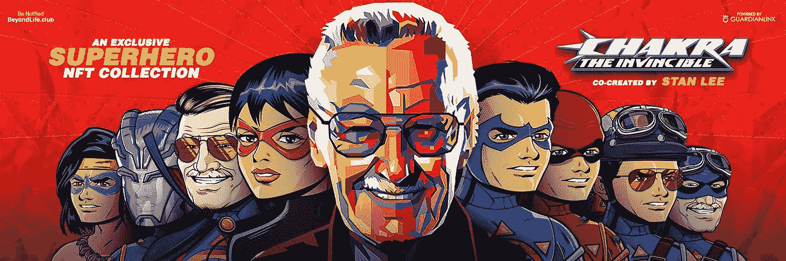
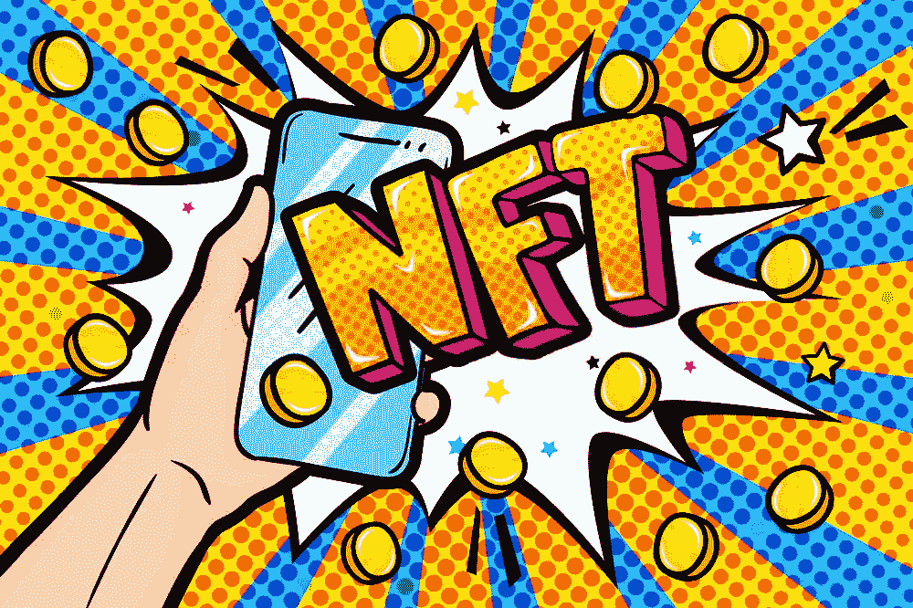

# 对待所有斯坦·李球迷，介绍他的查克拉-无敌 NFT 收集

> 原文：<https://medium.com/nerd-for-tech/a-treat-to-all-stan-lee-fans-introducing-his-chakra-the-invincible-nft-collection-a826d6fa9512?source=collection_archive---------9----------------------->

超级英雄 NFT 系列

即使在他去世后，他的作品仍然和我们生活在一起。他成就了我们童年的超级英雄，现在是时候在他 99 岁生日时庆祝这个传奇了。斯坦·李在世界各地创造了许多超级英雄，甚至来自世界以外的地方。他在 2013 年创造的一个轰动的角色是 [**查克拉**](https://chakra.beyondlife.club/?fsz=home)——无敌。这位英雄将带着 NFT 收藏回来，里面有斯坦·李所有稀有的素描和看不见的石版画。

**什么是 NFT，人们为什么收集它们？**

非同质化通证

NFT 是记录在区块链上的不可替代的令牌。NFT 是通过智能合约用令牌 id 对数字资产进行令牌化而创建的。它们表示资产的所有权，资产保存在区块链中。简单来说，你对资产的所有权将被铭刻在区块链上，这样在你不知情的情况下，没有人能够破解或更改它。

NFT 数码收藏品现在正成为一种趋势。任何数字化的东西都被制作成 NFT，并以数百万美元的价格出售。所以 NFT 是人们为之疯狂的新时代收藏品。

**查克拉——无敌**

2013 年初，斯坦·李想创造一个基于印度文化的超级英雄。他创造了查克拉无敌以及图形印度。这部超级英雄漫画纯粹基于印度意识形态。斯坦·李是一个创造性的传奇人物，他将超能力概念和能量轮概念完美地结合在一起。

这个故事基于一个名叫拉朱·拉伊的弱小男孩，他和他的哥哥萨梅尔·拉伊住在一起。拉朱是辛格博士的助手，他一直在设计一套超级英雄服装。当邪恶的帮派试图拿走西装时，拉朱穿上西装逃走了。不幸的是，纳米机器人(一种用于制作宇航服的纳米技术机器人)将宇航服附着在他的身体上。随着宇航服的新力量，Raju 开始了解危险的未来，并帮助宇航服的人们。

为什么查克拉 NFT 很特别？

**查克拉**——无敌号于 2013 年作为动画电影续集在卡通网上映。但是由于贴近他的内心，斯坦·李决定制作成人版的查克拉。他为 3D 真人表演制作成人版。但不幸的是，这个版本是不完整的，没有发布。

为了纪念他的诞辰，他的作品以 NFT 作品集的形式发行。

> NFT 收藏有一份 NFT 物品清单，可以直接购买，也可以通过拍卖购买。有一个让斯坦·李粉丝惊喜的 NFT，就是“**斯坦·李 Bday 特别 NFT** ”。

斯坦·李 99 岁生日

这个 NFT 是一个包，包括有史以来第一本查克拉 NFT 漫画，由斯坦·李本人签名，查克拉的签名故事治疗和一个看不见的超级英雄角色，他已经工作了多年。斯坦·李将这个角色命名为温柔的珀西的力量。

**巨型点唱机**

查克拉 NFT 收藏中有许多 NFT 物品被拍卖。它们包括，查克拉 NFT 艺术朋克，动画 NFT 视频，漫画封面剧照，动画漫画封面和其他一些。在成功推出宝莱坞巨星 Amitabh NFTs 之后，Beyondlife 现在为这个 NFT 系列推出了一个特殊的点唱机。

点唱机将有以下项目供粉丝在他的宇宙中体验查克拉。

*   粉丝们可以得到普通和不普通的查克拉-无敌漫画封面
*   附有故事情节的罕见漫画书封面
*   看不见的罕见漫画封面版与整个三部续集电影的精髓
*   罕见的秘密白银时代版漫画书封面
*   查克拉无敌动画视频

**百宝箱**

除了所有的稀有物品，还有一个专门为粉丝制作的宝盒。那些从 [**查克拉 NFT 系列**](https://chakra.beyondlife.club/?fsz=home) 中购买至少 5 件 NFT 的人将获得宝箱，不管 NFT 的价格如何。

访问将被授予 1 月 1 日结束后，所有的拍卖和销售的整个查克拉 NFT 收集。这个巨大的宝箱价值 5 万美元。他们声称有大礼物，也有一堆小礼物，让所有斯坦迷大吃一惊。

**总结**

随着加密货币和 NFT 的日益流行，人们如此热衷于收集时尚和稀有的物品。数字收藏品正在得到世界各地收藏家的认可。一些人对收藏品感兴趣，而另一些人为了转售价值而购买。粉丝们已经开始加入等待名单，并为将在斯坦·李生日那天举行的拍卖做好准备。今年对所有漫画爱好者来说，这将是一次罕见的漫画收藏品大爆炸。如果你还没看过这个系列，可以去官方网站查看，因为迟到总比不到好。