# 博弈论和数据科学的独特交叉点:电子商务产品定价

> 原文：<https://medium.com/nerd-for-tech/a-unique-intersection-of-game-theory-and-data-science-e-commerce-product-pricing-659a4c877261?source=collection_archive---------1----------------------->

## 价格弹性、交叉弹性和纳什均衡

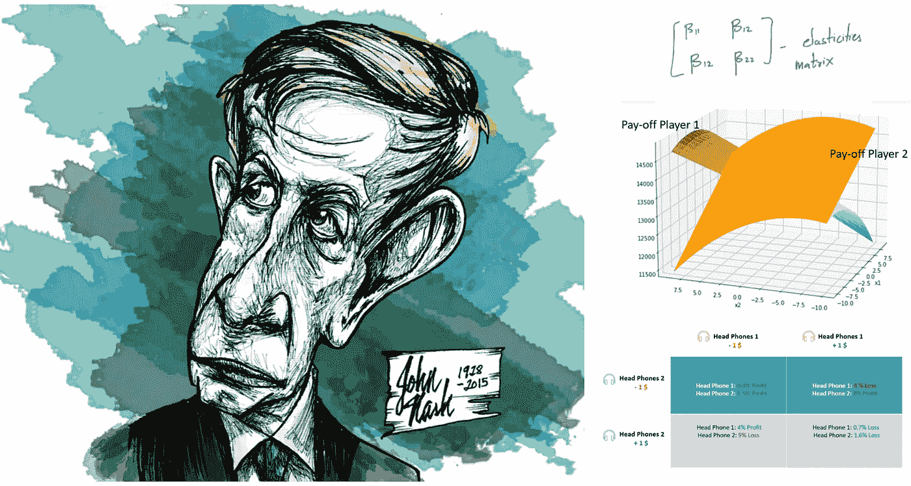

左图: [Rica Espiritu](https://ricaespiritu.com/author/rica/)

# 内容:

1.简介
2。弹性的概念
3。测量弹性:线性回归
4。示例:数据&代码
5。竞争中的动态定价:博弈论
6。纳什均衡

# 介绍

电子商务中最大的挑战之一是利用数据挖掘方法来改进他们的动态定价策略。通常电子商务中的这些产品面临来自不同电子商务网站上的相同产品或不同品牌产品的激烈竞争。

在这篇博客中，我将尝试把这场激烈的竞争建模为一场正式的双人战略游戏，并应用一个最著名的博弈论解决方案概念，名为**纳什均衡**。我们将跨时间从电子商务网站获取产品的价格-需求数据，并编写 python 代码来求解博弈论数学方程。

在这篇博客结束时，你可以理解博弈论如何被用来解决比赛中的动态定价问题。

# 弹性概念

了解电子商务**产品定价系统**非常重要。

1.  产品需求随价格变化而变化。
    ***举例*** :如果某款笔记本电脑在亚马逊上的价格下降，那么同一款笔记本电脑在亚马逊上的销量就会增加
2.  竞争者改变价格时产品需求的变化。
    ***例 1*** :如果一台特定的笔记本电脑在亚马逊上的价格下降，同样的笔记本电脑在 Flipkart 上的销量也会下降，因为人们倾向于从亚马逊上购买笔记本电脑。
    ***例 2*** :如果某款惠普笔记本电脑在亚马逊上的价格下降，那么同规格的联想笔记本电脑的销量也会下降，因为人们更倾向于购买惠普笔记本电脑。

量化价格对需求的影响是非常重要的。让我们在这里挖掘弹性的概念。

## 价格弹性:

需求的价格弹性是衡量一种产品相对于其价格变化的消费变化。用数学表达，就是:[1]

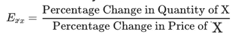

**无弹性:**也就是说，价格的降低并不会增加多少需求，价格的提高也不会伤害需求。

**弹性:**这些商品的价格变动会导致其需求或供给发生重大变化。

我们可以清楚地看到**价格弹性**清楚地量化了 *1。产品需求随价格变化而变化。*

## 交叉弹性:

需求的交叉弹性是一个经济概念，用来衡量当竞争对手的价格变化时，一种商品的需求量的反应。

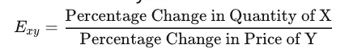

作者生成

我们可以清楚地看到**交叉弹性**明确量化: *2。竞争者改变价格时产品需求的变化。*

# 测量弹性:线性回归！

为了测量弹性，我们将使用最著名的回归概念，这是第一次介绍给每个数据科学家的追求者:**线性回归**。

在线性回归中，系数提供了一条直线斜率的估计值，该直线被假定为因变量和至少一个自变量之间的关系。

根据微积分，线的斜率是一阶导数，并告诉我们变量" **X"** 的一个单位变化对变量" **Y** "的单位中测量的变量值的影响大小。

> 所以，我们可以计算出斜率 **𝓭Q/𝓭P** 。如果我们使用一个线性回归，以**因变量作为销售(Q)** 和**自变量作为价格(P)和系数给出斜率**。

## 弹性与坡度(𝓭Q/𝓭P)

请注意，弹性是 ***【需求数量变化%/价格变化%。其中斜率为线性回归系数:*** 𝓭Q/𝓭P ( *数量单位变化/价格单位变化)。*

有两种方法可以从线性回归中提取“弹性”。

1.  直接以需求(Q)为因变量(Y)，价格(p)为自变量(X)。
    弹性=斜率* (P/Q)
    这叫**级-级**变换
2.  使用需求对数(Q)作为因变量(Y ),价格对数(p)作为自变量(X)。
    弹性=斜率
    这叫做**双对数**变换

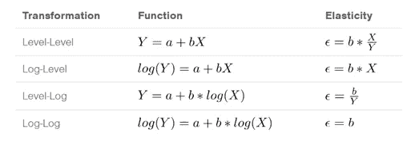

这张图表解释了使用水平-水平和对数-对数方法计算价格弹性。
X =价格
Y =数量/需求/销售

# 示例:数据和代码

让我们以价格和需求数据为例，计算弹性。

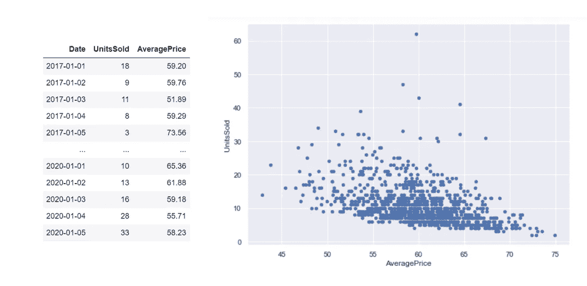

你可以清楚地看到，随着价格的上涨，销售额在下降。现在让我们尝试在 **log(sales)** 和 **log(price)** 上拟合一个 L *线性回归*，直接输出斜率作为弹性。离群值非常明显，需要移除以拟合 LR 模型，我们可以使用 Z 分数**移除离群值**

## 1.价格弹性

```
import pandas as pd
import statsmodels.api as sm
df = pd.read_csv('data.csv')
df['AveragePrice'] = np.log(df['AveragePrice'].values)
df['UnitsSold'] = np.log(df['UnitsSold'].values)
X = df[‘AveragePrice’]
Y = df[‘UnitsSold’]
X = sm.add_constant(X)
model = sm.OLS(Y,X)
results = model.fit()
print(results.summary())
df.plot.scatter(x = ‘AveragePrice’, y = ‘UnitsSold’)
import matplotlib.pyplot as plt
fig = plt.figure(figsize=(10,5))
fig = sm.graphics.plot_partregress_grid(results, fig=fig)
```

## 口译输出

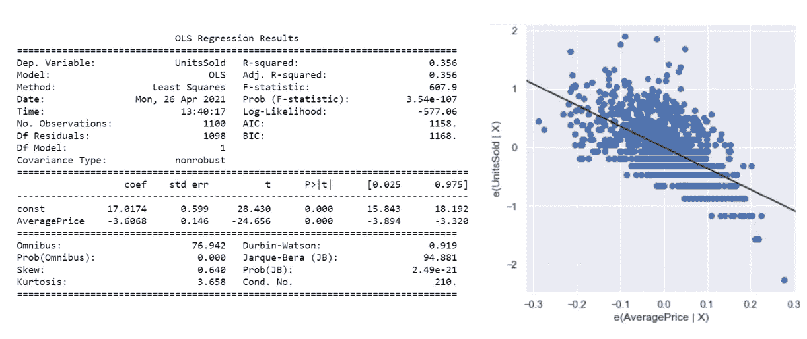

作者生成

1.  价格弹性:-3.6
2.  如果价格上涨 10%，销售额将减少 36%
3.  p 值< 0.05 意味着该系数是显著的结果

## 2.交叉弹性

我们只需要把自己的价格替换成竞争对手的价格，就可以得到交叉弹性。


作者生成

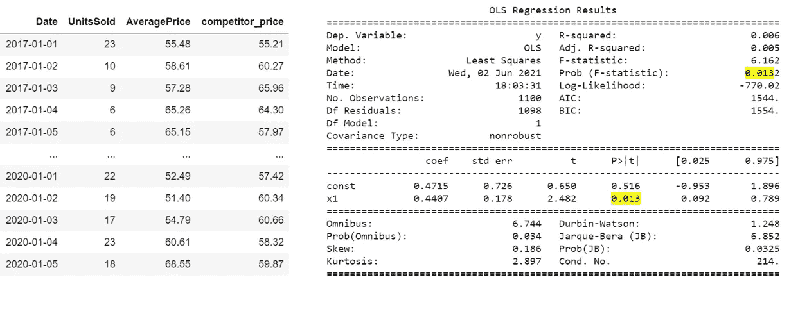

作者生成

1.  交叉弹性:0.44
2.  如果竞争对手的价格下降 10%，销售额就会减少 4.4%

在下一部分，我们将讨论博弈论的概念及其在这里的应用。请参考我在 medium 上的博弈论系列

[](/nerd-for-tech/quick-game-theory-blog-series-for-dummies-a6fdf7acacd6) [## 傻瓜快速游戏理论博客系列

### 6 个博客系列，每个不到 5 分钟

medium.com](/nerd-for-tech/quick-game-theory-blog-series-for-dummies-a6fdf7acacd6) 

# 竞争中的动态定价:博弈论

让我们把这个问题设置成一个静态游戏。让我们假设公司'**' X '**和公司' **Y'** 处于竞争中，双方都可以选择*提高或降低价格。*

## *游戏直觉*

正如我们在上面的讨论中看到的，**‘X’**的价格上涨确实减少了’**X’**的销售，这可以通过 ***价格弹性*** 来量化。此外，我们看到竞争对手**【Y】**的价格上涨确实增加了**X’**的销量，这可以通过 ***交叉弹性*** 来量化。

因此，如果任何公司选择提高或降低价格，它会影响自己的销售/利润，也会影响竞争对手的销售/利润。为了在这种竞争环境中最大化你的福祉，公司的动态定价系统不仅考虑你的行为，还猜测竞争对手在做什么，以最大化你的回报。

如何猜测竞争对手的行动？很简单，你的竞争对手也和你一样理性，他们以相似的方式做决定。你的竞争对手也知道如果你提高或降低价格，他们的利润会发生什么。

## 支付矩阵

支付矩阵是定义游戏的一种方式。

*行*:代表玩家 X 策略
*列*:代表玩家 Y 策略
*矩阵条目*:X/Y 的收益

正如图中所解释的，我们将需要得到每家公司的回报或利润，即公司' **X** '和公司' **Y'** '采取的不同行动。

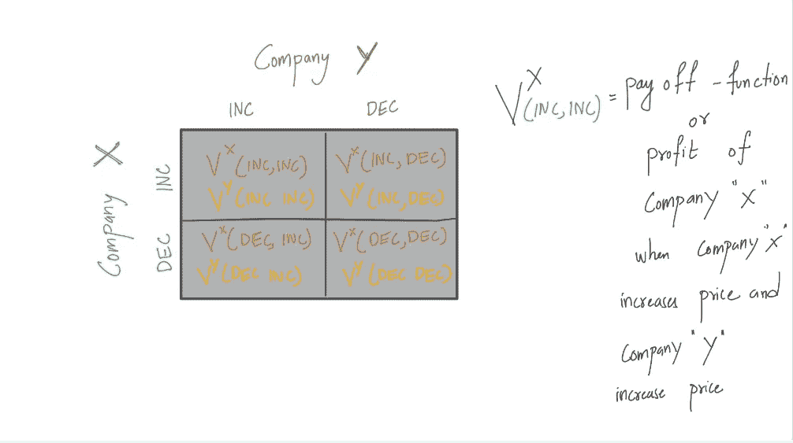

# 纳什均衡

一个最著名的解决方案概念，它是一个策略配置文件，每个参与者都选择对所有其他参与者策略的最佳反应。

> 纳什均衡中的每个策略都是该均衡中所有其他策略的最佳对策。

它是以 1994 年获得诺贝尔奖的约翰·纳西命名的。这个概念代表了游戏中的一个结果，在这一点上，没有玩家可以通过改变他们的战略决策来增加收益。我们用它来试图解释和理解理性个体之间的决策过程和策略。

数学上，让我们看看纳什均衡在我们的动态定价问题中的应用。我们将在这一节的最后编写代码。假设参与人 1 和参与人 2 在产品 1 和产品 2 的产品定价系统中，他们处于竞争中。

## 步骤 1:定义弹性

我们可以计算 2-价格弹性和 2-交叉弹性，如前所述。


作者生成

## 步骤 2:定义放线功能

这里，定义支付函数非常重要。对于不同的公司，这种回报会有所不同，因为有些公司更喜欢客户满意度而不是利润。现在我们将简单地把**即时**利润作为支付函数。

我们将定义参与人 1 和参与人的收益/利润，如果参与人 1 改变价格 x1，参与人改变价格 x2。

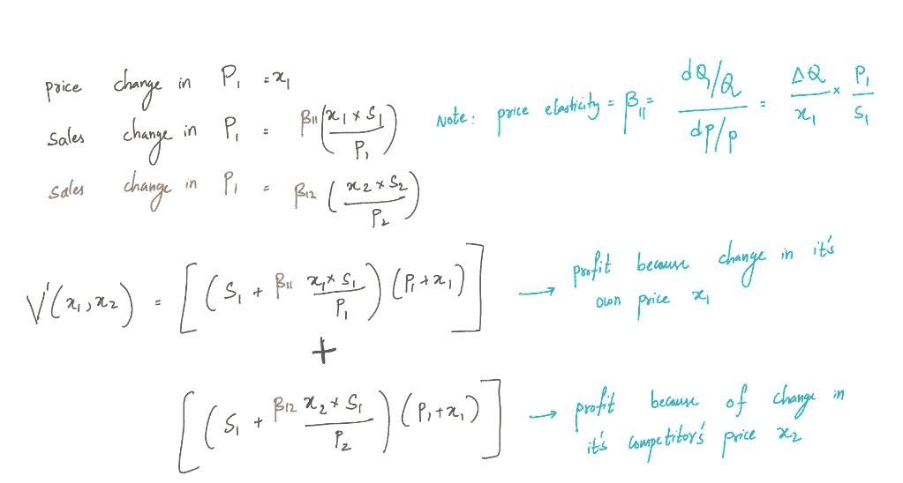

作者生成

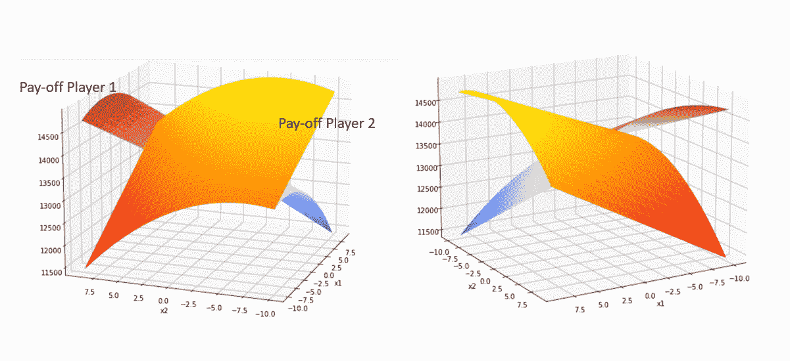

作者生成

## 第三步:纳什均衡求解

在这一步，我们找到了两个参与人的纳什均衡，并找出了均衡时参与人 1 和参与人 2 的价格变化。在这一点上，没有玩家可以通过改变他们的战略决策来增加收益。

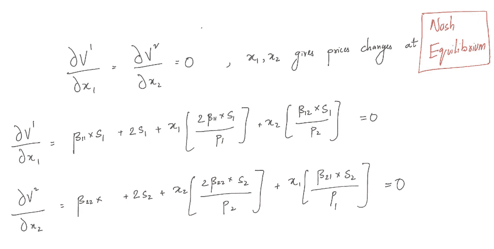

## 步骤 4:示例和代码

我们将假设 **%利润**为收益，因为这样更直观。我们将采取一个场景，其中电子商务市场上的 2 头手机处于激烈竞争中。价格弹性和交叉弹性定义如下:

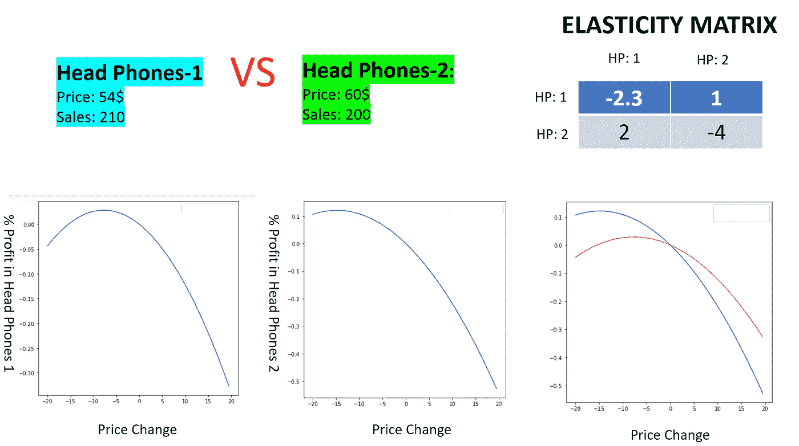

价格弹性

正如我们在价格弹性中所讨论的，价格变化对其自身的%利润有抛物线效应。我们将在下一个图中理解交叉弹性:

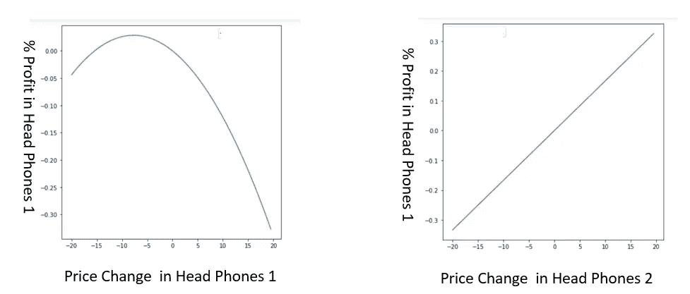

交叉弹性

交叉弹性的影响在上面的图中非常明显。如果“耳机 2”的价格增加，那么它的竞争对手(耳机 1)的销售额增加，其竞争对手的利润增加。

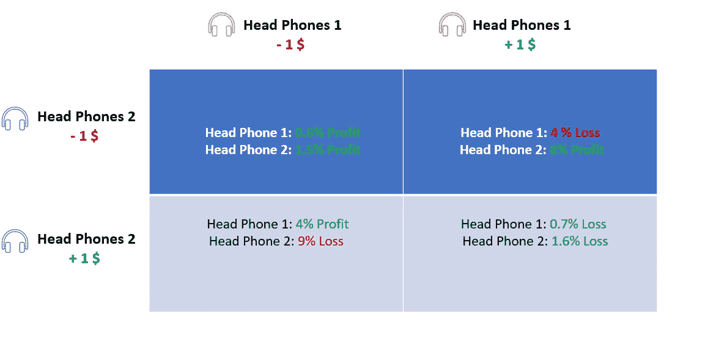

这是两个耳机的回报矩阵。我们可以清楚地看到两种产品的价格变化对两种产品的利润都有明显的影响。

现在让我们编码纳什均衡设置并理解结果。

```
from sympy import symbols, Eq, solve
elasticity_ = [[-2.3 ,1],[2,-4]]
s1 = 210
p1 = 54
s2 = 200
p2 = 60
x, y = symbols(‘x,y’)
a1 = elasticity_[0][0]*s1 + s1
a2 = elasticity_[1][1]*s2 + s2
b1 = (elasticity_[0][0]*2*s1)/p1
b2= (elasticity_[1][1]*2*s2)/p2
c1= (elasticity_[0][1]*s1)/p2
c2= (elasticity_[1][0]*s2)/p1
eq1 = Eq((a1+x*b1+y*c1), 0)
eq2 = Eq((a2+y*b2+x*c2), 0)
solution = solve((eq1, eq2), (x, y))
print(‘x1: ‘, solution[x],’,x2: ‘,solution[y])
X1 = solution[x]
X2 = solution[y]print(‘% Profit of head Phones 1’, 100*((s1+elasticity_[0][0]*X1*s1/p1+elasticity_[0][1]*X2*s1/p2)*(p1+X1) — p1*s1)/(p1*s1) )
print(‘% Profit of head Phones 2’, 100*((s2+elasticity_[1][1]*X2*s1/p2+elasticity_[1][0]*X1*s2/p1)*(p2+X2) — p2*s2)/ (p2*s2) )
```

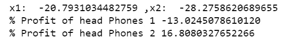

输出

## 第五步:了解结果

让我们试着去理解均衡。当两种产品处于激烈竞争时，耳机 1 降价为 **20 美元**，耳机 2 降价为 **28 美元。尽管降低了价格，head phones 1 仍然面临亏损。在纳什均衡之外的解空间中，头音 1 将有超过 13%的损失。**

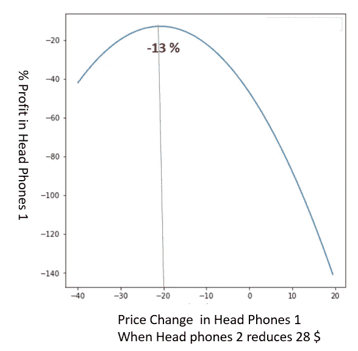

让我们通过将*头戴式耳机* 2 的价格变化固定在- **28 $** 并为*头戴式耳机 1* 绘制不同的解决方案来尝试理解这种均衡。

从图中我们可以清楚地看到， *head phones 1* 需要降价 20 美元才能将损失降到最低。

如果这两种产品没有激烈的竞争，这种情况会有所不同。请注意，交叉弹性是竞争的近似量化。

# 摘要

在这篇博客中，我们学习了如何计算价格对需求的影响，也了解了竞争对手价格的影响。我们引入了纳什均衡的概念，并成功地将其应用于电子商务竞争场景。

我希望我的读者喜欢阅读这篇博客。