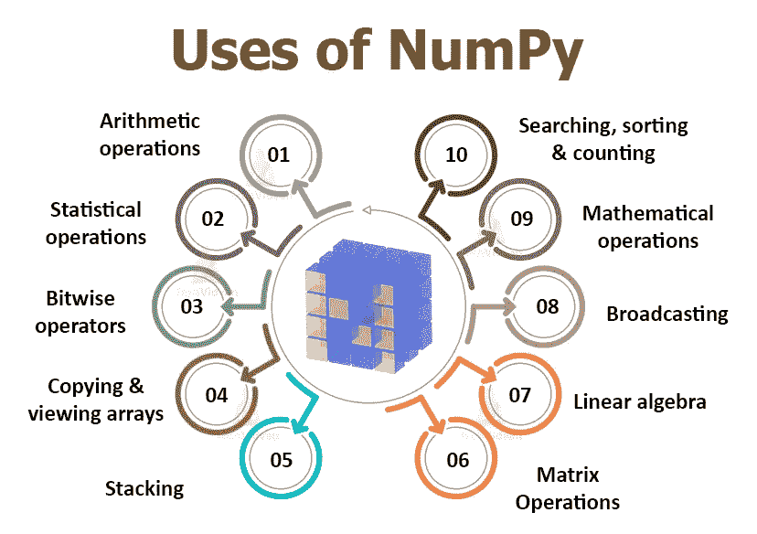

# 带有 Python Numpy 库的 A-Z。

> 原文：<https://medium.com/nerd-for-tech/a-z-with-numpy-library-6269de9c5413?source=collection_archive---------3----------------------->

用 Python 语言进行科学计算的最基本模块。🐍


演职员表:[https://ssiddique.info/](https://ssiddique.info/)

H ola 的读者们，众所周知， **Python** 是目前最强大的语言，事实上，Python 已经成为每个技术人员都应该知道的语言。

所以这篇文章是关于 Python 最重要和最常用的库之一，即 **NUMPY 库**。在开始之前，如果你想了解 Python 编程的基础，你可以看另一篇完全基于 Python 语言基础的文章。 [***点击这里***](/nerd-for-tech/python-is-the-new-c-bd0fe01cdc95) 。

从引用开始:

> “Python 是一门伟大的第一语言”，引出“Python 是一门伟大的最后语言！”
> 
> -诺亚·斯普瑞尔

# ✨介绍 NUMPY。

## 什么是 Numpy？

NumPy 代表'**数值 Python** . '它是一个基本的科学库，用于*统计函数、线性代数、算术运算、位运算*等。

它基本上是**科学计算**的核心库，包含了一个强大的 **n 维数组对象**。


演职员表:[https://www.edureka.co](https://www.edureka.co/blog/python-numpy-tutorial/)

我们对数组元素执行所有的操作。我们可以用几种方法初始化这些数组。

NumPy 的两个基本**先决条件**是 **Python** 和**数学**。我们需要了解 [Python 基础知识](/nerd-for-tech/python-is-the-new-c-bd0fe01cdc95)来使用 NumPy 模块。

## 为什么是 NumPy 数组？

numpy 数组是一个**强大的 N 维数组对象**，以行和列的形式存在。

Numpy 可用于**数组元素**的**存储、操作**和**删除**。我们可以用它对**数组**元素的**排序、索引、**和**堆叠**。

## NumPy 的局限性？

它旨在解决缺少值的问题。 **NumPy** 本身支持“ **nan** ”，但是 Python 内部缺乏跨平台支持，给用户造成了困难。这就是为什么我们在 Python 解释器中比较值时可能会遇到问题。

## 安装？

要使用 pip 在 **Linux** 上安装 NumPy，请在终端上运行以下命令:

```
sudo pip3 install numpy
```

要使用 pop 在 **Windows** 上安装 NumPy，请在命令提示符下运行以下命令。在运行安装 NumPy 的命令之前，确保您已经安装了 pip 。

```
pip3 install numpy
```

然后进入 IDE，使用 import 命令 import NumPy as np。🤗

## Numpy 的使用？



演职员表:[https://techvidvan.com](https://techvidvan.com/)

# NumPy ndarray 对象。

## 数组索引和切片:

一维 Numpy 数组:

```
**import** numpy as npa **=** np.array([1,2,3])print(a)**O/P** — [1 2 3]
```

多维数组:

```
a**=**np.array([(1,2,3),(4,5,6)])print(a)**O/P** — [[ 1 2 3]
[4 5 6]]
```

一个`**ndarray**`是一个(通常是固定大小的)相同类型和大小的多维容器。数组中的维数和项数由其`[**shape**](https://numpy.org/doc/stable/reference/generated/numpy.ndarray.shape.html#numpy.ndarray.shape)`定义，T1 是由 *N* 个非负整数组成的`[**tuple**](https://docs.python.org/dev/library/stdtypes.html#tuple)`，指定每个维数的大小。数组中项目的类型由单独的[数据类型对象(dtype)](https://numpy.org/doc/stable/reference/arrays.dtypes.html#arrays-dtypes) 指定，其中一个与每个 ndarray 相关联。

**n 数组对象**最重要的属性是:

*   **ndarray.ndim** 是数组的维数(通常称为“轴”)。
*   **ndarray.shape** 是数组的大小。它是一组自然数，显示了数组沿每个轴的长度。对于 n 行 m 列的矩阵，形状应该是(n，m)。形状元组的元素数量为 ndim。
*   **ndarray.size** 是距离数组形状 n*m 的数组中元素的个数。
*   **ndarray.dtype** 是描述数组元素类型的对象。您可以使用标准 Python 数据类型来定义 dtype。NumPy 在这里提供了一大堆的可能性，既有内置的，例如 bool_、character、int8、int16、int32、int64、float8、float16、float32、float64、complex64、object_，还能够定义自己的数据类型，包括复合数据类型。
*   **ndarray.itemsize** 是数组中每个元素的字节大小。
*   **ndarray.data** 是一个包含数组实际元素的缓冲区。通常，这个属性不常用，因为访问数组元素最简单的方法是使用索引。

**切片**基本上是从一个数组中提取一组特定的元素。这个切片操作与**列表**中的操作非常相似。

例如:

```
**import** numpy as npa**=**np.array([(8,9),(10,11),(12,13)])print(a[0:2,1])Output — [9 11]
```

正如您在上面的代码中看到的，只打印了 9 和 11。当我写 0:2 时，这不包括数组第三行的第二个索引。因此，只有 9 和 11 被打印出来，否则你将得到所有的元素，即[9 11 13]。

> Python 是“你还能读懂的最强大的语言”。
> 
> 保罗·迪布瓦

## ndarray 的存储器布局:

类`[**ndarray**](https://numpy.org/doc/stable/reference/generated/numpy.ndarray.html#numpy.ndarray)`的一个实例由一个连续的一维计算机内存段(由数组或其他对象拥有)组成，结合了一个索引方案，将 *N* 个整数映射到块中某个项目的位置。索引可以变化的范围由数组的`[**shape**](https://numpy.org/doc/stable/reference/generated/numpy.ndarray.shape.html#numpy.ndarray.shape)`指定。

NumPy 是灵活的，`[**ndarray**](https://numpy.org/doc/stable/reference/generated/numpy.ndarray.html#numpy.ndarray)`对象可以适应任何*步进索引方案*。

**视图和副本:**

一个**副本和一个数组**视图的主要区别在于，副本是一个新的数组，而视图只是原数组的一个视图。

```
The **copy** returns None.
The **view** returns the original array.
```

**副本**示例:

```
import numpy as nparr = np.array([1, 2, 3, 4, 5])
x = arr.view()
arr[0] = 42print(arr)
print(x)
```

副本**不应受到对原始数组所做更改的影响。**

**视图的例子**:

```
import numpy as nparr = np.array([1, 2, 3, 4, 5])
x = arr.view()
arr[0] = 42print(arr)
print(x)
```

视图**应该会受到对原始数组所做更改的影响。**

## **创建数组:**

其中一个更简单的方法是使用 **numpy.array()** 函数从常规 Python 列表或元组创建一个数组:

```
**import** numpynumpy.array([1,2])# result: array([1, 2])
```

要在 NumPy 中创建多维数组，只需在 array 函数中使用多维列表。

```
**import** numpynumpy.array([[1,2],[3,4]])# result: array([[1, 2],# [3, 4]])
```

> 如果您想创建一个数组并将内容初始化为 0，您可以使用 **zeros()** 函数；如果您想将数组内容初始化为 1，请使用 **ones()** 函数、 **eye ()** 函数创建一个单位矩阵、 **empty()** 函数创建一个包含随机数的空数组、 **arange()** 函数创建一个数字序列。

## 数组数据类型:

默认情况下，Python 具有以下数据类型:

*   `strings`
*   `integer`
*   `float`
*   `boolean`
*   `complex`

**NumPy** 有一些**额外的数据类型**，引用一个字符的数据类型，比如`i`表示整数，`u`表示无符号整数，等等。

*   `i` -整数
*   `b` -布尔型
*   `u` -无符号整数
*   `f` -浮动
*   `c` -复杂浮动
*   `m` -时间增量
*   `M` -日期时间
*   `O` -对象
*   `S` -字符串
*   `U` - Unicode 字符串
*   `V` -无效

使用以下代码检查数据类型:

```
import numpyp = numpy.arange(20,50, 5)p.dtype# result: dtype(‘int64’)
```

# NumPy 线性代数。

NumPy 的**线性代数模块**提供了在任何 NumPy 数组上应用线性代数的各种方法。

NumPy `ndarray`类用于表示矩阵**和向量**。为了在 NumPy 中构造一个矩阵，我们在一个列表中列出矩阵的行，并将该列表传递给 NumPy 数组构造函数。

SciPy 库还包含一个`[**linalg**](https://docs.scipy.org/doc/scipy/reference/linalg.html#module-scipy.linalg)`子模块，并且 SciPy 和 NumPy 子模块提供的功能有重叠。

# 使用 NumPy 数组。

## 矢量化操作:

由于 NumPy 数组是一个只包含单一类型数据的数组，因此有了 NumPy 上的**向量化运算**的概念，它允许对 Numpy 数组对象和数据序列使用**更优化和预编译的函数**和**数学运算**。

例如:

在 NumPy 阵列上使用向量化和方法。

```
# importing the modules**import** numpy as np**import** timeit# vectorized sum**print**(np.sum(np.arange(15000)))**print**("Time taken by vectorized sum : ", end **=** "")**%**timeit np.sum(np.arange(15000))
```

## 通用功能:

一个**通用函数**(或简称 [ufunc](https://numpy.org/doc/stable/glossary.html#term-ufunc) 是一个以元素为单位对`[**ndarrays**](https://numpy.org/doc/stable/reference/generated/numpy.ndarray.html#numpy.ndarray)`进行操作的函数，支持[数组广播](https://numpy.org/doc/stable/reference/ufuncs.html#ufuncs-broadcasting)、[类型转换](https://numpy.org/doc/stable/reference/ufuncs.html#ufuncs-casting)以及其他几个标准特性。也就是说，ufunc 是一个函数的“[矢量化](https://numpy.org/doc/stable/glossary.html#term-vectorization)”包装器，它接受固定数量的特定输入并产生固定数量的特定输出。

**数字**中的**基本通用功能**有:

**三角函数**:包括- sin、cos、tan、arcsin、arccos、arctan 等函数。

**统计函数:**包括均值、中值、方差、最小值等函数。

**位扭曲函数:**包括- bitwise_and、bitwies_or、bitwise_xor 等函数。

例如:

## 广播:

**广播**是指 NumPy 在算术运算中处理不同形状数组的能力。

```
import numpy as np 

a = np.array([1,2,3,4]) 
b = np.array([10,20,30,40]) 
c = a * b 
print cO/P: [10   40   90   160]
```

较小的数组被**广播**到较大数组的大小，以便它们具有兼容的形状。

## 形状操作/阵列操作:

有一个**shape()函数**，它允许我们给一个数组一个新的形状，而不改变它的数据。

这将是一个新的视图对象作为返回值，或者它将是一个副本。

```
import numpy as np x = np.array([[2,3,4], [5,6,7]]) np.reshape(x, (3, 2)) O/P: array([[2, 3], [4, 5], [6, 7]])
```

**奖励:**你甚至可以使用**数字按钮查看昨天、今天和明天的**日期；****


感谢阅读。😇