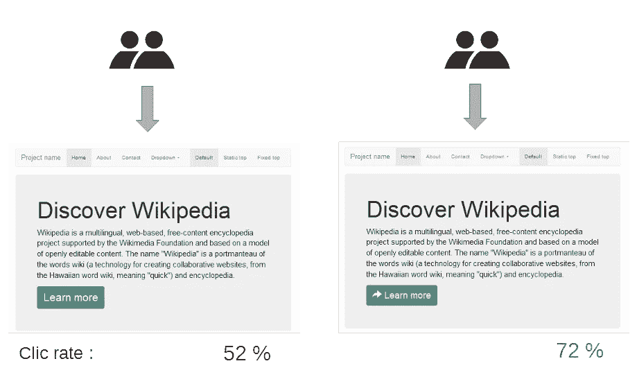
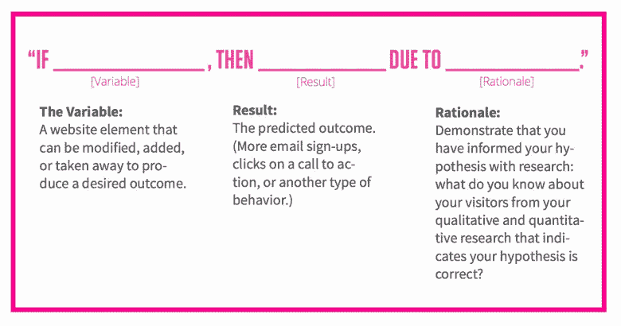
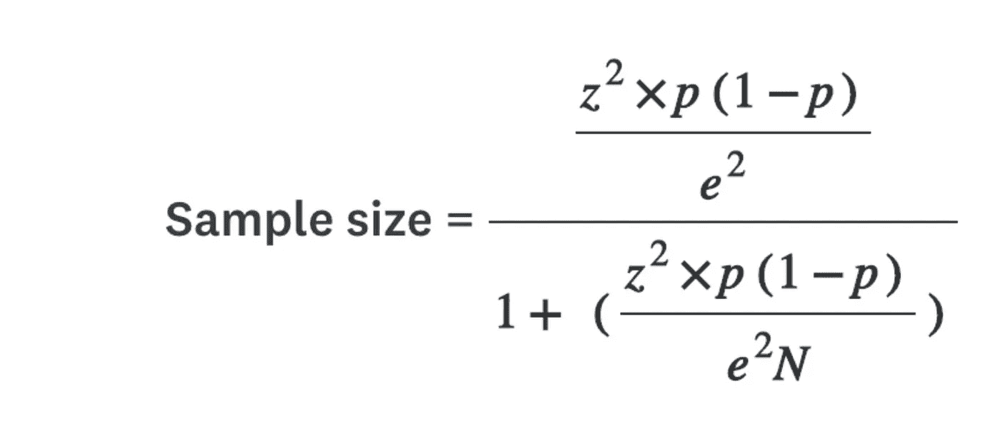
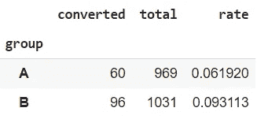
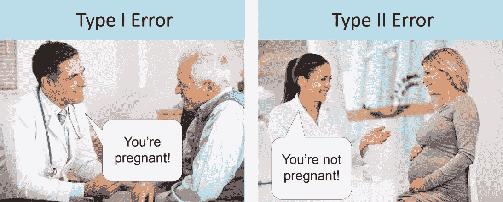
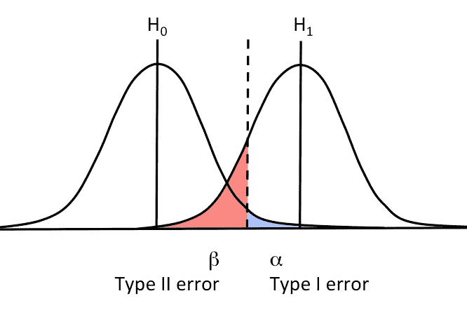
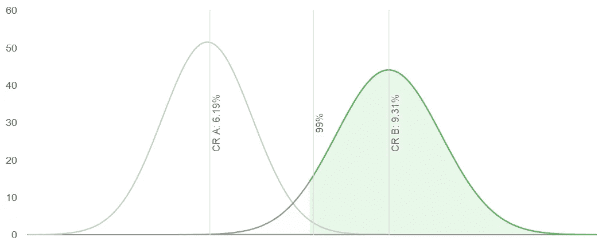
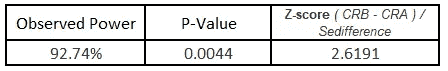

# A/B 测试基础知识

> 原文：<https://medium.com/nerd-for-tech/abc-of-a-b-testing-abde706d2efb?source=collection_archive---------7----------------------->

平台上的“订单”按钮应该是绿色还是蓝色？给定时事通讯的最佳标题是什么？哪个版本的广告点击率最高？仅仅通过做和观察会发生什么来判断变化的影响通常是令人惊讶的困难。A/B 测试等实验为使用*因果* *推理*进行决策提供了一种干净简单的方法。

以点击率为关键指标的 A/B 测试(来源:[维基百科](https://commons.wikimedia.org/wiki/File:A-B_testing_simple_example.png))

**A/B 测试**(也称为**分割测试**)是一个向不同的内容访问者同时展示同一营销资产的两个变体的过程，例如网页或电子邮件。根据[转换率](https://www.crazyegg.com/blog/increase-your-conversion-rate/)或其他指标，您可以决定哪种变体表现最佳。

许多科技公司，如亚马逊、Booking.com、脸书、微软和谷歌，每年对数百万客户进行超过 10，000 次 A/B 测试。2007 年，通过在线控制实验，亚马逊得出了网站性能和收入之间的直接关系，在降低网站延迟 100 毫秒后，增加了 1%的收入。

# 入门指南

## **检验假设**

来源:[*构建你公司的数据 DNA*](http://pages.optimizely.com/eBook-Data-DNA.html)

假设一家游戏公司发现，用用户在简讯中的相对排名(游戏化)替换用户在平台上的脸书朋友的实际分数，将为休眠客户带来更好的参与度，从而导致他们的重新激活。在这种情况下，**默认动作**是带分数的简讯。**变量**是带有等级的通迅。

下一步是用**量化**到**更好的**到**客户参与度**到**来衡量实验的成功。指标可以是再次开始玩游戏的客户数量。这个矩阵的缺点是一些用户在漏斗的后期卡住或退出，而简讯对此没有影响。更适合本实验的矩阵是*点击率(CTR)或点击率*。这衡量的是收到简讯并回到平台的客户占总客户的百分比。**

一旦默认动作、可变动作和矩阵被定义，实验最关键的一步就是设置[零假设和](http://the%20null%20hypothesis%20and%20the%20alternate%20hypothesis/)备择假设。假设默认动作的转换概率为`Pa`，变量的转换概率为`Pb`。那么我们两个假设是:

*无效假设(现状)，H0:* **在重新激活*简讯*中添加好友等级将导致转化概率(CTR)** 不变，即`Pa-Pb` = 0

*替代假设()，H1:* **在重新激活*简讯中添加好友等级会导致*转化概率(CTR)的变化**即`Pa-Pb` ≠ 0

# 设置实验

市面上有很多 A/B 测试工具，如 [Google、](https://marketingplatform.google.com/about/optimize/)optimize、 [Hubspot](https://www.hubspot.com/products/marketing?hubs_post=blog.hubspot.com/&hubs_post-cta=hsg-nav__box-link&_conv_v=vi%3A1*sc%3A1*cs%3A1614535885*fs%3A1614535885*pv%3A3*seg%3A%7B10031564.1%7D*exp%3A%7B%7D&_conv_s=si%3A1*sh%3A1614535884896-0.3413533361405219*pv%3A3) 、[optimize](https://www.optimizely.com/)、 [Zoho](https://www.zoho.com/pagesense/) 等。一些像 Google 这样的公司可以免费使用，但是缺乏高级功能和集成。此外，一些公司构建了根据自身需求定制的内部工具，例如:

*   Airbnb: [实验报告框架](/airbnb-engineering/https-medium-com-jonathan-parks-scaling-erf-23fd17c91166)
*   亚马逊:[网络实验室](https://developer.amazon.com/blogs/appstore/post/Tx3J8G0UZN8S13F/a-b-testing-now-supports-segmentation)
*   微软: [ExP](https://www.microsoft.com/en-us/research/group/experimentation-platform-exp/#!videos)
*   网飞:[闪亮](https://netflixtechblog.com/reimagining-experimentation-analysis-at-netflix-71356393af21)
*   Spotify: [ABBA](https://engineering.atspotify.com/2020/10/29/spotifys-new-experimentation-platform-part-1/) (聪明的名字)
*   火绒:[凤凰](/tinder-engineering/phoenix-tinders-testing-platform-part-iii-520728b9537)
*   优步:[莫菲斯](https://eng.uber.com/xp/)

**拆分组**

*基于群组的*:根据人口统计、地理、客户类型随机划分客户群。如果这两个群体不包括相似的客户，它可以由于不相关用户的比较而稀释效果大小。

*时间范围*:避免批量发送电子邮件，即以固定的时间间隔在一天中发送。但是，如果有必要，请确保用户组在这两个组的时间段内按比例划分。这将确保结果不会因基于时间的因素而失真。

**持续时间/样本量**

运行实验足够长的时间，以获得足够大的样本量，从而获得两个变量之间的统计显著差异。根据公司、受众类型和流量的不同，达到期望的统计显著性所需的样本可能需要几个小时到几周的时间。如果你不想手动计算给定显著性的样本大小，有很多免费的在线服务可以为你计算大小，例如 [Adobe](https://docs.adobe.com/content/target-microsite/testcalculator.html) 、 [Optimizely](https://www.optimizely.com/sample-size-calculator/) 和 [Surveymonkey](https://www.surveymonkey.com/mp/sample-size-calculator/) 。有限总体(N)的样本量公式为:误差范围(e)、z 得分(z)和标准差(e)

注意，**少量降低显著性可以显著减少样本量。** [23%的邮件打开发生在投递后的第一个小时](https://www.superoffice.com/blog/email-open-rates/)，24 小时后，邮件被打开的几率下降到 1%以下。

# **测量结果**

给定的实验是针对 2000 个客户运行的，这些客户几乎被平均分为 969 个客户的默认客户(A)和 1031 个客户的变体客户(B)。一旦测试停止，结果总结如下。这里，`converted`是点击链接的唯一客户总数，`rate`是`total`与`converted.`的比率

A 组收到的是默认的时事通讯，B 组收到的是不同的

可以看出，变体 B 的转化率(9.31%)远高于变体 A 的转化率(6.19%)或高出 3.32%。粗略看来，**这是两个假设之间非常好的变化，但是我们能确定如果我们选择一些随机样本，它仍然成立吗？**如果我们拒绝了零假设，接受了改变，但实际上并没有给转换带来任何积极的改变(I 型错误)怎么办？相反，如果我们不接受改变，即使它提高了转化率(第二类错误)。为了确定这些结果不仅仅是偶然的，而且对更多的人群有效，我们将看看分布情况。

第一类和第二类错误(来源:[https://www . statistics solutions . com/to-err-is-human-what-is-type-I-and-II-errors/](https://www.statisticssolutions.com/to-err-is-human-what-are-type-i-and-ii-errors/))

## 分配

从[二项分布](https://www.investopedia.com/terms/b/binomialdistribution.asp)可以看出，B 组(排名)的随机样本比 A 组(得分)的大部分样本有更高的转化概率。

变异 A 和 B 的预期分布(转换与概率)

99%置信水平下[零假设的汇总统计数据](http://www.mit.edu/~6.s085/notes/lecture2.pdf)

从分布中，我们看到 **p** - **值**为0.0044，这意味着有 0.44%的机会犯下**I 型错误，**可忽略不计(最大可接受 p 值为 0.05)。绿色阴影区域代表**观察功率(** [**统计功率**](https://en.wikipedia.org/wiki/Power_(statistics)) **)** 。上图中的灰色虚线代表零假设的置信区间(上图为 99%)。通过找出替代假设分布下和无效假设的置信区间之外的面积来计算观察到的功效。观察到的功率 **92.7 远高于期望的 80%，因此存在统计上不显著的 II 型误差。**

> 由于第一类错误和第二类错误在统计上是不重要的，并且在整体转换中有显著的提升，我们**拒绝零假设，并有 99%的信心变量比默认变量表现更好，并实施基于排名的简讯。**

# 避免常见错误

*   在 A/B 测试中，**只关注每个测试的一个变化**，以便更好地确定结果的属性。就电子邮件而言，变化包括文本(开头、结尾)、主题和布局等。要测试多个变化，使用更复杂的测试，如[多元测试](https://www.optimizely.com/optimization-glossary/multivariate-test-vs-ab-test/)或 [Bandit 算法](https://github.com/raffg/multi_armed_bandit)
*   **如果没有统计学意义就不要放弃新版本**，尽量多迭代几次作为这个迭代过程。此外，在集群/群组水平上寻找显著性，即特定集群的转化率是否提高( [Yule-Simpson 效应](https://www.conversion-uplift.co.uk/glossary-of-conversion-marketing/simpsons-paradox/#:~:text=Simpson's%20Paradox%20(also%20called%20the,the%20trend%20disappears%20or%20reverses.))。如果是这样，您可以使用新版本来锁定集群的受众，而不是使用一揽子模板来优化活动
*   即使备选假设成立，公司也应**在转换中设定最小影响大小或提升**，以证明给定变更的业务可行性。

来源:

1.  [https://towards data science . com/a-collection-of-a-b-testing-learning-resources-新手到高手-6bab1e0d7845](https://towardsdatascience.com/a-collection-of-a-b-testing-learning-resources-newbie-to-master-6bab1e0d7845)
2.  [https://www . LinkedIn . com/posts/denisevisser _ BOL com-de-winkel-van-ons-allemaal-activity-6742395058261131264-gLWb/](https://www.linkedin.com/posts/denisevisser_bolcom-de-winkel-van-ons-allemaal-activity-6742395058261131264-gLWb/)
3.  [https://towards data science . com/the-math-behind-a-b-testing-with-example-code-part-1-of-2-7be 752 E1 d 06 f](https://towardsdatascience.com/the-math-behind-a-b-testing-with-example-code-part-1-of-2-7be752e1d06f)

 [## A/B 测试是如何工作的？

### 深入了解科技行业最强大的工具之一

towardsdatascience.com](https://towardsdatascience.com/how-do-a-b-tests-work-996842ce6fc0)