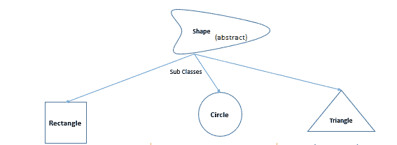
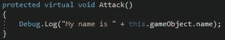
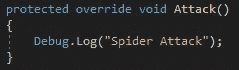
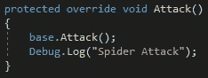
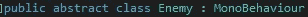
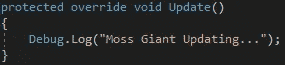

# Unity 中的抽象类

> 原文：<https://medium.com/nerd-for-tech/abstract-classes-in-unity-ba33863259be?source=collection_archive---------14----------------------->

在我的上一篇文章中，我讨论了如何使用类继承。在这篇文章中，我将讨论抽象类。

**虚拟方法**

首先让我们谈谈虚方法。虚拟方法将允许您创建一个可由多个类继承的方法，并拥有该方法自己的实现。

这是通过在方法中添加关键字 virtual 来实现的。

当使用关键字 override 继承类时，您将能够向虚方法添加不同的功能。

通过使用 base 关键字，您可以使用旧的实现。

**抽象类**

抽象类允许你强制类继承属性。要使一个类成为抽象类，请在类声明中添加关键字 abstract。

用关键字 abstract 创建一个方法，该方法将被强制到任何继承它的类上。

现在你将被迫继承这个方法。

**总结**

虚方法是一种允许类为继承的方法实现自己的功能的方式。抽象类用于强制继承使用抽象类的类。