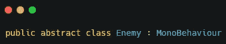
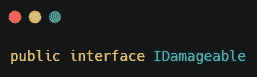
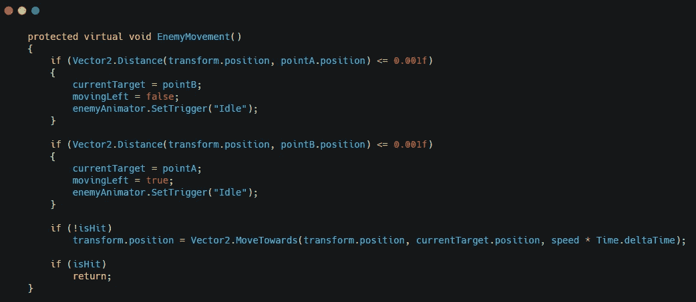
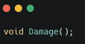
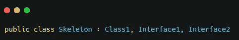
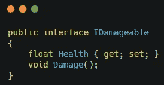
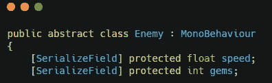
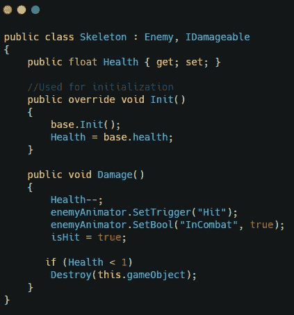

# 抽象类与接口

> 原文：<https://medium.com/nerd-for-tech/abstract-classes-vs-interfaces-2e1714f5237e?source=collection_archive---------1----------------------->

**抽象类**

抽象类是已经声明为抽象的类，并且可以选择包含抽象方法。它们不能实例化，但可以用作子类。

**接口**

接口类似于类，除了接口代表对象和用户之间的契约。它们不能被实例化，也不能用于定义数据。接口是用于定义方法和属性的类。

**抽象类和接口的区别**

一个区别是允许抽象类定义数据。

不允许接口定义数据。

另一个区别是，类只能继承一个抽象类，但可以继承多个接口。

最大的区别之一是，如果一个类使用一个接口，它必须实现接口中声明的所有方法和属性。如果一个类使用一个抽象类，它可以决定使用哪些方法和属性，只要它们没有被声明为抽象的。

注意:骷髅必须同时使用生命值和伤害值()，但不需要使用速度或宝石

**总结**

当你定义一个对象是什么的时候，一个抽象类被使用。例如，说苹果是一种水果。当你定义一个类能做什么的时候，接口被使用。例如，一个首领能够烹饪。

