# 私下访问您的 AWS 资源

> 原文：<https://medium.com/nerd-for-tech/access-your-aws-resources-privately-2b0dd8ffc3a2?source=collection_archive---------0----------------------->

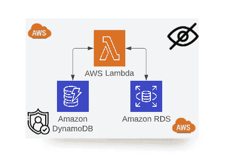

私下访问您的 AWS 资源

在这篇博客中，我们将配置我们的 AWS 资源，通过三种不同的用例进行私有访问。我们一起开始吧！

**案例 1:配置您的 Lambda 函数以访问 AWS RDS:**

如您所知，您的数据库应该始终位于私有子网中，并且不能公开访问。您需要从 AWS Lambda 函数连接数据库。你怎么能这样做？

**解决方案:在 VPC 使用你的 AWS Lambda**

你可以用 VPC 配置一个 Lambda 函数来创建一个私有网络，比如连接我们的数据库或内部服务。

*首先，你需要证实我们的 RDS 不是公开的。*

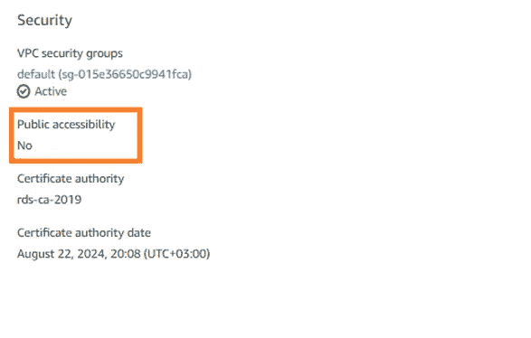

AWS RDS 安全配置

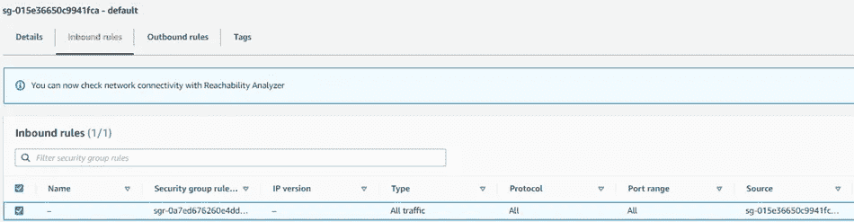

RDS 的默认安全组

**1-** 从 AWS Lambda 控制台，您需要选择 VPC→编辑。

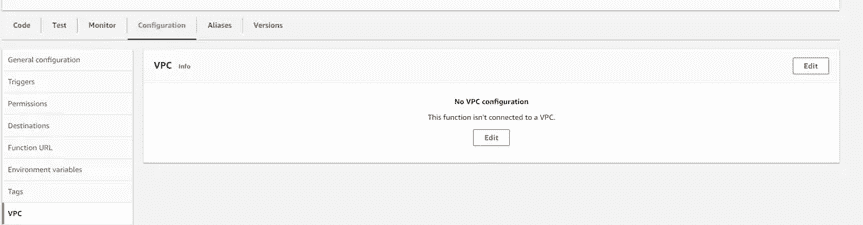

自动气象站λVPC 配置

**2-** 您可以从这里选择 VPC 和子网。为了实现高可用性，请至少选择 2 个子网。

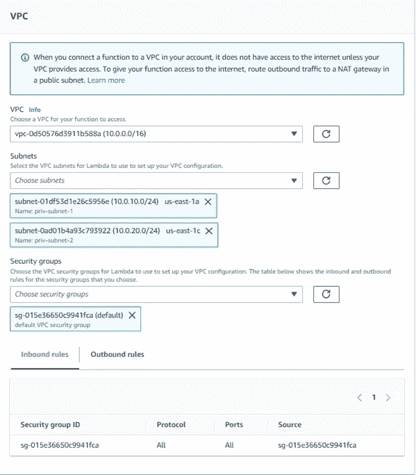

自动气象站λVPC 配置

**3-** 大概，你会得到这样一个错误。您需要向 AWS Lambda 执行角色添加一个策略。

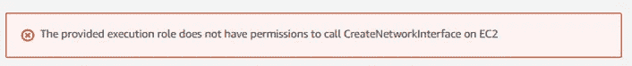

自动气象站λVPC 误差

**4-** AWS 有一个名为“AWSLambdaVPCAccessExecutionRole”的托管策略。您可以使用它来防止错误。

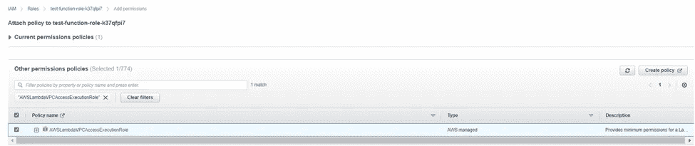

AWSLambdaVPCAccessExecutionRole

之后，您可以使用您指定的 AWS VPC 设置成功地配置您的 Lambda。

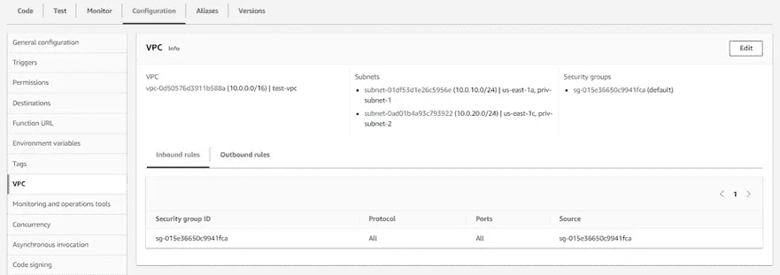

自动气象站λVPC 配置

您可以从 AWS Lambda 函数测试连通性。这是一个示例测试代码，请不要在您的代码中使用硬编码的凭证，您可以使用 [AWS Secrets Manager](https://docs.aws.amazon.com/secretsmanager/latest/userguide/intro.html) 来完成。

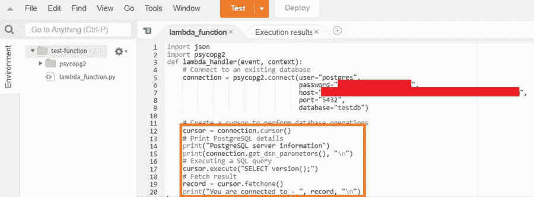

AWS Lambda 连接测试代码

**案例 2:为您的 AWS Lambda 函数 URL 使用 IP 白名单:**

您只想从 EC2 访问 AWS Lambda 函数 URL。你怎么能这样做？

**解决方案:从头部检查源 IP，并将其用于 IP 白名单**

使用 AWS Lambda 函数 URL，您只能通过公共互联网访问。对于 IP 白名单，我发现了一个非常有用的[资源](https://www.youtube.com/watch?v=a3jvN9MS3Sw)，它可以将使用 Lambda 函数 URL 的资源 IP 列入白名单。在这个解决方案中，您需要检查调用 Lambda 的源 IP。如果 IP 属于你的 IP 范围，Lambda 返回 200，否则返回 500 条“未授权”消息。你可以在这里查看来自[的所有源代码。](https://github.com/srcecde/aws-tutorial-code/blob/master/lambda/lambda_ip_val_func_url.py)

AWS Lambda 功能 IP 白名单

**案例 3:私下访问你的 DynamoDB】**

您需要从私有子网中的 Lambda 函数访问 DynamoDB 表。你的 AWS Lambda 函数应该是内部的，不能从互联网上公开访问。你怎么能这样做？

**解决方案:为 DynamoDB 配置 VPC 端点**

**1-** 从 VPC→端点，需要选择 DynamoDB 作为服务。

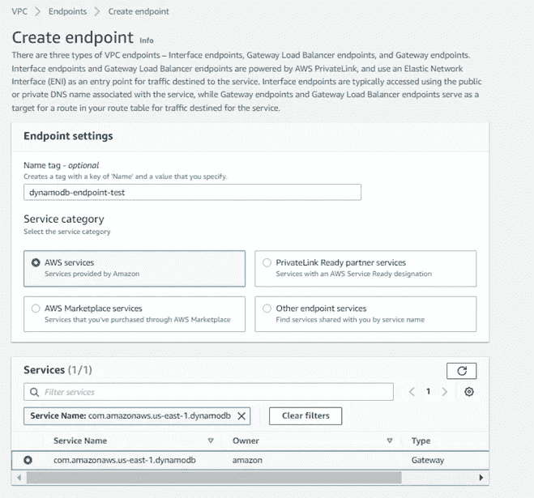

用于 DynamoDB 的 AWS VPC 端点

**2-** 您需要选择资源附加到的 VPC。您还可以配置控制您的访问的策略。现在，我们可以设置完全访问权限(请不要在生产环境中这样做)。

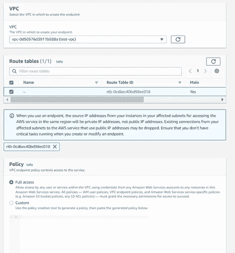

AWS VPC 端点配置

之后，你不需要从代码方面做任何事情。您可以使用 [Boto3 SDK](https://boto3.amazonaws.com/v1/documentation/api/latest/guide/dynamodb.html) 从 AWS Lambda 访问 DynamoDB 资源。

感谢阅读！☁️