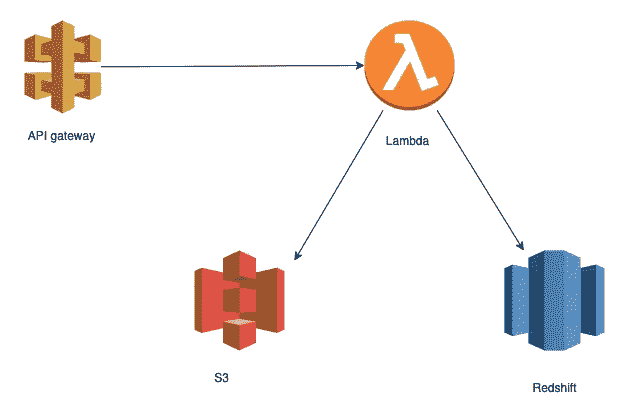
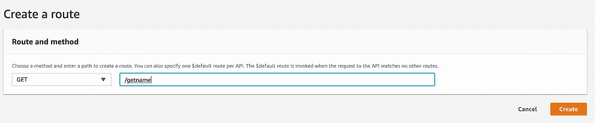
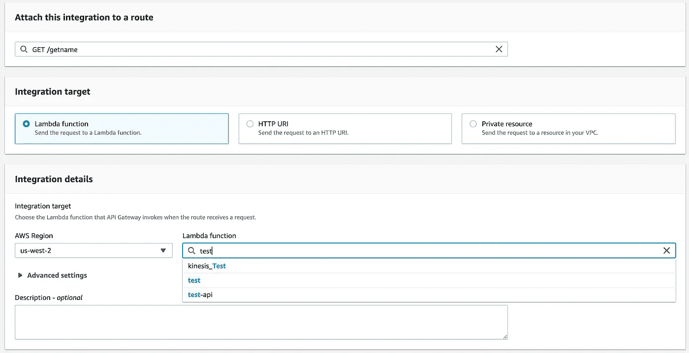
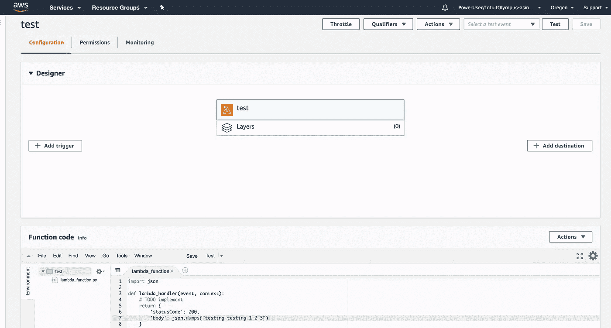
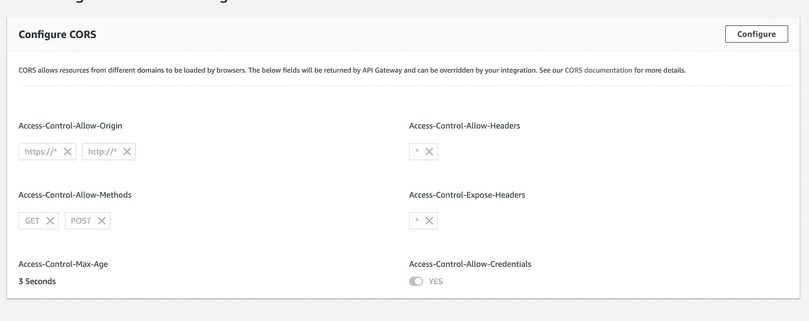
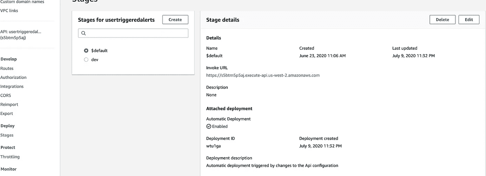
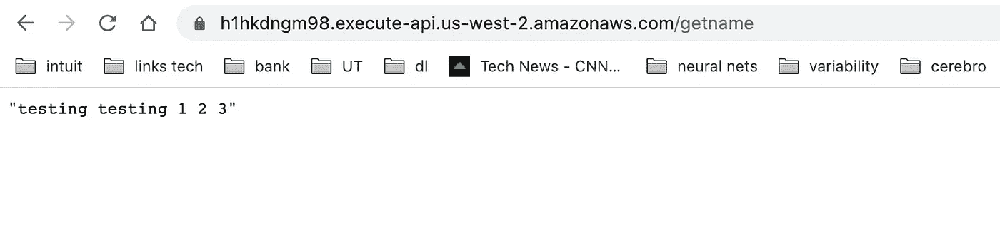
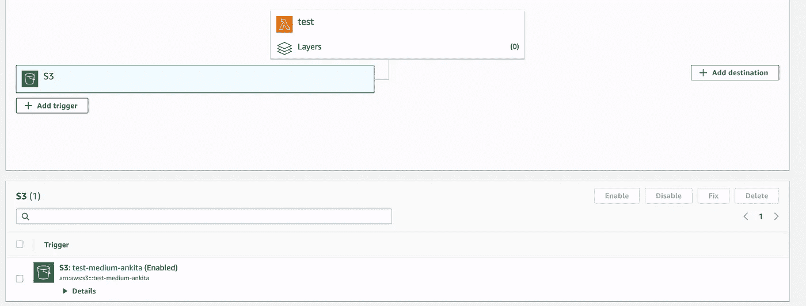
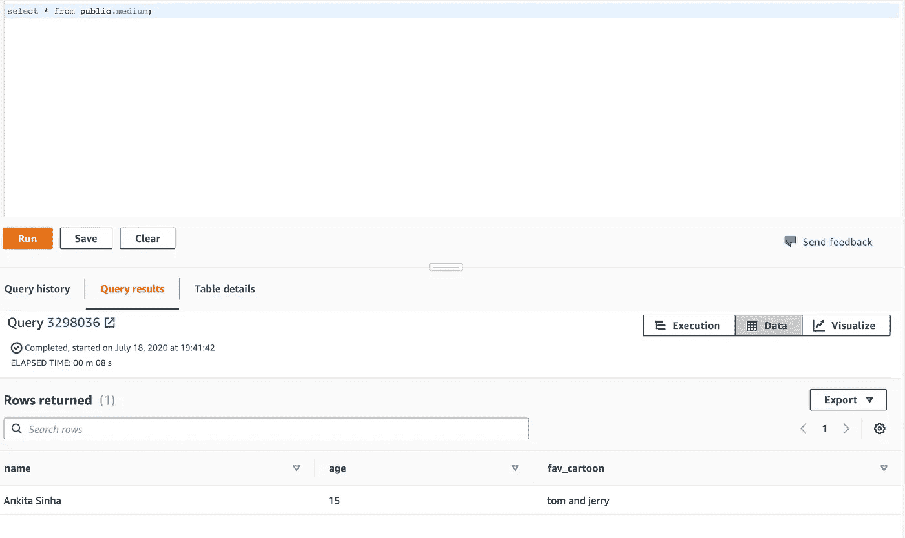

# 通过 API 网关访问 S3 和红移(使用 AWS Lambda)

> 原文：<https://medium.com/nerd-for-tech/accessing-s3-and-redshift-via-api-gateway-using-aws-lambda-aad4d1915587?source=collection_archive---------0----------------------->

今天我要讲的是如何从你的网站获取数据，并使用 AWS 无服务器架构将其存储在 redshift 中。这可能是开始处理数据和快速构建后端的最简单、最快的方法。



让我们从构建一个简单的 GET restpoint 开始。

1.  打开 AWS 控制台并转到 API 网关。
2.  选择 HTTP API，然后选择 BUILD。HTTP api 支持 lambda，并提供现成的 CORS 支持。
3.  现在给你的 api 命名，我们就可以开始了。对于本教程，我将命名为“测试”。
4.  它将为您提供一个自动部署路径的选项，自动部署您的所有更改。您可以给它起自己的名字，或者保留$default。
5.  现在只需单击 create，就会为您创建一个 api。

现在让我们创建 lambda 函数，我们将把它与我们的 api 网关集成在一起。

1.  从头开始创建函数。
2.  我选择了 python 作为语言，但是你可以选择任何你喜欢的语言。
3.  创建一个 IAM 角色，并授予对 API Gateway、S3、Redshift 和 Cloudwatch 的读写权限。
4.  Lambda 会自动为你创建一个日志组，并将所有日志上传到 cloudwatch。

现在让我们在 api 中创建一条路线。

1.  单击左侧窗格中的路线。
2.  单击创建并选择“获取”api。



现在我们有了一个端点，让我们将它与我们的后端(lambda)集成起来。

3.现在转到您的路线并点击“获取”。

4.点击“附加集成”，选择 lambda 函数，并将您的 Lambda 函数的 arn 复制到此处。



5.单击—授予 API 网关调用 lambda 的权限。

AAANNNDDD！！！..你可以走了。

6.默认情况下，lambda 返回“你好！" .现在让我们把代码改为“测试测试 1 2 3”并保存它。



你的 lambda 函数应该是这样的。

您的 api 应该自动部署到默认阶段。

7.现在让我们配置 CORS，这样我们就可以从任何 web 浏览器访问我们的 API。



完成后，您的 CORS 配置应该如下所示。我们现在将允许所有的头命中我们的 API。

现在我们已经配置好了一切，让我们试着点击 API。

您将在左侧面板中找到您的阶段的 url。



让我们转到这个网址，你会看到你的“测试”消息🥳🥳🥳🥳.



现在我们已经建立了 lambda 和 apigateway 之间的连接，让我们开始将数据保存在 S3 和红移中。

创建一个“POST”路由，类似于我们创建“GET”的方式，并将其与相同的 lambda 集成。

让我们也创建一个 S3 桶和红移表来存储我们的数据。

S3·巴特—

1.  只要给你的桶起一个独特的名字，你就可以开始了。你不需要更多的配置。我把我的桶命名为“测试-中等-安基塔”。
2.  现在，在您的 lambda 中，添加这个 S3 桶作为触发器，这样每当有任何数据添加到桶中时，它都会流向红移。



红移表

1.  让我们的模式。—字符串名称、字符串年龄、字符串收藏 _ 卡通
2.  现在从 AWS 控制台打开 Redshift，让我们创建我们的表。(我假设你已经有红移设置。如果没有，你可以按照这个[教程](https://docs.aws.amazon.com/redshift/latest/gsg/getting-started.html)。
3.  运行以下命令创建一个表。

```
Create table public.medium (
name VARCHAR(max),
age VARCHAR(max),
fav_cartoon VARCHAR(max)
)
```

4.当你这么做的时候—

```
select * from public.medium; 
```

你应该看看你的桌子。对于我的教程，每当数据被插入到 S3 桶——“test-medium-ankita”时，它应该会自动填充您的红移表。

一旦我们准备好所有的配置，让我们开始创建我们的 lambda 函数。

您将需要以下软件包:

1.  心理战 2
2.  boto3

您将需要在本地机器上配置 AWS(为此创建一个拥有前面提到的所有必需权限的用户)。

1.  现在创建一个虚拟 env。(我们将需要这个把我们的代码作为 zip 文件上传到 lambda。也可以跟着这个[教程](/@manivannan_data/import-custom-python-packages-on-aws-lambda-function-5fbac36b40f8)。

代码:

```
import json
import psycopg2
import boto3def redshiftputdata(loc):
    con = psycopg2.connect(dbname='***',
                       host='***',
                       port='***', user='***', password='***')
    cur = conn.cursor()
    # Begin your transaction
    cur.execute("begin;")
    cur.execute(
        "COPY public.executed_user_rules FROM" + loc + "CREDENTIALS 'aws_iam_role=arn:aws:iam::***' json 'auto';")
    # Commit your transaction
    cur.execute("commit;")
    print("executed user rules copy executed fine!")def put_data_into_s3(data, bucket):
    putbucket = bucket
    key = "medium"
    client = boto3.client('s3')
    client.put_object(Body=data, Bucket=putbucket, Key=key)
    return datadef lambda_handler(event, context):
    print(event)
    # For api gateway post.
    response = "default"
    if ("rawPath" in event and event.get("rawPath") == "/postnames"):
        body = event.get("body")
        dict = json.loads(body)
        dict = json.dumps(dict)
        print(dict)
        response = put_data_into_s3(dict, "test-medium-ankita")

    # handle data coming from s3.
    if("Records" in event):
        records = event["Records"]
        for record in records:
            s3_name = record["s3"]["bucket"]["name"]
            key = record["s3"]["object"]["key"]
            output = ""
            if (s3_name == "test-medium-ankita" and key.find(".json") != -1):
                loc = "'s3://test-medium-ankita/%s'" % (key)
                output = redshiftputdata(loc)
                print("output: ", output)
    # TODO implement
    return {
        'statusCode': 200,
        'body': json.dumps(response)
    }
```

函数“redshiftputdata”用于将从 S3 收到的 json 文件复制到我们的红移表中。函数“put_data_into_s3”用于将您的数据以 json 格式放入 s3。

现在让我们进行 post 调用，我们应该可以直接看到填充在红移表中的数据:

号召正文:

```
{"name":"Ankita Sinha","age": "15","fav_cartoon": "tom and jerry"}
```

现在让我们看看表格中的数据—



另外，你可以从这里获得 lambda 可执行文件 psycopg 2—【https://github.com/jkehler/awslambda-psycopg2】T4。你只需要把这个文件放到你的代码中，然后压缩它。