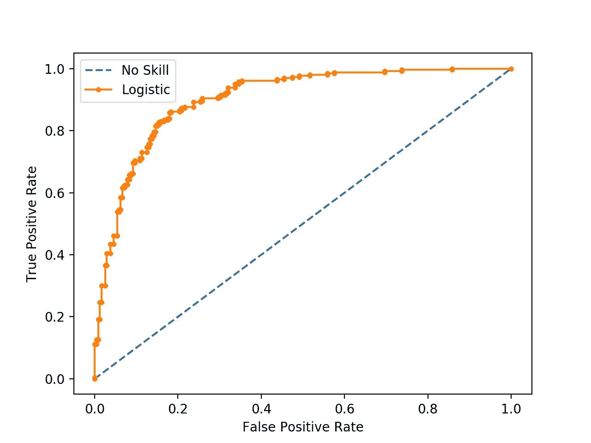

# 准确性与 AUC-ROC

> 原文：<https://medium.com/nerd-for-tech/accuracy-vs-auc-roc-a8e7a384d153?source=collection_archive---------3----------------------->

美国宇航局在 [Unsplash](https://unsplash.com?utm_source=medium&utm_medium=referral) 拍摄的照片

在这篇文章中，我将谈论准确性和 ROC 曲线下的面积。这两个指标都有助于使用已知目标变量的历史数据来验证分类模型。

# **精度:**

准确性是计算和理解的最简单的验证度量，它是正确分类的比例。在标签均匀分布的情况下(约 50%为正，约 50%为负)，准确性可能有助于验证模型，但在极度不平衡的类别中，如 98%为负，2%为正，则可能会导致我们得出错误的结论。

## 二元分类模型的混淆矩阵；

来源: [Joydwip 的博客](https://towardsdatascience.com/confusion-matrix-for-your-multi-class-machine-learning-model-ff9aa3bf7826)

**精度:** (TP + TN)/(TP+TN+FP+FN)

## 准确性不总是有用的两个主要原因是:

1.  *是阈值变量，高度取决于所选的阈值*
2.  *它是标度变量，用标量乘以概率会影响准确度分数*

# **ROC 下的区域:**

ROC 曲线下面积是验证分类模型的非常有用的度量，因为它是阈值和尺度不变的。ROC 绘制了不同阈值下 FPR 对 TPR 的曲线。

**TPR(真阳性率):** TP/(TP+FN)
**FPR(假阳性率):** FP/(FP+TN)

来源:[机器学习掌握度](https://machinelearningmastery.com/roc-curves-and-precision-recall-curves-for-classification-in-python/)

ROC 在 X 轴上绘制了 FPR，在 Y 轴上绘制了 TPR，并且图中的每个点对应于一个阈值。

*   阈值为 0 时，模型预测所有数据点的类别为负，因此 FPR 和 TPR 都为零
*   在阈值 1，模型预测所有数据点的正类，因此 FPR 和 TPR 都是一

上图中的橙色曲线是 ROC 曲线，该曲线下的面积可用于验证分类模型。

*   AUC-ROC 对于阈值是不变的，因为我们没有选择阈值来计算该指标
*   AUC-ROC 不随比例变化，因为概率分数乘以标量值不会影响这一指标(您可以自己检查)

## 参考资料:

1.  [https://towards data science . com/confusion-matrix-for-your-multi-class-machine-learning-model-ff 9 aa 3 BF 7826](https://towardsdatascience.com/confusion-matrix-for-your-multi-class-machine-learning-model-ff9aa3bf7826)
2.  [https://machine learning mastery . com/roc-curves-and-precision-recall-curves-for-class ification-in-python/](https://machinelearningmastery.com/roc-curves-and-precision-recall-curves-for-classification-in-python/)
3.  [https://towards data science . com/an-understand-guide-to-roc-curves-and-AUC-and-why-and-when-to-use-them-92020 BC 4c 5c 1](https://towardsdatascience.com/an-understandable-guide-to-roc-curves-and-auc-and-why-and-when-to-use-them-92020bc4c5c1)