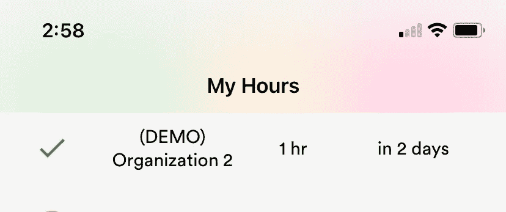
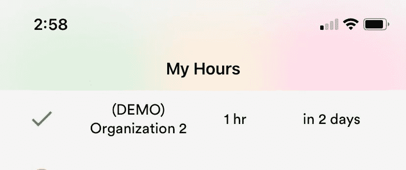

# 使用 React Native 实现 iOS“玻璃”模糊

> 原文：<https://medium.com/nerd-for-tech/achieve-the-ios-glass-blur-with-react-native-82931e2cd2?source=collection_archive---------2----------------------->



也许每个移动应用程序中最常见的组件就是标题。它告诉你的用户他们在你的应用程序中的位置，它在屏幕的最上方。因此，在你的 React 原生应用中拥有一个精致的、有本土感觉的标题是至关重要的。我为 [Voluntime](https://voluntime.org) 的移动应用程序使用 React 导航库，我想实现苹果公司闻名的 iOS“毛玻璃”模糊效果。

苹果的大多数 iOS 应用程序都使用模糊的标题，包括设置、应用商店、笔记和提醒。它给用户一个隐藏在标题后面的提示，它让应用程序感觉是经过精心设计的。

由于我使用的是 react 导航，所以我开始在谷歌上搜索“React 导航模糊标题”。结果建议编写自己的自定义标题或安装额外的库来实现模糊效果。这不是我想为这么小的变化做的事情，所以我深入研究了 React Navigation 的文档。

最后，在查看了包的 TypeScript 定义文件之后，我发现了一个看起来很有前途的属性。

```
blurEffect: Blur effect to be applied to the header (iOS only).
```

这可以添加到导航器的“headerStyle”属性中，并可以设置为下列值之一:

```
’extraLight’ | ‘light’ | ‘dark’ | ‘regular’ | ‘prominent’ | ‘systemUltraThinMaterial’ | ‘systemThinMaterial’ | ‘systemMaterial’ | ‘systemThickMaterial’ | ‘systemChromeMaterial’ | ‘systemUltraThinMaterialLight’ | ‘systemThinMaterialLight’ | ‘systemMaterialLight’ | ‘systemThickMaterialLight’ | ‘systemChromeMaterialLight’ | ‘systemUltraThinMaterialDark’ | ‘systemThinMaterialDark’ | ‘systemMaterialDark’ | ‘systemThickMaterialDark’ | ‘systemChromeMaterialDark’
```

我建议尝试所有的方法，直到你找到最适合你的应用的方法。

然而，blurEffect 属性似乎对我的应用程序没有影响。无论我将值更改为什么，或者是否包含了该属性，我的标题看起来都一样:不模糊。因此，我回顾了 React 导航类型脚本定义文件，并找到了关于 blurEffect 的以下注释:

```
Works with backgroundColor’s alpha < 1.
```

答对了。这里的“alpha”是指颜色的透明度。如果 backgroundColor 的 alpha 为 1，则页眉是不透明的，这意味着根本不透明。我将 backgroundColor 设置为' #F5F5F5 '，这是我的应用程序的背景色。它的 alpha 值也是 1。

因此，我在我的 headerStyles 中设置了“backgroundColor: 'transparent ' ”,模糊效果很好！这是我最后的筹码。导航器和堆栈。带有工作模糊标题的屏幕:

这是标题的样子:



标题后面有三个按钮，分别是绿色、黄色和红色。