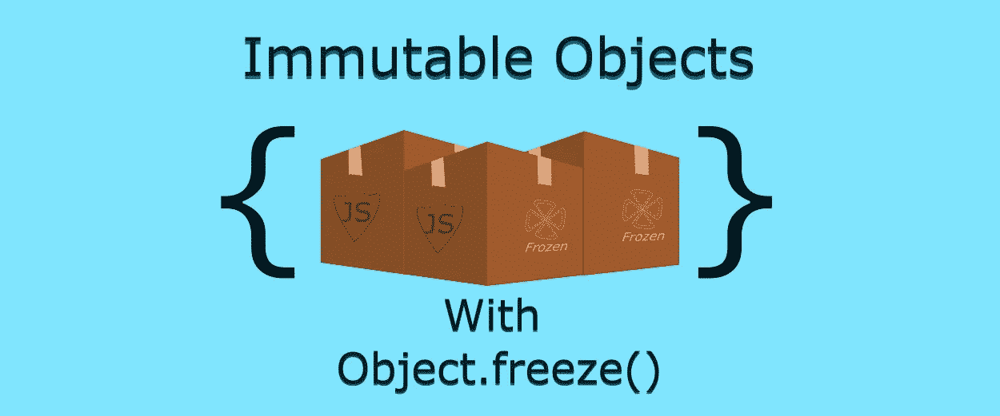

# 用 Freeze 实现 JavaScript 中对象的不变性

> 原文：<https://medium.com/nerd-for-tech/achieving-object-immutability-in-javascript-with-freeze-d2c23d18a21?source=collection_archive---------0----------------------->

JS 中的不可变对象

在本文中，让我们看看如何使用 ***对象原型*** 上可用的 ***冻结*** 方法使 JavaScript 中的对象不可变。

我们将首先探讨什么是不变性以及它为什么重要。然后，我们将查看一个代码片段，其中我们使用 freeze 方法将一个普通对象转换为一个不可变对象。