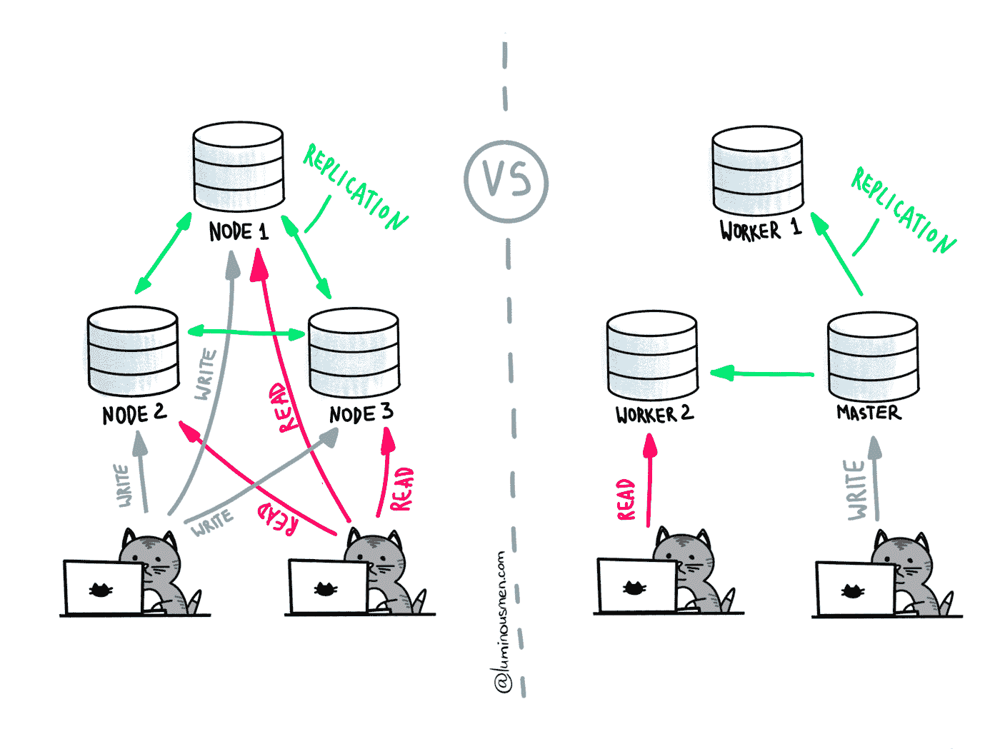

# 酸与碱:两种设计哲学的比较

> 原文：<https://medium.com/nerd-for-tech/acid-vs-base-comparison-of-two-design-philosophies-c5910c48aa17?source=collection_archive---------0----------------------->

让我们来谈谈数据空间中的几个基本概念，以及它们之间的关系和起源。这是一个宽松的解释和我对情况的理解，所以如果你想要严格的条款，这里不是学习它们的地方。

因此，酸和碱代表了两种设计理念，在一致性-可及性范围的两端。怎么了？