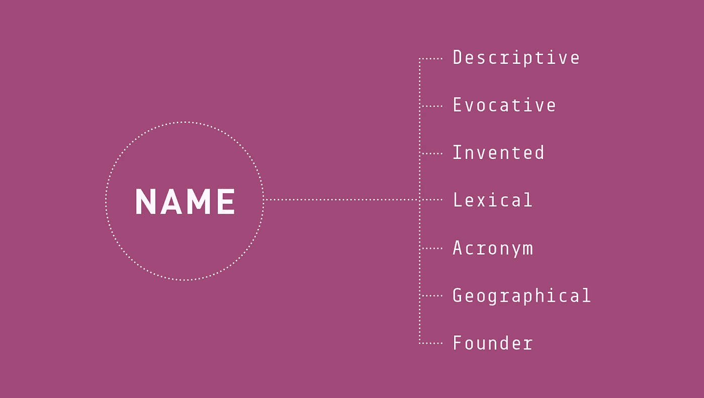
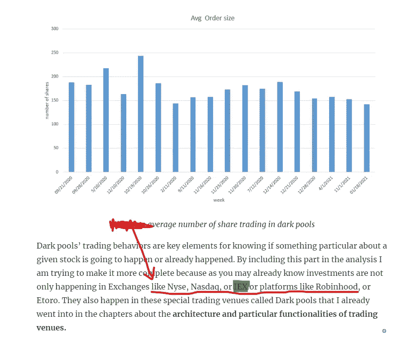
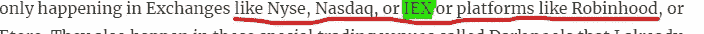

# 首字母缩写品牌优势

> 原文：<https://medium.com/nerd-for-tech/acronym-brand-names-advantage-ec2694997e61?source=collection_archive---------17----------------------->

图片取自[https://www.ignytebrands.com/](https://www.ignytebrands.com/)

你可能已经知道有 7 种品牌名称，但让我们自己提醒一下。他们是

1.  描述的
2.  唤起的
3.  发明
4.  词汇的
5.  关于首字母缩略字的
6.  地理学的
7.  创始人

你可以在这里找到关于品牌名称[的详细解释](https://www.ignytebrands.com/7-popular-types-of-brand-names/)。我觉得突出下面这张照片很有趣

包含词汇品牌名称的句子示例

我要告诉你，在书籍和文本内容中，完整的品牌名称比其他类型的品牌名称有一个优势，因为我们几乎都是大写的。如果我们要上市公司，这些名字是曝光率最高的，因为它们都是大写的。我们的眼睛最先得到它们，更有可能是我们的大脑和记忆。这只是分享给你的一个关键见解，让你去认识或学习。当你读到这里的时候，如果你将读到一个包含公司列表的句子，你也更有可能在未来提醒自己。就像下面这张

包含词汇品牌名称的句子

这只是正常的认知行为，你不是被操纵只是被提醒。