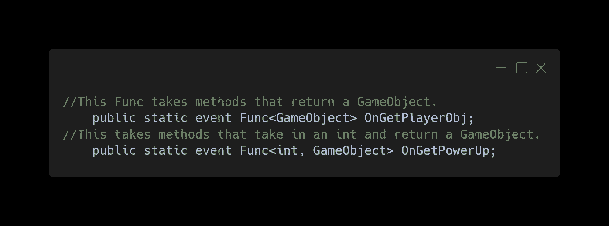
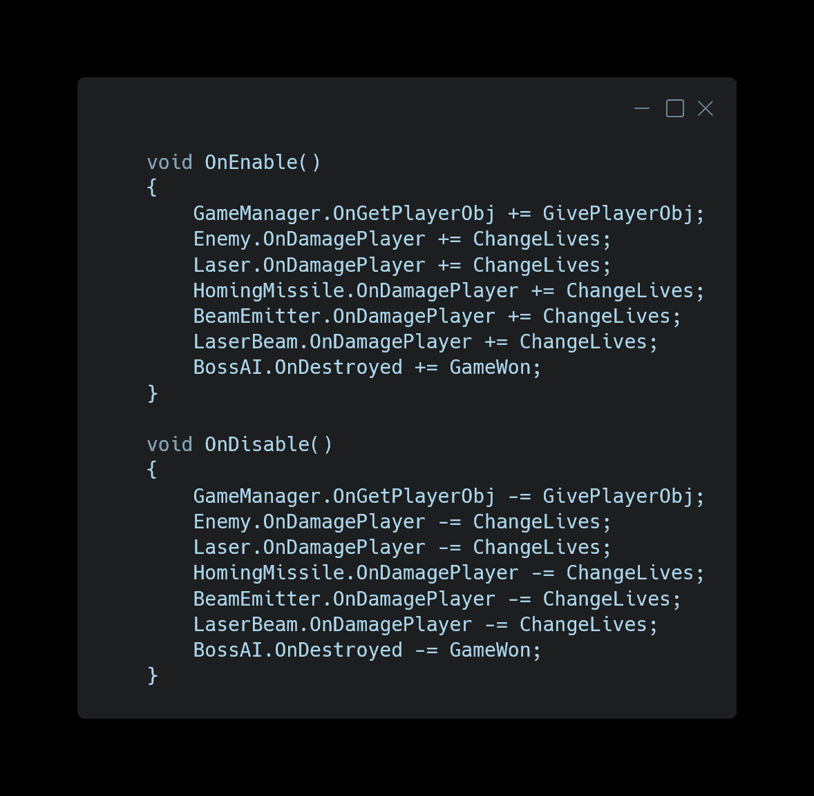
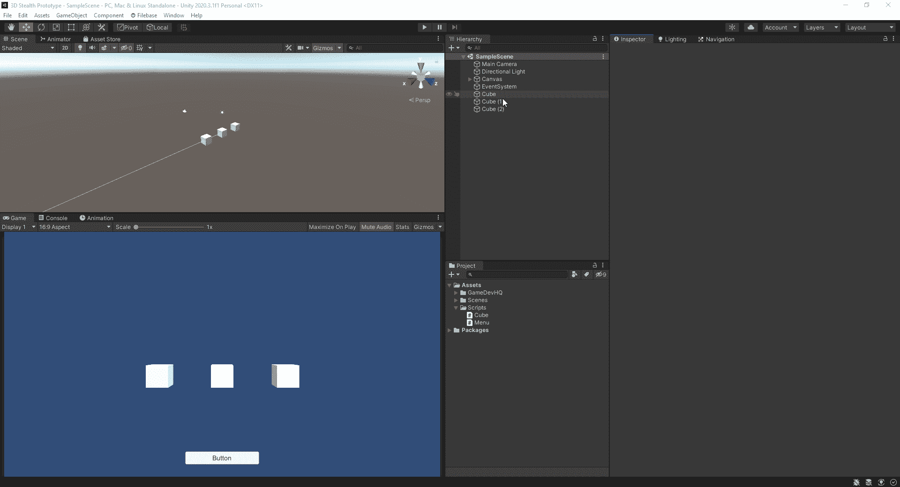
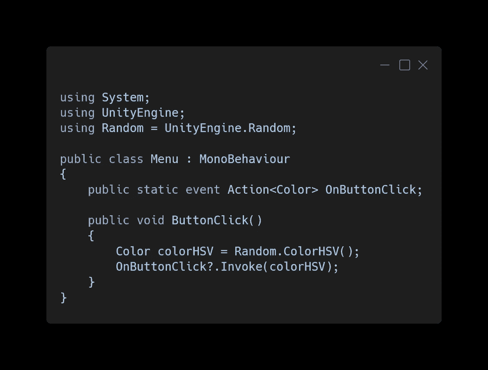
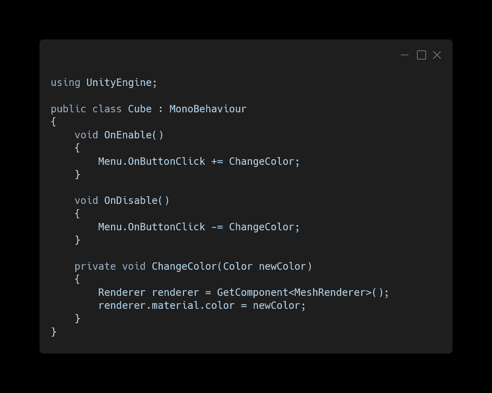
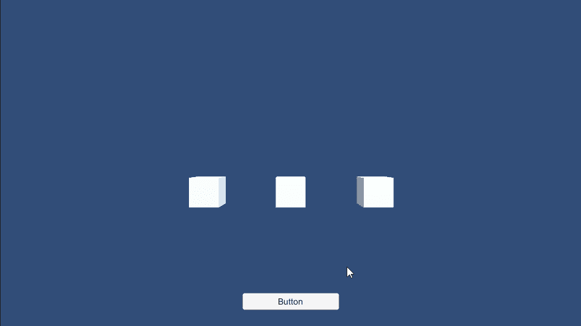
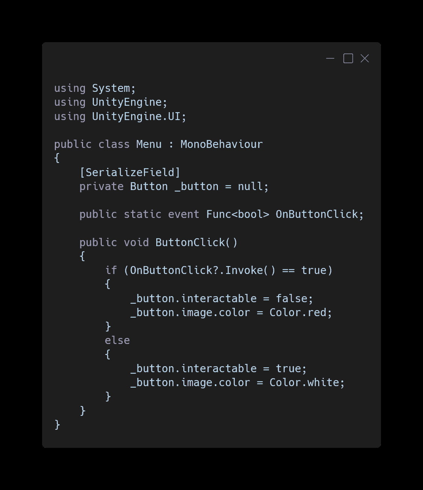
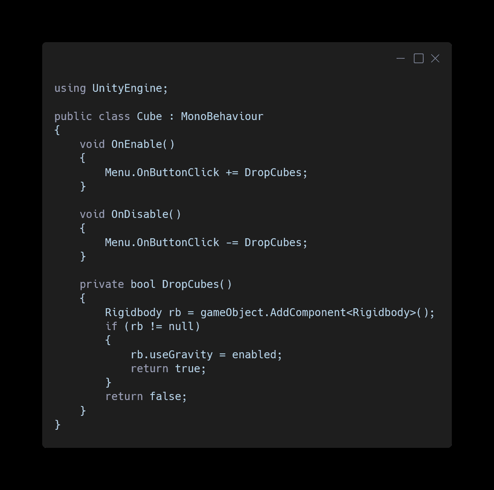
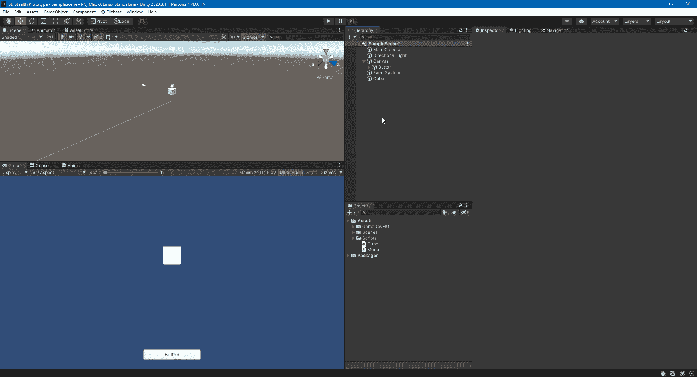

# 动作和功能委托

> 原文：<https://medium.com/nerd-for-tech/action-and-func-delegates-d60fe913e26c?source=collection_archive---------9----------------------->

在下一篇文章中实现观察者模式和委托之前，本文将简要讨论它们。

[观察者模式](https://docs.microsoft.com/en-us/dotnet/standard/events/observer-design-pattern)在 C#和 Unity 中很常见，尤其是在 GUI(图形用户界面)和 Unity 事件系统中。该模式提供了一种对其他对象上的变化或事件做出反应的方式，而无需耦合到它们的类。

代替接口，我们将使用委托来实现设计模式——特别是 Action 和 Func 委托类型。委托是保存对方法的引用的变量，用于事件和回调方法。委托引用的方法需要有匹配的数据类型。

[一个动作委托](https://docs.microsoft.com/en-us/dotnet/api/system.action-1?view=net-5.0)持有对一个方法的引用，该方法可以接受一个值，但不必也不返回值。

[Func 委托](https://docs.microsoft.com/en-us/dotnet/api/system.func-1?view=net-5.0)就像一个动作，它保存了一个对方法的引用，该方法可以接受一个值，但它必须返回值。

event 关键字将委托锁定到该类，因此不能从任何其他脚本调用它，即使是那些从它继承的脚本。

向委托添加或注册方法时，您希望确保移除或注销该方法；如果不这样做，它会抛出一个错误。在 Unity 中，分别在 OnEnable 和 OnDisable 中注册和注销是很常见的。

## 示例:动作

在这个例子中，我们想在点击按钮时将立方体变成随机的颜色，但是我们不想将两个脚本结合在一起。所以我们将使用委托，因为我们不想要返回值，所以我们将使用动作委托。

菜单脚本是动作委托所在的地方，所以我们需要使用系统名称空间，并定义在使用 Random 时我们想要使用哪个 Random。这个动作会将菜单脚本生成的随机颜色发送给任何正在收听 OnButtonClick 的人。当调用 OnButtonClick 时，我们使用三元运算符(？)来检查是否有人在听这个动作，如果有，我们调用或调用委托并传入随机颜色。

在多维数据集脚本中，我们创建了一个方法，该方法接受一个颜色参数，并将多维数据集设置为该颜色。然后，我们注册和取消注册菜单脚本的 OnButtonClick 操作，以侦听何时调用该操作。

每次点击按钮，立方体会变成随机的颜色。

## 示例:Func

在这个例子中，我们希望立方体落在按钮 click 上，然后返回一个 bool 来告诉按钮它是否成功落下并禁用按钮。我们不想将这两个脚本结合在一起。所以我们将使用委托，但是因为我们想要返回值，所以我们需要使用 Func 委托。

在菜单脚本中，我们现在将使用返回布尔值的 Func 委托来确定脚本是否应该停用按钮并将颜色更改为红色。当使用 OnButtonClick 时，我们检查任何侦听器，然后根据返回值更改按钮。

在立方体脚本中，我们将创建一个返回布尔值的方法，并通过添加一个 Rigibody 组件并启用 gravity 来使立方体下落。如果脚本成功添加了组件，返回值将为 true，否则为 false。

点击按钮，立方体有一个刚体组件加入，开始下落；该按钮会变成红色并被禁用。

