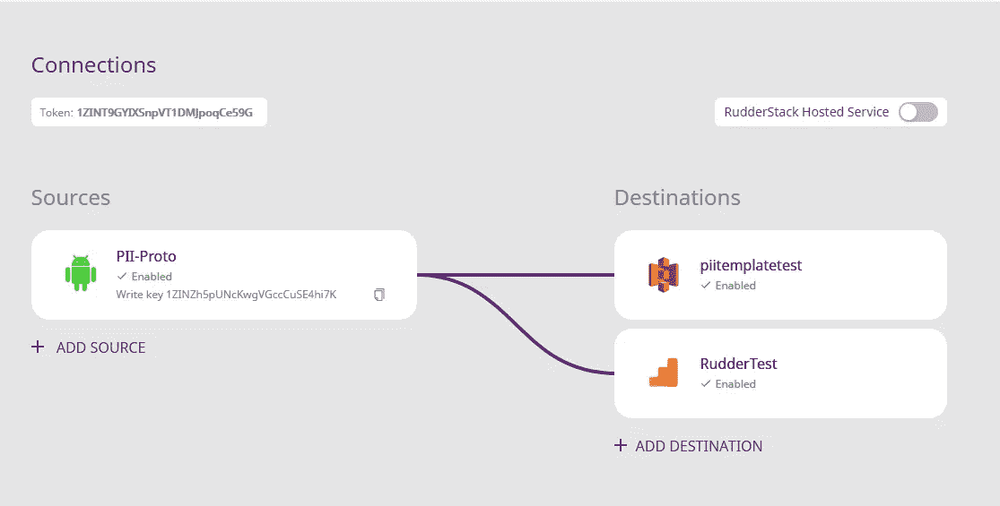
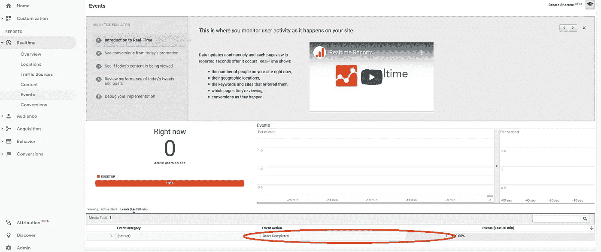

# 使用 RudderStack 激活数据流:AWS Lambda 和 Amazon Kinesis 的一个用例

> 原文：<https://medium.com/nerd-for-tech/activate-your-data-streams-using-rudderstack-a-use-case-with-aws-lambda-and-amazon-kinesis-eff443543183?source=collection_archive---------17----------------------->


本博客介绍了一种使用 Amazon Kinesis 和 AWS Lambda 函数将数据路由到 RudderStack 的方法。

# 介绍

如今，许多组织利用来自其应用程序和网站的流式事件数据。为了收集数据流，他们使用像亚马逊 Kinesis 这样的工具。但是，这些企业如何将数据流转化为可操作的见解呢？一个流行的方法是通过一个叫做*激活*的过程。在这个过程中，我们转换原始数据，然后将其路由到不同的应用程序和服务以获得洞察力。例如，我们可以向我们的 CRM 发送注册事件，以便销售团队可以处理新的线索并建立业务机会。

在本帖中，我们展示了一个非常强大的架构，它使用现成的服务来完成上述任务。我们将亚马逊 Kinesis 与 AWS Lambda 函数和 [RudderStack](https://www.rudderstack.com/) 相结合，这是一个开源和灵活的客户数据基础设施，可以执行我们正在寻找的激活。AWS 中的 lambda 函数读取 Kinesis 数据流，并将它们传递给 RudderStack，以执行必要的数据映射。RudderStack 然后将这些映射数据传递给分析平台(Google Analytics、Amplitude 等)。)进行分析。

> ***注*** *:在本帖中，我们以 AWS 栈为例。然而，可以用 Kafka 替代 Kinesis，用任何其他云提供商替代 AWS。该堆栈仍将与 RudderStack 无缝协作。*

# AWS Lambda 如何与 RudderStack 集成

如上所述，我们在 AWS 中使用 Lambda 函数作为中介来处理和路由数据流以进行分析。由于 Lambda 函数可以在 Node.js 中编码，因此它与 RudderStack 等数据路由工具的集成非常容易。RudderStack 提供了一个 [**Node.js SDK**](https://github.com/rudderlabs/rudder-sdk-node) ，我们可以将它与 Lambda 代码一起使用。

# 数据流的快速概述

出于本博客的目的，我们设计了一个简单的应用流程:

*   使用[**AWS Kinesis Agent**](https://github.com/awslabs/amazon-kinesis-agent)来:
*   监视文件系统中指定位置的特定文件模式
*   将新收到的文件上传到预定义的 Kinesis 流
*   消费者触发 AWS Lambda 功能
*   Lambda 函数将 Kinesis 数据映射到 RudderStack API 参数
*   Lambda 函数调用 RudderStack API
*   RudderStack 将数据发送到两个目的地——AWS S3 和谷歌分析

# 设置 AWS Kinesis 代理

我们可以使用以下代码行配置 AWS Kinesis 代理:

```
{
  "cloudwatch.emitMetrics": true,
  "kinesis.endpoint": "",
  "firehose.endpoint": "",

  "flows": [
    {
      "filePattern": "/tmp/*.csv",
      "kinesisStream": "lambda-integration-poc",
      "partitionKeyOption": "RANDOM",
      "dataProcessingOptions": [
                {
                    "optionName": "CSVTOJSON",
                    "customFieldNames": ["anonymousId","orderId", "itemId", "itemName", "qty", "unitPrice"],
                    "delimiter": ","
                }
	]
    }
  ]
}
```

这里需要注意一些要点:

*   我们配置 AWS Kinesis 代理来监控`/tmp`目录中的 CSV 文件。
*   Kinesis 代理将数据传递给`lambda-integration-poc` Kinesis 数据流。
*   数据处理选项规定将 CSV 数据转换为 JSON。还提到了生成的 JSON 的字段名。

下面是 CSV 文件样本和相应生成的 Kinesis 记录的一些示例:

```
testuser1,0001,0001,sample product 1,001,51.00testuser1,0001,0002,sample product 2,002,23.50{ "anonymousId": "testuser1", "orderId": "0001", "itemId": "0001", "itemName": "sample product 1", 
"qty": "001", "unitPrice": "51.00" }{ "anonymousId": "testuser1", "orderId": "0001", "itemId": "0002", "itemName": "sample product 2", 
"qty": "002", "unitPrice": "23.50" }
```

> ***注*** *:我们以这个变换为例来演示 AWS Kinesis Agent 的操作。一些企业已经有了自己的程序，以适合其业务需求的格式编写 Kinesis。没有必要改变这样的程序和/或格式。*

# 设置 AWS Lambda

在我们进入 Lambda 函数代码之前，我们必须回顾一下整体设置。对于这篇博客，我们在 EC2 实例中设置了一个 Docker 版本的 RudderStack 服务器。你可以在这里找到关于设置[的更多说明。](https://github.com/rudderlabs/rudder-server#setup-instructions-docker)

> ***注意*** *:您还需要在您的开发环境中安装 AWS CLI。*

# 将方向舵堆栈与 AWS Lambda 集成

如前所述，我们可以将 AWS Lambda 与 RudderStack Node.js SDK 等第三方库无缝集成。lambda 函数调用这个 SDK 来执行必要的数据映射，并将数据流路由到指定的分析目的地。因此，在这一点上，仔细查看将 RudderStack 节点 SDK 与 Lambda 函数集成起来所必需的几个步骤也是明智的。

*   您应该在开发环境中维护 Lambda 函数工件的位置安装 RudderStack Node.js SDK，如下所示:

```
[ec2-user@ip-172-31-44-230 ~]$ npm install --prefix=~/lambda-apps @rudderstack/rudder-sdk-node
```

*   将 Lambda 函数开发目录的所有内容存档在一个 ZIP 文件中。

```
[ec2-user@ip-172-31-44-230 lambda-apps]$ zip -r function.zip
```

*   更新 lambda 函数部署，如图所示:

```
[ec2-user@ip-172-31-44-230 lambda-apps]$ aws lambda update-function-code --function-name lambda-apps-dev-helloWorld --zip-file fileb://~/lambda-apps/function.zip
```

# 使用λ函数

作为下一步，下面的代码片段展示了 Lambda 代码。您可以使用 Lambda 代码响应在 AWS 指定的 web 端点上测试函数的可用性，该端点是在首次部署函数时创建的。

在下面的代码片段中，发生了以下操作:

*   该函数初始化一些用于构造 RudderStack 规范对象的变量
*   lambda 函数迭代 Kinesis 事件中的每条记录
*   该函数解析 JSON 格式的记录
*   然后，该函数使用 JSON 对象的属性值作为 RudderStack 对象的属性值
*   在某些情况下，RudderStack 对象属性值是通过聚合 JSON 对象属性值得到的，如`revenue`的情况
*   每个记录用于创建一个`product`对象。多个`product`对象被收集到一个`products`数组中。使用`products`数组、记录中的`order_id`和`revenue`构造一个`order`对象

此后，在调用 RudderStack 的`track` API 时，`order`对象被用作`properties`键的值。

```
'use strict';
const Analytics = require("@rudderstack/rudder-sdk-node");//
//
module.exports.helloWorld = (event, context, callback) => {
    const response = {
   	 statusCode: 200,
   	 headers: {
   		 'Access-Control-Allow-Origin': '*', // Required for CORS support to work
   	 },
   	 body: JSON.stringify({
   		 message: 'Go Serverless v1.0! Your function executed successfully!',
   		 input: event,
   	 }),
    };
    var order = {};
    var revenue = 0;
    var anonymousId = "dummy";
    order["products"] = [];
    event.Records.forEach(function(record) {
   	 // Kinesis data is base64 encoded so decode here
   	 var payload = Buffer.from(record.kinesis.data, 'base64').toString('ascii');
   	 console.log('Decoded payload:', payload);

   	 //Construct order line item as expected by GA from Kinesis record
   	 var orderLine = JSON.parse(payload);
   	 var product = {};
   	 product["product_id"] = orderLine.itemId;
   	 product["name"] = orderLine.itemName;

   	 revenue += orderLine.qty * orderLine.unitPrice;
   	 order["products"].push(product);
   	 order["order_id"] = orderLine.orderId; //keeping it simple, all line items from same order
   	 anonymousId = orderLine.anonymousId; //keeping simple again, as above });

    order["revenue"] = revenue;
    console.log("Order : ", JSON.stringify(order));
    // we need the batch endpoint of the Rudder server you are running
    const client = new Analytics("1ZINZh5pUNcKwgVGccCuSE4hi7K", "Data Plane URL");
    //remember to handle error and allow for processing to continue
    try {
   	 client.track({"event" : "Order Completed", "anonymousId" : anonymousId, "properties" :  {order}});
   	 console.log("Rudder Success");
    } catch(err) {
   	 console.log("Rudder Error");
    }
    callback(null, response);
};
```

`write_key`和 RudderStack 端点用于初始化 Rudder 客户端。在这个特殊的例子中，我们配置 RudderStack 将事件转储到**亚马逊 S3** 以及**谷歌分析、**进行分析。点击了解更多关于在方向舵堆栈[中配置源和目的地的信息:](https://docs.rudderstack.com/getting-started/adding-source-and-destination-rudderstack)



**舵杆连接配置**

转储到亚马逊 S3 的交付事件如下所示:

```
{"type": "track", "event": "Order Completed", "sentAt": "2020-04-15T09:59:50.246Z", "context": {"library": {"name": "analytics-node", "version": "0.0.1"}}, "_metadata": {"nodeVersion": "12.16.1"}, "messageId": "node-5306d64b863bdf7c95cce1442c70f3ac-1345b9b5-c5a9-4c1b-8338-64762ff2de8d", "timestamp": "2020-04-15T09:59:50.27Z", "properties": {"order": {"revenue": 98, "order_id": "0001", "products": [{"name": "sample product 1", "product_id": "0001"}, {"name": "sample product 2", "product_id": "0002"}]}}, "receivedAt": "2020-04-15T09:59:50.271Z", "request_ip": "34.205.171.63:54764", "anonymousId": "testuser1", "originalTimestamp": "2020-04-15T09:59:50.245Z"}
```

下面的屏幕截图显示了 Google Analytics 中交付的事件:



**谷歌分析中看到的舵栈事件**

# 摘要

在这篇文章中，我们看到了如何将数据流与 RudderStack 和 AWS Lambda 函数结合起来，为您的事件数据创建一个极其灵活和实时的激活数据流。将 AWS Kinesis 和 AWS Lambdas 等基础设施与 RudderStack 相结合，可以产生一个精简且可扩展的数据基础设施，可以立即从您的数据中提取价值。

此外，RudderStack 是一个开放和灵活的客户数据基础设施，这意味着它可以与您能找到的任何常见数据平台相结合。在这篇文章中，我们使用 AWS 栈作为例子，但是可以用 Kafka 代替 Kinesis，用任何其他云提供商代替 AWS。

# 免费注册并开始发送数据

测试我们的事件流、ELT 和反向 ETL 管道。使用我们的 HTTP 源在不到 5 分钟的时间内发送数据，或者在您的网站或应用程序中安装我们 12 个 SDK 中的一个。[上手](https://app.rudderlabs.com/signup?type=freetrial)。

这篇博客最初发表于
[https://rudder stack . com/blog/data-streams-using-rudder stack-with-AWS-lambda-and-Amazon-kinesis](https://rudderstack.com/blog/data-streams-using-rudderstack-with-aws-lambda-and-amazon-kinesis)