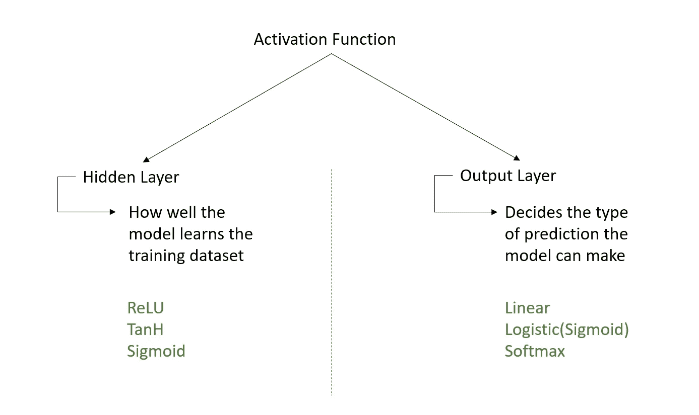
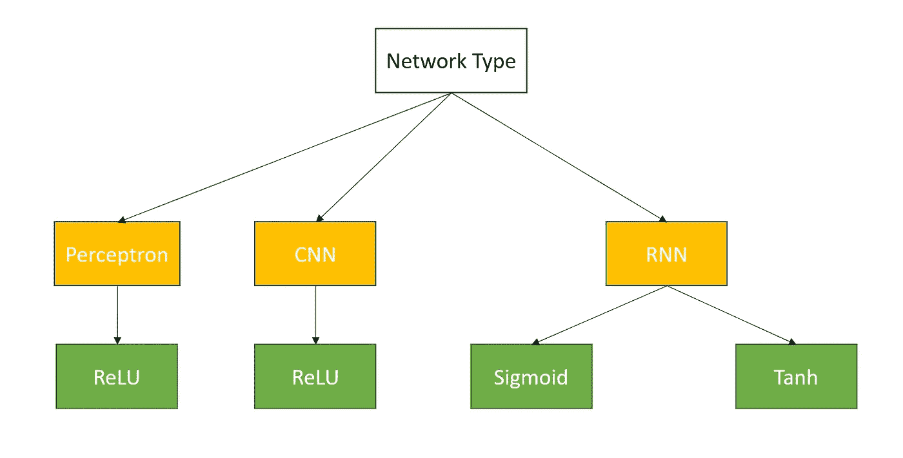
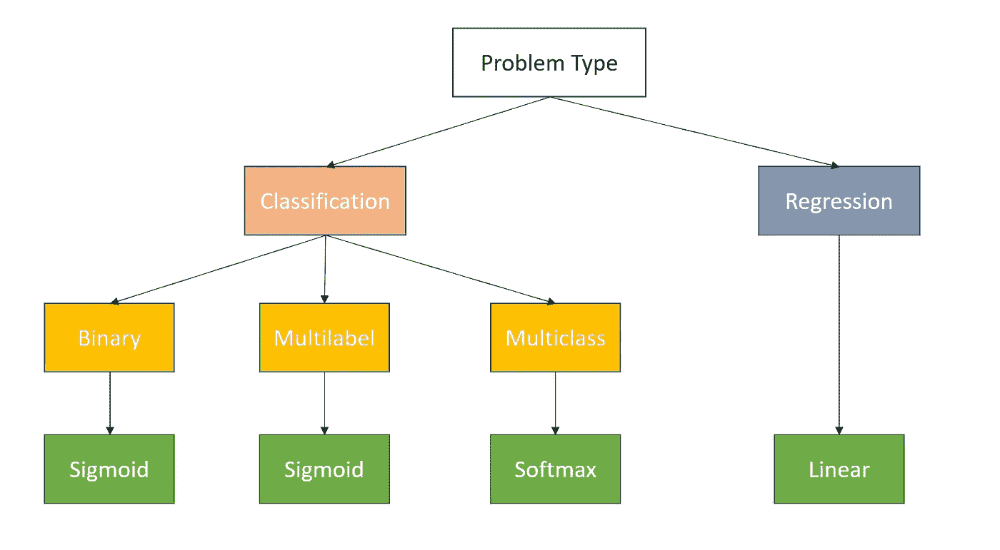
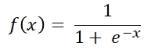
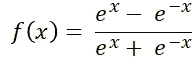
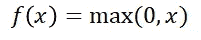
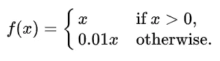
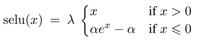
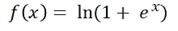

# 激活功能—秘制酱

> 原文：<https://medium.com/nerd-for-tech/activation-function-secret-sauce-f283bfe160cb?source=collection_archive---------4----------------------->

在 [Unsplash](https://unsplash.com/s/photos/transform?utm_source=unsplash&utm_medium=referral&utm_content=creditCopyText) 上由[Meagan carscience](https://unsplash.com/@mcarsience_photography?utm_source=unsplash&utm_medium=referral&utm_content=creditCopyText)拍摄的照片

激活函数，也称为传递函数，决定神经元的输入是否相关。这些函数应用于隐藏层以引入非线性。这种非线性有助于理解复杂的关系。激活功能也用于输出层。

激活功能具有以下基本要求。

> 计算成本低廉的
> 微分
> 零居中

下图给了我们一个粗略的概念，基于神经网络的类型，何时在隐藏层使用哪个激活函数。

下图根据我们试图解决的网络问题类型，给出了在输出层使用哪个激活函数的想法。

让我们逐一了解每个激活功能。

## 乙状结肠的

> 1.在 0 和 1 之间转换值。
> 2。函数的梯度值在-3 到 3 的范围内是显著的。超出此范围的梯度值变为零。
> 3。以 0.5 左右为中心。这使得所有神经元的输出具有相同的符号。

## 双曲正切

> 1.在-1 和 1 之间转换值。
> 2。零居中。因此梯度向两个方向移动。

Sigmoid 和 tanh 激活函数的一个普遍问题是“**饱和**”。大值转换为 1 &，小值转换为 0 或-1。这些函数只在中点(0.50 或 0)附近的区域敏感。这使得体重适应非常困难。

由于与非线性激活函数(sigmoid & tanh)相关的**消失梯度**问题，它们在具有许多层的网络中不是优选的。我们使用线性近似法。精确校正线性单位。

## 整流线性单位

> 1.所有正值为线性，所有负值为零。因此，这是稀疏激活。
> 2。计算成本低。
> 3。收敛速度更快(几乎比 Sigmoid 或 tanh 快 6 倍)
> 4。与 Sigmoid 或 tanh 不同，它没有消失梯度问题
> 5。患有一种叫做“死亡再路”的疾病。

**垂死的 ReLU:** 一旦一个神经元变成阴性，它就不太可能恢复。因此所有这样的神经元它们的权重将在下降过程中被调整&那些神经元变得被动&不起任何作用。这通常发生在学习率很高或者有很大的负偏差的时候。

## LeakyReLU

> 1.克服了垂死的 ReLU 问题。leaky ReLU 不是负值的斜率为零，而是负值的斜率较小。
> 2。它比 ReLU 快。
> 3。它比 ReLU 更平衡。

## 卢瑟

它结合了 ReLU 和 Leaky ReLU 的优点。它使用**标度(对数曲线)**表示负值。因为它对于负值具有大的负斜率，所以它使那些神经元不活跃。在计算上，它比 ReLU 或 Leaky ReLU 稍微贵一点，但是它训练得更快。由于其平均值更接近于零，因此具有更好的推广性。它解决了两个消失&爆炸渐变问题。

> 由于 ReLU 及其变体的输出在正域中是无界的，因此 ReLU 或其变体被认为不太适合在 RNN 使用。RNN 更喜欢有界激活函数。

**输出层激活功能**

## Softmax

> 1.将数字转换成概率分布
> 2。给出每个类别的“可信度分数”
> 3。分数总和为 1

## Softplus

> 以(0，+∞)
> 的比例产生输出，还没有注意到被使用得多

希望对你有用。