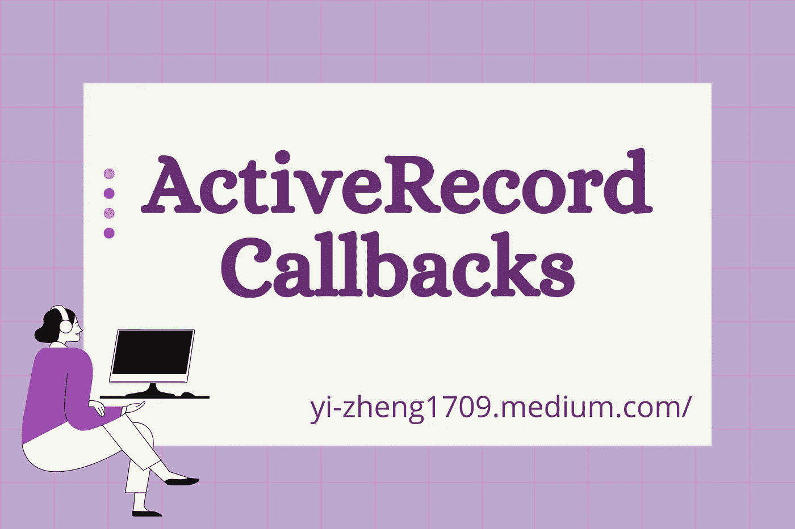

# 使用 Rails 的 ActiveRecord 回调

> 原文：<https://medium.com/nerd-for-tech/activerecord-callbacks-33bc437ac19b?source=collection_archive---------13----------------------->

你能想象意外地将坏数据保存到你的数据库中吗？如果坏数据进入数据库，您可以在控制器中添加额外的逻辑来处理它们。但是如果我们可以在创建对象之前处理它呢？

除了验证之外，使用回调可以防止坏数据被插入到数据库中。



# 什么是回调？

回调是在对象生命周期的特定时刻被调用的方法。对象的生命周期是从它的创建到它的销毁——在对象的创建和销毁之间是读取和更新的时刻。

# 第一步

为了使用回调，我们必须在模型中定义一个回调函数来使用这个回调函数。例如，如果我们有一个允许人们创建帐户的 web 应用程序，我们可能会有这样的内容:

```
class User < ApplicationRecord
  validates_presence_of :first_name, :last_nameprivate  def ensure_name_is_titlecase
    self.first_name.titlecase
    self.last_name.titlecase
  end
end
```

有时用户可能会不小心用小写字母键入他们的名字。然后在他们的主页上，我们可以试着欢迎用户，但是用户看到他们的名字是小写的！我们需要一种方法来避免这种尴尬。

# 第二步

在定义了我们需要的方法之后，我们会让 ActiveRecord 知道何时执行`ensure_name_is_titlecase`。

```
class User < ApplicationRecord
  validates_presence_of :first_name, :last_name
  **before_validation :ensure_name_is_titlecase** private  def ensure_name_is_titlecase
    self.first_name.titlecase
    self.last_name.titlecase
  end
end
```

宏`before_validation`表明，它作为输入的方法将在每次验证之前执行。

下面是触发验证的常见 ActiveRecord 方法的列表:

*   `save`
*   `save!`
*   `update`
*   `update!`
*   `valid?`

使用`before_validation :ensure_name_is_titlecase`、**、**，`ensure_name_is_titlecase`方法将在每个验证方法之前运行。

# 第三步

但是如果我们不想让程序浪费时间运行某些回调函数呢？除了在任何验证方法之前，我们可以指定运行回调的生命周期事件！

```
class User < ApplicationRecord
  validates_presence_of :first_name, :last_name
  before_validation :ensure_name_is_titlecase, **on:** **[ :create, :update ]** private  def ensure_name_is_titlecase
    self.first_name.titlecase
    self.last_name.titlecase
  end
end
```

在这个代码片段中，我们指定希望回调只在创建和更新生命周期事件上运行。这样，我们就不会运行不必要的方法了！

# **普通回调宏**

**创建对象时**

*   `before_validation`
*   `after_validation`
*   `before_save`
*   `after_save`
*   `before_create`
*   `after_create`

**更新对象时**

*   `before_validation`
*   `after_validation`
*   `before_save`
*   `after_save`
*   `before_update`
*   `after_update`

**摧毁一个物体时**

*   `before_destroy`
*   `after_destroy`