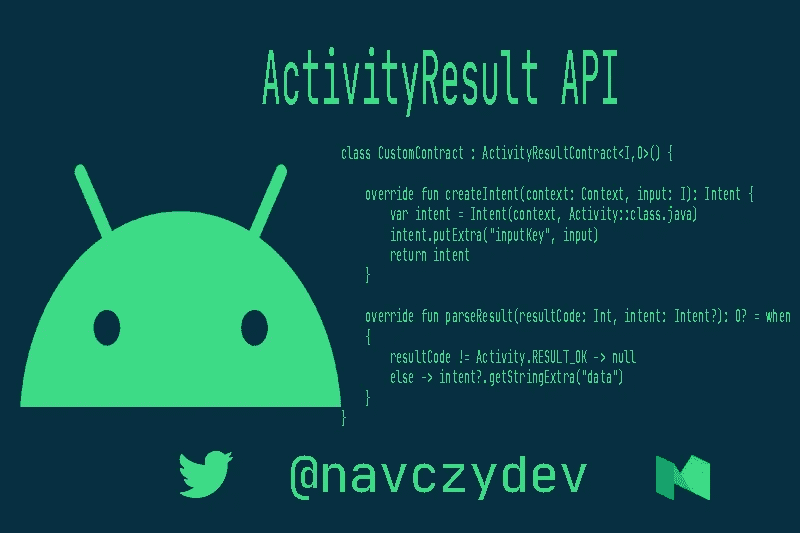
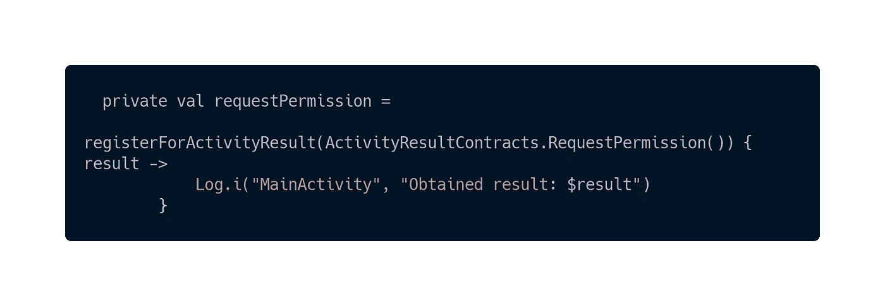
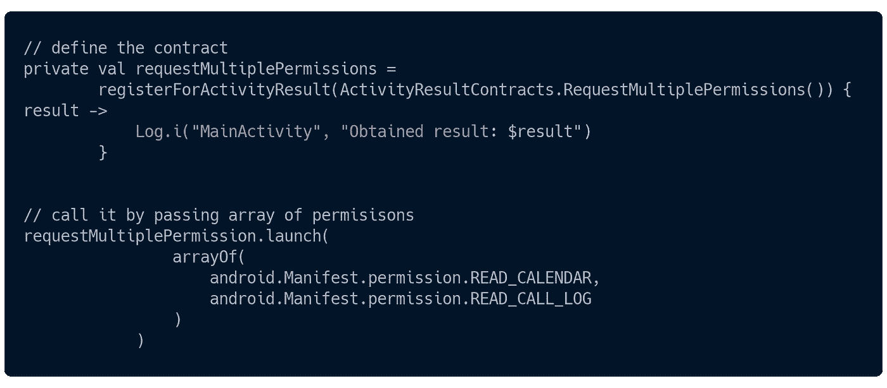
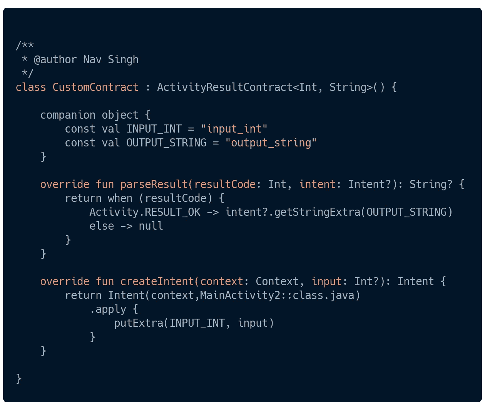
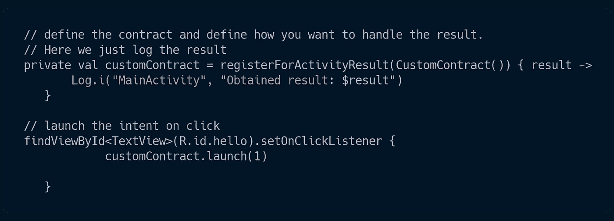

# 活动结果 API Android…

> 原文：<https://medium.com/nerd-for-tech/activityresult-api-android-87308971c277?source=collection_archive---------0----------------------->



今天我们将学习 **ActivityResult API** ，它让 Android 开发人员更容易管理权限和活动间通信。

*   目前，如果我们需要来自**子活动或由主机活动** y 启动的另一个活动 **的数据，我们使用 **startActivityForResult** 和 **onActivityResult****

```
// start activity 
startActivityForResult(intent,requestCode)// get the result
override fun onActivityResult(*requestCode*: Int, *resultCode*: Int, *data*: Intent?) {
    super.onActivityResult(*requestCode*, *resultCode*, *data*)
}
```

*   第二个用例是**权限**，如果你曾经实现过请求权限 ex。访问媒体文件等。你猜对了。

```
// request for permisison
requestPermissions(*arrayOf*(android.Manifest.permission.*READ_CALENDAR*))// manage the result 
override fun onRequestPermissionsResult(
    *requestCode*: Int,
    *permissions*: Array<out String>,
    *grantResults*: IntArray
) {
    super.onRequestPermissionsResult(*requestCode*, *permissions*, *grantResults*)
}
```

**现在我们将了解上述用例是如何👆使用 ActivityResult API** 实现变得更加容易

**首先要做的事情:**

*   **依赖关系:**添加👇在你的**应用级 build.gradle 文件**中的 **2 依赖关系**之后

```
// check the latest version @Android released notes
implementation "androidx.activity:activity-ktx:1.2.0-beta02"
implementation 'androidx.fragment:fragment-ktx:1.3.0-beta02'
```

> **请求权限**:该 API 提供了 **2 种方式**请求权限。

**活动结果合同。RequestPermission()) :** 如果你想请求单个权限，这个**契约**会为你做**的工作**。

*   使用**请求许可合同**创建**activity request launcher**

Lambda 在下面的代码中👇将在请求完成时执行，您可以调用它 **onRequestPermissionsResult。**

> 在这种情况下，根据是否授予权限，它返回布尔值

****

*   **好了，你可以去申请任何许可了，它会为你完成工作**

****

*   **API 提供了许多其他预构建的契约，您可以像**requestpermission 一样直接使用。**查看参考资料部分，了解更多信息。**

****如果你想请求多个权限使用下面的契约:****

****

**此处**结果**👆属于类型**映射<字符串、布尔>、**，其具有作为关键字的**权限名称和基于是否授予权限的**值******

****现在我们将了解如何使用该 API 从子活动中获取数据。****

*   **我们将创建**自定义契约**，该契约**扩展**活动**结果契约<输入、输出> ()****

****输入**:如果需要发送一些数据**

****输出** : **结果**您期望从您为结果而开始的活动中得到的结果**

*   **这里👇我们已经创建了自定义契约，它将 **Int 作为输入**，并给我们**字符串**类型的**结果****

****

*   ****我们需要覆盖两个方法:****

```
// here we handle the resultparseResult(*resultCode*: Int, *intent*: Intent?): String?  // it's the Output type that we have defined for our contract // this method creates the Intent that we defined, input:Int? It's the input type that we have defined for our contractcreateIntent(*context*: Context, *input*: Int?): Intent
```

*   ****让我们用这个契约:****

****

*   ****这是本文的 Github 回购:****

**[](https://github.com/navczydev/ActivityContractsSample) [## navczydev/ActivityContractsSample

### ActivityResult API sample GitHub 是 5000 多万开发人员的家园，他们共同工作来托管和审查代码、管理…

github.com](https://github.com/navczydev/ActivityContractsSample)** 

## ****👏👏快乐编码我希望你今天学到一些新东西👏👏****

# **保持联系**

 **[## Nav Singh -中级移动软件工程师-宏利| LinkedIn

### 在世界上最大的职业社区 LinkedIn 上查看 Nav Singh 的个人资料。Nav 列出了 6 个职位…

www.linkedin.com](https://www.linkedin.com/in/navczydev/)** 

**[**推特**](https://twitter.com/navczydev)**

# **参考**

*   **[https://developer . Android . com/reference/androidx/activity/result/activity result](https://developer.android.com/reference/androidx/activity/result/ActivityResult)**
*   **[https://developer . Android . com/reference/androidx/activity/result/contract/ActivityResultContracts](https://developer.android.com/reference/androidx/activity/result/contract/ActivityResultContracts)**

**[](https://android-developers.googleblog.com/2020/07/jetpack-activityresult.html) [## 使用 Jetpack ActivityResult 改善活动间的交流

### 无论您是请求许可，从系统文件管理器中选择文件，还是期望从第三方获得数据…

android-developers.googleblog.com](https://android-developers.googleblog.com/2020/07/jetpack-activityresult.html)**