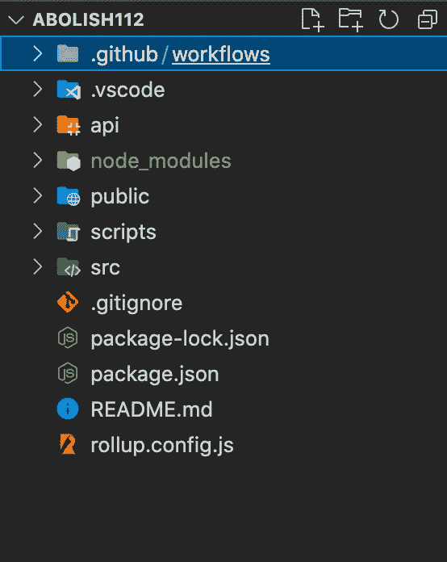
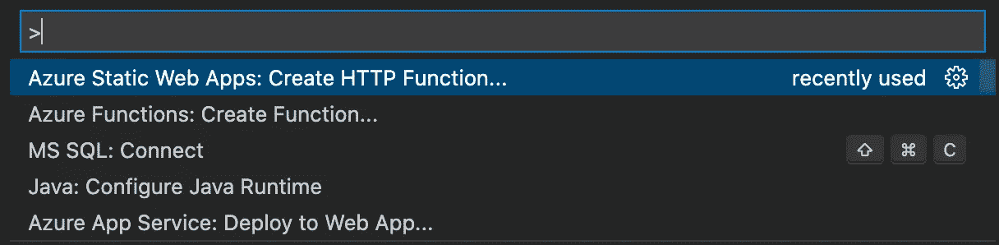
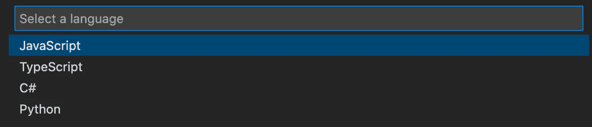
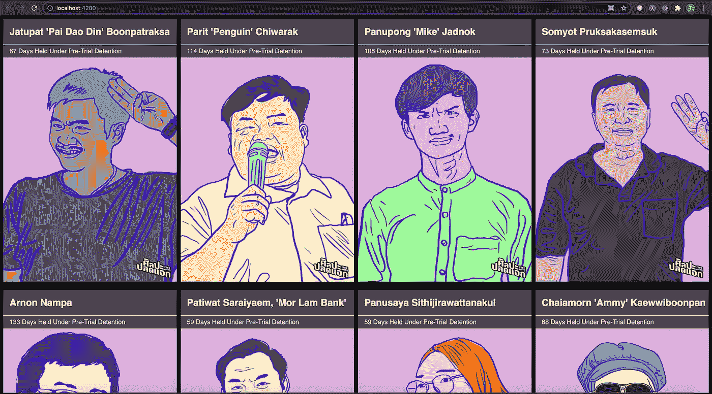

# 使用 Azure 函数向 Azure 静态 Web 应用程序添加 API

> 原文：<https://medium.com/nerd-for-tech/add-an-api-to-azure-static-web-apps-with-azure-functions-dbf0dd3fce0a?source=collection_archive---------4----------------------->

演示如何向 Azure SWA 添加 Azure 函数并返回模拟数据


本文图片改编自[文件:2020 年抗议民主纪念碑(上)。jpg](https://en.wikipedia.org/wiki/2020%E2%80%932021_Thai_protests#/media/File:Protest_in_2020_Democracy_Monument_(I).jpg)by[supan ut Arunoprayote](https://commons.wikimedia.org/wiki/User:Supanut_Arunoprayote)

# 创建 API

## 先决条件

*   安装 [Azure 静态 Web 应用](https://marketplace.visualstudio.com/items?itemName=ms-azuretools.vscode-azurestaticwebapps) VS 代码扩展
*   安装 [Azure 函数](https://marketplace.visualstudio.com/items?itemName=ms-azuretools.vscode-azurefunctions) VS 代码扩展

## 步伐

1.  在根目录下创建 *api* 文件夹



在根目录下创建 *api* 文件夹

2.通过将 *api* 文件夹作为根项目，打开新的 Visual Studio 代码窗口。我认为这是一种解决办法**正如我正在努力解决静态 Web Apps VS 代码扩展的问题，它总是在根目录下创建 *api* 项目，并覆盖现有的 package.json 文件。**

3.按下 *F1* 打开命令面板。

4.选择 Azure 静态 Web 应用程序:创建 HTTP 函数…



选择 Azure 静态 Web 应用程序:创建 HTTP 函数…

5.出现提示时，输入以下值:

*   选择一种语言[JavaScript]
*   提供一个函数名[activities]



选择一种语言[JavaScript]


提供一个函数名[activities]

结果将是生成一个带有 HTTP 触发函数的 Azure Functions 项目。项目结构类似于以下示例:

```
├── .github 
│   └── workflows 
│       └── azure-static-web-apps-<DEFAULT_HOSTNAME>.yml 
│
├── api 
│   ├── activists 
│   │   ├── function.json 
│   │   └── index.js 
│   ├── host.json 
│   ├── local.settings.json 
│   └── package.json 
│ 
└── (folders and files from your static web app)
```

6.接下来，我从 Svelte 应用程序中提取模拟数据(activists 数据),现在它将由 Azure Functions 项目公开。现在，`activists`函数将通过`get`调用向前端返回活动者数组。

*   使用以下代码更新[API/activities/index . js](https://github.com/totsawin/abolish112-blog/commit/5a581a11036e0f1bf76c242cfa37bc6afb185bde#diff-dd8d6c3a3ff40c0eeaead6c784aa5552099611f11bc54a898ffdb060f1b7f771)中的函数，以返回 activities 数组

```
const data = require('../shared/activists-data.js');module.exports = async function (context, req) {
context.log('JavaScript HTTP trigger function processed a request.');
try { 
  const activists = data.getActivists();
  context.res.status(200).json(activists);
} 
catch (error) {
  context.res.status(500).json(error);    
}}
```

*   将 activities 数组提取到[API/shared/activities-data . js](https://github.com/totsawin/abolish112-blog/commit/5a581a11036e0f1bf76c242cfa37bc6afb185bde#diff-e92231b1e1825ebf61ebf31134f5e488dcc58ab87833e392df57e28792de232e)，由[API/activities/index . js](https://github.com/totsawin/abolish112-blog/commit/5a581a11036e0f1bf76c242cfa37bc6afb185bde#diff-dd8d6c3a3ff40c0eeaead6c784aa5552099611f11bc54a898ffdb060f1b7f771)导入

```
const data = {    
  activists: [ ... ] 
}
const **getActivists** = () => { return data.activists; };
module.exports = { getActivists };
```

# 更新前端应用程序以调用 API

回到根项目，我更新了前端应用程序 [src/App.svelte](https://github.com/totsawin/abolish112-blog/commit/4fe4ae168fa378d411d0fb5b979295e917b3edb3#diff-d68daa8b73cec8e4419759802bbd91e9f87f8ee02f25cdb1d12582ef6de848db) ，以在`/api/activists`从 API 中检索活动者数据，并利用该响应。如果一切正常，外观和感觉应该是一样的。

```
import { onMount } from 'svelte';
...
let activists = [];

function **getNumberOfDaysUnderDetained**(detainedDuration) {
  return detainedDuration.reduce((acc, {detainedDate, releasedDate }) => {
    const detainedDateTemporal = Temporal.PlainDate.from(detainedDate);
    const releasedDateTemporal = releasedDate ? Temporal.PlainDate.from(releasedDate): todayDate;
    return acc + detainedDateTemporal.until(releasedDateTemporal, { largestUnit: 'days' }).days;
},0 );
}**onMount**(async () => {
  await fetch("**/api/activists**")
    .then(response => response.json())
    .then(data => {
      activists = data.map(activist => {
        return {
           ...**activist**,
           **detainedDays**: **getNumberOfDaysUnderDetained**(activist.detainedDuration)
        };
      })
    }).catch(error => {
      console.log(error);
  });
});...
<div class="individual__caption">
  <span>{ **activist.detainedDays** } Days Held Under Pre-Trial Detention</span>
</div>
<div class="individual__image">
  
  {#if activist.detainedDuration[activist.detainedDuration.length - 1].releasedDate}
    <div class="stamp is-bailed">BAILED</div>
  {/if}
</div>...
```

# 本地运行前端和 API

Azure Static Web Apps 提供了一个模拟云环境的 CLI。这个命令行界面可以在本地运行前端应用程序和 API。

*   前端应用程序从已建立的文件夹提供，例如用于苗条的*公共*文件夹
*   api 从 API 文件夹提供，SWA CLI 利用 Azure Functions 核心工具来提供 API

## 安装命令行工具

1.  安装 Azure 静态 Web 应用程序 CLI。

```
npm install -g @azure/static-web-apps-cli
```

2.安装 Azure Functions 核心工具最新版本。

```
npm i -g azure-functions-core-tools@4 --unsafe-perm true
```

## 构建前端应用程序

运行以下命令来构建苗条的前端应用程序，因为仿真工具将使用这些静态资产来服务前端应用程序

```
npm run build
```

## 启动 CLI

1.  运行静态 Web Apps CLI，并提供包含前端应用程序和 API 后端的文件夹:

```
swa start ./public --api-location ./api
```

上面的命令是从/ *public* 文件夹服务前端 app。或者，静态 Web Apps CLI 提供了从前端开发服务器提供服务的选项:

```
swa start http://localhost:3000 --api-location ./api
```

2.当 CLI 进程启动时，在`http://localhost:4280/`访问应用程序。开发人员工具可用于验证前端应用程序是否对 API 进行了实际调用。



# 将 API 位置添加到工作流

作为将应用程序部署到 Azure 静态 Web 应用程序之前的最后一步，GitHub 操作工作流需要用 API 文件夹的正确位置进行更新。

1.  在 [*打开工作流文件。github/workflows/azure-static-web-apps-<DEFAULT-HOSTNAME>。yml*](https://github.com/totsawin/abolish112-blog/commit/5a581a11036e0f1bf76c242cfa37bc6afb185bde#diff-98f188874d607f5575ea25d4aeccd886c08d9e69227a6432915be3e932c2a3bf) 。
2.  搜索属性`api_location`，并将值设置为`api`。
3.  保存文件。

# 部署更改

要发布对 Azure Static Web Apps 的更改，提交并推送代码到目标分支中的远程 GitHub 存储库。Github Actions 将运行基于 GitHub Actions 工作流的作业——通常，它将构建和部署应用程序。

# 参考

1.  [Azure 静态 Web 应用文档](https://docs.microsoft.com/en-us/azure/static-web-apps/add-api?tabs=vanilla-javascript)