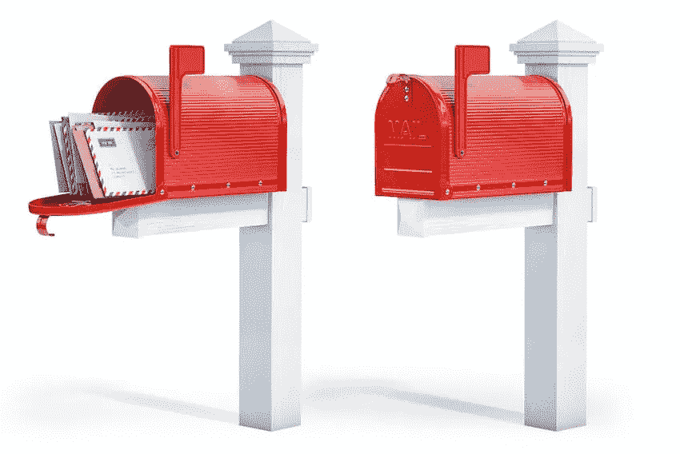

# 向 Django 用户注册添加电子邮件功能

> 原文：<https://medium.com/nerd-for-tech/add-email-functionality-to-a-django-user-registration-b3b3655ed623?source=collection_archive---------0----------------------->

用户注册和认证是任何 web 应用程序的一个关键部分，为了完成这个过程，系统需要电子邮件来帮助与客户端进行通信。在本文中，我们将向 Django 用户注册流程添加电子邮件功能。

当用户在您的 web 应用程序上创建帐户时，您可能想要在以下情况下向他们发送电子邮件:

*   他们成功地创建了一个帐户
*   他们请求重设密码
*   他们的个人资料发生了一些重大变化
*   然后发送通信消息
*   双因素身份验证，每次登录时使用第二个代码以提高安全性
*   你需要交流的任何其他原因


向 Django 用户注册流程添加电子邮件功能

# HTML 电子邮件和模板

除了标准的纯文本电子邮件类型，我们还将发送 HTML 电子邮件类型。在 Django 文档页面上阅读更多关于从 Django 发送电子邮件的信息:【https://docs.djangoproject.com/en/3.1/topics/email/ 

我们假设你已经设计了一个 Django 项目和用户注册流程——查看我们以前的相关文章:[https://skolo-online . medium . com/python-Django-user-registration-log in-logout-custom-styling-c2f 2901 e 162 a](https://skolo-online.medium.com/python-django-user-registration-login-logout-custom-styling-c2f2901e162a)

## 获取电子邮件 HTML 模板

请访问:[https://github . com/mailchimp/email-blue prints/tree/master/templates](https://github.com/mailchimp/email-blueprints/tree/master/templates)获取您可以根据自己的需求使用的电子邮件模板。

电子邮件模板的工作方式与 Django 中的页面 HTML 模板类似。您可以使用上下文对象将数据传递给 HTML，并在双花括号中访问该数据:

在你的 HTML 模板中

```
<h1>{{object.title}}</h1>
<h2>{{object.subtitle}}</h2>
```

将以 JSON 格式发送到模板的数据:

```
{
"object": { "title": "this is a title", "subtitle": "this is a subtitle" }
}
```

## 获取电子邮件托管帐户，并将配置添加到设置文件中



发送 Django 电子邮件

下一步是获得一个电子邮件托管帐户，或者你可以使用一个现有的帐户，你需要:(1)邮件服务器，(2)邮件用户名和(3)邮件密码来访问该帐户。

获得这些详细信息后，将它们添加到 settings.py 文件的底部，如下所示:

```
. . . . . .  
#Email settings details 
EMAIL_BACKEND = 'django.core.mail.backends.smtp.EmailBackend' EMAIL_HOST = 'mail.careers-portal.com' 
EMAIL_USE_TLS = True 
EMAIL_PORT = 587 
EMAIL_HOST_USER = 'no-reply@careers-portal.com' 
EMAIL_HOST_PASSWORD = '************' 
. . . . . . .
```

## 构建 sendMail 函数

创建电子邮件数据:

```
email = {
    "title": "Thank your for registering with Careers Portal",
    "shortDescription": "Welcome to Careers Portal, South Africa's Leading Job 
     Search Engine. These are the next steps.",
    "subtitle": "Careers Portal - Start your job search process today",
    "message": "You have successfully registered with Careers Portal. You can 
     now login in to your profile and start creating a profile. We have 
     thousands of jobs just waiting for you to apply. If you experience any 
     issues feel free to contact our support at support@careers-portal.co.za.>
    }
subject = '[Careers Portal] Welcome to Careers Portal'
to_email = 'anyemail@gmail.com"
```

这是我们现在需要的所有数据，然后我们需要创建如下所示的电子邮件功能。该函数接收上面指定的数据。

```
def sendEmail(email, subject, to_email): from_email = settings.EMAIL_HOST_USER text_content = """
    {} {} {} regards,
    Careers Portal Support
    """. format(email['shortDescription'], email['subtitle'], email['message']) html_c = get_template('basic-email.html')
    d = { 'email': email }
    html_content = html_c.render(d) msg = EmailMultiAlternatives(subject, text_content, from_email, to_email)
    msg.attach_alternative(html_content, 'text/html')
    msg.send()
```

现在我们知道了函数应该是什么样子，让我们在现有的视图函数中应用这个函数——在我们的 python Django 项目中。为此，我们将使用“忘记邮件”功能。

该功能将启动后面的过程，使用户能够重置他们的密码。我们将重置新密码，并通过电子邮件将新密码发送给用户。

以下是必需的:

1.  一个 HTML 文件，带有一个用户可以用来请求密码重置的表单
2.  在上面的 HTML 文件中提供的表单
3.  处理该请求的视图函数
4.  url 文件的更新—包括“忘记密码”的新 URL

## 创建满足请求的 HTML 文件

您可以为此使用任何模板，在模板内部您将有一个表单。该表单只有一个字段，即电子邮件字段。这就是我们需要从用户那里得到的所有信息——他们的电子邮件，这样我们就可以搜索数据库并调出他们的个人资料(如果有的话):

```
<form class="login-form" method="POST"><div class="row"><div class="col-12 text-center"><p>Let us find your account first, enter the email address associated with the account below:</p></div><div class="col-lg-12"><div class="form-group position-relative"><label>Enter Email <span class="text-danger">*</span></label>{{form.email}}</div><div class="alert alert-danger"><strong>{{ error|escape }}</strong></div></div><div class="col-lg-12 mb-0"><button class="btn btn-primary w-100" type="submit">Recover Password</button></div><div class="col-12 text-center"><p class="mb-0 mt-3"><small class="text-dark mr-2">Create a new account ?</small> <a href="" class="text-dark font-weight-bold">Register</a></p></div></div></form>
```

## 忘记电子邮件表单

在 forms.py 文件中—我们需要在文件的底部添加一个新的表单。这是将在上面的 HTML 文件中呈现的表单。确保您有这些导入—表单和用户类。

```
**from** django **import** forms**from** django.contrib.auth.models **import** User...
.
.
.
.
....**class** ForgotForm(forms.ModelForm):email = forms.EmailField(max_length=100,required = **True**,help_text=**'Enter Email Address'**,widget=forms.TextInput(attrs={**'class'**: **'form-control'**, **'placeholder'**: **'Enter Email'**}),)**class** Meta:model = Userfields = [**'email'**]
```

## 创建遗忘视图

在 views.py 文件内—添加以下代码行来处理视图:

```
**from** .functions **import** WelcomeEmail, sendEmail, ForgotEmail
**from** uuid **import** uuid4
**from** django.conf **import** settings
**from** django.contrib.auth.models **import** User
**from** django.shortcuts **import** render, redirect
**from** django.contrib **import** messages...
.
.
.
.
...**def forgot**(request):**if** request.method == **'POST'**:form  = ForgotForm(request.POST)**if** form.is_valid():user_email = request.POST[**'email'**].lower().replace(**' '**, **''**)u = User.objects.get(email=user_email)**if** u **is** **not** **None**:new_pass = str(uuid4()).split(**'-'**)[4]forgot = ForgotEmail(new_pass) **#Send the Forgot Email . . .**to_email = u.emaile_mail = forgot.email()sendEmail(e_mail, forgot.subject, [to_email])u.set_password(new_pass)u.save()messages.success(request, **'Your password has been reset, check your email for more details'**)**return** redirect(**'login'**)**else**:messages.error(request, **'We could not find a user with matching email'**)**return** redirect(**'home_page'**)**else**:messages.error(request, **'Error Processing Your Request'**)context = {**'form'**: form}**return** render(request, **'forgot.html'**, context)**if** request.method == **'GET'**:form  = ForgotForm()context = {**'form'**: form}**return** render(request, **'forgot.html'**, context)**return** render(request, **'forgot.html'**, {})
```

在 POST 选项中，我们在这个函数中所做的事情如下:

(1)我们用请求声明表单变量。后置参数

```
form  = ForgotForm(request.POST)
```

在继续之前，我们检查表单是否有效，然后使用提交的电子邮件检查该电子邮件中是否存在用户。如果用户存在，我们继续。我们使用 uuid4 创建一个密码(*确保您安装了它并将其导入到文件的顶部)。

创建新密码后，我们将带有新密码的电子邮件发送给客户端，然后在系统上更新密码。最后，我们将用户重定向到登录页面。

您可以在这里看到，我们正在导入一个 forgotEmail 类，并从其他地方调用该函数。我们在一个单独的文件中编写了这些函数。

```
forgot = ForgotEmail(new_pass)
sendEmail(e_mail, forgot.subject, [to_email])
```

创建一个名为 functions.py 的新文件，并粘贴下面的代码。然后，确保在 view.py 文件的顶部导入文件。

functions.py 内部

```
**from** django.conf **import** settings**from** django.core.mail **import** EmailMultiAlternatives**from** django.template.loader **import** get_template**class** ForgotEmail():**def __init__**(self, new_pass):self.new_pass = new_pass subject = **'[Careers Portal] Forgot your password'****def email**(self):**return** {**"title"**: **"Your password has been reset"**,**"shortDescription"**: **"You have requested a new password"**,**"subtitle"**: **"Please find your new password attached for Careers Portal"**,**"message"**: **"Your new password is: {}. If you did not request this new password, please contact support@careers-portal.co.za immediately. Othewise, kindly login to your profile with your new password. If you have any challenges, send an email to admin@careers-portal.co.za."**} **def sendEmail**(email, subject, to_email):from_email = settings.EMAIL_HOST_USERtext_content = **"""****{}****{}****{}****regards,****Careers Portal Support****"""**. format(email[**'shortDescription'**], email[**'subtitle'**], email[**'message'**])html_c = get_template(**'basic-email.html'**)d = { **'email'**: email }html_content = html_c.render(d)msg = EmailMultiAlternatives(subject, text_content, from_email, to_email)msg.attach_alternative(html_content, **'text/html'**)msg.send()
```

# 完整视频教程——为 Django 用户注册添加电子邮件功能