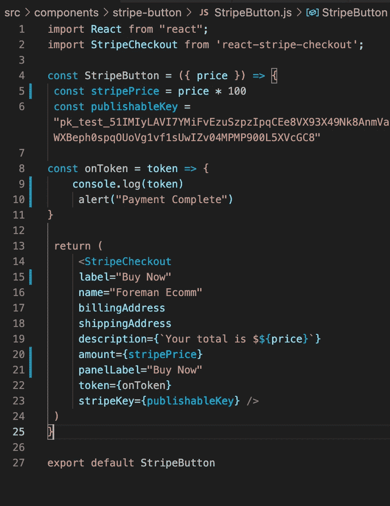

# 向您的 React 应用程序添加条纹

> 原文：<https://medium.com/nerd-for-tech/add-stripe-to-your-react-app-ed9bf23c93b7?source=collection_archive---------8----------------------->

在最近的一个项目中，我建立了一个电子商务网站来加强我的一些技能。虽然我的网站是虚构的——我实际上没有卖任何东西——但它能够在现实世界中运作。

为了让我的网站变得生动，我实现了用于库存数据库存储的 Google Firestore，以及用于用户认证和 Google 登录功能的 Google Firebase。我添加的下一个特性是通过 Stripe API 将该项目从理论带到功能，即有效的信用卡认证和授权。我将在下面演示如何设置 Stripe 并将其集成到您的项目中。

我将演示的是一些最基本的功能，但 Stripe 允许您使用浏览器内支付选项，指定允许的银行，等等。(我不是条纹代表，但我是粉丝！)

一旦你通过 Stripe 创建了一个账户，就很容易实现它的功能。事实上，许多设计功能都是内置的，随时可以使用，包括一个按钮激活的结账组件，它包括一个卡结账下拉菜单，供用户输入账单和支付信息。

在新创建的用户页面中，导航到 Developers 部分并获取 API 键。有一个用于测试目的的可发布密钥，以及一个用于现场使用的隐藏密钥。提醒:永远隐藏你的 API 密匙，尤其是当真金白银岌岌可危的时候！！

出于我们的目的，可发布的密钥足以证明概念。

要真正集成 Stripe，您必须首先添加 react-stripe-checkout。

接下来，创建一个组件来容纳 Stripe 按钮并利用内置的检查功能。

在这个组件中，从“反应-条纹-检验”中导入条纹检验然后，您可以创建以 price 为属性的组件。请注意，Stripe 以美分计量价格，而不是美元，因此您必须相应地计算您的总额，以便进行准确的处理。您可以将它保存到一个变量中，这个总数将作为 StripeCheckout 组件的“amount”输入。

下面是实现支付的完整代码。同样，这里可以添加更多的功能，包括图像和各种支付规范。

出于测试目的，我简单地创建了一个函数来记录令牌并提醒用户“交易”已经成功。您只能通过后端服务器进行收费，因此要完全实现支付，您需要将令牌传递给后端服务器来完成收费。

只需不到 30 行代码，您就可以将按钮组件及其所有功能导入到 checkout 组件中使用。

Stripe 处理关于卡、运输和账单信息的所有验证信息，其身份验证允许您获得一个令牌来处理支付。为了证明您的结账工作正常，输入 4242 4242 4242 4242 作为卡号，输入当前日期之后的任何日期作为到期日期，输入 123 作为 CVC。这将像使用功能卡一样完成收费。

就这么简单。在后端服务器上进行一些额外的步骤，你就有了一个功能齐全的网上商店！