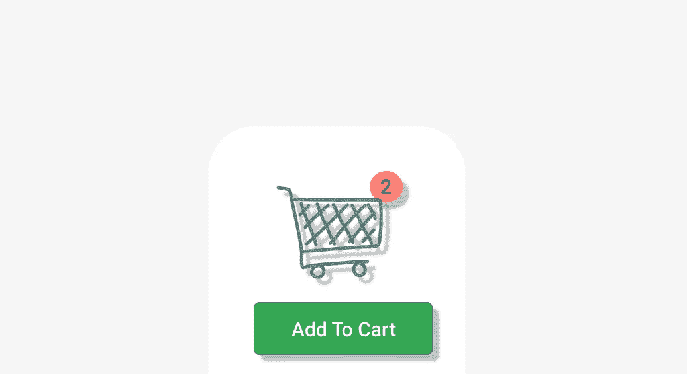

# 添加到前端购物车逻辑

> 原文：<https://medium.com/nerd-for-tech/add-to-cart-logic-in-frontend-cab0b6e64215?source=collection_archive---------8----------------------->

一次写入，随时随地使用

[更多在我阅读创意](/nerd-for-tech/www.ihatereading.in/creativity)

## 在后台

故事开始于我为跨多个领域的前端项目编写多个可重用逻辑的时候。你可以阅读更多关于这个想法和我将要讨论的主题，来了解“一次编写，随时随地使用”的概念。

## 概观