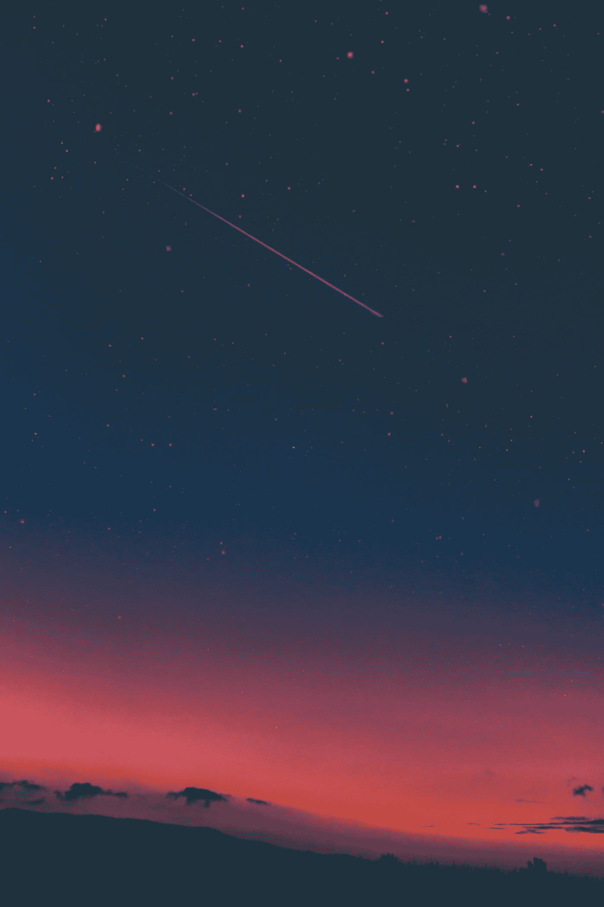
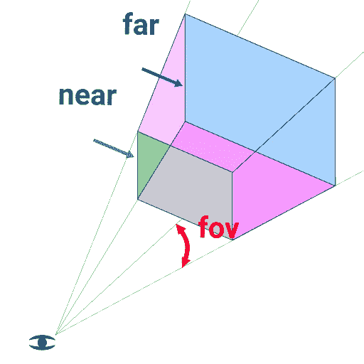

# 用 three.js 添加自定义星域背景

> 原文：<https://medium.com/nerd-for-tech/adding-a-custom-star-field-background-with-three-js-79a1d18fd35d?source=collection_archive---------0----------------------->



照片由 [Diego PH](https://unsplash.com/@jdiegoph?utm_source=medium&utm_medium=referral) 在 [Unsplash](https://unsplash.com?utm_source=medium&utm_medium=referral) 上拍摄

今天，我将添加一个类似星空的背景，这是我在之前的帖子 [*中调侃过的，通过 css 动画和 three.js*](https://25ckuntaldas.medium.com/taking-a-simple-contact-form-to-the-next-level-with-css-animation-and-three-js-part-1-cb9093ef9d64) 将一个简单的联系人表单提升到下一个级别，这将对鼠标移动做出响应。

我将从上一篇文章离开的地方开始，继续添加内容。如果您只想用 three.js 创建背景，也可以从一个基本的空白 HTML 页面开始。

# three.js 是什么？

Three.js 是一个轻量级跨浏览器 JavaScript 库/API，用于在 Web 浏览器上创建和显示动画 3D 计算机图形。Three.js 脚本可以与 HTML5 canvas 元素、SVG 或 WebGL 结合使用。

**添加 canvas 标签:**当我决定使用 [HTML5 canvas 元素](https://developer.mozilla.org/en-US/docs/Web/API/Canvas_API)时，我们需要在 HTML 中添加一个`<canvas>` 标签，就在`<body>`标签[ `<canvas id=”c”></canvas>` ]之后。我还添加了一个 id，以便在我的 JavaScript 中引用它。

**一位 CSS :** 这位 CSS 会通过应用`position: absolute;`和`width:100%;height:100%;`使其横跨整个屏幕。这里它是相对于 HTML 的`body`的，所以`width:100%;`将表示`body`元素的 100%宽度，高度也是如此。一个`z-index:-1;`会把它放在所有 HTML 元素的后面。此外，如果注意到`transition`属性，它会使背景平滑地出现，因为它会在页面和 JavaScript 加载后需要一些计算，它也会给低端计算机一些时间在渲染第一幅图像前进行计算。

```
#c {
    display: block;
    position: absolute;
    z-index: -1;
    width: 100%;
    height: 100%;
    opacity: 0;
    transition: opacity 1500ms ease-out;
}
```

给 js 接线:我们将在 JS 的帮助下制作`opacity:1;`

```
const canvas = document.getElementById("c");document.addEventListener("DOMContentLoaded", () => {
  canvas.style.opacity = 1;
});
```

现在让我们先用 threejs 声明，我们需要通过
`import THREE form “[https://cdnjs.cloudflare.com/ajax/libs/three.js/r127/three.min.js](https://cdnjs.cloudflare.com/ajax/libs/three.js/r127/three.min.js)”`
将它导入到我们的项目中，或者我们可以简单地用 HTML
`<script src=“[https://cdnjs.cloudflare.com/ajax/libs/three.js/r127/three.min.js](https://cdnjs.cloudflare.com/ajax/libs/three.js/r127/three.min.js)”>`中的脚本标签链接它

为了在我们在 HTML 中定义的画布上完成三项工作，我们需要在创建`renderer`时传递它:

```
const starFieldBG = () =>{
    const renderer = new THREE.WebGLRenderer({canvas});
    renderer.setClearColor(new THREE.Color("#1c1624")); ...
}
```

**setClearColor()** 函数设置我们将要绘制的画布的颜色。渲染器将一个`scene`对象和一个`camera`对象作为参数来正确渲染它。

```
const scene = new THREE.Scene();const fov = 75, aspect = 2, near = 1.5, far = 5;
const camera = new THREE.PerspectiveCamera(fov, aspect, near, far);renderer.render(scene, camera);
```



在这里，我使用了**透视相机**，它给出了一个 3d 视图，在这个视图中，远处的东西看起来比近处的小。`fov`是以度为单位的视野，`aspect`是宽高比，`near` `far`将决定渲染多少空间。

为了更好地了解 three.js 中的[摄像机，请看这个](https://threejsfundamentals.org/threejs/lessons/threejs-cameras.html)[在](https://threejsfundamentals.org/threejs/threejs-cameras-perspective-2-scenes.html)[https://threejsfundamentals.org](https://threejsfundamentals.org)的真实例子

此时，我们将看不到任何东西，因为在`scene`中没有**光**和任何物体。Three.js 库中有很多种类的灯，如`**AmbientLight**`、`**AmbientLightProbe**`、`**DirectionalLight**`、**、**、**、**等。你可以在这里了解更多关于灯光[的信息。我选择了使用平行光，因为它可以创造出类似太阳光线的效果。](https://threejsfundamentals.org/threejs/lessons/threejs-lights.html)

```
// light source
  const color = 0xffffff, intensity = 1;
  const light = new THREE.DirectionalLight(color, intensity);
  light.position.set(-1, 2, 4);
  scene.add(light);
```

`color` & `intensity`分别指光线的颜色和它会照亮表面的程度。`position.set(x, y, z)`设置光源在 3d 空间的位置。虽然光源不会被渲染，但它与对象的交互将被渲染。

现在让我们添加一个对象，这样我们至少可以在画布上看到一些东西。为此，我们需要**网格**，它是以下各项的组合:

*   一个`[Geometry](https://threejs.org/docs/?q=Geometry)` [](https://threejs.org/docs/?q=Geometry)—物体的形状
*   一个`[Material](https://threejs.org/docs/#api/en/materials/Material)`——如何绘制物体，发亮还是扁平，什么颜色，应用什么纹理。等等。
*   场景中对象相对于其父对象位置、方向和比例。在下面的代码中，父对象是场景。

**让我们先画一个立方体:**这将画一个在点(0，0，0)上有`[BoxGeometry](https://threejs.org/docs/?q=Geometry#api/en/geometries/BoxGeometry)`的立方体来看它，我们需要用`camera.position.z = 2;`在后面拍摄一点，这里我只改变`z`轴的值，你也可以用一些不同的单位来尝试`x`或`y`。

```
const boxWidth = 1, boxHeight = 1, boxDepth = 1;
const geometry = new THREE.BoxGeometry(boxWidth, boxHeight, boxDepth);const material = new THREE.MeshBasicMaterial({color: 0x44aa88});const cube = new THREE.Mesh(geometry, material);scene.add(cube);
```

**使其具有响应性:**到现在为止，您可能在显示器上显示立方体时有问题，或者当您调整浏览器大小时有问题。为了解决这个问题，我们需要知道窗口的宽度和高度何时改变，并根据它进行调整。

```
const resizeRendererToDisplaySize = (renderer) => {
  const canvas = renderer.domElement;
  const width = canvas.clientWidth;
  const height = canvas.clientHeight;
  const needResize = canvas.width !== width || canvas.height !== height;
  // resize only when necessary
  if (needResize) {
    //3rd parameter `false` to change the internal canvas size
    renderer.setSize(width, height, false);
  }
  return needResize;
};
```

这个函数将通过用`renderer.setSize()`调整画布的 drawingbuffer 大小(画布的内部大小，它的分辨率)来消除缩放问题。的“drawingbuffer”可以与`<svg>`元素的`viewbox`或``标签内的图像进行比较(图像尺寸可以不同于``标签的尺寸)。

在我们的`main()`中调用这个函数时，我们将利用它的返回语句来改变摄像机的**宽高比**。

```
const render = (time) => {
  if (resizeRendererToDisplaySize(renderer)) {
    const canvas = renderer.domElement; // changing the camera aspect to remove the strechy problem
    camera.aspect = canvas.clientWidth / canvas.clientHeight;
    camera.updateProjectionMatrix();
  } // Re-render the scene
   renderer.render(scene, camera);
   // loop
   requestAnimationFrame(render);
};
requestAnimationFrame(render);
```

因为我们需要跟踪窗口尺寸并调用这个代码块来使画布在所有屏幕上响应，所以我将这个代码块包含在一个函数中，并用浏览器提供的`[requestAnimationFrame()](https://developer.mozilla.org/en-US/docs/Web/API/window/requestAnimationFrame)` [](https://developer.mozilla.org/en-US/docs/Web/API/window/requestAnimationFrame)进行递归循环。

**增加一些交互性:**用鼠标指针定位。为此，我在文档中附加了一个`mousemove` EventListener，并更新了两个全局变量`mouseX` & `mouseY`。

```
// mouse
let mouseX = 0;
let mouseY = 0;
document.addEventListener("mousemove", (e) => {
  mouseX = e.clientX;
  mouseY = e.clientY;
});
```

现在在`render()`中添加两行代码来改变它基于鼠标移动的旋转。

```
const render = (time) => {
    ...
    ...

    cube.rotation.x = mouseY * 0.005;
    cube.rotation.y = mouseX * 0.005;

    renderer.render(scene, camera);
    // loop
    requestAnimationFrame(render);
  };
```

你最终会变成这样。

到目前为止，我使用一个立方体来使响应部分易于理解。但是我们不需要立方体，我们需要点，所以我们将使用`[THREE.Points](https://threejs.org/docs/index.html?q=points#api/en/objects/Points)`来代替`THREE.Mesh`，为了让它工作，我们还需要使用不同的材料，`[**PointsMaterial**](https://threejs.org/docs/?q=PointsMaterial#api/en/materials/PointsMaterial)`现在你会看到立方体的 8 个角上有 8 个点。我们需要更多的分数。就像这样:

现在使用`size:0.05`使它变得明显

```
const material = new THREE.PointsMaterial({
    size: 0.05,
    color: 0x44aa88 // remove it if you want white points.
});
```

我们还需要大量的点盒——几何在这种情况下没有太大的帮助，所以我们需要使用`[BufferGeometry()](https://threejs.org/docs/?q=BufferGeometry()#api/en/core/BufferGeometry)`

```
const geometry = new THREE.BufferGeometry();
```

`BufferGeometry()`创建几何图形时不需要参数，但我们需要改变一些属性来定义我们的点位置。

```
geometry.setAttribute(
    "position",
    new THREE.BufferAttribute(getRandomParticelPos(350), 3)
);
```

该部分通过使用由 `getRandomParticelPos()`返回的随机浮点值数组来设置位置，该数组以**点数**作为参数。`[BufferAttribute](https://threejs.org/docs/?q=BufferAttribute#api/en/core/BufferAttribute)`使用该数组通过从数组中每个点取 3 个值来设置位置属性。

```
const getRandomParticelPos = (particleCount) => {
  const arr = new Float32Array(particleCount * 3);
  for (let i = 0; i < particleCount; i++) {
    arr[i] = (Math.random() - 0.5) * 10;
  }
  return arr;
};
```

这将看起来像这样:

为了改变悬停效果，我们需要改变`render()`中的这两行，并从材质中移除`color`属性，使其为白色。

```
...
const render = (time) => {
    ...
    ...

    //cube.rotation.x = mouseY * 0.005;
    //cube.rotation.y = mouseX * 0.005; cube.position.x = mouseY * 0.0001;
    cube.position.y = mouseX * -0.0001;

    renderer.render(scene, camera);
    // loop
    requestAnimationFrame(render);
  };
...
```

不幸的是，我们不能把这些点做成圆形或任何类似的形状。但是我们可以使用`texture`让它们看起来像我们想要的任何样子。我在 Figma 中制作了两张 **PNG** 图片作为纹理，并上传到 GitHub [**repo**](https://github.com/Kuntal-Das/textures) 中。为了使用纹理，我们需要`[TextureLoader()](https://threejs.org/docs/?q=TextureLoader()#api/en/loaders/TextureLoader)`，我们还需要在创建材质时改变传递给`[PointsMaterial()](https://threejs.org/docs/?q=PointsMaterial#api/en/materials/PointsMaterial)`的对象。

```
const loader = new THREE.TextureLoader();
...const material = new THREE.PointsMaterial({
    size: 0.05,
    map: loader.load(
      "[https://raw.githubusercontent.com/Kuntal-Das/textures/main/sp2.png](https://raw.githubusercontent.com/Kuntal-Das/textures/main/sp2.png)"
    ),
    transparent: true
    // color: 0x44aa88
});
```

`loader.load()`从给定的 PNG 文件创建纹理，并将其作为`map`传递，以使点看起来像它，但我们还需要`transparent:true`使之前渲染的白色方块消失。

唷，我们终于成功了。仅限此背景。

在这个最终版本中，我添加了两种不同的纹理和不同的点数。这个帖子已经很长了，我不想让它变得更长，所以我会把它留给你自己去实现，并弄脏你的手。(或者只是在我的代码中有一个峰值🤭)

现在，那些跟随[上一篇文章](https://25ckuntaldas.medium.com/taking-a-simple-contact-form-to-the-next-level-with-css-animation-and-three-js-part-1-cb9093ef9d64)的人应该有这个:

所以我们今天学到了:

*   如何将 threejs 与 canvas 配合使用？
*   我们知道我们需要`scene`和`camera`来渲染我们的场景。
*   我们还需要将`light`添加到`scene`中，以查看我们添加到`scene`中的对象。
*   我们学习了用`BoxGeometry` & `MeshBasicMaterial`创建`Mesh`。
*   我们通过监听窗口的宽度和高度使画布内部的图像做出响应。
*   如何渲染大量的点`BufferGeometry` & `PointsMaterial`。
*   我们在 threejs 中学到了一些关于`textures`的知识。
*   我们还学习了两种使 canvas 元素交互的方法。