# 添加玩家健康栏

> 原文：<https://medium.com/nerd-for-tech/adding-a-player-health-bar-d59d629c1311?source=collection_archive---------3----------------------->

## 创建 UI 元素:滑块

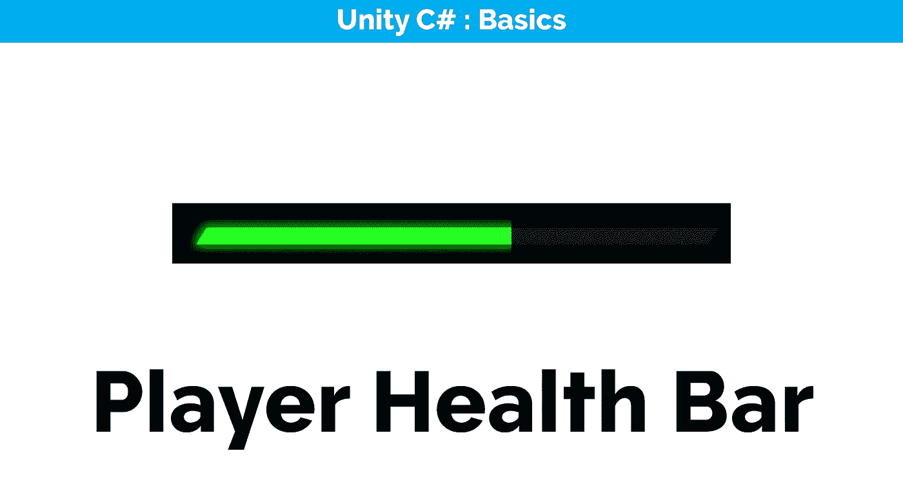

在这篇文章中，我将继续改进 UI，添加一个健康栏，直观地显示玩家的健康状况。因为我们已经有了一个[健康系统](/nerd-for-tech/adding-health-to-the-player-24d594b8fb11)，我们可以通过引入一个**滑块组件**并将我们当前的健康状况与它联系起来。

## 滑块组件

可以在最小值和最大值之间移动的标准滑块。

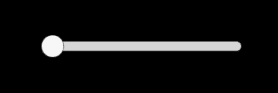

默认滑块

> 滑块组件是一个可选择的 T4，它控制填充、手柄或两者。使用时，填充从最小值跨越到当前值，而使用时，句柄跟随当前值。

填充和手柄矩形变换的锚点由滑块驱动。填充和手柄可以是带有滑块的游戏对象的直接子对象，或者可以在它们之间放置中间的 RectTransforms 以进行额外的控制。

## 创建滑块组件

作为 *UI 管理器*所连接的画布的子组件，创建一个新的 Slider UI 组件。在我们的例子中，我们只是想直观地展示玩家的健康状况，我们不需要可调节的手柄，所以我们可以删除*手柄滑动区域*组件。根据您的喜好定位和固定健康栏。

我把图像换成了背景和填充图像，并将*填充图像*的颜色设置为绿色，你可以使用任何你喜欢的图像，它也适用于默认图像。

26FF21

对于填充图像，我使用水平填充方法将图像类型设置为填充。这样做是为了防止填充图像与背景重叠。

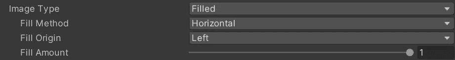

我们还必须对滑块组件进行轻微调整，使其不至于**难以处理**。非常重要，因为否则，即使不使用句柄，我们仍然可以通过鼠标交互来调整值。

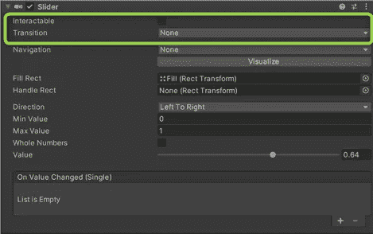

不需要指定任何转换

在 UI Manager.cs 脚本中，创建两个新的引用类型变量。一个引用健康栏，一个引用填充区域'*填充图像*'。

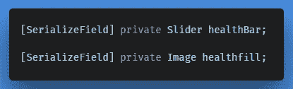

然后我们可以在检查器中分配它们；

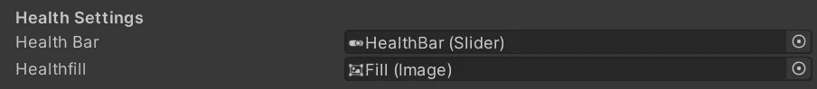

## 将健康栏与玩家健康联系起来

如果我们进入游戏模式，当然什么也不会发生，因为我们还没有把我们的健康值和填充图像联系起来。

为了使健康栏与玩家健康同步，我们需要在 UIManager.cs 脚本中创建两个新方法；一种方法允许我们传递*的初始生命值，另一种方法更新*的当前生命值。**

****初始化 *UIManager.cs* 中的** 首先我们需要指出*填充图像*的最大值是多少。我们抓住我们的健康栏，设置最大值。通过关键字 ***访问值。maxValue*** ，并更新生命值栏。**

**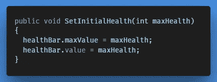**

**在*player . cs 中的 *Start()* 方法中，*我们已经有了一个在游戏开始时设置我们最大生命值的方法。我们现在需要做的就是将该值传递给 UI 管理器。**

*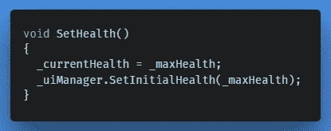*

*在游戏模式下，现在我们的健康栏更新到最大健康值。*

***更新玩家健康栏** 我们还需要 UI 管理器中的一个方法来更新健康栏，以便在当前玩家健康发生变化时使用。*

*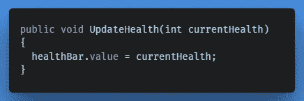*

*在我们的例子中(目前)，当玩家*承受伤害，当我们 ***加生命值*** 加力量时。在 *Players.cs* 脚本中，每次发生这种情况时，我们都会更新健康栏，方法是:**

**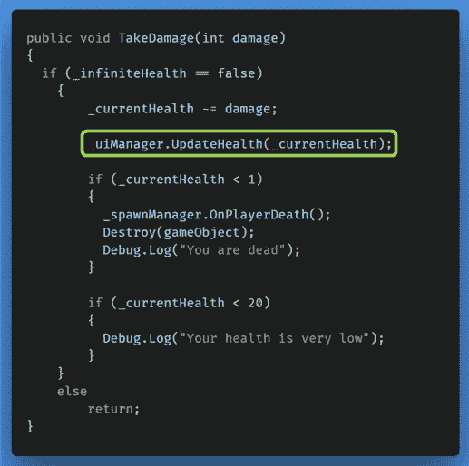****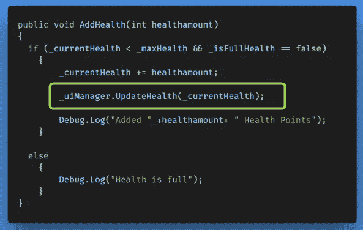**

## **向健康栏添加渐变**

****

**你可以看到，在预览图像中，如果玩家的健康下降到 20%以下，健康栏会变成红色。这是因为我们用在检查器中设置的自定义渐变覆盖了它；**

**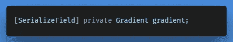****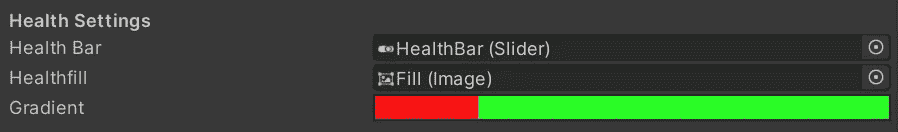******

**首先，我们需要指出与玩家健康状况相比，梯度的最大值是多少(相对于从 0 到 1 的浮动)。我们可以这样说:**

**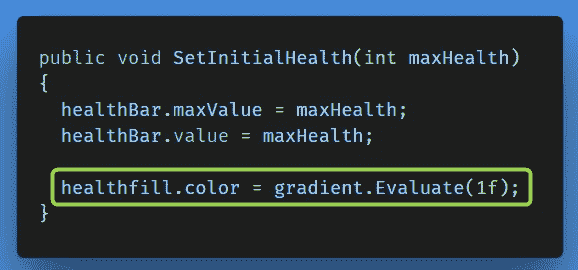**

**滑块的最大值**

**为了更新梯度，我们现在需要寻找与我们的健康状况相对于标准化值进行比较的当前值。**

**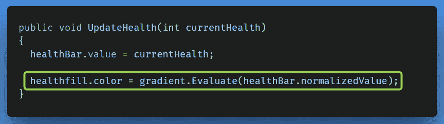**

**滑块的当前值规范化为 0 到 1 之间的值。**

**掌握了这些知识，你应该能够创建自己的健康栏，但是如果你有任何问题，请不要犹豫，我会尽快回答。祝你好运！**

**接下来我们将看看为玩家整合一个盾牌系统。**

**← [上一张](/nerd-for-tech/creating-basic-game-over-behaviour-df4fa70b6f98) | [下一张](https://gert-coppens.medium.com/adding-the-player-shield-f56b7fea039b) →**