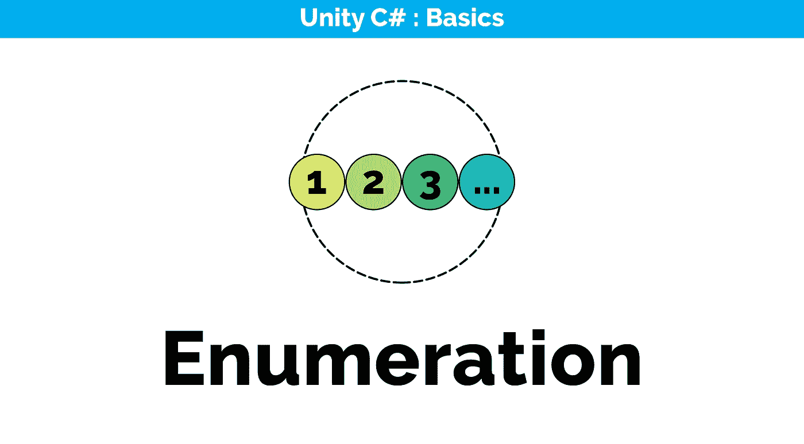
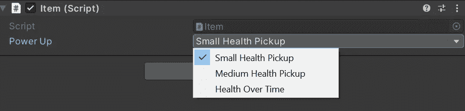
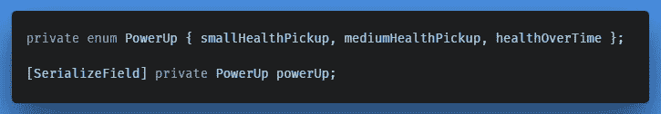
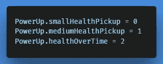
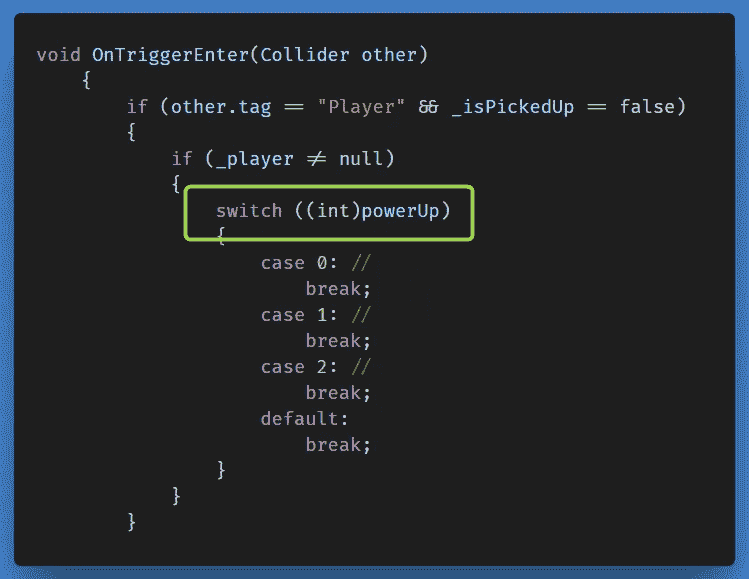

# 在检查器中添加简单的下拉字段

> 原文：<https://medium.com/nerd-for-tech/adding-a-simple-drop-down-field-in-the-inspector-a3b4dc9da64f?source=collection_archive---------13----------------------->

之前，我们必须在检查器中为加电设置一个 ID，让我们看看如何通过引入一个被限制为一组值的 enum 变量类型来为我们的选项创建一个简单的下拉字段。

## 列举型别

> Enumeration 是 Enumeration 的缩写，它是一个用户定义的关键字，允许您声明一组名为 Enumerators 的命名常量。枚举器是一组值的名称。

它们限制枚举变量可以取的值，并且是一个常数而不是一个数字，增加了源代码的可读性。

首先，我们创建一个枚举类型的私有变量。为了在检查器中访问它，我们将它声明为一个名为' *powerUp* 、类型为 **PowerUp** 的私有成员变量。

## **枚举到整数**

它的一个好处是，它自动为我们添加的每个常数存储一个值。

现在，我们可以删除最初使用的' *_itemID* '变量，转而在 switch()方法中传递一个整数形式的枚举常量。

← [上一张](/nerd-for-tech/switch-statements-to-the-rescue-945c1f491736) | [下一张](https://gert-coppens.medium.com/using-a-boolean-logical-operator-20c8ea225b05) →