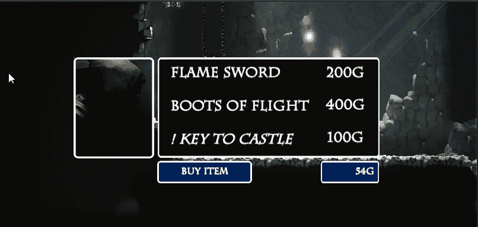

# 添加一个 RPG 风格的商店(第 1 部分)

> 原文：<https://medium.com/nerd-for-tech/adding-an-rpg-style-shop-part-1-281caa786ffa?source=collection_archive---------11----------------------->

## 在 Unity 中开始游戏开发

## //让我们花掉辛苦赚来的战利品…但是首先我们需要一个商店！

在我们的游戏中，从敌人那里获得一些辛苦赚来的战利品是值得的，但是花掉这些辛苦赚来的战利品更值得。为了做到这一点，我们需要为我们的游戏建立一个商店。