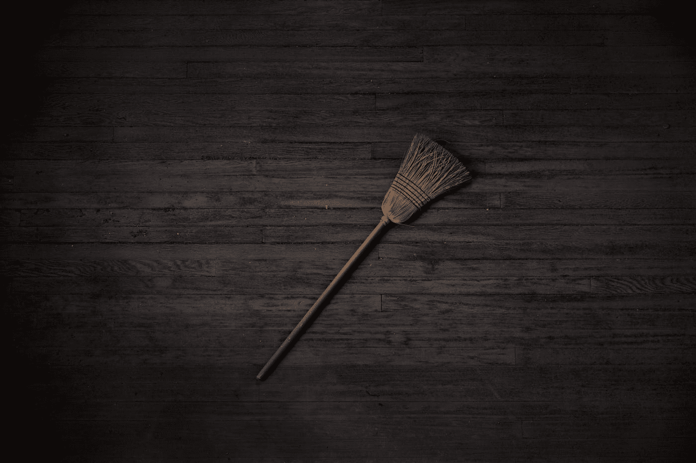

# 添加一个 RPG 风格的商店(第 3 部分)

> 原文：<https://medium.com/nerd-for-tech/adding-an-rpg-style-shop-part-3-fc328903c1aa?source=collection_archive---------13----------------------->

## 开始 Unity 游戏开发

## //让我们收拾一下商店

尼尔·约翰逊在 [Unsplash](https://unsplash.com?utm_source=medium&utm_medium=referral) 上拍摄的照片

在本系列的第一和第二部分中，我们创建了一个游戏商店，并创建了从商店购买物品的功能。但我们需要做一些最后的清理，以确保商店正常运作，我们购买的物品在游戏中确实有一些影响。