# 添加角色并制作动画

> 原文：<https://medium.com/nerd-for-tech/adding-and-animating-a-character-dbed65a293de?source=collection_archive---------10----------------------->

现在我们已经将项目升级到了 URP，让我们添加一个角色模型并开始制作动画。首先，我们将创建一个空对象作为我们正在使用的胶囊对象的子对象，并将我们的模型附加到该对象，同时删除我们胶囊的网格渲染器，使其不再可见，但仍可以与我们的游戏交互:

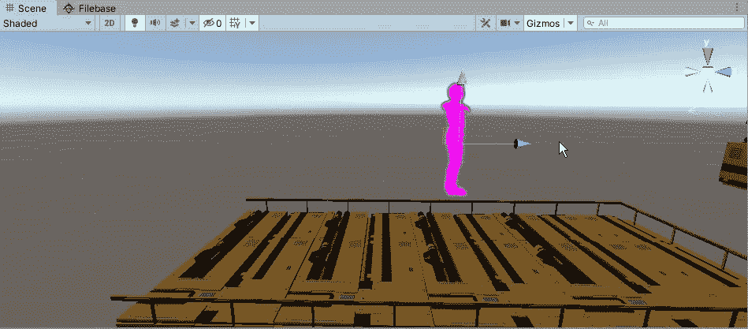

有时，当添加一个新的模型时，我们会看到一个洋红色的图形。为了解决这个问题，我们只需对我们的材料进行升级:

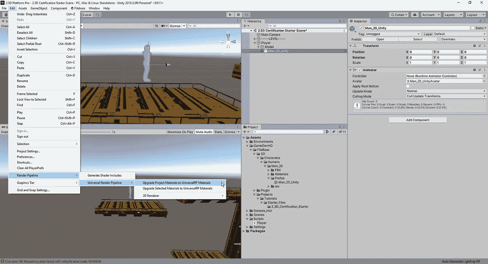

从这里，我们将只剩下一个发光的发型，我们将进入模型，改变设置，让它贯穿 URP:

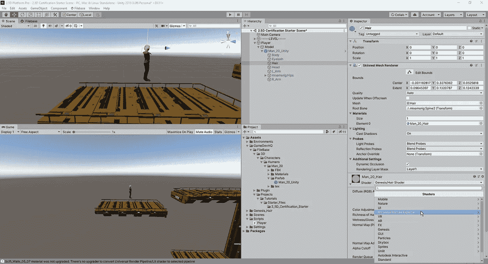

现在我们已经有了我们的角色，让我们调整我们的胶囊碰撞器，使它包含玩家的形象:

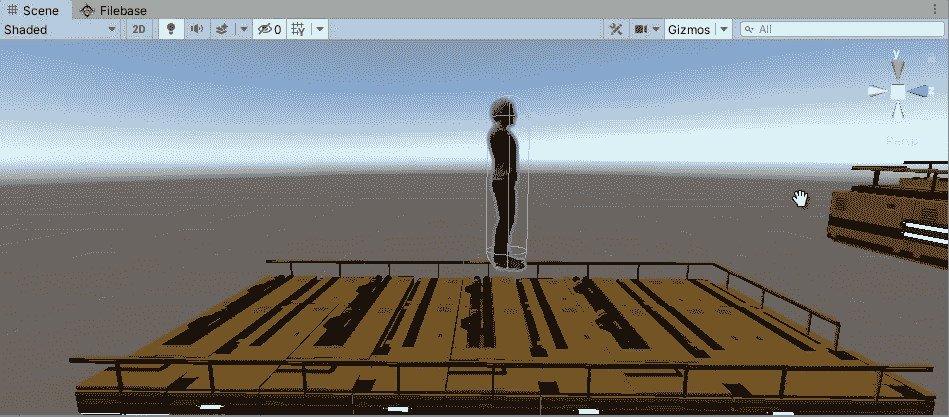

完成所有这些后，让我们看看它在游戏中的样子:

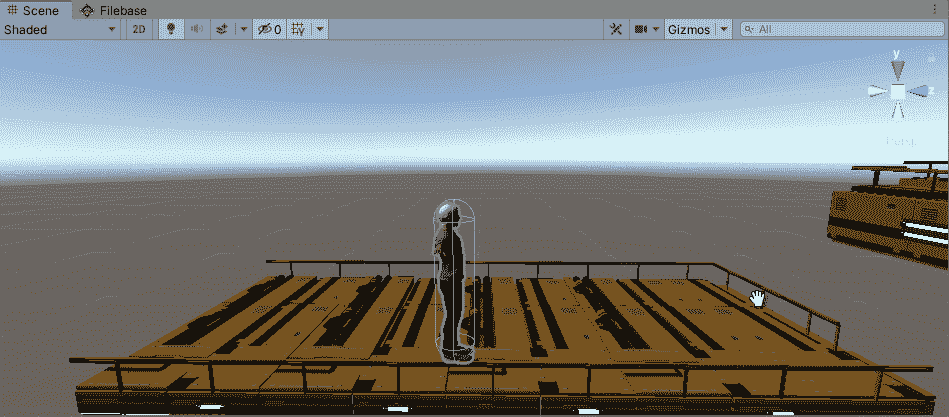

正如我们所看到的，它像我们想要的那样到处跑，但是我们需要做一些动画来让它看起来不像是到处滑动的图形。首先，让我们前往 [Mixamo](https://www.mixamo.com/#/) ，我们可以在那里免费下载各种角色动画。从那里，我们将下载任何我们想要的空闲动画，并把它拖到我们的项目视图中。因为我们正在使用人形，所以我们希望确保将装备设置更改为人形:

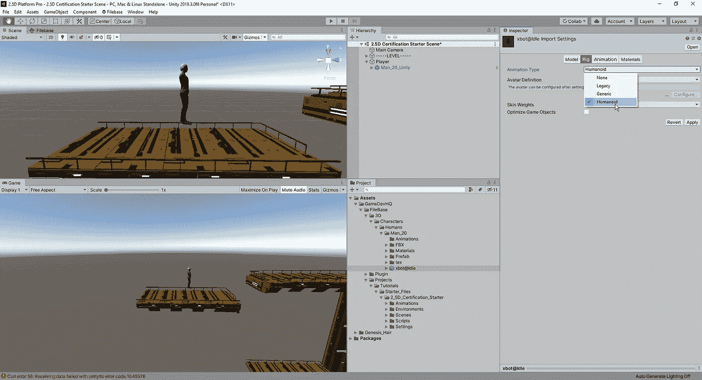

从这里，我们将复制动画，以便我们可以调整它的一些设置:

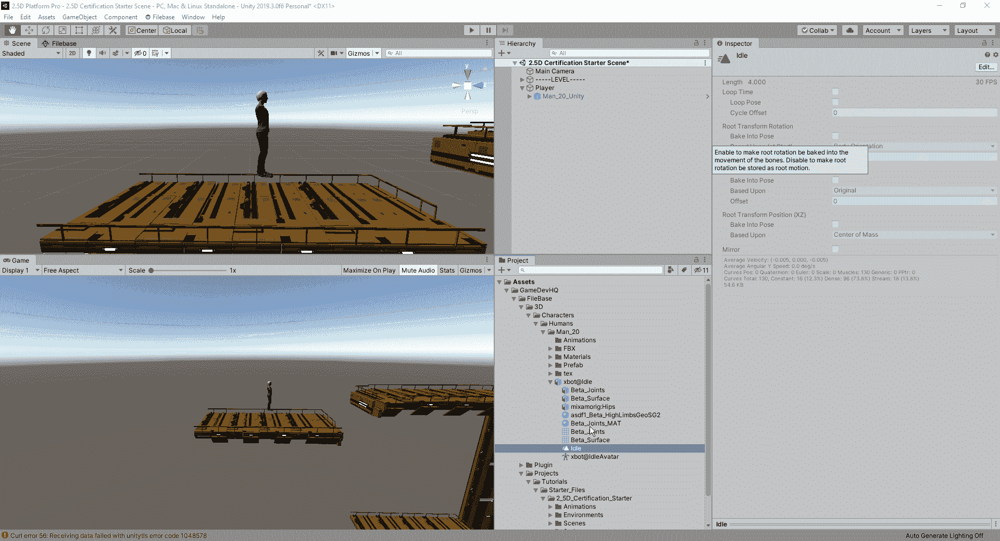

从这里，我们只需将我们的动画拖动到角色所需的控制器上，并在游戏中播放它，看看它是否工作:

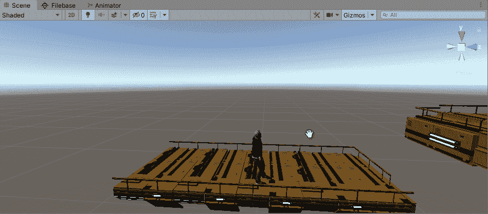

现在我们有了一个工作的空闲动画，让我们开始制作一个正在运行的动画。当我们从我们的网站上抓取动画时，我们希望确保我们勾选了“在适当的位置”选项:

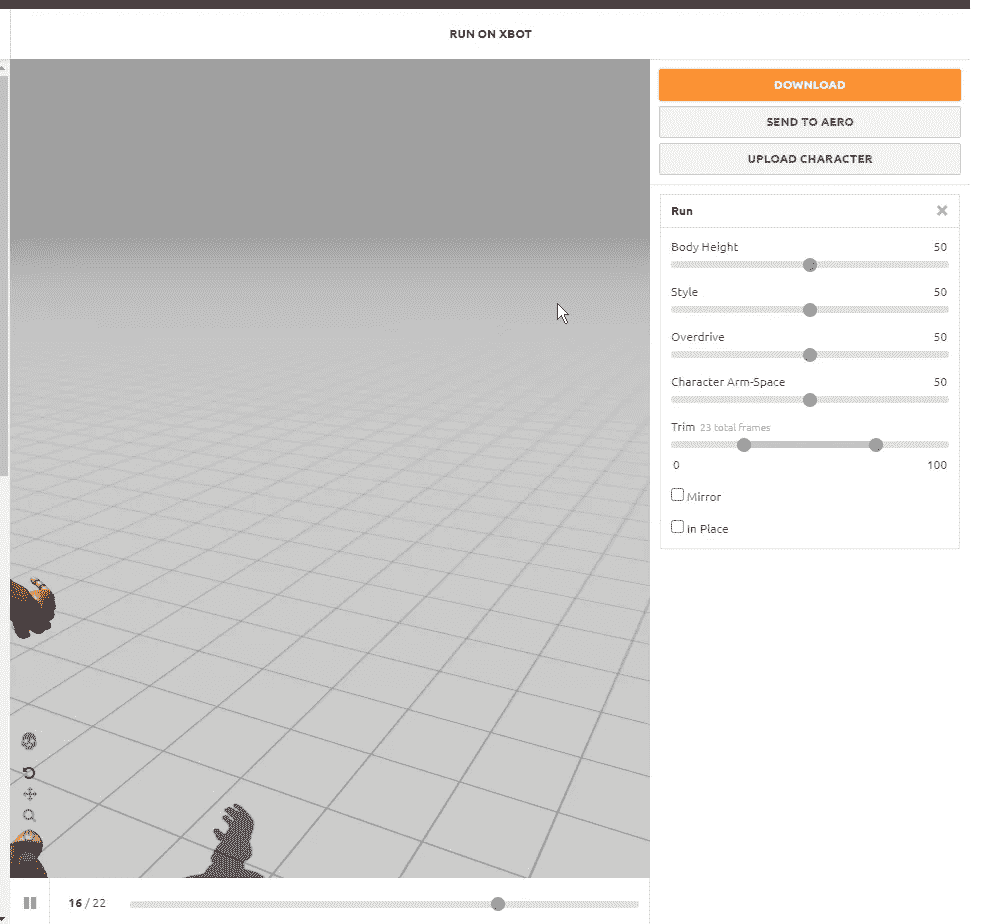

这将使我们的动画不控制我们的角色的势头。从这里，我们将它拖入并应用到我们的动画控制器，就像我们对空闲动画所做的那样，但现在我们创建了一个到运行运动的过渡，并返回到空闲状态。在这种情况下，我们将陈述速度决定我们是在运行还是空闲:

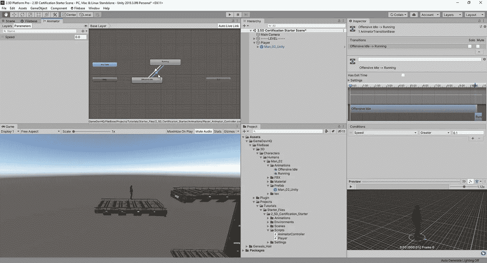

现在为了让我们利用这个参数，我们需要把它编码进去，这样当我们改变状态时，我们也改变我们的动画:

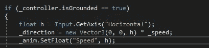

然而，仅仅这样做只会在一个方向起作用，因为我们告诉 Unity，如果速度大于 0.1，我们希望动画运行:

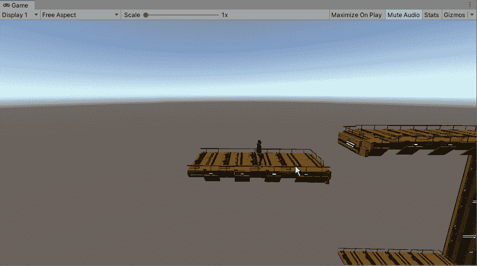

当我们向后移动时，我们移动的方向小于 0，所以我们让它取变量的绝对值:

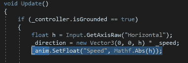

现在，让我们看看这个是什么样子的:

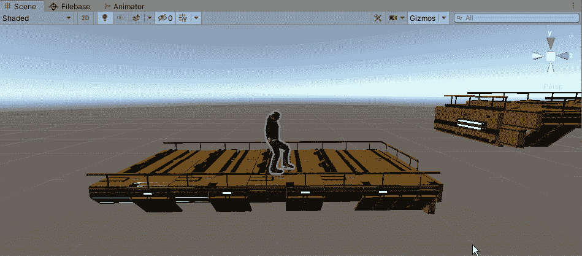

我们让我们的动画向前和向后工作，但是现在我们的模型在运行时转向摄像机。这是一个快速解决方案，因为在这种情况下，我们需要做的就是关闭我们的根运动:

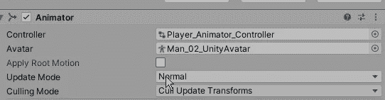

现在所有这些都完成了，让我们看看它是什么样子的:

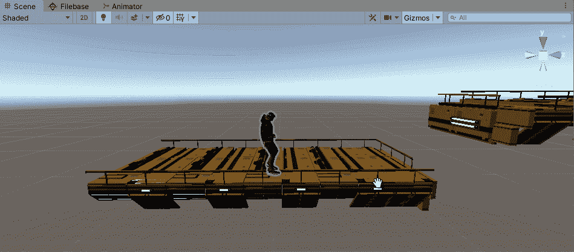

现在我们已经完成了创建一些空闲和运行的动画，我们可以看看如何建立跳跃以及如何翻转我们的角色，这样就不会给它向后滑动的尴尬外观。